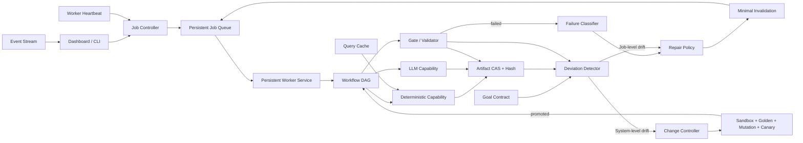

# A001 Wiki 生产长任务优化与修复方案

日期：2026-08-13  
适用项目：`lca-project`  
基准案例：`ict_equipment::A001`  
基准 Job：`job_570946c066654f099c38d588b8ca7ed1`  
基准 Workflow Run：`run_a48b076b96bb478dbc353473e103ed37`  
文档状态：代码修复已完成本地实现与回归；真实Provider Shadow/Canary性能验收待执行

修订基准：当前工作区（含未提交改动）与 `var/state.db` 在 2026-08-13 的只读快照。
本文所称“当前实现”均指该修订基准；实施前必须生成不可变 Baseline Artifact，避免后续运行继续改变统计结果。

## 1. 文档目的

本文针对 A001 Wiki 生产任务在故障排查和恢复过程中运行超过一小时的问题，给出完整的工程修复方案。目标不是只修复当前 Job 的个别错误，也不只是缩短单次墙钟时间，而是消除导致同类任务长时间运行、高频人工介入、重复检索、反复模型生成、产物不可重放和状态失真的系统性原因。

本方案按四层目标组织：

1. **自治连续执行**：Job 不依赖 Dashboard 或 Codex Session 存活，Worker 丢失后可自动识别和恢复；
2. **有界局部修复**：失败可分类，结构问题由确定性代码修复，语义问题只修改目标段落；
3. **增量复用降耗**：真实 Artifact 进入 CAS，未变化的 Task、Query 和 Fetch Payload 不重复执行；
4. **质量与审计不退化**：优化不得绕过 Editorial、Golden Validator、Preview Lint 或发布授权，所有复用与修复均可重放。

本文覆盖：

- Worker 生命周期与 Job 状态管理；
- 失败分类、自动修复与 Repair Plan；
- Wiki 正文生成和 Editorial Review；
- Product/Activity 统一生产契约；
- Search/Fetch 的并发、缓存、断点续跑；
- 基于 Artifact Hash 的最小范围失效；
- Dashboard、CLI、事件和可观测性；
- Codex 会话与模型调用治理；
- 测试矩阵、灰度发布、回滚和最终验收标准。

## 2. 执行摘要

A001 的一小时任务并不是单一脚本持续运行一小时，而是在同一个 Codex Session 中发生了多轮“执行—失败—排查—修改—测试—重绑定—重跑”。基准会话在约 67 分钟内产生：

| 指标 | 基准值 |
|---|---:|
| Codex 模型请求 | 262 次 |
| 工具调用 | 260 次 |
| 输入 Token | 约 40.10M |
| 缓存命中率 | 98.2% |
| Job 阶段累计运行时间 | 约 35 分钟 |
| 等待与状态检查 | 152 次 |
| `content_compose` 本轮执行 | 8 次 |
| `editorial_review` 本轮执行 | 4 次 |
| `table_collect` 本轮执行 | 4 次 |
| Context Compaction | 1 次 |

核心问题按影响排序如下：

1. 当前已有进程内连续 `WorkerLoop`，但生产执行仍缺少独立进程监管、Worker Heartbeat、Lease 续期和孤儿 Task 恢复；
2. 大量不同故障统一显示为 `PROCESS_EXIT`，无法自动选择修复策略；
3. 正文结构问题和局部审核问题会触发整篇模型重写；
4. Activity 和 Product 的表格、脊边、排放、来源契约存在多处重复定义；当前 Activity 权威合同为六表，但部分设计和旧逻辑仍按五表或可选 `props` 处理；
5. Task output hash 当前主要绑定包装信息、路径和大小，尚未逐文件冻结真实内容，既无法完整重放旧 Attempt，也不足以支持安全的最小失效；
6. Search Matrix 串行执行，查询级缓存和断点续跑不足；
7. Dashboard、Worker 和 Job 状态可能互相矛盾；
8. `PersistentOrchestrator`、`WikiRuntime` 和通用 Run 投影存在职责重叠，继续直接扩展可能形成多套状态事实源；
9. Codex Session 被迫承担人工编排器、轮询器和修复器的角色。

本方案的总体目标是：

```text
Codex 负责诊断、语义决策和高风险修复评审；
受进程监管的持久化 Worker 负责连续执行；
确定性错误由代码和规范化器修复；
模型只处理语义生成与独立审核；
任何修复只重跑输入真正发生变化的任务；
任何复用都必须基于已冻结的真实内容 Hash，并生成可审计的 Reuse Receipt。
```

## 3. 范围和非目标

### 3.1 本次修复范围

- `wiki-node-production@7` 及后续版本的运行机制；
- Baseline冻结、真实Task Output Manifest、CAS重放和单一状态事实源；
- Dashboard 创建、启动、恢复和观察 Job 的能力；
- `WorkerLoop`、Persistent Orchestrator、Lease 和 Event；
- Content Compose、Editorial Review 和 Draft Gate；
- Activity/Product 的 Content/Table/Preview 契约；
- 表格查询、来源抓取、证据选择与缓存；
- A001、P003、P030 三类回归样例；
- Codex 维护项目时的请求、模型和上下文治理。

### 3.2 非目标

- 不降低现有 Gate 的质量要求；
- 不通过跳过 Editorial Review 或 Preview Lint 缩短时间；
- 不自动授予 reviewed/publish 权限；
- 不为了速度无限增加第三方 Search Provider 并发；
- 不删除现有事件、Artifact、Attempt 和 Repair Plan 审计记录；
- 不以清空旧Task output hash或覆盖Workspace文件作为“失效”实现；
- 不把无法确定性修复的语义问题伪装成成功。

## 4. 当前基准案例复盘

### 4.1 本轮主要执行阶段

| 时间段 | 阶段 | 主要问题 |
|---|---|---|
| 10:27–10:42 | Content Compose | 标题顺序漂移、Claim 类型绑定错误 |
| 10:42–11:03 | Editorial Review | 指代、编号侵入、重复论述、字数退化 |
| 11:03–11:20 | Table Pipeline | Activity 被按 Product 构建、英文轨道缺失 |
| 11:20–11:25 | Table Apply/Preview | 占位区块、脊边、排放和来源一致性错误 |
| 11:25 之后 | Table Re-collect | 契约扩展后重新执行 66 条双语查询 |

### 4.2 原始排查截面的 Attempt 结构

下表是原始故障排查会话中的中间截面，不代表该 Run 的最终累计值。由于当时未冻结 State DB、Workspace Manifest 和统计截止时间，它只能用于说明问题形态，不能直接作为 `@8` 性能验收的对照数据。

| Task | Attempt 数 | 阶段运行时间 | 主要失败 |
|---|---:|---:|---|
| `content_compose` | 8 | 约14.1分钟 | 结构漂移、类型绑定、字数退化 |
| `editorial_review` | 4 | 约5.2分钟 | 三次 `NO_GO` |
| `table_collect` | 4 | 约15.8分钟 | 契约变更导致反复重采 |
| `table_verify` | 4 | 不足1分钟 | 三次确定性失败 |
| `table_population_gate` | 2 | 不足1分钟 | 占位区块未清理 |
| `preview` | 1 | 不足1分钟 | 三项 Activity 一致性失败 |

### 4.3 当前 Run 累计事实

截至本次修订，`var/state.db` 中同一基准 Run 已继续发生人工修复和重跑，累计值为：

| Task | Attempt 数 | 成功/失败 | 累计执行时间 |
|---|---:|---:|---:|
| `content_compose` | 9 | 4/5 | 约16.1分钟 |
| `editorial_review` | 4 | 1/3 | 约5.2分钟 |
| `table_collect` | 5 | 5/0 | 约24.3分钟 |
| `table_verify` | 8 | 5/3 | 约1.3秒 |
| `table_population_gate` | 6 | 5/1 | 不足1秒 |
| `preview` | 5 | 3/2 | 约1.8秒 |

该 Run 共记录59个 Attempt，其中14个失败全部归类为 `PROCESS_EXIT`。当前 Job 已进入 `candidate`，说明原文中的运行状态和 Attempt 数只能视为历史中间截面。

### 4.4 当前状态失真

基准案例中出现过：

```text
Job.status = running
Worker = 不存在
table_search_execution_gate.status = ready
```

这会让 Dashboard 看起来仍在执行，实际却需要再次启动 Worker。该状态必须在架构层消除。

### 4.5 正式 Baseline 冻结要求

实施前必须生成 `wiki-optimization-baseline-v1` Artifact，至少包含：

- Job、Run、Workflow、Policy、Node Profile 和 Workspace Manifest Hash；
- 统计起止时间和时区；
- 每个 Task 的 Attempt、执行时间、排队时间、失败码和外部调用数；
- 模型请求数、输入/输出/缓存 Token，且明确“请求”和“Token”的统计口径；
- Query、Provider、Fetch、缓存命中和重复请求统计；
- 正文、表格、来源覆盖、Golden、Editorial 和 Preview 质量结果；
- State DB 只读快照 Hash及所有最终输出的 CAS Manifest。

后续 Shadow、Canary 和正式验收只允许与该冻结 Baseline 或同环境并行对照组比较，不再从持续变化的工作区现场取数。

## 5. 修复目标与 SLO

### 5.1 性能目标

| 指标 | 当前基准 | P-1至P2/P3阶段目标 | 最终目标 |
|---|---:|---:|---:|
| A001 冷启动到 Preview Candidate | 超过67分钟 | ≤30分钟 | ≤20分钟 |
| 已知故障恢复到下一有效 Gate | 30–60分钟 | ≤15分钟 | ≤10分钟 |
| 单Job Codex模型请求 | 262次 | ≤80次 | ≤40次 |
| 单Job人工/Agent工具调用 | 260次 | ≤100次 | ≤50次 |
| 单Job总输入Token（含缓存输入，另报未缓存Token） | 约40.10M | ≤10M | ≤5M |
| Content 整篇模型生成 | 多于4次 | ≤2次 | ≤2次 |
| Search 66条冷启动 | 8分钟以上 | ≤5分钟 | ≤4分钟 |
| Search 热缓存重跑 | 分钟级 | ≤60秒 | ≤30秒 |

### 5.2 可靠性目标

- Worker 丢失后30秒内被识别；
- 存在 `ready` Task 时，5秒内必须有 Worker 接手或 Job 转为 `stalled`；
- Task 成功后2秒内开始下一个可执行 Task；
- 已完成 Query 的中断恢复重复率不超过5%；
- 同一确定性错误不得触发第二次模型整篇生成；
- Job 状态、Task 状态和 Worker 状态不得互相矛盾；
- 每个自动修复必须保留 Repair Plan、输入 Hash、输出 Hash和失效范围。
- 旧 Worker 在 Lease 被接管后提交成功率必须为0；
- 任一历史 Attempt 的实际输入和输出必须能仅依靠 CAS 与 Manifest 重放校验；
- Worker、Job、Task 和 Attempt 状态必须能够由同一事实源确定性重建。

### 5.3 质量目标

- 不降低 Golden Validator、Editorial Review 和 Preview Lint；
- Activity 六表结构、脊边覆盖和基本流分类100%符合统一 Profile；
- 修复后已通过的章节、Claim 和来源覆盖不得退化；
- Preview Candidate 必须保留完整证据链和审计记录。

上述绝对阈值不是通过一次 A001 成功即判定达标。最终验收必须同时满足单次 Golden Case、故障注入和连续批次统计要求，详见第17节“验证指标与验收设计”。

## 6. 目标架构



必须建立以下边界：

```text
Dashboard 负责控制与观察，不作为 Worker 的唯一宿主。
Worker 负责持续推进，不依赖 Codex Session 存活。
Workflow 负责状态机，Skill 只负责意图路由。
Capability 负责一次有界执行，不自行无限重试。
Gate 负责判定，Repair Policy 负责选择修复路径。
Artifact Hash 负责决定哪些任务必须失效。
```

### 6.0.1 目标对齐与系统自我修复

上述执行修复闭环之外，平台必须维护独立于单个 Gate 的版本化 Goal Contract。Gate 是目标的可执行传感器，不是目标本身；系统需要同时检测执行失败、产出偏离和 Gate 自身的 False Pass/False Block。

单 Job 的安全偏离由 Repair Policy 做有限修复和最小重放；重复出现或暴露公共合同缺陷的问题升级为系统变更候选。系统变更只能在隔离工作区生成，必须经过触发样本、Golden、缺陷 Mutation、Shadow 和 Canary，且已通过质量维度不得退化。详细合同、权限分级、A040 False Pass 与 A037 False Block 示例见 `docs/系统自我修复与目标对齐架构.md`。

### 6.1 单一状态事实源

`wiki-node-production@8` 实施前必须先明确状态所有权：

```text
PersistentOrchestrator：唯一生产 Workflow/Task/Attempt 状态机
ControlPlane Job：由 Workflow、Task、Worker事实推导的粗粒度投影
Worker Registry/Lease：执行所有权与活性事实
WikiRuntime：停止独立扩展状态表；其 Hash、Proof、Stage Replay能力迁入Orchestrator或作为只读兼容层
通用 runs：仅保留兼容投影，不再成为Wiki执行决策来源
```

不得让 Job、`orchestrator_runs`、`wiki_runtime_runs` 和 Worker 内存分别维护可互相矛盾的“当前状态”。任何 Dashboard 状态必须能够从同一组持久事实重建。

### 6.2 P-1：真实 Artifact 冻结与可重放基础

最小失效依赖真实内容 Hash，不能继续只保存路径和大小。任何 Task 成功提交前必须：

1. 将每个实际输出文件逐个写入 CAS；
2. 生成排序稳定的 `task-output-manifest-v1`，记录逻辑名、媒体类型、字节数和 SHA-256；
3. 将输入 Artifact、Capability版本、Workflow Task Binding、Policy、Profile和Workspace Manifest建立 lineage；
4. Attempt只引用 CAS Manifest，不把可变工作区路径作为权威产物；
5. 重试使用 Attempt独立输出目录或直接从CAS物化，禁止覆盖历史 Attempt唯一副本；
6. 为复用结果生成 `task-reuse-receipt-v1`，记录被复用的原 Attempt 和 Hash 判定。

P-1退出条件：任意历史 Attempt 删除工作区副本后，仍可仅凭 State DB、CAS和Manifest完成输入输出完整性验证。

## 7. P0：Worker 生命周期与状态修复

### 7.1 建立独立持久化 Worker

当前 `lca-platform worker` 默认已经具备进程内循环执行能力，`--once` 只是诊断选项。P0不重复实现任务循环，而是把现有 Worker 提升为受进程监管、可恢复的生产服务。命令可保持兼容或增加明确别名：

```bash
lca-platform worker-daemon \
  --poll-seconds 1 \
  --heartbeat-seconds 5 \
  --max-concurrent-jobs 2
```

行为要求：

1. 持续查找 `ready` Task；
2. 获取带 fencing token 的 Lease；
3. 执行一个有界 Task；
4. 成功后自动领取下一个 Task；
5. 遇到不可自动处理的 `repairable/failed/quarantined` 后停止该 Job；
6. 继续处理其他 Job，不退出整个 Worker；
7. 进程重启后通过 State DB 恢复，不依赖内存状态。
8. Task执行期间持续续租，Heartbeat和Lease更新不得依赖 Task 子进程主动返回；
9. 完成提交必须在同一个数据库事务内校验 holder、fencing token、Attempt状态和Lease有效期；
10. Worker只负责报告执行结果，Job最终状态由持久事实重新推导。

Dashboard 中的后台 Thread 可以保留为开发模式，但生产默认必须使用独立 Worker Service。

Worker进程的启动、自动重启和日志轮转应交给系统服务管理器或容器编排器；项目内 Worker负责业务循环，不自行实现第二套进程守护器。

### 7.2 新增 Worker Instance 状态

建议表结构：

```sql
CREATE TABLE worker_instances (
  worker_id TEXT PRIMARY KEY,
  hostname TEXT NOT NULL,
  pid INTEGER NOT NULL,
  status TEXT NOT NULL,
  current_job_id TEXT,
  current_run_id TEXT,
  current_task_id TEXT,
  started_at TEXT NOT NULL,
  heartbeat_at TEXT NOT NULL,
  last_error TEXT
);
```

建议状态：

```text
starting → idle → claiming → running → idle
                              ├→ degraded
                              └→ stopped
```

### 7.3 Job 状态重新推导

Job 状态必须由 Task 和 Worker 共同决定：

| 条件 | Job 状态 |
|---|---|
| 有 `ready` Task，Worker 已领取 | `running` |
| 有 `ready` Task，无有效 Worker | `queued` 或 `stalled` |
| 有 `running` Task，Heartbeat 正常 | `running` |
| 有 `running` Task，Heartbeat 超时 | `stalled` |
| 有 `repairable` Task | `repairable` |
| Preview 成功且无发布授权 | `candidate` |
| 授权范围内全部成功 | `completed` |
| 不可修复错误 | `failed` 或 `quarantined` |

### 7.4 Watchdog

新增周期性 Watchdog：

```text
每5秒扫描 running/queued/stalled Job
→ 校验 Worker Heartbeat
→ 校验 Lease 是否过期
→ 释放孤儿 Lease
→ 将孤儿 running Attempt 标为 abandoned/worker_lost
→ 将对应 Task 恢复为 ready并创建新的Attempt
→ 写入 worker.lost / job.stalled / task.requeued 事件
```

安全约束：同一 Task 同一时刻只能有一个有效 fencing token，旧 Worker 恢复后也不能提交结果。Watchdog自身也必须使用Leader Lease或幂等事务，避免多个Watchdog重复回收同一Attempt。

### 7.5 P0验收

- Dashboard 重启不影响正在运行的 Job；
- Worker 被强制终止后30秒内自动恢复；
- Task 成功后无需人工再次调用 `worker --once`；
- 不再出现 `Job=running + 无Worker + Task=ready`；
- 所有恢复操作都有事件和新的 Attempt。
- Lease接管后，旧Worker即使恢复执行也无法通过原子提交；
- Dashboard停止、重启和升级均不影响独立Worker；
- 终态Job不会遗留永不退出的Job-scoped轮询Thread。

## 8. P1：结构化失败与 Repair Policy

### 8.1 失败结果协议

Capability 失败时必须返回结构化结果：

```json
{
  "status": "failed",
  "failure": {
    "code": "CONTENT_TOO_SHORT",
    "category": "content_validation",
    "scope": "section:system_boundary",
    "message": "正文长度低于冻结门槛",
    "retryable": true,
    "automatic_repair": "expand_section",
    "invalidates": ["content_compose", "editorial_review"],
    "preserves": ["research_ready", "verify", "content_blueprint"],
    "evidence_artifacts": ["content-result.json", "golden-report.json"]
  }
}
```

`PROCESS_EXIT` 只允许表示无法解析子进程输出的基础设施异常，不得继续作为业务校验失败的通用错误码。

子进程协议必须明确区分两种失败：

```text
业务/Gate失败：Capability仍写出符合Schema的 failure-envelope，Adapter解析后提交结构化失败
基础设施失败：超时、信号终止、无法解析输出或启动失败，才由Adapter生成 PROCESS_EXIT/TIMEOUT等代码
```

Capability 可以报告 `scope`、证据和建议修复，但 `retryable`、`automatic_repair`、`invalidates` 和 `preserves` 的最终裁决必须由版本冻结的 Repair Policy完成，不能由失败进程自行决定执行权限和失效范围。

### 8.2 首批错误分类

| 错误码 | 类别 | 默认修复 |
|---|---|---|
| `CONTENT_SECTION_BINDING_DRIFT` | 结构 | 确定性重新绑定章节 |
| `CONTENT_CLAIM_KIND_INVALID` | 结构 | Claim Normalizer |
| `CONTENT_TOO_SHORT` | 内容 | 只扩写不足章节 |
| `CONTENT_DUPLICATION_HIGH` | 内容 | 局部去重 Patch |
| `EDITORIAL_LOCAL_ISSUES` | 审核 | 按段落 Patch |
| `TABLE_NODE_TYPE_MISMATCH` | 契约 | 按 Node Profile 重建表格 |
| `TABLE_QUERY_ALIAS_MISSING` | 检索 | 增加审计化翻译种子 |
| `TABLE_FLOW_CONTRACT_DRIFT` | 契约 | 重建受影响 Flow Collection |
| `PREVIEW_PROVENANCE_MISMATCH` | 一致性 | 同步实际来源并重跑 Preview |
| `PROVIDER_TIMEOUT` | 外部服务 | 有限重试或切换 Provider |
| `WORKER_LOST` | 基础设施 | 回收 Lease 并恢复 Task |
| `ARTIFACT_HASH_MISMATCH` | 并发保护 | 拒绝覆盖并重新生成 Plan |

### 8.3 Repair Policy Registry

新增机器可读策略文件，例如：

```text
policies/wiki-repair-policy-v1.json
```

每条策略至少包含：

- 允许自动修复的错误码；
- 修复器 Capability；
- 最大自动修复次数；
- 允许变更的 Artifact 范围；
- 必须保留的 Artifact；
- 失效 Task 集合或计算规则；
- 是否需要 checker；
- 超过预算后的状态。
- Policy版本和内容Hash；
- 允许自动执行的Actor、是否要求双人/独立Checker；
- Failure Envelope不完整或Artifact漂移时的Fail-closed行为。

### 8.4 重试预算

建议默认值：

| 阶段 | 模型执行上限 | 确定性修复上限 | 超限状态 |
|---|---:|---:|---|
| Content Compose | 2 | 3 | `quarantined` |
| Editorial Review | 2 | 不适用 | `manual_review` |
| Table Collect | 2个完整版本 | 增量不限但受查询预算约束 | `repairable` |
| Provider Query | 每Provider 2次 | 不适用 | 切换或 `not_found` |
| Preview | 不重新生成内容 | 3次局部修复 | `manual_review` |

`manual_review`、`stalled`、`queued`、`abandoned` 等状态必须先进入统一枚举和合法转换表，不能只作为文档字符串。自动重试只适用于真正瞬时的基础设施错误；Gate `NO_GO`、Schema不一致和合同漂移应进入确定性Repair或人工处理，不得按普通进程重试消耗模型预算。

## 9. P2：正文生成和 Editorial Review 重构

### 9.1 标题和顺序完全确定性化

模型不再输出可自由修改的 `heading`，只输出稳定的 `section_id`：

```json
{
  "sections": [
    {
      "section_id": "system_boundary",
      "paragraphs": []
    }
  ]
}
```

Renderer 从冻结 Blueprint 写入标题：

```python
heading = blueprint.sections[section_id].heading
```

结果：标题改写、遗漏、重复和顺序漂移不再消耗模型 Attempt。

Content模型只生成九个正文 Section；页面第十个“出处”章节由Renderer根据实际引用来源确定性生成。Schema、Blueprint和Preview Lint必须明确区分“九个生成章节”和“十个渲染章节”，避免数量口径不一致。

### 9.2 强制 Schema

Content Schema 必须约束：

- 固定九个 `section_id`；
- 每个 ID 恰好出现一次；
- `claim_kind` 必须是枚举；
- 每节设置最小内容要求；
- 外部事实必须绑定允许的 Claim 和 Source；
- 模型不得自行创建正式标题或脚注 ID；
- 不允许把标题写进 `paragraph.focus` 代替 Section。
- 每个段落必须有跨修复稳定的 `paragraph_id`；
- `section_id + paragraph_id` 在同一Content版本中唯一；
- Renderer只接受Blueprint声明的Section和顺序。

### 9.3 两次整篇生成上限

执行策略：

```text
Attempt 1：基于冻结 Blueprint 生成完整 Draft
Attempt 2：只修复无法确定性处理的语义问题
Attempt 3及以后：禁止整篇重写，只允许确定性规范化或局部 Patch
```

以下问题必须走确定性修复：

- 标题和顺序；
- Claim Kind 映射；
- 引用标记格式；
- 重复 ID；
- Frontmatter 同步；
- 已知占位符清理。

### 9.4 Editorial Review 输出 Patch

审核输出应包含可定位的操作：

```json
{
  "verdict": "NO_GO",
  "issues": [
    {
      "issue_id": "E003",
      "section_id": "mechanism",
      "paragraph_id": "p2",
      "target_hash": "sha256:...",
      "type": "duplicate_argument",
      "operation": "replace",
      "instruction": "删除与 system_boundary.p3 重复的内容",
      "facts_must_preserve": ["claim-A001-12"]
    }
  ]
}
```

Writer 只能修改这些目标段落；Target Hash 不一致时拒绝应用，重新生成 Patch。

Editorial Reviewer只输出问题定位和修复约束，不直接生成替换正文，以保持Reviewer/Writer独立。Writer随后输出单独的 `wiki-editorial-paragraph-repair-v1`：

```json
{
  "issue_id": "E003",
  "section_id": "mechanism",
  "paragraph_id": "p2",
  "target_hash": "sha256:...",
  "replacement": {
    "focus": "...",
    "sentences": []
  },
  "preserved_claim_ids": ["claim-A001-12"]
}
```

应用器必须先验证Target Hash，再只替换目标段落，并生成Patch Receipt。应用后必须重新运行确定性Content Gate和独立Editorial Review；不得由Writer自审。

### 9.5 非退化 Gate

每次修复前后比较：

- 正文总长度不得下降超过10%；
- 未被点名的章节 Hash 必须保持不变；
- 已通过 Claim 不得丢失；
- 来源覆盖率不得下降；
- 数量防火墙不得退化；
- 内容相似度不得明显恶化；
- 冻结事实不得被删除或改变含义。
- 所有未被Patch点名的段落Hash必须保持不变；
- 被点名章节中的未修改段落也必须保持Hash不变；
- 来源、Claim和段落变更必须形成可追溯映射。

当前用于Preview的 `deterministic_preview_fallback` 不得把术语一致性、去重、引用可读性和整体可读性直接置为 `true`。独立Editorial超过预算后应进入 `manual_review`，Preview可以保留为未授权诊断产物，但不得标记为满足完整Editorial质量目标。

### 9.6 P2验收

- A001 标题漂移通过单元测试确定性消除；
- `content_compose` 整篇模型生成不超过2次；
- Editorial 局部问题只修改目标段落；
- 8259字符的合格正文不会因局部修复退化到5885字符；
- 审核记录、Patch和最终文本之间可完整追溯。
- 超过Editorial预算时进入`manual_review`，不得通过确定性语义占位结果制造`GO`。

## 10. P3：统一 Product/Activity 生产契约

### 10.1 Node Production Profile

新增统一模型：

```python
@dataclass(frozen=True)
class NodeProductionProfile:
    node_id: str
    node_type: Literal["product", "activity"]
    required_sections: tuple[str, ...]
    required_tables: tuple[str, ...]
    graph_inputs: tuple[FlowRef, ...]
    graph_outputs: tuple[FlowRef, ...]
    elementary_flows: tuple[FlowRef, ...]
    waste_flows: tuple[FlowRef, ...]
    terminology: TerminologyProfile
    provenance_policy: ProvenancePolicy
```

该模型不是在现有合同之外再新增一套定义。应以当前 `wiki_quality_contract.py`、Activity Blueprint、Table Population和Preview Lint的实际规则为迁移输入，生成一个版本化、可冻结的Canonical Profile Artifact；旧Python常量逐步改为从该Profile加载的兼容适配器。

以下组件必须读取同一 Profile，不得分别推导节点类型：

- Content Blueprint Builder；
- Table Collection Builder；
- Table Validator；
- Table Population；
- Preview Lint；
- Frontmatter Synchronizer。

### 10.2 Activity 契约

A001 等 Activity 固定要求：

```text
flows
props
params
emissions
indicators
quality
```

即 Activity 当前权威合同为六表，不是五表。`props` 表示参考产品在活动交接点的身份、型号、净质量、交接状态和规格口径，与过程运行参数 `params` 不得合并。

分类规则：

- Product/Material Input 和 Output 来自权威图谱脊边；
- Waste Flow 不得自动归入 Elementary Emission；
- Emission 必须绑定合规 Compartment；
- 全部冻结脊边必须进入 Flow Contract；
- 页面 Frontmatter Provenance 等于正文与表格实际引用来源的并集；
- 未使用来源不得保留在正式 Frontmatter。
- `props`、`flows`、`emissions`、`indicators`、`params` 和 `quality` 的字段、最小行数和来源规则全部来自同一Profile；
- 一旦Profile存在，所有组件禁止继续按节点ID的`A/P`前缀自行推导Node Type，前缀只允许作为旧Job兼容校验。

### 10.3 Product 契约

Product Profile 继续维持适合 Product 的表格结构，但必须同样由 Profile 驱动，避免 Validator 与 Builder 使用不同规则。

### 10.4 单一契约版本

每个 Job 冻结：

```json
{
  "node_profile_version": "node-production-profile-v1",
  "node_profile_hash": "sha256:..."
}
```

Profile 变化必须显示影响范围，并触发相应的最小失效。

Profile必须作为Job输入Artifact写入隔离Workspace Manifest，确保历史Job即使项目代码升级也能重放原合同。

## 11. P4：Search/Fetch 性能和恢复能力

### 11.1 有限并发

当前 Search Matrix 为逐条串行。建议使用受控并发：

```python
ThreadPoolExecutor(max_workers=6)
```

并发限制：

| 资源 | 限制 |
|---|---:|
| 全局查询并发 | 6 |
| 单Provider并发 | 2 |
| 单域名Fetch并发 | 1–2 |
| Provider Search超时 | 10秒 |
| 页面Fetch超时 | 15秒 |
| 瞬时错误重试 | 1次 |
| 429处理 | 遵循 `Retry-After` |

并发数必须可配置，并通过Provider级Semaphore实现，不能一次并发全部66条。

当生产部署存在多个Worker或并发Job时，单进程Semaphore不足以提供全局Provider限流。必须通过数据库令牌桶、共享限流服务或单一Search执行器保证跨Job/Worker的Provider并发和速率上限。

### 11.2 Query Cache Key

缓存拆为两层，避免Fetch Policy变化连带失效全部Search结果。

Query Result Cache Key：

```text
sha256(
  normalized_query
  + language
  + provider_id
  + provider_config_version
  + routing_policy_version
)
```

`locator`、目标表和字段属于查询结果的消费映射，不进入外部Search执行键；同一个规范化查询可被多个字段复用，同时分别保留审计引用。

Fetch Payload Cache Key：

```text
sha256(
  canonical_url
  + fetch_policy_version
  + accepted_media_types
  + extractor_version
)
```

目录：

```text
var/search-cache/<query-hash>/result.json
var/fetch-cache/<fetch-hash>/payload
var/fetch-cache/<fetch-hash>/metadata.json
```

缓存键只包含非敏感配置版本，不得包含API Secret；缓存条目必须记录创建时间、TTL、来源Provider、HTTP验证信息、内容Hash和读取校验结果。

### 11.3 增量执行

重跑时按 Hash 分类：

```text
unchanged → 复用
new       → 执行
changed   → 重新执行
removed   → 从当前 Matrix 移除，但保留历史Artifact
expired   → 按TTL重新执行
```

典型效果：

- 新增英文轨道时只运行英文 Query；
- 增加三条脊边时只运行相应 Query；
- 修改百度千帆配置时只失效该 Provider 结果；
- 修改页面 CSS 不影响任何 Search Artifact。

### 11.4 Query 级 Checkpoint

每条 Query 结束即持久化：

```text
query.started
provider.completed
payload.fetched
query.completed
matrix.progress
```

进程中断后读取已完成 Query 的 Artifact，继续剩余项，不覆盖已冻结的有效结果。

原始 `search-matrix.json` 是冻结计划，执行器不得原地覆盖。应分别产生：

```text
search-matrix.json                 # 不可变计划
search-execution/<query-id>.json   # Query级结果/Checkpoint
search-execution-manifest.json     # 当前执行投影及完整Hash清单
```

每条Query使用临时文件加原子rename或数据库事务提交；中断不得留下半个合法JSON。已完成Query再次执行前必须验证Artifact Hash和Cache Policy兼容性。

### 11.5 阶段预算和提前停止

建议默认：

| 项目 | 预算 |
|---|---:|
| Search Matrix总时限 | 240秒 |
| 单Query总时限 | 25秒 |
| 单Query最大Provider数 | 3 |
| 单Query最大Fetch数 | 2 |

当某字段已经达到来源类别、语言和质量覆盖要求时，允许停止该字段的低优先级保底查询，但必须在 Matrix 中记录 `satisfied_early` 和停止理由。

### 11.6 P4验收

- 66条Query冷启动≤4分钟；
- 热缓存重跑≤30秒；
- 新增10条Query只新增10条外部检索；
- 中断恢复后重复外部请求≤5%；
- 每个Query的Provider、关键词、命中、选择和Payload均可审计。

## 12. P5：基于 Artifact Hash 的最小失效

### 12.1 Task 输入指纹

每个 Task 保存：

```text
input_artifact_manifest_hash
capability_version_hash
workflow_task_binding_hash
workspace_manifest_hash
policy_hash
profile_hash
effective_input_hash
output_manifest_hash
```

建议规范化定义：

```text
effective_input_hash = sha256(canonical_json({
  input_artifact_manifest_hash,
  capability_version_hash,
  workflow_task_binding_hash,
  workspace_manifest_hash,
  policy_hash,
  profile_hash
}))
```

所有字段使用排序稳定、版本固定的Canonical JSON编码。环境中会影响语义结果的配置必须进入Capability或Policy版本；主机名、临时目录和时间戳等非语义信息不得进入Hash。

修复后重新计算所有下游 Task 的 `effective_input_hash`：

```python
if new_effective_input_hash == previous_effective_input_hash:
    create_reuse_receipt(previous_attempt, output_manifest_hash)
else:
    invalidate_task()
```

“失效”是创建新一代Task Binding并停止选择旧输出，不是清空旧Attempt的`output_hash`或覆盖工作区文件。旧Attempt、旧Manifest和旧Artifact始终只读保留。

### 12.2 失效规则

| 变更 | 必须重跑 | 必须保留 |
|---|---|---|
| Content标题绑定 | Normalize、Review、Preview | Research、Search、Verify |
| 单章节局部修复 | Review、Draft Gate、Preview | 其他章节、Table Search |
| 新增英文表格Query | 新Query、Table Verify及下游 | 已完成中文Query、Content |
| Frontmatter来源清理 | Preview/Lint | Table Collect/Search |
| Activity脊边契约变化 | 受影响Query、Table链路 | Content正文 |
| Dashboard UI修改 | Dashboard测试 | 全部Wiki Job Artifact |

### 12.3 Repair Dry Run

应用 Repair Plan 前必须生成：

```json
{
  "will_invalidate": ["table_collect", "table_verify", "preview"],
  "will_preserve": ["research_ready", "verify", "content_compose"],
  "new_queries": 18,
  "reused_queries": 48,
  "estimated_external_calls": 31,
  "estimated_runtime_seconds": 145
}
```

Dashboard 应显示失效预览，外部成本显著增加或范围超出 Repair Policy 时要求人工确认。

对于“单章节局部修复”这类细粒度复用，Content输出还必须拆成Section/Paragraph子Artifact Manifest；如果Task只产生一个整篇JSON Hash，系统只能判断整篇变化，不能证明未修改章节被保留。

## 13. P6：CLI 与 Dashboard 控制面

### 13.1 统一诊断命令

新增：

```bash
lca-platform diagnose-job <job-id> --json
```

一次返回：

- Job、Workflow Run 和当前 Task；
- Worker、Heartbeat 和 Lease；
- 最近失败及真实错误码；
- Attempt 摘要；
- Artifact 变化；
- Query进度和缓存命中；
- 推荐 Repair Policy；
- 是否能自动修复；
- 预计失效范围。

目标是替代多次 `sqlite3`、`curl`、`ps`、`find` 和 `tail`。

### 13.2 修复并跟踪命令

新增：

```bash
lca-platform repair-job <job-id> \
  --repair-plan <plan.json> \
  --follow \
  --until candidate
```

该命令内部完成：

1. 校验 Repair Plan；
2. 输出失效 Dry Run；
3. 重绑定必要 Task；
4. 启动或唤醒持久Worker；
5. 订阅Event Stream；
6. 到达 `candidate` 时退出；
7. 遇到新故障时输出一个结构化诊断并退出。

生产模式下该命令只向持久队列提交/唤醒信号，不在CLI进程内临时启动第二个生产Worker。未检测到可用Worker时，应明确返回`stalled`诊断和服务恢复建议。

### 13.3 Dashboard 增强

Job详情至少展示：

- Job真实状态；
- Worker在线状态与最后Heartbeat；
- 当前Task和Attempt；
- 阶段开始时间、有效进展时间和ETA；
- Search完成/缓存/失败数量；
- 当前失败码和默认修复策略；
- Repair将失效和保留的Task；
- 每阶段模型调用、Token和外部请求；
- Worker恢复、Lease回收和Task重排历史。

### 13.4 卡死判定

卡死不能只依赖运行时长，应同时满足：

```text
Task=running
且无Event更新
且无Artifact更新
且无Worker Heartbeat或Capability进度序号无变化
持续超过阶段阈值
```

CPU/网络占用不作为正确性事实；它在不同平台上不可稳定采集，也无法证明Task取得语义进展。长任务Capability必须定期提交单调递增的 `progress_seq`、已完成单元数和最后Artifact/Checkpoint Hash。

建议阈值：

| 阶段 | 无进展阈值 |
|---|---:|
| 确定性Gate | 30秒 |
| Search/Fetch | 90秒 |
| Content生成 | 5分钟 |
| Editorial Review | 3分钟 |
| Worker Heartbeat | 30秒 |

## 14. P7：Codex 会话、模型与 Token 治理

### 14.1 会话边界

维护项目时，一个Codex会话只处理一个明确交付目标：

```text
Worker生命周期
Content Pipeline
Activity Table Contract
Search Runtime
Dashboard Observability
```

不得在修复Search时顺带重构Dashboard，或在修复Preview时继续修改Content模型策略。

### 14.2 项目级规则

建议新增 `AGENTS.md`，至少规定：

```text
单阶段最多50次模型往返。
首次Context Compaction后输出Checkpoint并停止扩展范围。
同一Task整篇模型生成最多2次。
确定性失败必须先调用确定性修复器。
后台等待由脚本或Event Stream完成，不允许模型10秒一次轮询。
诊断请求不直接修改；修复请求只修改明确范围。
达到验收条件即结束，不继续探索新问题。
```

`AGENTS.md` 是维护约定，不是运行时强制机制。模型次数、进程次数、Compaction和阶段时限必须复用并扩展当前项目已有的 `StageSupervisor`，由Worker在启动Capability前冻结预算并在运行时执行。

### 14.3 模型路由

| 工作 | 推荐模型 |
|---|---|
| 状态聚合、日志归类、机械修复 | Terra/medium |
| 查询翻译、Alias提名 | Terra/medium |
| Wiki正文生成 | Sol/medium |
| 独立Editorial Review | Sol/high，每轮一次 |
| 高风险架构修复审查 | Sol/high |
| Schema、Hash、Gate、渲染 | 不调用模型 |

### 14.4 程序化批处理

对无需每一步重新做语义判断的有界任务，使用一个程序完成：

- 状态查询与日志聚合；
- Artifact Hash 比较；
- Query过滤、排序、去重和缓存命中；
- Gate结果汇总；
- Attempt统计和报告生成。

只把压缩后的结构化结果交给模型。官方OpenAI建议对这类过滤、聚合和验证工作采用程序化工具编排，同时强调长Session会放大重复上下文。

## 15. 数据迁移与兼容策略

### 15.1 数据库迁移

新增表和字段必须通过版本化Migration完成，至少包括：

- `schema_migrations`与唯一Migration执行入口；
- `worker_instances`；
- Task的输入指纹字段或独立 `task_bindings` 表；
- Query Cache元数据；
- Failure结构化Payload；
- Repair Dry Run结果；
- 阶段进度和Heartbeat事件。

当前多处组件在构造函数中执行 `CREATE TABLE IF NOT EXISTS`。`@8` 迁移前应停止由各运行时隐式演进生产Schema，统一使用有序Migration，并在启动时校验数据库版本。

还必须明确 `orchestrator_runs/orchestrator_tasks/orchestrator_attempts`、`wiki_runtime_runs/wiki_runtime_stages` 和通用 `runs` 的保留、迁移与只读兼容关系。生产调度只能读取一套权威Task/Attempt状态。

### 15.2 旧Job兼容

- 旧 `PROCESS_EXIT` 仍可读取，但标记为 `legacy_unclassified`；
- 旧Job恢复时先运行一次 Failure Reclassifier；
- 缺少 Profile Hash 的旧Job生成兼容Profile，不直接覆盖原Artifact；
- 旧 Search Payload 可通过 Query/URL/Content Hash 回填缓存索引；
- 旧 Attempt 和事件保持只读，不改写历史语义。

### 15.3 Workflow版本

建议新增 `wiki-node-production@8`，不要静默改变已冻结的 `@7`：

- `@7` 用于历史Job重放和比对；
- `@8` 使用持久Worker、结构化失败、Node Profile和增量Search；
- Dashboard创建新Job默认使用 `@8`；
- 灰度期间允许显式选择 `@7` 作为回退。

## 16. 测试策略

### 16.1 测试金字塔

| 层级 | 内容 |
|---|---|
| 单元测试 | 错误分类、Profile、Hash、缓存、状态推导 |
| 契约测试 | Capability失败协议、Repair Plan、Editorial Patch、Output Manifest、Reuse Receipt |
| 集成测试 | Worker、Lease续期、原子Fencing提交、Watchdog、增量失效、Search恢复 |
| E2E测试 | P003、A001、P030完整Preview流程 |
| 故障演练 | Kill Worker、Provider超时、Artifact漂移、Dashboard重启 |
| 性能测试 | 66条Query冷/热缓存、模型调用和总时间 |

### 16.2 A001 必测案例

1. 标题由Renderer插入，模型无法造成顺序漂移；
2. Claim类型错误通过Normalizer修复；
3. Editorial只修改目标段落；
4. 局部修复不得让正文长度退化超过10%；
5. Activity生成六张正确表格；
6. 固废不进入基本流排放表；
7. 所有图谱脊边进入Flow契约；
8. 缺少英文名时生成可审计翻译种子；
9. 中英文Query均执行；
10. Query Cache支持中断恢复；
11. Frontmatter只保留实际使用来源；
12. Dashboard重启不影响Worker；
13. Worker丢失后自动恢复；
14. Repair只失效必要Task；
15. Preview成功后自动进入Candidate；
16. 无发布授权时跳过Release/Publish；
17. 所有Attempt和Repair均可审计。
18. 删除可变Workspace副本后，所有Attempt仍可从CAS验证和重放；
19. Editorial超限进入`manual_review`，不得由确定性fallback生成语义`GO`；
20. 同一Query被多个字段引用时只发生一次兼容的外部Search；
21. Profile变更只失效真实依赖Profile的Task；
22. 旧Worker在Lease校验后、Attempt提交事务前失去Lease时仍必须提交失败。

### 16.3 Golden Case组合

| 节点 | 重点 |
|---|---|
| `P003` | Product正文、表格和既有Golden兼容 |
| `A001` | Activity复杂脊边、六表和双语检索 |
| `P030` | Search/Verify真实网络与恢复能力 |

### 16.4 故障注入

必须自动化验证：

- Worker执行中被`SIGKILL`；
- Dashboard执行中重启；
- Provider返回429、超时、空结果和无效URL；
- Query执行到50%时进程退出；
- Repair Plan生成后Artifact发生变化；
- Editorial Patch的Target Hash发生漂移；
- 同一Job被两个Worker同时尝试领取；
- 缓存Artifact损坏或缺失。
- Query Checkpoint临时文件写到一半时进程退出；
- Worker在Lease校验后、Attempt提交前被另一个Worker接管；
- Workspace输出被覆盖或删除后执行历史重放；
- 两个Watchdog同时扫描同一个孤儿Attempt；
- Profile、Policy或Capability版本变化但业务输入文件不变。

## 17. 验证指标与验收设计

### 17.1 验证原则

优化是否成功必须同时回答四个问题：

1. **是否更自治**：减少了多少人工启动、轮询、重绑定和恢复操作；
2. **是否更快、更省**：墙钟、模型Token、模型生成、外部请求和重复执行是否下降；
3. **是否更可靠、可重放**：Worker丢失、并发接管、中断恢复和Artifact审计是否正确；
4. **是否没有降低质量和授权边界**：正文、表格、来源、Editorial、Preview和发布权限是否无退化。

任何性能指标达标但质量护栏失败，均判定优化失败；任何质量指标达标但无法重放或存在双Worker提交，也不得上线。

所有指标由程序从 Event、Attempt、Worker、Model Usage、Query Execution、CAS Manifest 和 Gate Artifact计算，禁止以人工观察或Codex会话回忆作为正式证据。每次验证生成一个不可变 `wiki-optimization-verification-v1` Artifact。

### 17.2 统一时间和计数口径

| 名称 | 定义 |
|---|---|
| Job端到端时间 | `job.candidate.occurred_at - job.submitted.occurred_at`，包含排队 |
| Job有效处理时间 | 各Attempt实际`started_at`至`finished_at`的并集，不重复累计并行Task |
| Queue等待时间 | `first_task.claimed - job.submitted`及各Task `claimed - ready` |
| 恢复时间 | 故障注入事件至下一个有效Gate成功或Job明确进入`manual_review/repairable`的时间 |
| 模型请求 | Usage Ledger中实际发出的模型API响应数，不以Codex工具调用数代替 |
| 整篇生成 | 输入包含全部九个正文Section且输出完整Draft的Writer模型调用 |
| 输入Token | 分别统计总输入、未缓存输入、缓存输入和输出Token，不混为一个数字 |
| 外部Search请求 | 实际到达Provider的请求；`not_configured`和纯缓存读取不计入 |
| Fetch请求 | 实际HTTP内容请求；CAS/Fetch Cache读取不计入 |
| 人工介入 | Job提交之后，Actor为operator/user/codex-maintainer的重试、修复、重绑定、Worker启动等控制写操作；初始Job提交、只读Dashboard和自动Worker事件不计入 |
| 重复请求 | 相同兼容Cache Key在TTL内发生第二次外部Search或Fetch |
| 冷缓存 | 使用全新命名空间，Query与Fetch Cache均为空 |
| 热缓存 | 使用同版本Policy/Profile/Provider配置，由一次完整成功运行预热后的只读缓存 |

时间统一记录为UTC并使用单调时钟测量进程内耗时；事件时间用于跨进程统计。测试报告同时记录主机、Python版本、代码Commit/工作区Hash、Provider配置Hash和网络环境标签。

### 17.3 一级结果指标

一级指标直接判断优化目的是否达成。

| ID | 指标及公式 | 目标 | 数据源 |
|---|---|---:|---|
| O1 | A001冷缓存端到端时间P95 | ≤20分钟 | Job/Event Ledger |
| O2 | 已知故障恢复到下一有效Gate时间P95 | ≤10分钟 | Fault/Event/Gate |
| O3 | 无人工介入Candidate率=`零人工控制写入且到达candidate的Job/可自动执行Job` | ≥95% | Event Actor、Job状态 |
| O4 | 单Job模型请求P95 | ≤40次 | Model Usage Ledger |
| O5 | 单Job总输入Token P95 | ≤5M，并单独报告未缓存Token | Model Usage Ledger |
| O6 | Content整篇生成次数最大值 | ≤2次/Job | Model Invocation Artifact |
| O7 | 66条Table Search冷缓存时间P95 | ≤240秒 | Search Execution Event |
| O8 | 66条Table Search热缓存时间P95 | ≤30秒 | Search Execution Event |
| O9 | 相对Baseline端到端时间降幅=`1-@8_P50/@7_P50` | ≥60% | 配对Shadow报告 |
| O10 | 相对Baseline总输入Token降幅 | ≥75% | 配对Usage报告 |
| O11 | 单Job人工/Agent工具调用P95 | ≤50次 | Tool/Event Usage Ledger |

如果外部Provider故障导致O1/O7失败，报告必须同时给出“包含Provider等待”和“扣除已标记Provider不可用窗口”两套数据；正式SLO仍以包含等待的数据为准，不能通过事后删除慢请求制造达标。

### 17.4 Worker与状态可靠性指标

| ID | 指标及公式 | 目标 |
|---|---|---:|
| R1 | Worker丢失识别延迟P95=`worker.lost - 最后heartbeat` | ≤30秒 |
| R2 | 孤儿Task恢复延迟P95=`新attempt.started - worker.lost` | ≤5秒 |
| R3 | Task连续调度延迟P95=`下游claimed - 上游succeeded` | ≤2秒 |
| R4 | Ready无人接管时间P95 | ≤5秒，否则Job必须转`stalled` |
| R5 | 旧Fencing Token提交成功数 | 0 |
| R6 | 同一Task同时有效Lease数 | 0 |
| R7 | Job/Run/Task/Worker状态矛盾数及持续时间 | 0个；0秒 |
| R8 | Watchdog重复重排率=`同一孤儿attempt多次task.requeued/孤儿attempt` | 0% |
| R9 | Dashboard重启期间Worker中断数 | 0 |
| R10 | Worker SIGKILL后最终可恢复率 | 100% |

R5、R6、R7属于零容忍安全指标，任意一次失败立即停止灰度。

### 17.5 失败分类与Repair指标

| ID | 指标及公式 | 目标 |
|---|---|---:|
| F1 | 结构化失败覆盖率=`有明确业务/基础设施错误码的失败/全部失败` | 100% |
| F2 | 非基础设施`PROCESS_EXIT`占比 | 0% |
| F3 | 自动Repair成功率=`预算内到达下一有效Gate的自动Repair/自动Repair` | ≥90% |
| F4 | Repair误修率=`修改超出allowed_scope的Repair/全部Repair` | 0% |
| F5 | 失效召回率=`应失效且实际失效/应失效Task` | 100% |
| F6 | 失效精确率=`应失效且实际失效/实际失效Task` | ≥95% |
| F7 | Repair计划完整率 | 100%具有Plan、Dry Run、Policy Hash、输入/输出Hash和Receipt |
| F8 | 确定性同错重复调用整篇模型次数 | 0 |

“应失效Task”由测试夹具中的变更Oracle和重新计算的Effective Input Hash共同确定；不得用系统自己的失效结果反向定义正确答案。

### 17.6 Search/Fetch增量与缓存指标

| ID | 指标及公式 | 目标 |
|---|---|---:|
| S1 | 热缓存Query命中率 | ≥95% |
| S2 | 热缓存Fetch命中率 | ≥95% |
| S3 | TTL内重复外部请求率 | ≤1% |
| S4 | 中断恢复重复外部请求率 | ≤5% |
| S5 | 增量准确性：新增10条Query时新增外部Search数 | 恰为10条的必要请求，不重跑未变Query |
| S6 | Query审计完整率 | 100%有Query、语言、Provider、状态、耗时、Cache Key和结果Hash |
| S7 | Payload审计完整率 | 100%有URL、Fetch Policy、内容Hash、字节数、媒体类型和提取器版本 |
| S8 | Cache错误复用数 | 0 |
| S9 | Provider并发超限次数 | 0 |
| S10 | Query Checkpoint恢复成功率 | 100% |

S5需分别测试新增、修改、删除、TTL过期、Provider配置变化和仅CSS变化六种输入差异。

### 17.7 Content、Activity和质量护栏

| ID | 指标及公式 | 目标 |
|---|---|---:|
| Q1 | 未点名Paragraph Hash保持率 | 100% |
| Q2 | Patch Target Hash冲突错误应用数 | 0 |
| Q3 | 已通过Claim保留率 | 100% |
| Q4 | 来源覆盖率相对Baseline变化 | 不下降 |
| Q5 | 正文字符数相对修复前下降 | ≤10%，且仍高于Golden下限 |
| Q6 | Golden Validator、Draft Gate、Preview Lint通过率 | 100% |
| Q7 | 独立Editorial完整率 | 100%；不得以确定性语义fallback代替 |
| Q8 | Activity六表合同符合率 | 100% |
| Q9 | 图谱脊边进入Flow Contract覆盖率 | 100% |
| Q10 | Waste误入Elementary Emission数 | 0 |
| Q11 | 非法Compartment数 | 0 |
| Q12 | Frontmatter Provenance精确率与召回率 | 均为100% |
| Q13 | 无授权进入Reviewed Apply/Publish次数 | 0 |

质量比较既检查Gate Verdict，也比较结构化指标和Artifact Hash；不能只因`@7`、`@8`都返回PASS就认定无退化。

### 17.8 Artifact与审计指标

| ID | 指标及公式 | 目标 |
|---|---|---:|
| A1 | Task实际输出CAS冻结率 | 100% |
| A2 | Attempt离线重放完整率=`删除Workspace后可验证的Attempt/抽样Attempt` | 100% |
| A3 | Manifest内容Hash校验通过率 | 100% |
| A4 | 历史Attempt被覆盖或改写次数 | 0 |
| A5 | Reuse Receipt完整率 | 100% |
| A6 | Artifact Lineage完整率 | 100%可追溯到输入、Capability、Policy、Profile和Workspace Manifest |
| A7 | 损坏CAS被错误复用次数 | 0 |

### 17.9 实验矩阵与样本要求

验证分四层执行：

| 层次 | 样本 | 目的 |
|---|---|---|
| 确定性测试 | 每个状态、Hash、Patch、失效和故障分支至少1个自动化用例 | 证明逻辑正确 |
| 性能微基准 | Search冷/热缓存各至少10轮；使用冻结Mock Provider另跑无网络基准 | 分离代码与外部网络波动 |
| Golden E2E | P003、A001、P030各至少5个配对`@7/@8` Shadow Job | 验证节点类型和真实链路 |
| SLO样本 | A001冷缓存、Search冷缓存和Search热缓存各至少20个有效观测 | 形成可判定的P95 |
| Canary统计 | 至少30个连续`@8` Preview Job，覆盖Product/Activity及冷/热缓存 | 计算P50/P95、自治率和失败分布 |

配对Shadow必须使用相同Request、Graph、Profile、Policy、Provider配置和冷/热缓存条件，按交替顺序执行`@7`与`@8`，减少网络时段偏差。`@7`只作对照，不Apply；`@8`在Shadow阶段同样不Apply。

任何P95指标少于20个有效观测时只报告样本最大值和暂定结果，不签发正式SLO达标结论。失败和超时样本必须计入分布，不得只统计成功Job。

故障注入至少包含：Worker SIGKILL、Dashboard重启、429、Provider超时、Query 50%中断、双Worker领取、Fencing竞态、两个Watchdog、Artifact漂移、Patch Target漂移、Cache损坏和Workspace删除。每类至少重复5次，零容忍指标不得出现一次违规。

### 17.10 指标采集实现要求

为保证上述指标真正可计算，P-1至P7必须同步补齐以下持久数据：

- Task状态时间：`ready_at/claimed_at/started_at/finished_at`及Attempt、Worker、Fencing Token；
- Worker活性：Heartbeat、`progress_seq`、完成单元数、最后Checkpoint Hash；
- 模型Usage：每次Invocation的Attempt ID、模型、请求数、总/缓存/未缓存输入Token、输出Token和耗时；
- 外部请求账本：Query/Fetch Cache Key、Provider、请求开始结束、Cache命中、HTTP状态、重试原因和Payload Hash；
- Repair账本：Failure、Policy、Plan、Dry Run、允许范围、实际变更、失效集合和Reuse Receipt；
- 质量指标：修复前后Section/Paragraph Hash、Claim集合、Source集合、六表/脊边/Compartment和各Gate结果；
- Actor：所有控制写操作必须有稳定Actor类型，支持区分用户提交、人工修复和自动Worker行为。

Usage和请求账本按Attempt追加写入，不能像当前工作区同名usage文件一样被后续重试覆盖。指标采集不得记录API Secret；需要关联配置时只记录版本和Hash。

新增只读命令：

```bash
lca-platform verify-optimization \
  --baseline <baseline-artifact-hash> \
  --candidate-workflow wiki-node-production@8 \
  --output var/reports/wiki-optimization-verification.json
```

该命令从持久事实重新计算所有适用指标，输出样本数、P50/P95/最大值、分子分母、失败样本和未能计算的原因。任何关键指标缺数据时结果为`insufficient_evidence`，不得默认PASS。

### 17.11 总体验收判定

只有同时满足以下条件，才判定优化达到了预期目的：

1. O1–O11全部达到绝对阈值或相对改善目标；
2. R5–R7、F2、F4、Q2、Q10–Q13、A4和A7保持零违规；
3. 其余可靠性、缓存、Repair和审计指标达到目标；
4. P003、A001、P030全部通过Golden E2E，质量指标不低于Baseline；
5. 至少30个连续Canary Job无严重错误，且P95指标有效；
6. 所有指标均可从不可变验证Artifact重新计算。

若绝对性能目标因Provider稳定性未达到，但`@8`相对`@7`显著改善，仍不得直接判定正式达标；可记录为“工程优化有效、生产SLO未达标”，继续优化或调整经评审批准的SLO。

## 18. 分阶段实施计划

| 阶段 | 工作 | 预计工作量 | 退出条件 |
|---|---|---:|---|
| P-1 | 冻结Baseline、收敛状态所有权、真实Output Manifest/CAS | 2–4天 | Attempt可离线重放，只有一套生产Task状态机 |
| P0 | 持久Worker监管、Heartbeat、续租、原子Fencing提交、Watchdog | 3–5天 | 无人工逐Task推进，SIGKILL可恢复且旧Worker不能提交 |
| P1 | 失败协议、错误分类、Repair Policy | 2–3天 | 业务错误不再显示通用`PROCESS_EXIT` |
| P3 | Canonical Node Production Profile和Activity六表回归 | 2–3天 | Builder/Validator/Preview契约统一 |
| P2 | Content两次上限、确定性结构、Editorial Patch | 3–5天 | A001正文≤2次整篇生成且无语义fallback |
| P4 | Search并发、缓存、Checkpoint、增量执行 | 2–3天 | 66条冷启动≤4分钟 |
| P5 | Effective Input Hash、Reuse Receipt和最小失效 | 3–5天 | Repair复用未变化Task、Section和Query |
| P6 | Diagnose/Repair Follow、Dashboard观察能力 | 2–3天 | 单命令诊断和持续恢复 |
| P7 | StageSupervisor接入、模型路由、指标和故障演练 | 2–3天 | Token、墙钟和第17节指标达成目标 |

推荐顺序不可调整为“先优化模型”。正确顺序是：

```text
Baseline与真实Artifact冻结
→ 状态机收敛
→ 持久Worker可靠性
→ 结构化失败
→ 统一Activity契约
→ Content停止整篇重写
→ Search增量并发
→ 最小失效
→ Dashboard与Codex治理
```

## 19. 灰度发布方案

### 19.1 Shadow阶段

- `@8` 对P003、A001、P030运行但不Apply；
- 与`@7`比较Artifact、Gate、模型次数、外部请求和耗时；
- 任一质量指标退化则不进入下一阶段。

### 19.2 Preview灰度

- Dashboard仅对测试Program开放`@8`；
- 只允许`publication_mode=preview`；
- 监控Worker恢复、缓存复用和最小失效；
- 完成第17.9节的Golden E2E，并连续30个Job无严重错误后扩大范围。

### 19.3 默认切换

- 新Job默认使用`@8`；
- `@7`保持可选回退至少一个版本周期；
- 记录每个版本的成功率、P50/P95时长和修复次数。

## 20. 回滚方案

### 20.1 回滚触发条件

- Preview内容质量或引用覆盖低于`@7`；
- 出现双Worker并发提交；
- 增量缓存错误复用了不兼容Artifact；
- 自动Repair修改超出允许范围；
- Candidate状态错误授予发布能力；
- P95耗时连续显著高于基准。

### 20.2 回滚动作

1. 停止`@8`新Job创建；
2. 保留所有运行中Artifact和事件；
3. 将未完成Job转为`stalled`而非删除；
4. 切回`@7`创建入口；
5. 禁用自动Repair，只保留诊断；
6. Query Cache切换为只读；
7. 对受影响Job生成回滚报告；
8. 修复后从新Job重跑，不覆盖旧Job历史。

## 21. 最终验收清单

### 21.1 功能验收

- [ ] Dashboard可创建并启动A001 Job；
- [ ] Worker自动连续推进所有可执行Task；
- [ ] Worker和Dashboard重启后Job可恢复；
- [ ] Content结构错误无需重新调用模型；
- [ ] Editorial问题通过局部Patch修复；
- [ ] Activity六表和脊边契约正确；
- [ ] 双语Search、Provider和来源选择可追溯；
- [ ] Query支持并发、缓存和断点续跑；
- [ ] Repair只失效必要范围；
- [ ] Preview成功后Job进入Candidate；
- [ ] 无授权时不进入Reviewed Apply或Publish。

### 21.2 性能验收

- [ ] A001冷启动至Candidate不超过20分钟；
- [ ] 已知故障恢复不超过10分钟；
- [ ] 66条Search冷启动不超过4分钟；
- [ ] 热缓存Search不超过30秒；
- [ ] 单Job模型请求不超过40次；
- [ ] 单Job工具调用不超过50次；
- [ ] 单Job总输入Token P95不超过5M，并单独报告未缓存输入Token；
- [ ] Content整篇模型生成不超过2次。

### 21.3 可靠性和审计验收

- [ ] Worker丢失30秒内识别并恢复；
- [ ] 不存在Job/Task/Worker状态矛盾；
- [ ] 每次Repair都有Plan、Dry Run、Hash和事件；
- [ ] 每条Query都有关键词、语言、Provider和Payload记录；
- [ ] 历史Attempt不可被覆盖或改写；
- [ ] Fencing Token阻止旧Worker提交结果；
- [ ] 所有失败均有明确错误码和修复策略。
- [ ] 所有实际Task输出均已进入CAS Manifest；
- [ ] 删除Workspace副本后抽样Attempt仍可完整验证；
- [ ] 所有复用均有Reuse Receipt；
- [ ] 第17节全部一级指标、质量护栏和零容忍指标达标。

## 22. 建议代码落点

| 能力 | 建议位置 |
|---|---|
| Schema Migration与状态模型收敛 | `src/lca_project/kernel/state.py`、新增`migrations/`，`wiki_runtime`改为兼容层 |
| Task Output Manifest/CAS/Replayer | `src/lca_project/kernel/artifacts.py`、`src/lca_project/kernel/orchestrator.py` |
| Worker Daemon/Watchdog | `src/lca_project/kernel/worker.py`及独立模块 |
| Worker Instance/Heartbeat/Lease续期 | `src/lca_project/control.py`、`src/lca_project/kernel/leases.py`、State Migration |
| Job状态推导 | `src/lca_project/kernel/orchestrator.py` |
| Failure协议和分类 | `src/lca_project/kernel/executor.py`、`contracts/` |
| Repair Policy | `policies/`、`src/lca_project/kernel/repair.py` |
| Canonical Node Production Profile | `contracts/`或`policies/`中的版本化Artifact，`wiki_quality_contract.py`改为加载适配器 |
| Content Schema/Normalizer | `contracts/`、`scripts/normalize_wiki_content_claims.py` |
| 通用Editorial Patch | 新增通用Hash-bound Patch应用器，移除A001硬编码和语义fallback |
| Search并发、两级缓存和Checkpoint | `scripts/execute_table_search_matrix.py`、独立Cache/Checkpoint模块 |
| Diagnose/Repair Follow CLI | `src/lca_project/cli.py` |
| Dashboard可观测性 | `src/lca_project/dashboard/` |
| Model/Token硬预算 | 现有`src/lca_project/kernel/stage_supervisor.py`接入Worker |
| 验证指标聚合与报告 | 新增`src/lca_project/metrics/`或`src/lca_project/verification/` |
| E2E与故障演练 | `tests/`、`tests/wiki_phase2/` |

## 23. 决策记录

### D1：不通过降低Gate换取速度

质量Gate保留，优化执行路径、修复粒度和重复工作。

### D2：结构问题优先确定性修复

标题、ID、Claim Kind、Frontmatter和已知占位符属于工程约束，不交给模型反复试错。

### D3：Worker独立于Dashboard和Codex

Dashboard可停止，Codex Session可结束，但Job必须继续运行或明确进入`stalled/repairable`。

### D4：Query缓存以完整策略版本为键

不能只用查询文本；Query Result和Fetch Payload使用两级Cache Key，分别绑定Provider/路由策略与Fetch/Extractor策略。

### D5：新架构使用Workflow新版本

通过`wiki-node-production@8`灰度，不静默改变历史`@7`语义。

### D6：最小失效前先冻结真实产物

路径和文件大小不能作为Artifact身份。所有实际输入输出先进入CAS Manifest，之后才允许按Effective Input Hash复用。

### D7：只保留一个生产状态事实源

Workflow、Task和Attempt由Persistent Orchestrator统一持久化；其他Wiki Runtime状态只作迁移兼容或能力来源，不再独立决定生产进度。

### D8：Activity合同固定为六表

`flows/props/params/emissions/indicators/quality`来自同一Canonical Profile，Builder、Validator、Population和Preview不得分别维护表集合。

## 24. 预期收益

完成P-1、P0、P1和P2/P3后，预计能够消除人工逐Task推进和正文整篇反复生成，墙钟时间与Token可先下降40%–60%。完成P4–P5后，Activity契约错误、重复Search和广泛失效将显著减少，A001类任务总体墙钟与Token预计较当前下降60%–85%。这些数值是待验证假设，只有第17节指标和样本要求全部满足后才能转为验收结论。

最终系统应从：

```text
Agent发现问题 → 手工排查 → 修改 → 轮询 → 重跑整段
```

演进为：

```text
Worker连续执行
→ Gate返回结构化失败
→ Repair Policy选择有界修复
→ Hash计算最小失效
→ 增量恢复
→ Dashboard持续展示进度和证据
→ 只有真正的语义歧义才交给Agent
```

## 25. 实施记录（2026-08-13）

本轮已完成以下代码落地，但不因此提前勾选第21节最终验收；最终验收仍需A001 Shadow样本、真实Provider和故障演练数据：

- P-1：实际Task文件逐个冻结进CAS，Attempt引用`task-output-manifest-v1`；Manifest包含输入、Capability、Workflow Binding、生产/修复Policy、Canonical Profile和Workspace Manifest lineage，并支持删除Workspace后的离线校验；
- P0：新增版本化Migration、Worker Registry、独立Lease Heartbeat、原子Fencing校验、`STALLED`状态、Watchdog孤儿Attempt回收，以及`worker-daemon`和`worker-watchdog`命令；
- P1：新增`failure-envelope-v1`与`wiki-repair-policy-v1`；Capability报告与Repair授权分离，未知错误Fail-closed，业务进程不得伪造`PROCESS_EXIT/TIMEOUT`；
- P3基础：新增`wiki-node-production-profile-v1`，质量合同的章节、表集合、最小行数和核心证据区开始由同一Profile加载；Activity仍固定为六表；
- P2：新增通用`wiki-content-draft-v3`、稳定Section/Paragraph ID、确定性标题Renderer和Hash-bound Paragraph Patch；应用时校验Target Hash、未点名段落Hash、Claim保留和10%长度护栏，并强制独立复审；Editorial预算耗尽进入`manual_review`，不再允许语义Fallback制造`GO`；
- P4：新增受控并发Search Runtime、SQLite跨Worker全局/Provider/域名限流、Query Result与Fetch Payload两级TTL缓存、Query级原子Checkpoint和Execution Manifest；计划`search-matrix.json`保持不可变，执行结果写入独立投影；
- P5：Attempt冻结六类输入Binding Hash与`effective_input_hash`；兼容结果通过`task-reuse-receipt-v1`复用，语义输入变化时拒绝复用；Repair先生成Dry Run并创建新的Task Binding Generation，旧Attempt和旧输出保持只读；
- P6：新增`diagnose-job`、`repair-job`和Dashboard Worker API，一次展示Worker、Lease、Attempt、Failure和失效预览；
- Workflow：新增`wiki-node-production@8`并设为新Wiki Job默认工作流，`@7`继续保留用于历史重放和对照；
- P6/验证基础：新增`optimization-baseline`和`verify-optimization`命令，报告A1/A2/A3/A6、F1/F2和R7/R8并将结果冻结为CAS Artifact；
- 测试：新增Lease续期、Worker接管、旧Fencing Token拒绝、Watchdog幂等回收、CAS离线重放、损坏CAS Fail-closed、结构化失败、Repair Policy授权、局部Patch非退化、缓存、并发限流、Checkpoint、增量Query和Reuse Receipt测试；最新全量结果见交付回归记录。

仍待外部环境验收、不得在本地测试后宣称达标的部分：

- 66条真实Provider冷/热缓存性能、429和Provider不可用演练；
- `wiki-node-production@8`配对Shadow/Canary、A001端到端P50/P95、Token与外部请求指标；
- 至少20个连续Job的稳定性样本及R1/R2/R3/R4时延分位数；
- Apply/Publish授权边界的Canary复核；
- 旧Wiki Runtime只读兼容层在生产数据快照上的一次迁移演练。
