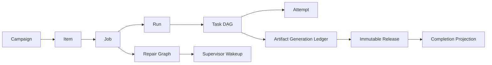
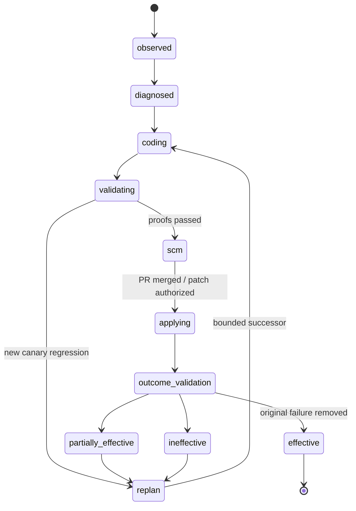

# Job 跨阶段状态一致性与自主收敛设计 v1

> 文档状态：设计基线（部分机制已实现，端到端一致性尚未验收）
> 适用范围：自治 Campaign 下的 Wiki / LCA Job，从创建、研究、内容、表格、发布到系统修复闭环
> 案例基线：A019 `job_0b69524e5e7d457d87741ec2da2e2e59`
> 日期：2026-08-26

[返回《研究约束与 Agent 自治平衡设计 v1》](research-constraint-governance-redesign-v1.html)

## 1. 执行结论

A019 证明当前系统的单阶段 Gate、Agent 生成、证据核验和不可变发布已经能够分别工作，但它们之间缺少一份完整、统一、可事务化的跨阶段协议。问题不是简单的“Gate 太严”或“Agent 太自由”，而是：

> 机械边界严格、语义边界宽松；单阶段规则丰富、跨阶段事务不足；修复能够产生候选，却不能稳定地收敛为一个已验证、已发布、已恢复原 Job 的结果。

目标不是降低安全门槛，而是把严格性放在正确对象上：

- 对事实、身份、引用、权限、产物血缘和正式发布保持严格；
- 对查询、来源探索、表达和低风险修复路径保留 Agent 自由；
- 对 Job、Run、Task、Campaign Item、Repair 和 Release 的变化使用统一事务与可验证投影；
- 对修复是否有效使用因果输入和边际进展判断，而不是依赖错误消息或重试次数。

本设计的最终目标是：在出现可治理故障时，系统能够自行完成“发现 → 归因 → 修复 → Canary → SCM → 应用 → 回卷 → 结果验证 → 发布 → 清理”，且不会出现状态互相矛盾、重复修复、合法 Hash 被误判或 Preview 提前结束最终目标。

## 2. A019 提供的生产证据

A019 最终完成 reviewed publication，但过程并不具备可重复的无人值守特征。

| 指标 | A019 结果 | 设计含义 |
|---|---:|---|
| Workflow Task | 26 / 26 最终成功 | 单阶段能力最终可用 |
| 执行记录 | 406 | 大量回卷与重复物化 |
| 带失败码记录 | 125 | 失败不是偶发噪声 |
| Failure Triage | 52 | 同一 Job 生成过多诊断支线 |
| System Repair | 39 | 缺少唯一活跃 Repair Graph |
| `content_compose` 生命周期尝试号 | 98 | 没有用边际进展控制生成循环 |
| `editorial_review` 生命周期尝试号 | 64 | 内容修复改变样本多于改变因果输入 |
| 表格填充 | 1 / 28 | “非零填充”不等于生产完整 |
| 最终发布覆盖 | 79 / 79 | 发布证明链最终闭合 |

### 2.1 已暴露的跨阶段断点

1. **研究契约升级后，旧 Nomination Capture、Slot 顺序和 Cache 仍服从旧协议。**
2. **Canary 将候选修复与无关的文档链接基线故障混为一谈。**
3. **Verify 合法更新派生 Manifest，却被 SIDE_EFFECT 保护当作越权修改。**
4. **Task 和 Run 已回卷为 ready，但 Job、Item 和 Campaign 仍保持终止或阻塞状态。**
5. **Content Apply、Table Apply 和 Reviewed Apply 合法连续修改同一文件，却没有共同的物化代际。**
6. **Release Gate 的业务 NO_GO 被包装为基础设施 `CAPABILITY_PROCESS_FAILED`。**
7. **同一故障产生多个 Triage、Repair、SCM 支线，旧支线没有 supersede。**
8. **Job 发布后仍残留 queued、coding、awaiting SCM 的 Repair。**
9. **不可变 Release Artifact、Release DB、Job 状态和治理决定没有统一提交。**

### 2.2 不是跨阶段错误的诚实结果

以下结果不应通过“提高自动完成率”被掩盖：

- 公开来源确实可能不足；
- 27 个表格字段仍可能是有检索出处的显式数据缺口；
- 分类事实不能被推导成定量 LCI 数值；
- 高风险事实冲突不能通过增加来源数量绕过；
- reviewed publication 未必等于完整 LCA 模型可用于计算。

系统可以自主完成，但必须自主完成到**契约声明的目标**，不能把证据不足重新命名为成功。

## 3. 根因模型：严格性与自治的错位

| 约束位置 | 当前表现 | 正确设计 |
|---|---|---|
| 文件保护 | 任意字节变化触发隔离 | 按文件类型、所有者和事务来源判定 |
| Hash 验证 | 只接受固定 old/new Hash | 接受授权物化代际中的后继 Hash |
| Canary | 全量测试任意红灯阻断候选 | 只阻断 Candidate 相对同基线新增的失败 |
| Gate | 退出码同时表示执行与业务决策 | execution、decision、goal effect 三轴分离 |
| 研究 | Agent 可自由解释抽象维度 | 系统固定问题契约，Agent 自由探索路径 |
| 内容 | 依赖精确句子和 Token 字符串 | 依赖语义 ID、声明绑定和结构化操作 |
| 修复 | 多个 Agent 独立生成相似 Patch | 一个 Failure 对应一个可版本化 Repair Graph |
| 回卷 | 每个组件分别更新自己的状态 | 一个原子 Recovery Transaction 更新全局聚合 |
| 完成 | 局部状态和 Preview 容易被误读 | Completion Verifier 只认目标绑定的证明 |

### 3.1 必须继续 fail-closed 的边界

- 不可验证或冲突的事实；
- 引用不存在、范围不匹配或对象身份错误；
- 未经授权的业务源文件修改；
- Candidate 引入的新 Canary 回归；
- Release Record 缺失、Hash 不匹配或没有绑定当前 Job；
- Agent 直接写入 Decision、Release、Manifest 等治理证明；
- 高风险代码修复未经批准即应用。

### 3.2 应从阻塞改为自适应或债务的边界

- 英文查询覆盖是否达到 100%；
- Provider、URL、语言和来源类别是否达到理想数量；
- 非关键研究问题是否全部闭合；
- 可公开获得的数据字段是否暂时为空；
- Candidate 与 Baseline 共同存在、且与候选无因果关系的测试失败；
- 合法后继物化导致的页面、Registry 或 Manifest Hash 变化。

## 4. 设计原则与不变量

### 4.1 单一事实源

数据库中的多个状态不是多个真相源。权威事实应来自：

1. 追加式事件；
2. 当前 Artifact Generation Ledger；
3. 当前 Task DAG；
4. Completion Goal；
5. 不可变 Release Proof。

Job、Run、Item、Campaign 和 Dashboard 状态都是上述事实的可重建投影。

### 4.2 单写者与显式所有权

每种状态和产物必须有唯一写者：

| 对象 | 唯一写者 |
|---|---|
| Task / Run 状态 | Orchestrator Transition Service |
| Job 状态 | Job Aggregate Reducer |
| Item / Campaign 状态 | Campaign Projection Reducer |
| Gate Decision | 确定性 Gate Runtime |
| 业务内容 | 获授权的 Apply Transaction |
| Workspace Manifest | Manifest Materializer |
| Repair 生命周期 | Repair Coordinator |
| Release Record | Publish Transaction |

Agent 只能提交 Proposal、结构化操作和证据，不能直接提交权威状态。

### 4.3 幂等、带前置条件、可回放

每个跨阶段命令都必须声明：

- `expected_generation`；
- `expected_statuses`；
- `idempotency_key`；
- `causation_id`；
- `correlation_id`；
- `invalidates`；
- `preserves`；
- `produces`。

重复消费同一命令不能产生第二条修复、第二次回卷或第二份 Release。

### 4.4 最终目标优先于局部完成

`completion_goal=reviewed_publication` 只在以下条件同时满足时完成：

1. Publish Task 成功；
2. 不可变 Task Output Manifest 有效；
3. Release Record 绑定当前 Job；
4. Gate、Reviewed Apply 和 Publish Hash 全部有效；
5. 最终物化代际与 Release Candidate 一致；
6. Campaign Item 成功投影已经提交。

Preview、Maturity PASS、Candidate 或 Applied 都只是里程碑。

## 5. Job Execution Aggregate

### 5.1 聚合边界

一个自治 Job 的一致性聚合包含：



### 5.2 三类状态

#### 执行状态

描述代码是否运行完成：

`pending → ready → running → completed | crashed | timed_out | lease_lost`

#### 决策状态

描述当前 Gate 的判断：

`NOT_RUN | PASS | PASS_WITH_DEBT | RESEARCH_MORE | EVIDENCE_LIMITED | BLOCKED_INTEGRITY`

#### 目标状态

描述相对于 Completion Goal 的效果：

`no_progress | partial_progress | progress | regression | goal_satisfied`

三者不能互相推导。例如命令成功执行后完全可能得到 `gate=RESEARCH_MORE` 和 `goal_effect=no_progress`。

### 5.3 统一阶段结果

```json
{
  "protocol": "stage-outcome-v1",
  "execution": {
    "status": "completed",
    "exit_code": 2,
    "attempt_id": "..."
  },
  "decision": {
    "gate_id": "release_gate",
    "gate_version": "...",
    "verdict": "BLOCKED_INTEGRITY",
    "failed_requirement_ids": ["claim.coverage.current_body"]
  },
  "goal_effect": {
    "status": "no_progress",
    "quality_vector_before": {},
    "quality_vector_after": {}
  },
  "recovery": {
    "action": "repair",
    "from_task": "draft_content_gate",
    "causal_input_hash": "...",
    "strategy_hash": "..."
  },
  "artifacts": []
}
```

脚本退出码仅属于 `execution`，不能直接决定 Failure Taxonomy。

## 6. 原子状态转移协议

### 6.1 转移命令

所有状态变化通过统一命令执行：

```text
transition_job_aggregate(
  command_id,
  job_id,
  run_id,
  expected_generation,
  transition_kind,
  transition_payload
)
```

支持的核心命令：

- `start_job`
- `complete_task`
- `record_gate_decision`
- `fail_task`
- `schedule_retry`
- `rewind_from_task`
- `start_repair_graph`
- `apply_repair`
- `validate_repair_outcome`
- `publish_release`
- `finalize_goal`
- `supersede_stale_work`

### 6.2 Recovery Transaction

从某个任务回卷必须在一个事务中完成：

1. 锁定 Job Aggregate Generation；
2. 校验目标 Task 存在且没有运行中的后继任务；
3. 当前 Task 置为 ready；
4. 所有后继 Task 置为 pending；
5. Run 置为 ready；
6. Job 置为 ready；
7. Item 置为 running；
8. Campaign 置为 running；
9. 创建新的 Repair Epoch；
10. 创建唯一 Supervisor Wakeup；
11. 将旧 Generation 的输出标记 stale；
12. 提交 Outbox Event。

任何一步失败，整个事务回滚。

### 6.3 状态不变量

系统每个 Supervisor Cycle 都必须检查：

- 存在 ready Task 时，Job 不得处于终止状态；
- Job=published 时，Publish Task 必须 succeeded；
- Item=succeeded 时，Completion Proof 必须有效；
- Campaign=completed 时，所有 Item 必须满足 Campaign Goal；
- Run=ready 时，至少存在一个 ready Task 或可被依赖释放的 pending Task；
- Task=running 时，必须存在有效 Lease 和 Fencing Token；
- Job 有活跃 Repair 时，不得存在同一 Repair Key 的第二个活跃 Repair；
- Job 完成后，不得保留非终态 Repair 和未消费 Wakeup。

不变量失败时创建 `control_plane_repair_job`，不能依靠 Dashboard 人工判断。

## 7. Artifact Generation Ledger

### 7.1 为什么需要代际账本

同一页面和 Registry 会被多个合法阶段修改：

```text
content_apply → table_apply → reviewed_apply → publish
```

只记录 old/new Hash 无法表达多阶段合法后继关系。

### 7.2 Ledger 记录

```json
{
  "logical_path": "wiki/.../A019.md",
  "generation": 7,
  "producer_task": "table_apply",
  "transaction_id": "mat_...",
  "base_generation": 6,
  "base_sha256": "...",
  "output_sha256": "...",
  "semantic_identity": "wiki-page:A019",
  "operation_class": "table_materialization",
  "authorized_successors": ["reviewed_apply"],
  "proof_artifacts": ["table-apply-report.json"]
}
```

### 7.3 派生文件策略

文件分为：

| 类型 | 示例 | 策略 |
|---|---|---|
| 业务源文件 | Wiki 页面、Registry | 只允许 Apply Transaction 修改 |
| 派生完整性文件 | `workspace-manifest.json` | Agent 禁止直接修改，由系统重建 |
| Gate 产物 | Gate JSON | Gate Runtime 独占写入 |
| 审计产物 | Attempt Archive、Event | 追加写入，不允许覆盖 |
| 发布证明 | Release Record | Publish Transaction 一次性冻结 |

SIDE_EFFECT 检测必须判断“变化由谁、通过什么事务产生”，而不是简单比较执行前后的所有字节。

## 8. Repair Graph 与自主收敛

### 8.1 Repair Key

同一时刻每个 Repair Key 只能有一个活跃 Graph：

```text
(job_id, task_id, failure_fingerprint, causal_generation)
```

### 8.2 Repair Graph



旧 Candidate 不能与新 Candidate 并行争夺同一 Job。新 Candidate 创建后，旧版本必须标记 `superseded`。

### 8.3 因果差异与边际进展

每次修复必须绑定：

- Failure Fingerprint；
- Causal Input Hash；
- Strategy Hash；
- Code Baseline；
- Quality Vector Before；
- Expected Delta；
- Recovery Task。

允许继续的规则：

| 条件 | 动作 |
|---|---|
| 指纹、因果输入、策略全部相同 | 拒绝重试，进入 replan |
| 策略改变且预期证明不同 | 允许一次验证 |
| Quality Vector 有改善 | 继续当前 Graph |
| 连续两次零增益 | 必须更换因果方案或诚实终止 |
| Quality Vector 退化 | 回滚并标记 regression |
| 公开证据稀缺 | 形成 explicit gap，不无限搜索 |

### 8.4 Agent 自由边界

Agent 可以决定：

- 查询措辞、语言、Provider 和探索顺序；
- 来源候选与证据组合建议；
- 内容表达和段落组织；
- 代码修复候选；
- 对失败原因的解释和疑问。

Agent 不能决定：

- 核心问题契约和验收谓词；
- Gate 最终判定；
- Job、Run、Item 或 Campaign 状态；
- Artifact Generation；
- Manifest、Decision 或 Release Record；
- 最终目标是否已经完成。

## 9. Canary、SCM 与运行时更新

### 9.1 差分 Canary

Candidate 和 Baseline 必须：

- 来自同一 Git Revision；
- 使用相同依赖和环境；
- 执行相同测试集合；
- 输出可解析的测试 Node ID。

判定规则：

- Candidate 全绿：通过；
- Candidate 红、Baseline 同样红且失败集合无新增：候选通过，记录 Baseline Debt；
- Candidate 新增失败：候选拒绝并创建 bounded successor；
- 失败无法解析：fail-closed；
- Baseline 环境本身无法运行：分类为基础设施故障，不归因于 Candidate。

### 9.2 SCM 自动收敛

低风险修复在验证通过后自动：

1. 从最新 `origin/main` 创建分支；
2. 根据因果方案重新生成 Patch；
3. 运行 focused、shadow、canary；
4. 创建或复用 Issue；
5. Commit 并创建 PR；
6. 等待 Required Checks；
7. 自动合并低风险 PR；
8. 本地 fast-forward；
9. 重启受影响服务；
10. 从 Recovery Task 受控回卷；
11. 验证原 Failure Fingerprint 消失。

Main 漂移不应永久停在 `awaiting_scm_publication`，而应生成绑定新基线的 Repair Revision。网络失败使用退避重试，不重新生成业务修复。

### 9.3 风险等级

| 风险 | 示例 | 发布规则 |
|---|---|---|
| low | 分类器、可观察性、兼容解析 | 测试通过后自动合并 |
| medium | Gate 规则、状态转移、物化恢复 | Shadow + Canary + 最小批准 |
| high | 发布不变量、权限、数据库迁移 | 人工批准和双重证明 |

## 10. Completion Transaction 与收尾

### 10.1 Reviewed Publication Verifier

Verifier 必须同时检查：

- Publish Task Output Manifest；
- Release Record 协议；
- Job ID 和 Candidate Hash；
- Gate Report Hash；
- Reviewed Apply Hash；
- Publish Report Hash；
- Artifact Ledger 的最终 Generation；
- Release DB Projection；
- Governance Decision 与 Publication Status 一致。

### 10.2 Final Reconciliation

发布成功后，同一事务或可靠 Outbox Consumer 必须：

- Job → published；
- Run → succeeded；
- Item → succeeded；
- Campaign 在所有 Item 完成后 → completed；
- 当前 Repair → effective；
- 其他 Repair → superseded / obsolete；
- Pending Wakeup → consumed_obsolete；
- Open Deviation → resolved_by_release 或 retained_as_debt；
- Release DB 写入与不可变 Artifact 绑定。

“发布成功但 Dashboard 仍显示修复中”应被视为不变量失败。

## 11. Supervisor 与 Worker 协议

### 11.1 Supervisor 每个 Cycle 的顺序

1. 获取 Campaign Lease；
2. 运行 Aggregate Invariant Reconciler；
3. 消费唯一 Wakeup；
4. 处理唯一活跃 Repair；
5. 处理 SCM Publication；
6. 运行 Outcome Validation；
7. 若存在 ready Task，派发 Worker；
8. 更新 Projection；
9. 判断 Completion Goal；
10. 写入 Heartbeat。

不能先因为 Campaign=`needs_attention` 直接退出，再忽略已经存在的 ready Task 或可恢复 Repair。

### 11.2 Worker 规则

- 只领取当前 Generation 的 ready Task；
- Claim、Lease 和 Attempt 必须在同一所有权边界；
- Worker 丢失后由 Watchdog 标记 Attempt abandoned，并安全重新领取；
- Stage Outcome 写入成功后才能释放后继任务；
- Worker 不直接更新 Item 或 Campaign；
- Worker 不直接决定 Repair 是否有效。

## 12. 可观察性与 Dashboard 投影

Dashboard 每个阶段至少展示：

- 做了什么；
- 输入 Artifact 和 Generation；
- Agent 或脚本是谁；
- 查询关键词和 Provider；
- 候选、采纳与拒绝原因；
- 执行状态；
- Gate 决策；
- 对最终目标的效果；
- 当前失败 requirement；
- 修复改变了哪些因果输入；
- 当前 Repair Graph；
- 下一自动动作和预计触发条件。

Dashboard 只做投影，不能通过前端推断或修正状态。

## 13. 实施差距矩阵

| 能力 | 当前状态 | 缺口 | 目标 |
|---|---|---|---|
| Research Question Contract v2 | 已实现 | 下游兼容曾不完整 | E2E 固化 |
| 逐问题证据账本 | 已实现 | 与最终关键字段闭合尚未统一 | 接入 Completion Goal |
| Stage 三轴事件 | 部分实现 | Release 等 Gate 未统一 | 所有阶段使用 StageOutcome v1 |
| Failure Fingerprint v2 | 部分实现 | 缺少 Causal Generation 与零增益控制 | 接入 Retry Permission |
| Quality Trajectory | 已观测 | 未控制 Worker 重试 | 成为收敛判据 |
| Baseline-aware Canary | 已有实现 | 需要稳定基线与 SCM 集成验收 | 干净 checkout 回归 |
| 原子 Recovery | 部分实现 | Item/Campaign/Wakeup 非统一事务 | Aggregate Transition Service |
| Artifact Generation Ledger | 未实现 | 多 Apply 依赖特例识别 | 一等账本 |
| Derived Manifest Ownership | 部分实现 | 检测仍可能按字节误判 | 类型化副作用策略 |
| 唯一 Repair Graph | 未实现 | Repair Storm | Repair Key 唯一约束 |
| SCM 自动重基线 | 部分实现 | 大量 Base Conflict | 自动重生成和合并 |
| Final Reconciliation | 未实现 | 发布后残留 Repair | 终态清理事务 |
| Release 多投影一致性 | 未实现 | Artifact 与 DB 可能不同步 | Completion Transaction |

## 14. 实施顺序

### P0：保证不会再被状态不一致卡住

1. 定义 `stage-outcome-v1`；
2. 所有 Gate 统一业务失败分类；
3. 实现 Job Aggregate Transition Service；
4. 实现原子 Recovery Transaction；
5. 增加状态不变量 Reconciler；
6. 实现 Repair Key 唯一约束和 Supersession；
7. 实现 Final Reconciliation。

### P1：保证修复能够收敛

1. 将 Quality Trajectory 接入 Retry Permission；
2. 实现连续零增益检测；
3. 完成差分 Canary；
4. SCM 自动重基线、PR 和低风险自动合并；
5. Outcome Validation 自动回卷原 Job；
6. 结构化 Agent 编辑操作替换整篇自由覆盖。

### P2：消除 Hash 与物化特例

1. Artifact Generation Ledger；
2. Apply Transaction 统一协议；
3. Derived Manifest Materializer；
4. Release Transaction 与 DB Projection；
5. 清理旧的 old/new Hash 特例。

### P3：生产验收与迁移

1. 迁移存量活跃 Job 的 Projection；
2. 将历史 Repair 标记为 superseded / obsolete；
3. 从干净 main 启动连续三个 reviewed Job；
4. 故障注入；
5. 对比 Golden Case；
6. 发布实施状态报告。

## 15. 验收与故障注入

### 15.1 必须通过的端到端场景

| 场景 | 预期结果 |
|---|---|
| Release Gate 返回 exit 2 | 显示真实 BLOCKED 原因并自动选择 Recovery Task |
| Table Apply 修改页面 | Release Gate 识别为合法后继 Generation |
| Verify 触发 Manifest 重建 | Manifest 由系统重建，不误判 Agent 越权 |
| Agent 修改业务源文件 | SIDE_EFFECT 隔离仍然生效 |
| Baseline 有文档死链 | 无 Candidate 新增失败时不阻断候选 |
| Candidate 新增测试失败 | Canary 拒绝并生成唯一 successor |
| 从 evidence_limited 回卷 | Job、Run、Task、Item、Campaign 同时恢复 |
| Worker 在 Task 中丢失 | Attempt abandoned，Task 可安全重领 |
| Main 在修复期间更新 | Patch 基于最新 Main 自动重生成 |
| 同一失败重复出现 | 只存在一个活跃 Repair Graph |
| 两轮质量零增益 | 自动换策略或诚实停止 |
| Preview 成功 | reviewed Job 继续运行 |
| Publish 成功 | 所有 Repair 和 Wakeup 被收尾 |
| Release Artifact 与 DB 不一致 | Completion 被拒绝并触发控制面修复 |

### 15.2 通过标准

- 连续三个全新 reviewed Job 无人工操作完成；
- 任一 Job 不超过一个活跃 Repair Graph；
- 相同 Causal Generation 不发生盲重试；
- 无状态不变量告警；
- 无合法物化 Hash drift 误报；
- 无发布后遗留活跃 Repair；
- 从干净 main checkout 可复现；
- Dashboard 所有状态均可追溯到事件和 Artifact。

## 16. 代码落点

| 模块 | 目标职责 |
|---|---|
| [`src/lca_project/capability_runtime.py`](../src/lca_project/capability_runtime.py) | 统一 Stage Outcome 与 Gate 失败分类 |
| [`src/lca_project/kernel/orchestrator.py`](../src/lca_project/kernel/orchestrator.py) | Task DAG、Recovery Transaction、Generation |
| [`src/lca_project/kernel/worker.py`](../src/lca_project/kernel/worker.py) | Worker 所有权、Retry Permission、Stage Outcome |
| [`src/lca_project/kernel/executor.py`](../src/lca_project/kernel/executor.py) | 类型化 Side Effect 和 Derived Manifest 策略 |
| [`src/lca_project/kernel/goal_alignment/autonomous_supervisor.py`](../src/lca_project/kernel/goal_alignment/autonomous_supervisor.py) | Aggregate Reconciliation、Campaign Projection、Completion |
| [`src/lca_project/kernel/goal_alignment/system_repair_agent.py`](../src/lca_project/kernel/goal_alignment/system_repair_agent.py) | 唯一 Repair Graph、差分 Canary、Outcome Validation |
| [`src/lca_project/kernel/goal_alignment/system_repair_scm.py`](../src/lca_project/kernel/goal_alignment/system_repair_scm.py) | 最新 Main 重基线、PR、自动合并 |
| [`src/lca_project/kernel/goal_alignment/quality_trajectory.py`](../src/lca_project/kernel/goal_alignment/quality_trajectory.py) | 边际进展与零增益判断 |
| [`src/lca_project/domains/wiki_workspace.py`](../src/lca_project/domains/wiki_workspace.py) | Manifest Materializer 与 Workspace 代际 |
| [`vendor/lca_cornerstone/scripts/wiki_claim_coverage.py`](../vendor/lca_cornerstone/scripts/wiki_claim_coverage.py) | 基于 Ledger 的最终声明覆盖 |
| [`vendor/lca_cornerstone/scripts/merge_wiki_ku.py`](../vendor/lca_cornerstone/scripts/merge_wiki_ku.py) | 基于 Generation 的重放和兼容合并 |

## 17. 与研究约束设计的边界

[《研究约束与 Agent 自治平衡设计 v1》](research-constraint-governance-redesign-v1.html)回答：

- 什么必须被证明；
- 研究问题如何稳定；
- Agent 可以如何探索；
- Evidence Gate 应当怎样判定。

本文回答：

- 证明和产物如何跨阶段传递；
- 状态如何原子变化；
- 修复如何成为唯一、可收敛的 Graph；
- 合法物化如何形成 Hash 代际；
- Job 如何从故障恢复到最终不可变发布；
- 发布后如何清理所有衍生工作。

两份设计共同构成完整自主生产闭环：

> 研究约束设计固定“什么算正确”；跨阶段一致性设计固定“正确结果怎样安全地走完全程”。

## 18. 决策记录

### ADR-01：不通过放宽 Gate 提高完成率

保持事实、身份、发布和权限不变量；修复错误归因和状态协议。

### ADR-02：状态由事件和证明投影，而不是组件互相覆盖

引入 Job Aggregate Transition Service，并禁止 Worker 直接写 Campaign 状态。

### ADR-03：Hash 验证升级为授权物化代际

保留 Hash 严格性，消除多阶段合法写入的误报。

### ADR-04：修复预算属于因果方案

引入 Repair Key、Strategy Hash、Quality Delta 和 Supersession。

### ADR-05：只有 Completion Verifier 可以宣告最终完成

Preview、Candidate、Gate PASS 和 Apply 都不能单独结束 reviewed Job。

---

最终标准不是让流水线“更容易成功”，而是让每一次推进、回卷、修复和发布都拥有唯一状态、明确所有者、完整证明和可复现的因果关系。
