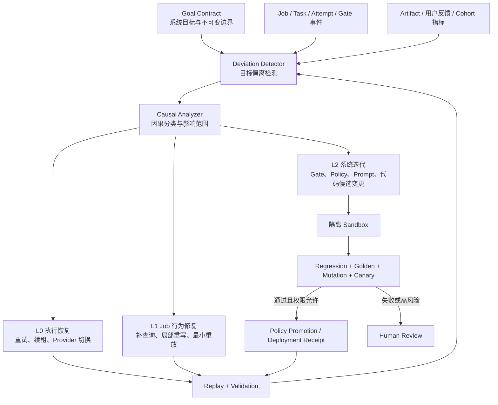
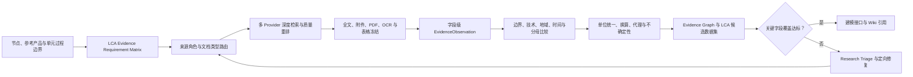
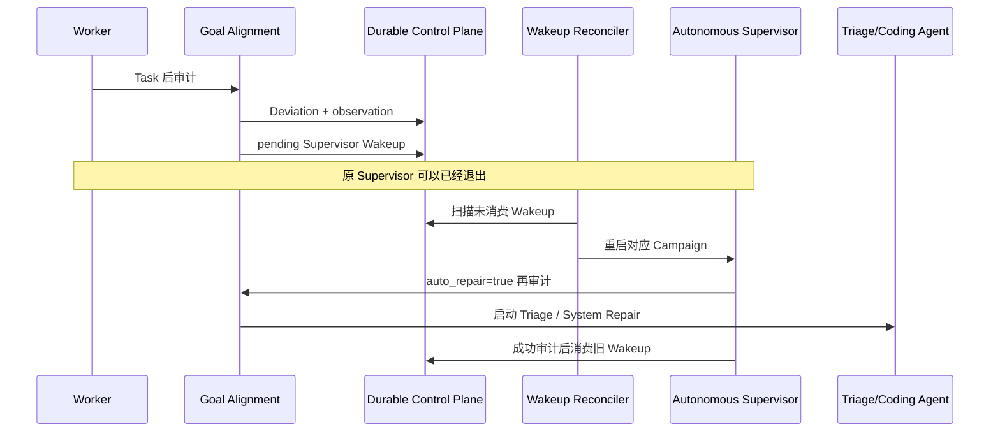
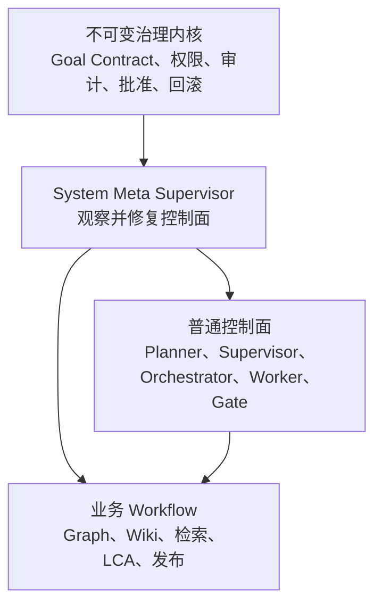

# 系统自我修复与目标对齐架构

- 状态：执行故障、研究效用、持久化监督唤醒、修复效果回执与系统元监督已实现；LCA 证据覆盖仍需按过程族持续扩展
- 适用范围：Graph、Wiki、Cross-link、LCA Binding、BOM 与 Publication 生产流程
- 设计目标：把“人发现偏离—人诊断—人修复—人重跑”升级为可审计、有限权、可回滚的系统闭环

## 1. 核心结论

系统不仅要监测 Job 是否失败，还必须监测以下三类偏离：

1. **执行偏离**：Job 无进展、Worker 失联、任务重复失败或修复预算异常耗尽；
2. **产出偏离**：Workflow 成功，但产物不满足业务目标，例如引用稀薄、身份混淆、数据表只有空缺；
3. **控制偏离**：Gate 与目标不再一致，例如不合理地阻塞有效产物，或放宽后让低质量产物成为 Candidate。

因此，Gate 不是系统的最终目标。Gate 是目标契约在当前实现中的一组可执行传感器和执行许可。系统必须用独立、版本化的 Goal Contract 评价 Gate 本身。

## 2. 三层闭环



### 2.1 L0：执行自愈

处理不改变业务语义的故障：Worker 丢失、临时 I/O、Provider 超时、缓存损坏、Lease 过期。动作可以自动执行，但必须保留 Attempt、Failure Envelope 和重放证明。

### 2.2 L1：Job 级目标回归

处理单个 Job 的可恢复偏离：

- 中文术语缺少英文查询词；
- 来源角色或语言轨缺失；
- 正文某节没有外部事实或显式证据缺口；
- Editorial 指出局部身份漂移或断裂；
- 表格某个单元格缺少检索证明；
- Preview 发现来源、正文或表格哈希不一致。

修复必须选择最小失效点，只重放必要的下游任务；同类修复有固定预算，质量没有改善时停止。

### 2.3 L2：系统级自我迭代

当相同偏离跨 Job 重复出现，或单个 Job 暴露公共合同缺陷时，问题应从 Job 事件升级为 System Improvement Candidate。系统可以自动提出对以下对象的修改：

- Goal 到 Gate 的映射；
- Gate 阈值与判定语义；
- Repair Policy 与预算；
- 查询词典、Provider 路由和 Prompt；
- 确定性验证脚本或 Workflow DAG；
- Golden、Defect Mutation 与回归测试。

系统级变更只能在隔离工作区生成和验证，不能由运行中的 Job 直接修改线上代码或目标数据。

L2 已接入受治理的编码 Agent 执行器：Deviation Detector 先冻结故障证据，Causal
Analyzer 和 Repair Planner 生成系统变更候选；`SystemRepairAgent` 随后复制一次性仓库
快照，调用固定模型在 `workspace-write` 边界内完成最小代码修改和回归测试。Agent 不能
编辑 Goal Contract、治理权限、发布能力或完整性清单，也不能为自己签发证书。控制平面
独立计算文件差异和补丁哈希，确定性刷新既有 vendor 完整性锚点，依次执行 focused
Sandbox、Shadow、全量 Canary 和合入后全量回归；只有低风险且全部通过的候选才自动
晋级。晋级后刷新原 Job 工作区并从故障 Task rewind；任一阶段失败均保留证据并拒绝合入。

规则库只承担已知问题的确定性快速路径。对规则不能解释的失败，migration v9 持久化
`failure_triage_runs`，并自动调用只读 `FailureTriageAgent`。该 Agent 在不获得写权限的
仓库快照中读取冻结 dossier、Task DAG、上下游前置条件、Goal Contract、相关 Artifact
和源码，自主区分实现缺陷、流程死锁、合同错配、真实证据缺口、外部依赖和治理决策，
输出因果链、证据、风险、修复层级、恢复节点、实现目标与 focused tests。故障指纹仅用于
去重、复发聚类和历史经验复用，不再是允许调查或修复的白名单。Triage 选择 L2 后才由
编码 Agent 获得隔离快照写权限；选择证据不足或外部权限时必须诚实降级或请求人工裁决。
首次未知失败即会形成持久待调查记录；即使快速重试把 Task 暂时改回 `ready`，下一次自治
监督仍会消费该记录并启动 Triage。Triage 完成前不得回退生成猜测性的通用变更候选，且
并发监督只观察 `investigating` Run，不得删除沙箱或重启同一调查。

## 3. Goal Contract：Gate 的上位合同

每个领域必须定义独立的 `goal-contract-v1`，至少包含：

| 字段 | 含义 |
|---|---|
| `purpose` | 产物要帮助谁完成什么决策 |
| `required_outcomes` | 身份、证据、内容、数据、可用性等结果维度 |
| `prohibited_outcomes` | 不允许出现的身份混淆、伪来源、越权发布等 |
| `maturity_levels` | diagnostic、evidence-limited、candidate、reviewed、published |
| `signals` | 用哪些 Gate、指标、抽样和用户反馈观测目标 |
| `repair_authority` | 哪些行为可自动改变，哪些必须人工批准 |
| `evaluation_cohorts` | Golden、普通样本、难例与 Mutation 集合 |

Wiki 的 Goal Contract 不是“正文达到多少字”或“所有 Gate 都显示绿色”，而是：

1. 准确说明节点身份、边界、相邻对象和在 LCA 中的作用；
2. 外部事实可追溯，建模判断与证据缺口明确区分；
3. 正文结构在语义上闭合，能支持后续建模和数据采集；
4. Product/Activity 表合同正确，数值、代理值和缺口都有真实来源或检索证明；
5. 成熟度诚实，低证据产物不得成为 Wiki Candidate；
6. 内容对读者有用，而不仅是机器合同形式完整。

## 4. 如何检测“Gate 通过但目标偏离”

Deviation Detector 同时比较三个对象：

```text
Goal Contract 期望结果
        vs
Gate / Policy 声称的结果
        vs
Artifact 与用户反馈显示的实际结果
```

主要检测模式：

| 偏离类型 | 典型信号 | 系统判定 |
|---|---|---|
| False Pass | Gate PASS，但身份冲突、引用覆盖下降或表格无数据 | Gate 对目标覆盖不足 |
| False Block | 内容满足目标，却因固定字数、未知翻译片段等被阻塞 | Gate 代理指标不合理 |
| Repair Ineffective | 重试后失败指纹、质量向量和来源集合没有改善 | 修复行为无效，禁止继续盲重试 |
| Local Fix Recurrence | 同一失败码跨多个节点出现 | 升级为系统变更候选 |
| Success Without Maturity | Run succeeded，但 maturity 不是 candidate | 流程完成，不等于目标完成 |
| Low Evidence Yield | 已抓取大量候选，但可接受观测和关键字段填值接近零 | 优先判定检索、路由、提取或适用性能力缺口，不能直接解释为公开数据稀缺 |
| Search Strategy Mismatch | 查询包含内部 ID、语言未翻译、过程族没有文档路由 | 生成批次级研究计划修复；复发时升级系统能力变更 |
| Extractor Coverage Gap | 目标字段远多于可识别字段，全文中存在信息但无法结构化 | 启动语义提取或 L2 提取器能力修复 |
| False Terminal Low Utility | `evidence_limited` 被当作建模资料任务的正常完成 | 按 Goal Contract 改为 `needs_research` 或 `data_required` |
| User Escape Report | 用户指出事实混淆、空表或引用下降 | 形成结构化偏离样本并回扫同类产物 |

质量比较使用多维向量，不能压缩成一个容易被优化钻空子的总分：

```text
identity_fidelity
source_role_coverage
claim_provenance_coverage
semantic_closure
editorial_coherence
table_contract_validity
research_process_integrity
evidence_yield
critical_field_coverage
model_data_readiness
search_strategy_adequacy
gap_provenance
reader_utility
```

`data_ready` 与 `no_eligible_public_data` 不得再映射为同一个质量结果。前者表示存在可用于模型的证据，后者最多证明检索流程完整、拒绝和缺口可审计。质量轨迹必须分别记录“研究是否合规完成”和“是否形成可入模数据”。

任何修复都必须证明目标维度改善，且已通过维度没有退化。

## 5. Wiki Gate 偏离目标的完整示例

### 5.1 A040：Gate 放宽导致 False Pass

目标对象是“笔记本电脑整机总装”，实际产物只有一个独立来源，并混入“通用服务器主板、服务器散热器、服务器机箱”等投入。旧流程通过降低来源和正文阈值让 Job 跑完，却使引用和内容完整度下降。

监督系统应检测到：

- 图谱输出产品族为 `laptop`，多个投入产品族为 `server`；
- 来源域、来源角色和语言轨未达到 Candidate 目标；
- 核心章节只有内部图谱事实或泛化判断；
- 六表虽然结构存在，但有效公开数据为零；
- Run succeeded 与 `wiki_candidate` 目标不一致。

因果分类为：`GATE_FALSE_PASS + GRAPH_SEMANTIC_CONFLICT + EVIDENCE_DEFICIT`。

允许的系统行为修改：

1. 在 Blueprint 阶段增加产品族语义冲突检测；
2. 将来源“数量”升级为身份、边界、相邻区分、地域和定量角色覆盖；
3. 正文从固定字数改为逐句事实类型和核心章节闭合；
4. 增加最终 Maturity Gate；
5. 将该产物降为 `diagnostic_preview`，禁止 Candidate 晋级；
6. 用 A040 缺陷样本和 Golden Case 验证变更没有过度阻塞正常 Wiki。

### 5.2 A037：Gate 过严与 Repair 预算错误导致 False Block

“机架 PDU”自动翻译得到 `PDU 1U`，但词典未覆盖“机架”，Research Plan Gate 因 `unmatched_fragments=[机架]` 阻塞；同时预算边界使第一次失败直接进入人工审核。

监督系统应检测到：

- 已存在可用英文查询，但翻译审计只因一个可翻译片段失败；
- Failure 第一次发生，Repair Policy 却声称预算耗尽；
- Job 未进入 Search，目标进展为零；
- 同一输入通过通用翻译回退可以形成 `rack-mounted PDU`。

因果分类为：`GATE_FALSE_BLOCK + TRANSLATION_COVERAGE_GAP + REPAIR_BUDGET_OFF_BY_ONE`。

安全的 L1 行为是生成经审计的查询级翻译并重放 `research_plan`；L2 候选变更是补充通用翻译回退、修复预算边界，并增加 A037 回归。只有回归、Golden 和 Canary 均通过后才能晋级为新系统行为。

### 5.3 A039：流程成功但 LCA 研究效用为零

A039 的任务、检索和表格合同均到达诚实终态，但实际结果为外部确认来源 0、关键字段填值 0、33 个字段全部为显式缺口。表格检索执行了 66 条查询并审核 329 个候选，因此不能把结果简单归因为“没有执行检索”。

监督系统应在任务结束时计算研究漏斗：

```text
查询 → 搜索结果 → 成功抓取 → 字段观测 → 适用性通过 → LCA 字段填值
 66      329          多份          0           0              0
```

同时检查以下确定性信号：

- 英文查询仍包含中文字段，且查询携带 `P018`、`P026` 等内部图谱编号；
- A039 的过程族没有命中任何 `document_route`；
- 33 个字段中只有少量字段拥有确定性提取规则，专项解析器集中在 SMT 环评和 PCB 装配；
- 搜索供应商返回任意命中后即停止扩展，停止条件是“有网页”而不是“有合格证据”；
- `no_eligible_public_data` 被质量轨迹计为 data readiness 通过，`evidence_limited` 又被 Autonomous Campaign 计为完成。

应产生复合偏离：

```text
LOW_EVIDENCE_YIELD
+ QUERY_EXTERNAL_VOCABULARY_MISMATCH
+ DOCUMENT_ROUTE_COVERAGE_GAP
+ EXTRACTOR_COVERAGE_GAP
+ FALSE_TERMINAL_LOW_UTILITY
```

这类偏离必须在没有 failed Task 的情况下也启动只读 `ResearchTriageAgent`。它需要回答：公开资料真的不存在，还是检索没有进入正确文档；哪些字段可由产品规格、维护手册、EPD/PCF、环评、过程 LCA 或拆解报告获得；失败位于查询、抓取、提取、归一化还是边界适用性；下一次尝试将改变什么因果输入；哪些剩余字段只能形成企业数据请求。

## 5.4 面向 LCA 建模的证据检索闭环

研究流程必须从 LCA 证据需求出发，而不是从 Wiki 展示字段直接拼接查询：



### 5.4.1 Evidence Requirement Matrix

每个字段在搜索前必须冻结：可观测问题、目标单位、功能单位或分母、单元过程边界、允许的来源角色、代理政策、失效条件和关键性。A039 的关键需求至少包括参考型号与配置、产品净质量、核心部件数量、总装与测试电耗、良率/返工、地点、代表期和共享资源边界。

### 5.4.2 文档类型路由

过程族 `server_final_assembly` 至少需要以下路由：

| 路由 | 主要文档 | 可支持的数据 |
|---|---|---|
| `manufacturer_product_spec` | QuickSpecs、技术规格、配置指南 | 型号、质量、尺寸、配置 |
| `maintenance_and_service_manual` | 维护与拆装手册 | 部件数量、装配顺序、交接状态 |
| `product_pcf_or_epd` | PCF、EPD 及技术附件 | 产品级材料和制造约束；不得直接冒充总装单元过程 |
| `factory_eia_and_permit` | 环评、排污许可、验收报告 | 年产量、能源、废物、排放及归一化代理 |
| `process_lca_and_manufacturing_research` | 过程 LCA、制造研究 | 装配、测试、返工能耗和范围 |
| `open_hardware_and_teardown` | Open Compute、拆解报告 | 参考配置、BOM 完整性与交叉校验 |

查询必须使用外部世界中的产品族、型号、观测量和文档类型词；内部节点 ID 只用于结果回写，不得进入开放检索词。执行器应跨 Provider 聚合候选并按文档类型、来源角色、全文可得性和字段潜力重排，不能在第一个 Provider 返回任意网页时停止。

### 5.4.3 EvidenceObservation 与证据等级

每个入模候选值必须保存数值、单位、功能单位、参考产品、过程边界、地域、代表期、来源组织、URL、页码/表格/原文、冻结内容 Hash、提取方法、换算公式、分配规则、质量向量、不确定性和使用等级。证据分级如下：

| 等级 | 含义 | 建模用途 |
|---|---|---|
| A | 同工厂、同产品、同边界的一手数据 | 基准值 |
| B | 同型号产品资料或同企业过程资料 | 直接值或轻度调整 |
| C | 同工艺、相似产品的公开数据 | 明示代理值 |
| D | 多来源工程推导 | 情景与敏感性分析 |
| E | 公开资料仍不可得 | 企业数据请求 |

来源权威性不能替代节点适用性。质量评价至少独立表达身份、技术、边界、功能单位、地域、时间、来源独立性和提取可信度；两个不同域名只有在来源谱系独立时才算交叉证据，数值差异也不应仅以固定 2% 阈值决定真伪。

### 5.4.4 研究效用闸门与终态

结构合法、检索已执行和缺口可审计属于 `research_process_integrity`；关键字段覆盖和可用于模型属于 `model_data_readiness`。两者必须分开判定：

| 状态 | 含义 | Campaign 行为 |
|---|---|---|
| `modeling_ready` | 关键字段达到 Goal Contract，所有值可追溯 | 完成并进入建模接口 |
| `needs_research` | 当前策略产出低，但仍有未尝试的安全研究路径 | 自动启动 Research Triage 和 L1/L2 修复 |
| `data_required` | 已证明公共检索策略耗尽，关键字段依赖内部记录 | 生成企业数据请求并进入 `needs_attention` |
| `diagnostic_preview` | 仅用于查看结构或故障 | 不计为建模资料完成 |

`evidence_limited` 是否可作为完成必须由任务 Goal Contract 决定；对“生成诚实 Wiki 草稿”可以结束，对“形成 LCA 建模资料包”不能算成功。

### 5.4.5 研究修复路由

Research Triage 必须先区分失败层级，再选择动作：

| 失败层级 | 典型证据 | 修复动作 |
|---|---|---|
| 查询 | 内部 ID、语言混用、结果主题漂移 | L1 重写术语、查询和站点/文件类型限定 |
| 路由 | 过程族没有目标文档类型 | L1 批次路由扩展；跨 Job 复发时 L2 公共路由 |
| 获取 | 附件、PDF 或扫描件未冻结 | 重试附件、OCR、表格抽取 |
| 提取 | 候选很多但字段观测为零 | L2 增加语义/确定性提取能力 |
| 适用性 | 有数值但功能单位或边界不一致 | 建立代理、范围和失效条件，不放松证据标准 |
| 真实缺口 | 多策略无增量且字段依赖内部记录 | 生成结构化企业数据请求，停止盲重试 |

每次修复都必须声明预期指标增量，并以修复前后漏斗比较验证。只重新执行相同查询、相同路由和相同提取器不构成修复；连续尝试没有新增独立来源、字段观测或关键字段覆盖时，必须停止并升级或进入 `data_required`。

## 6. 系统如何安全地修改自身行为

行为变化必须经过以下状态机：

```text
observed
  → diagnosed
  → change_proposed
  → sandbox_validated
  → shadowed
  → canary_passed
  → promoted
  → awaiting_outcome_validation
  → effective | partially_effective | ineffective
  → retained | next_repair_iteration | rolled_back
```

### 6.1 自动权限分级

| 风险 | 例子 | 默认权限 |
|---|---|---|
| 低 | Provider 切换、缓存重建、相同合同下的局部重放 | 自动执行 |
| 中 | 查询级翻译、缺失来源角色补检索、局部正文 Patch | 自动执行但必须重跑目标 Gate |
| 中高 | 词典、Prompt、阈值、Repair Budget 变更 | Sandbox + Shadow + Canary 后晋级 |
| 高 | Goal Contract、节点身份、六表合同、发布权限、Graph 边修改 | 必须人工批准 |

### 6.2 晋级证据

每个系统行为变更必须生成：

- `deviation-report-v1`：目标、实际结果、偏离维度和证据 Hash；
- `causal-diagnosis-v1`：根因、置信度、影响范围和反事实；
- `repair-plan-v1`：最小失效点、预算、预期改善和回滚点；
- `system-change-candidate-v1`：代码、Policy、Prompt 或配置 Diff；
- `validation-certificate-v1`：回归、Golden、Mutation、Shadow、Canary 结果；
- `policy-promotion-receipt-v1`：批准者、版本、部署和回滚 Hash。
- `repair-validation-receipt-v1`：修复前基线、官方重放产物、目标指标变化和有效性结论。

## 7. 防止自我迭代偏离目标

自我迭代系统本身也可能 Goodhart 化，因此必须满足：

1. Goal Contract 与发布权限不能由普通 Job 或修复 Agent 修改；
2. 负责生成变更的 Agent 不能签发自己的 Validation Certificate；
3. 不允许为了提高通过率把失败检查改写为 true；
4. 不允许只以 Job 完成率、字数、来源数量等单一代理指标判定改善；
5. 每次变更必须同时跑触发样本、Golden、反例 Mutation 和随机 Cohort；
6. 已通过质量维度退化时，即使目标故障消失也不得晋级；
7. Canary 指标恶化必须自动回滚到上一冻结版本；
8. 自动修复预算耗尽后必须生成可执行异常包，而不是无限重试。

## 8. 与现有控制平面的集成

| 现有组件 | 新职责 |
|---|---|
| `PersistentOrchestrator` | 继续作为 Job/Task/Attempt 唯一状态事实源 |
| Event Ledger | 提供偏离检测所需的执行和 Gate 事件流 |
| Artifact CAS | 冻结目标、产物、诊断、变更和验证证书 |
| Worker + Repair Policy | 执行 L0/L1 有界修复，不承担系统目标定义 |
| Maturity Gate | 汇总单 Job 目标达成度，但不能独自修改 Goal Contract |
| Research Outcome Evaluator | 计算查询—抓取—观测—接受—入模漏斗、查询质量、提取覆盖和关键字段覆盖 |
| Research Triage Agent | 调查成功但低效用的研究结果，提出问题、因果假设、定向研究或系统能力修复 |
| Dashboard | 展示目标偏离、修复轨迹、质量趋势和系统变更候选 |
| Reconcile Loop | 投影期望行为版本，触发 Shadow/Canary 和回滚 |
| Goal Wakeup Reconciler | 消费持久化目标偏差；原 Supervisor 已退出时重启对应 Campaign |
| Release | 只接受绑定 Goal、Gate、Validation 和目标旧 Hash 的晋级凭证 |

逻辑组件已落地在 `src/lca_project/kernel/goal_alignment/`：

```text
goal_registry.py          版本化 Goal Contract
deviation_detector.py     单 Job 与 Cohort 偏离检测
causal_analyzer.py        规则 + Agent 辅助的根因候选
repair_planner.py         L0/L1/L2 路由与最小失效计划
failure_triage_agent.py   未知故障的只读问题调查、因果链与动态修复路由
change_controller.py      Sandbox、Shadow、Canary、Promotion
system_repair_agent.py    隔离编码 Agent、补丁差异、验证、晋级、回滚与 Job rewind
quality_trajectory.py     多维质量向量及退化检测
research_outcome.py       检索漏斗、查询质量、字段产出与目标增益评估
autonomous_supervisor.py  有限 Campaign 的 Job 创建、物化、执行与闭环监督
store.py                  Supervisor Wakeup 与 Repair Validation Receipt 的幂等持久化
action_graph.py           将复合 Triage 方案编译为逐动作权限、依赖和证明合同
meta_supervisor.py        独立于业务 Workflow 的控制面偏差检测、修复与版本边界
```

2026-08-17 已落地第一阶段研究效用闭环。`ResearchOutcomeEvaluator` 在成熟度产物出现后
分别记录 Workflow 是否结束、结果是否更接近建模目标，并从 Search Matrix、Evidence
Selection、Source Diversity 与 Maturity Artifact 计算查询数、候选数、抓取数、字段观测、
采纳证据、填充字段、确认来源、内部 ID 泄漏、英语查询中文残留和文档路由覆盖。零字段产出
会形成单一持久化 `low_research_utility` 复合偏离，即使没有 failed Task 也会自动启动现有
只读 `FailureTriageAgent`；该 Agent 在此场景承担 Research Triage 角色。

Triage 输出合同现强制包含 `goal_assessment`、`causal_input_changes` 与 `proof_contract`：
必须分别回答结果是否完成、是否更接近目标、为什么没有、下一轮具体改变哪个因果输入，以及
以哪个 Artifact 中的基线/目标指标证明有效。缺少任一部分的结果会被拒绝，不能进入编码修复。
编码 Agent 还必须把每个因果输入变化绑定到实际 Snapshot Diff，并为每个 Proof Contract
指标声明产物与回归测试；声明与真实改动不一致时拒绝晋级。
低效用偏离也不能因任务再次成功而关闭；只有 `closer_to_modelling_goal=true` 且采纳观测、
填充字段或确认来源至少一项相对原始基线增长，Repair Plan 才可标记为 `validated`。

同时已建立 migration v6 的八类目标对齐事实表、migration v7 Autonomous Campaign、
migration v8 `system_repair_runs`、migration v9 `failure_triage_runs`、migration v10
`goal_supervisor_wakeups` / `repair_validation_receipts`，以及 migration v11
`system_meta_deviations` / `control_plane_repair_jobs`、migration v12
`task_repair_epochs`，并提供版本化 JSON Contract、
`goal-audit` / `goal-status` / `goal-feedback` / `failure-triage` / `system-change` /
`system-repair` CLI，以及
`/api/goal-alignment`、Job goal-audit 和 goal-feedback Dashboard API。Worker 会在
Task 成功或失败后自动审计；失败形态先持久化再执行 rewind，避免自愈过程抹去学习证据。

2026-08-14 的真实 A037 验证中，监督器识别出 `RESEARCH_PLAN_INVALID` false block，
自动执行 L1 `rewind_research_plan`；“系统集成 | 机架PDU 1U”被审计翻译为
`system integration rack-mounted power distribution unit 1U`，未匹配中文片段为 0，
随后 `research_plan` 与 `research_plan_gate` 均通过并进入 `research_ready`。

同日 A039 的真实验证中，系统自动识别 `editorial_review` 已按策略接受 advisory、但
`draft_content_gate` 仍按原始 `NO_GO` 拒绝的跨阶段合同错配；编码 Agent 在隔离快照中
补齐 policy decision 传递和哈希绑定校验，focused 20/20、Shadow 28/28、Canary
263/263、合入后回归 263/263 均通过。低风险候选自动晋级后，原 A039 Run 从
`draft_content_gate` rewind，并在新 Attempt 中验证成功。

A039 随后暴露了此前未知的 `table_collect` 问题。系统没有增加错误文本或节点专用规则：
通用 Triage Agent 从 `found=10`、`fetch=0`、`confirmed=0`、Workflow 依赖和源码自行发现
“先要求确认来源、后生成能找到来源的专项搜索”的启动死锁，给出
`TABLE_COLLECTION_BOOTSTRAP_DEADLOCK`（confidence 0.99）并选择低风险 L2 代码修复。
编码 Agent 的 focused 14/14、Shadow 32/32、Canary 268/268 和合入后 268/268 均通过；
原 `table_collect` Attempt 3 随后成功，66/66 查询到达成功终态、抓取 257 份 payload，
`table_search_execution_gate` PASS，原偏离自动 resolved。

自动创建能力通过 `autonomous-job-campaign-v1` 接入。Campaign 明确冻结 Skill、
请求集合、并发上限、单 Job 自动修复预算、轮询间隔和失败停止策略；Supervisor 只能
调用 `SkillInvoker` 创建 Job，不能直接写 Job 表。每个请求使用
`autonomy:{campaign_id}:{item_id}` 幂等键，随后自动物化 Workflow、执行 Task、调用
Goal Alignment 审计、执行白名单 L0/L1 修复并验证。成熟度终态的聚合必须服从 Goal
Contract。Campaign 现在冻结 `completion_goal`：preview 请求使用 `lca_modeling_ready`，只有
建模成熟度、非零采纳证据和非零实际填充字段共同通过才能标记 `completed`；正式生产请求
使用 `reviewed_publication`，必须同时声明 `publication_mode=reviewed`，并且只有 Job 到达
`published`、`publish` Task 成功且不可变输出 Manifest 内的 `release-record-v1` 与当前
Job、候选哈希和审核发布证明绑定后才能完成。`preview + reviewed_publication` 以及
`reviewed + lca_modeling_ready` 会在创建 Campaign 前被拒绝，Candidate、Gate 和 Apply
均不能提前结束正式发布目标。`evidence_limited` 进入 `needs_attention`；明确选择
`workflow_delivery` 时，诚实的 evidence-limited 流程产物才可算交付完成。`needs_research`
会继续触发有界研究修复，`data_required`、预算耗尽、人工阻塞或失败均进入
`needs_attention`。migration v7 已持久化 Campaign、Item 和 Supervisor Heartbeat；新增
字段保存在版本化 Campaign payload 中，不修改既有表结构。

## 8.1 任务生命周期与目标生命周期分离

原设计的问题在于把 Supervisor 的退出条件等同于目标的终止条件：一次 Workflow 到达
`manual_review`、`evidence_limited` 或 `succeeded` 后，Campaign 线程可以结束；此后出现的
新质量事实虽然能写入 Deviation Report，却没有活着的消费者去启动第二轮 Agent。于是系统
“看见了问题”，但没有形成可执行工作。

现在控制面明确维护两条不同的生命周期：

| 生命周期 | 结束条件 | 是否可被新事实重开 |
|---|---|---|
| Task / Workflow | DAG 任务完成、失败、人工审查或诚实预览终态 | 由 rewind 或独立分支继续 |
| Goal / Campaign | Goal Contract 已有官方证明，或安全修复空间确实耗尽 | 必须；新偏差和无效修复可重新激活 |

正式生产完成证明链为：

`modeling_ready → candidate → release_gate → reviewed_apply → publish → immutable release-record`

其中 preview 可以被展示和审计，但不能跨越发布授权边界，也不能满足
`completion_goal=reviewed_publication`。

`completed` 只是某一时刻基于已有证据的投影，不是不可变事实。对
`completion_goal=lca_modeling_ready` 的 Campaign，后到达的高/严重偏差会撤销旧完成投影；
对 `needs_attention`，只有新的未消费 Wakeup 才能重新激活，避免旧偏差造成空转。

## 8.2 持久化 Supervisor Wakeup 协议

Worker 仍以 `auto_repair=false` 做观测，不能在 Task 提交事务中直接获得代码修改权限；但当
审计形成偏差时，必须同时写入 `goal_supervisor_wakeups`：



Wakeup 的幂等键绑定 `job_id + run_id + reason + deviation_ids + observation_hash`。同一观测
不会形成风暴，新观测或新的修复效果才会形成下一轮工作。消费发生在监督审计成功之后；
审计过程中产生的“修复部分有效/无效”新 Wakeup 不会被同一轮误消费。

当前有两条实际消费路径：

1. 长运行 Worker 在一次 Task 安全提交后尝试接管失去 Supervisor 的 Campaign；若原
   Supervisor 仍持有 Lease，则不竞争，由原 Supervisor 下一轮消费；
2. Dashboard 常驻 `Goal Wakeup Reconciler` 周期扫描待处理记录，重新启动已经
   `completed` 或 `needs_attention` 的 Campaign。

因此 Agent 的启动不再依赖用户打开页面、重新提问或旧线程继续存活。

## 8.3 修复部署与修复有效性分离

过去 `SystemRepairAgent` 在测试通过并复制补丁后直接标记 `promoted`，Supervisor 随即把它
计为一次成功修复。这只能证明“补丁可部署”，不能证明“结果更接近 LCA 建模目标”。新状态
机把部署视为待验证假设：

```text
awaiting_approval（中高风险）
        ↓
awaiting_outcome_validation
        ↓ 官方 recovery task 在 promoted_at 之后成功
effective | partially_effective | ineffective
```

官方验证必须来自原 Job 的持久化 DAG 和 Artifact，临时目录中的孤立实验只能作为
`provisional` 诊断，不能关闭偏差。研究修复优先等待 `maturity_gate`；其他修复等待其声明的
`recovery_task`。每个结论写入 `repair_validation_receipts`，并同时冻结：

- 修复前研究漏斗基线；
- 当前官方漏斗和 Artifact Hash；
- 证明任务及其时间，确保它晚于补丁部署；
- 核心增量：`accepted_observations`、`populated_fields`、`confirmed_sources`；
- 支撑增量：字段观测、抓取、文档路由，以及内部 ID/混合语言查询减少量；
- `closer_to_modelling_goal` 和原 Proof Contract。

只有目标已前进且至少一个核心指标改善才是 `effective`。字段观测从 0 增至 9、但采纳证据、
填充字段和确认来源仍为 0，属于 `partially_effective`；完全无增量属于 `ineffective`。后两者
会自动生成新 Wakeup，并在新的 System Change Candidate 中增加 `repair_iteration` 和
`supersedes_candidate_id`，防止候选哈希去重把旧补丁当作新方案反复执行。

## 8.4 人工审查只冻结失败分支

`orchestrator_runs.status=manual_review` 不再使整个 Run 对 Worker 不可见。Worker 可以选择
`ready` 或 `manual_review` Run，但 `PersistentOrchestrator.ready()` 仍严格检查 DAG 依赖：

- 依赖失败 Task 的后代保持 `pending`，不能绕过人工审查；
- 与失败 Task 无依赖、已经 `ready` 的研究或表格分支可以继续；
- 修复晋级后只从声明的 recovery task rewind，不重做无关成功分支。

这能直接避免 A039 中 `editorial_review` 的局部问题冻结已经具备执行条件的
`table_collect` 分支，同时保留 fail-closed 语义。

## 8.5 多轮自治的预算与停止条件

每轮必须遵循“观测 → 解释 → 改变因果输入 → 官方重放 → 效果回执”。允许下一轮的条件是：

1. 出现新的观测 Hash、部分有效或无效的 Repair Receipt；
2. Triage 能声明与上一轮不同的因果输入变化；
3. Campaign 仍有 `max_auto_repairs_per_job` 预算；
4. 动作仍在自动权限边界内。

以下情况停止自治并进入 `needs_attention`：达到 Goal Contract；公共研究路径已被证明耗尽并
转为 `data_required`；需要企业内部记录；达到预算；需要中高风险批准；或无法提出不同的
因果输入。停止时必须保留最后的“为什么没有更接近目标、下一次应改变什么、需要什么证明”，
不能只留下“任务没有执行完”。

## 8.6 系统元控制面：自修复高于业务编排、低于治理内核

自修复不能继续作为普通业务 Workflow 的一个子步骤，否则 Planner、Supervisor 或
Campaign 生命周期自身出现缺陷时，会要求有缺陷的组件先批准对自己的修复。系统采用三层
控制关系：



`SystemMetaSupervisor` 拥有独立 Lease、生命周期、偏差表和修复任务表，不依赖普通
Campaign 处于 `running`，也不使用普通 Repair Planner 判断“是否允许修 Planner”。它能
创建隔离代码候选、运行测试、推进独立 ready 分支和重建监督 Wakeup；但仍不能修改 Goal
Contract、扩大自己的权限、删除审计或为自己签发证书。中高风险正式晋级仍停在最小人工
边界。

元监督当前强制检查四条不变量：

| 元偏差 | 判定 | 自动处理 |
|---|---|---|
| `REPAIR_PLAN_PROJECTION_LOSS` | Triage 声明仍有安全动作，但 Planner 投影成纯人工或丢失动作 | 绕过标量 Planner，建立控制面动作图 |
| `PREMATURE_SUPERVISOR_TERMINATION` | Campaign 已 blocked/terminal，但 DAG 仍有 ready Task | 重新激活 Campaign 并执行一个独立安全分支 |
| `ORPHANED_GOAL_WORK` | 存在开放高/严重偏差，却没有 Wakeup 或活动 Supervisor | 重建幂等 Wakeup |
| `UNPROVEN_SYSTEM_REPAIR` | 研究修复已 promoted，但没有官方效果回执 | 转入 outcome validation，不允许当作成功 |

Dashboard 常驻循环每轮先执行 Meta Supervisor，再处理普通 Goal Wakeup。命令行可用
`meta-supervisor --audit-only` 查看元偏差，或用 `meta-supervisor` 推进一个有界元修复动作；
当动作图停在中风险人工边界时，操作者使用
`meta-supervisor --approve <meta_repair_id>` 批准该动作图，而不是绕过动作图直接修改 Job 状态。

## 8.7 复合修复动作图与最小权限边界

Triage 的顶层 `repair_action` 只保留兼容性，不再代表整个方案。`actions[]` 会编译为
`control-repair-action-graph-v1`；每个动作独立绑定：

- `action_id` 与幂等 Graph Hash；
- `kind` 和具体目标；
- `authority`：自动、自动分析验证或人工；
- `risk`；
- `dependencies`；
- 当前 `status`；
- 原始 Proof Contract 和执行回执。

因此，一个复合修复可以同时处于以下状态：

```text
completed              自动执行 table_collect
completed              自动生成并验证中风险代码候选
awaiting_authority      正式晋级中风险补丁
awaiting_authority      rehydrate 冻结工作区
awaiting_authority      rewind 已耗尽预算的内容分支
```

“需要人工批准”只阻塞依赖该批准的动作，不再把整个 Job 压缩为 `request_operator`。Planner
对任何 `safe_autonomous_actions_remaining=true`、存在明确实现目标且声明
`automatic_analysis_and_validation` 的代码动作，都可自动创建 L2 候选；风险由
Change Controller 在晋级边界处理，而不是在分析和验证之前处理。

Supervisor 在设置 `blocked` 前必须同时证明：没有 ready Task、没有 queued/running 元修复、
没有 outcome validation、没有本轮修复。如果仍存在安全工作，Campaign 必须保持运行。
另外，Triage 的 `recovery_task` 必须是冻结 DAG 中可验证的 Task ID，不能再用一段自然语言
计划冒充恢复节点。

`control-repair-action-graph-v1` 在 Graph 顶层单独保存结构化 `recovery_task`。执行器优先使用该
字段，不能从 `rewind_task.target` 的自然语言中任意挑选 Task 名；兼容旧记录时也只解析
“rewind”子句并排除 `preserve` 子句。Triage 若返回语法合法但不存在于冻结 DAG 的伪 Task 名，
会收敛到已知 `failed_task`，避免把“保留 freeze”误读成“从 freeze 回卷”。

人工批准也不是一个无语义的布尔值。Meta Supervisor 必须从动作图中的 `rewind_task` 解析
冻结 DAG Task ID，并把“补丁晋级、授权回卷点、实际失效 Task 集合、Campaign 恢复结果”写入
同一份授权回执。编码 Agent 最初建议的恢复点与操作者实际批准的恢复点分开保存，避免为了
修复协议缺陷却只重跑后置审查。例如 A039 的一对多段落修复必须从 `content_compose` 回卷，
让确定性 patch 先生成新段落，再进入 `editorial_review`；只回卷后者无法改变被审查内容。
晋级后状态不是 `completed`，而是 `awaiting_outcome_validation`，直到官方 Workflow 重放按
原 Proof Contract 证明阻塞数、身份漂移、未命中段落 Hash、检索字段产出和终态都改善。

质量轨迹比较必须发生在可比的 artifact lineage 内。Task 从 `succeeded` 因正式回卷变成
`ready/pending`，或新版本首次排除过期 maturity artifact 时，分数下降代表“撤销虚高分并进入
新恢复 epoch”，不能自动解释成业务质量回退。控制器在这两类情况下不生成
`quality_regression`；真正的同 lineage 回退也必须先进入只读 Triage，获得具名因果输入和可度量
Proof Contract 后，才允许创建编码修复。`SystemRepairAgent` 在启动编码模型前再次强制检查这两项，
防止空的 `causal_input_changes` / `proof_contract` 获得修改权限。

同一故障可能先产生首发 `unclassified_failure`，下一次又产生 `repeated_fault`。普通 Controller
与 Meta Supervisor 创建系统修复时同时按 `triage_run_id` 和冻结
`failure_fingerprint` 去重；已存在 queued/coding/validating/awaiting-outcome 的修复时直接复用，
不再并行启动第二个编码 Agent。被抑制的候选保留 rejected/superseded 回执。

Outcome Validator 按 Repair 自己的 Proof Contract 决定何时可以下结论。研究修复等待当前
`maturity_gate`；含 `workflow_status=succeeded` 的内容或控制面修复必须等待官方 Run 真正成功，
不能在 `freeze`、`content_compose` 等局部 Task 先成功时写 `ineffective`。非研究修复只有在
声明的 Workflow/Task 证明满足且更新时间晚于 promotion 后才可标记 `effective`；补丁测试仍只
代表可部署性，不代表目标效果。

重试预算按修复 epoch 计算，而不是把 Job 全生命周期累计次数直接当作当前预算。普通 Worker
重试和确定性内容修复仍累计 `orchestrator_tasks.attempt`，避免无限循环；只有经过验证并由操作者
批准的系统修复，在正式 `rewind_from(..., reset_attempts=true)` 时写入 `task_repair_epochs` 的
`base_attempt`，把策略看到的 epoch 内计数逻辑归零。`orchestrator_tasks.attempt` 继续单调递增，
历史次数不删除，仍完整保存在 `orchestrator_attempts` 和事件流中。这样既不破坏
`(run, task, attempt)` 唯一约束，新的因果输入也能获得一次受限重放。

## 9. 验收指标

系统自我修复不能只看“自动修了多少次”，至少应持续报告：

| 指标 | 目标方向 |
|---|---|
| 首次通过率 | 提升，但不得通过放宽目标实现 |
| 有界自动恢复率 | 提升 |
| False Pass 逃逸率 | 接近 0 |
| False Block 率 | 持续下降 |
| 重复故障跨 Job 复发率 | 持续下降 |
| 修复后质量向量退化率 | 0 |
| Candidate 中 evidence-limited 混入率 | 0 |
| 关键字段覆盖率 | 达到各过程族 Goal Contract 的最低值 |
| 外部证据漏斗产出率 | 持续提升；候选很多而观测为零必须告警 |
| 入模值孤儿率 | 0；每个值均可追到原文、定位、Hash 和换算公式 |
| 查询外部术语合规率 | 100%；开放查询不含内部节点 ID，语言轨无未审计混用 |
| 过程族文档路由覆盖率 | 100% 的生产节点至少拥有一个适配路由或显式豁免 |
| 低效用结果自动建案率 | 100% |
| 修复因果输入变化率 | 100%；不得用相同查询和能力冒充新修复 |
| 人工介入率 | 下降，语义与高风险决策除外 |
| 系统变更回滚率 | 可观察且原因可审计 |
| 从用户反馈到回归样本的转化率 | 100% |

## 10. 分阶段落地

1. **Observe（已实现）**：Research Outcome Evaluator 生成证据漏斗、查询质量、提取覆盖、关键字段覆盖和 Deviation Report；
2. **Question（已实现基础合同）**：成功但低效用时启动只读 Triage，输出目标判断、原因、因果输入变化和可量化 Proof Contract；
3. **Repair**：开放 L0/L1 低风险修复、最小重放和自动验证；能力缺口进入受治理 L2；
4. **Learn**：跨 Job 聚类故障，沉淀过程族路由、提取器、测试与 System Change Candidate；
5. **Shadow**：候选行为与当前行为并行执行，不影响正式结果；
6. **Canary**：以 A039 等触发样本、Golden、Mutation 和随机 Cohort 验证并自动回滚；
7. **Promote**：只有证据产出改善且既有质量不退化，才成为新的默认 Workflow/Policy。

最终目标不是让系统“永远不失败”，而是让失败能够被可靠观测、正确归因、有限修复、验证后沉淀为通用能力；同时确保系统为了减少失败而修改自身行为时，仍然受最初业务目标和发布权限约束。
