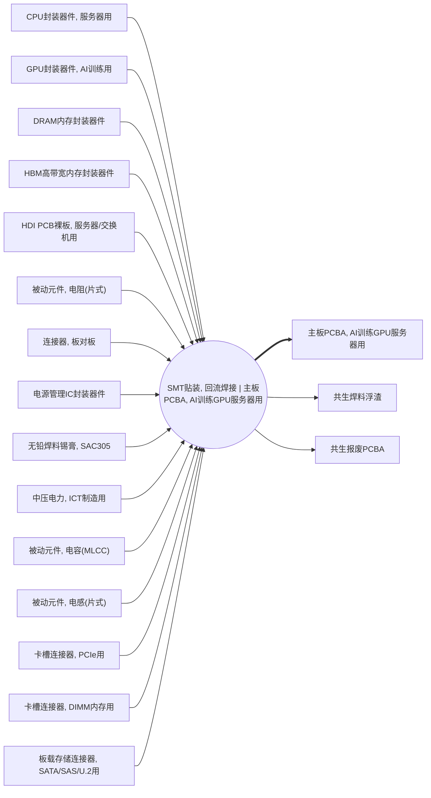

<!-- BODY:START -->
## 定义与参考活动

A002 表示把规定的表面贴装器件及必要板载连接器装联到 P043 裸 PCB 上，经锡膏印刷、贴片、回流焊和规定检查，形成一块合格 P019 主板 PCBA 的板级制造活动。UNSD ISIC Rev.4 2610 明确包括把元器件装载到印刷电路板上的活动，而 2620 的整机分类排除了供计算机使用的电子组件和接口板制造。[^ku-unsd-isic2610] 因此本活动的分类由原 C2620 修正为 C2610。

参考活动建议定义为“在目标中国 SMT 场址生产一块目标板号、修订版和装联 BOM 的合格主板 PCBA”。参考量以合格交付单板计，不以拼板投入片数、贴片机过板数或返工次数代替。

## 单元过程边界

前景边界从合格裸板、锡膏和电子元器件在 SMT 线交接开始，按目标路线包括来料与烘烤条件确认、锡膏印刷、SPI、贴片、回流焊、AOI、必要 X-ray、分板、人工返修和板级检验。许昌生态环境部门公开的 PCBA 项目批复列出了锡膏印刷、锡膏检测、贴片、回流焊、AOI、返修、波峰焊和产品检验等工序，可作为中国一般 PCBA 工序和产污字段依据。[^ku-cn-xuchang-pcba-2018]

插件、波峰焊、选择性焊、清洗、三防涂覆、ICT、FCT、固件烧录和老化只有在目标工艺卡确实属于该单元过程时才纳入；否则分别建模。边界不包括 P043 裸板和各封装器件的上游制造，不包括可插拔 CPU、DIMM、GPU 卡或 HGX 模块的整机安装，也不包括 A011/A012 的机箱级总装。〔建模判断〕

## 投入产出与脊边审计

当前权威图规定 A002 消耗十条产品流，输出 P019，并把 P030 焊料浮渣和 P031 报废 PCBA列为伴生输出。[^ku-ict-p019-a002-spine] 下表保留全部现有脊边以便对账；“待采”不是零值。

其中 P043 裸板、P044 被动元件、P045 连接器、P050 电源管理 IC、P062 锡膏和 P066 电力与一般 SMT 主板装联边界相符。P040 DRAM 只在目标板确有板载内存颗粒时适用，不能与下游 P026 DIMM 重复。P035 CPU 通常属于插槽安装，P036 GPU 与 P042 HBM 则应归入 GPU 加速卡或 HGX GPU baseboard 路线；H3C 手册将主板、处理器、内存和 GPU 配置列为不同部件，[^ku-h3c-r5300-g5] NVIDIA 又把 HGX H100 定义为包含 GPU 和 NVSwitch 的 GPU baseboard。[^ku-nvidia-hgx-h100-baseboard] 因此这三条边在普通主板路线下均为结构待修项，不能作为正式 SMT BOM 展开。〔建模判断〕

P030 和 P031 在 LCI 中应作为技术系统废物流记录质量和去向，不因图中 `coproduct` 角色就自动获得经济价值或分配负荷。公开 PCBA 批复确认可能产生锡渣、废电路板和废元器件；[^ku-cn-xuchang-pcba-2018] 但纯回流焊路线是否实际产生可称量焊料浮渣，必须由锡膏回收、钢网清洗、返修或波峰焊台账确认。没有实物和去向证据时不得套用固定产率。〔建模判断〕

## 中国项目数据获取规则

物料投入优先取 PLM/ERP 工程 BOM、AVL、ECN、仓库领退料、锡膏开封/回收/报废记录和 feeder 追溯；生产和良率取 MES 工单、拼板数、贴片程序、设备运行时间、SPI/AOI/X-ray/ICT/FCT 结果、返修与报废记录；能源取 SMT 线、回流炉、空压、氮气、空调和废气处理的分项计量；废物流取称量、危废台账、回收单据及转移联单。

HJ 1031—2019 可支持电子工业实际排放量核算、自行监测、环境管理台账和排污许可执行报告字段。[^ku-d980c3e309044a3a] 许可或环评数据通常是场址、产线或排放口总量；只有与同期目标板合格产量、产品组合、设备运行时间和分配参数对齐后，才能转为 A002 单板数据。锡及其化合物、颗粒物或 VOC 等直接排放应作为基本流单独记录，废锡膏、锡渣、报废 PCBA 和废包装则留在技术系统废物流表，不相互混淆。

## 代理值规则

不能取得目标批次实测值时，代理顺序为：同场址同线同板号的相邻批次；同场址同线且板尺寸、层数、板面数和器件封装密度相近的服务器板；中国 PCBA 产线按设备时长、过板面积或有效贴装点数分配的结果；最后才是工艺边界相同的国际 PCBA 模型。

代理必须标记“代理值”，保存原始年度或批次总量、合格单板分母、拼板换算、分配公式、良率、返工回流次数和敏感性区间。不得用设备额定功率乘名义节拍冒充实测电力，不得用企业总用电直接除以全部 PCBA 产量，也不得把消费电子或普通低密度板的单板值不经面积、层数和贴装密度修正后用于 AI 服务器主板。

## 上下文完整性与发布状态

| 上下文模块 | 当前状态 | 正式量化前仍需取得 |
|---|---|---|
| SMT/回流焊单元过程边界 | 已完成 | 目标工艺卡和工位边界确认 |
| ISIC 活动分类 | 已核验并修正 | 项目实际统计分类 |
| 现有脊边对账 | 已完成 | CPU/GPU/HBM及板载DRAM边修复 |
| 中国数据源和代理层级 | 已完成 | MES、ERP、分项计量及废物台账 |
| 中国单板实测或合格代理值 | 缺失 | 同型号数据或可审计分配结果 |
| P030/P031废物流性质和产率 | 缺失 | 实物称量、去向及处置合同 |

A002 的正式采集上下文已经补齐，但当前脊边仍把普通主板与 GPU/HGX 路线混合。截至 2026-07-27 的公开检索，最接近的中国项目资料仍是产品族或产线聚合数据，未取得目标 AI 服务器主板的单板 BOM、SMT 分项电力、锡膏平衡、良率和废物实测清单；这不表示企业内部数据不存在。量化状态为 `blocked_spine_component_route_and_primary_data`。
<!-- BODY:END -->

## 邻域工序图
> 由 graph edges 确定性派生（图==边，可被 lint 比对）；模型不得增删连线。

## 🔒 数量（待挂 · NOT POPULATED）
> 本节为占位。输入流 / 输出流 / 参考单位的结构在此预留，数值由实测/权威库挂入，**LLM 不得填写**（数量防火墙）。

| 流 | 方向 | 单位 | 值 | 源 |
|---|---|---|---|---|
| (待挂) | — | — | — | — |

<!-- LCA_ASSOCIATION:START -->
## 🔗 可引用 LCA 数据集与关联

> 已核验关联 4 条：C0=2、C1=0、C2=2、C3=0、C4=0。这些记录用于发现与代理筛选；进入计算前仍须在具体项目中核对边界、许可和版本。

| 强度 | 数据库记录 | 数据库/版本 | 关联对象 | 潜在用途 | 主要限制 | 模型状态 |
|---|---|---|---|---|---|---|
| `C2` · 候选关联 | [mounting, surface mount technology, Pb-free solder](https://ecoquery.ecoinvent.org/3.12/cutoff/dataset/5084/documentation) | ecoinvent 3.12 | `process_dataset` | 候选关联；优先补证 | 活动和 SMT/回流焊路线达到近似门；功能单位、过程边界及中国工厂参数仍需校准。 | 仅知识关联 · 仍需项目裁决 · 不可直接计算 |
| `C2` · 候选关联 | [Assembly line SMD (1SP, 2CS, 1CP, 1R, 1Rf) throughput 300/h - open input printed circuit board](https://lcadatabase.sphera.com/2026/xml-data/processes/309288a5-19a4-4efc-9e62-e5cf173751cc.xml) | Sphera Managed LCA Content 2026.1 | `process_dataset` | 候选关联；优先补证 | 活动和 SMT/回流焊路线达到近似门；功能单位、过程边界及中国工厂参数仍需校准。 | 仅知识关联 · 仍需项目裁决 · 不可直接计算 |
| `C0` · 外部对照 | [printed wiring board production, surface mounted, unspecified, Pb free](https://ecoquery.ecoinvent.org/3.12/cutoff/dataset/1415/documentation) | ecoinvent 3.12 | `external_process_result` | 外部对照；不可替代 | 数据集边界覆盖完整产品/行业聚合，直接挂接会与已展开前景链重复计入。 | 仅知识关联 · 仍需项目裁决 · 不可直接计算 |
| `C0` · 外部对照 | [印制线路板组件](https://www.hiqlcd.com/dataset/hiqlcd/1.5.0/cut_off/e8b682ed-6133-44d5-8ef8-6603d9323a78) | HiQLCD 1.5.0 | `external_process_result` | 外部对照；不可替代 | 数据集边界覆盖完整产品/行业聚合，直接挂接会与已展开前景链重复计入。 | 仅知识关联 · 仍需项目裁决 · 不可直接计算 |

### C2 候选关联的校准缺口

> C2 是优先补证对象，不是已绑定数据。以下字段用于判断它以后应成为直接引用候选还是 P2/P3 项目代理。

| 候选数据集 | 功能单位对齐 | 过程边界对齐 | 中国工厂参数 | 使用前状态 |
|---|---|---|---|---|
| [mounting, surface mount technology, Pb-free solder](https://ecoquery.ecoinvent.org/3.12/cutoff/dataset/5084/documentation) | 源 `m2`；目标 `1 piece 主板PCBA, AI训练GPU服务器用`；仍缺 4 项换算字段 | `partial`；待核 3 项 | 中国项目代理：锡膏 2.78 g/片；项目电力 1.39 kWh/片（均禁止计算） | C2 · 未形成模型绑定 · 不可直接计算 |
| [Assembly line SMD (1SP, 2CS, 1CP, 1R, 1Rf) throughput 300/h - open input printed circuit board](https://lcadatabase.sphera.com/2026/xml-data/processes/309288a5-19a4-4efc-9e62-e5cf173751cc.xml) | 源 `kg`；目标 `1 piece 主板PCBA, AI训练GPU服务器用`；仍缺 4 项换算字段 | `partial`；待核 3 项 | 中国项目代理：锡膏 2.78 g/片；项目电力 1.39 kWh/片（均禁止计算） | C2 · 未形成模型绑定 · 不可直接计算 |

> 关联不等于计算绑定；项目采用分别进入 `model_dataset_bindings.json` 或 `model_proxy_bindings.json`。
<!-- LCA_ASSOCIATION:END -->

<!-- CHANGELOG:START -->
## 修改日志

### 2026-07-30 · 从“预先强绑定”改为“可引用数据集关联”

- **发现的问题：** 节点 Wiki 的目的，是让后续 LCA 建模快速发现可直接引用或可作代理的数据集；旧栏目只展示正式绑定和 C2，隐藏了具有代理筛选价值的 C1，也把部分真实相邻记录直接归入否决，容易把“关联强弱”误读成“能否立即计算”。
- **采取的修改：** 按冻结的官方/公开证据重新裁决本节点的数据集引用关系，当前展示 4 条关联（C0=2、C1=0、C2=2、C3=0、C4=0），另保留 1 条真正否决；每条同时标记关联对象、潜在用途、主要限制和项目裁决要求。
- **中国源补检：** 本节点新增 1 条 HiQLCD 官方公共元数据关联；已核验稳定 UUID、版本、系统模型、参考产品/单位、地域、时间和公开边界，完整 I/O/LCIA 仍受许可控制。
- **修改原则：** C0–C4 只表示节点—数据集关联强度，不授予计算权限；C1/C2 可进入项目级 P0–P3 代理裁决，C3/C4 也必须在具体模型中核对边界、许可和版本后才形成真正绑定。
<!-- CHANGELOG:END -->
