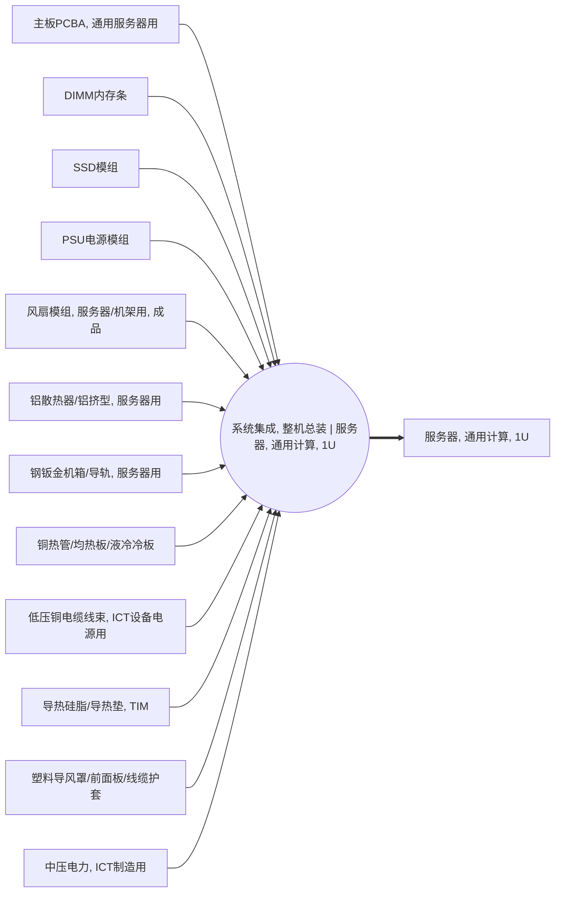

<!-- BODY:START -->
## 定义与参考活动

该活动表示将已制备的服务器部件集成为一台通用计算用1U机架式服务器的整机总装过程。 〔未核实·模型回忆〕 [^internal-review]

## 参考产品与参考单位

参考产品为一台完成总装的通用计算1U服务器，参考单位应按一台合格整机计。 〔未核实·模型回忆〕 [^internal-review]

## 单元过程边界

单元过程边界包括服务器部件接收、机箱内安装连接、整机组装和出厂前功能确认，不包括上游部件制造及下游使用和报废。 〔未核实·模型回忆〕 [^internal-review]

## 技术路线与相邻活动区分

该节点以chassis_integration路线区分于GPU服务器和网络交换机整机总装，产品锚点限定为通用计算1U服务器。 〔未核实·模型回忆〕 [^internal-review]

## 投入产出与脊边对账

活动产出应仅对账至P002，并以冻结连接中列出的十二项部件产品作为投入脊边，不在本节点新增或删减脊边。 〔未核实·模型回忆〕 [^internal-review]

## 直接排放、废物与监测指标边界

本节点应记录总装现场直接产生的包装废弃物、装配损耗和测试相关排放；上游制造排放不归入该活动。 〔未核实·模型回忆〕 [^internal-review]

## 节点特定采集字段

应采集每台整机的部件装配清单、装配与测试用电、良率、返工率及包装物料去向。 〔未核实·模型回忆〕 [^internal-review]

## 区域化补充要求

应补充总装工厂所在地区的电力供应和废弃物处理条件，以支持现场能源与废物流的区域化建模。 〔未核实·模型回忆〕 [^internal-review]

## 数据适用状态与缺口

该节点尚无关联LCA数据集，需补充实际1U服务器总装的能耗、良率、测试和废物数据。 〔未核实·模型回忆〕 [^internal-review]

## 出处

[^internal-review]: 内部评审与建模约定——仅支持显式标注的系统边界、参考流、采集字段与数据缺口判断，不作为外部事实证据。
<!-- BODY:END -->

## 邻域工序图
> 由 graph edges 确定性派生（图==边，可被 lint 比对）；模型不得增删连线。

## 🔒 数量（待挂 · NOT POPULATED）
> 本节为占位。输入流 / 输出流 / 参考单位的结构在此预留，数值由实测/权威库挂入，**LLM 不得填写**（数量防火墙）。

| 流 | 方向 | 单位 | 值 | 源 |
|---|---|---|---|---|
| (待挂) | — | — | — | — |

<!-- LCA_ASSOCIATION:START -->
## 🔗 可引用 LCA 数据集与关联

> **本轮暂无经过语义裁决的可引用数据集。** 这不表示全球不存在数据；应继续处理逐来源检索矩阵中的待裁决、未执行和受阻记录。

- 节点策略：`activity_process` — 优先关联与本活动相同参考产品和 gate-to-gate 边界的过程记录。
- 检索审计：候选 0 条，明确否决 1 条。
<!-- LCA_ASSOCIATION:END -->

<!-- CHANGELOG:START -->
## 修改日志

### 2026-08-03 · 断言级溯源受控合并

- **发现的问题：** 本次送审断言中有 0 条取得独立支持、9 条证据不足；另有 0 条因冲突、共享引用或锚点不唯一未自动修改。
- **采取的修改：** 已核实断言改挂专属 `ku-*` 引用；证据不足断言移除装饰性旧引用并明确降级。
- **修改原则：** 只修改哈希一致且唯一命中的原文行；不整页重写；不机械处理矛盾；来源注册、正文引用与修改日志同步更新。
- **数据影响：** 本次处理 9 条可安全合并断言；未新增或推断任何 LCI 数值。

### 2026-07-30 · 从“预先强绑定”改为“可引用数据集关联”

- **发现的问题：** 节点 Wiki 的目的，是让后续 LCA 建模快速发现可直接引用或可作代理的数据集；旧栏目只展示正式绑定和 C2，隐藏了具有代理筛选价值的 C1，也把部分真实相邻记录直接归入否决，容易把“关联强弱”误读成“能否立即计算”。
- **采取的修改：** 按冻结的官方/公开证据重新裁决本节点的数据集引用关系，当前展示 0 条关联（C0=0、C1=0、C2=0、C3=0、C4=0），另保留 1 条真正否决；每条同时标记关联对象、潜在用途、主要限制和项目裁决要求。
- **修改原则：** C0–C4 只表示节点—数据集关联强度，不授予计算权限；C1/C2 可进入项目级 P0–P3 代理裁决，C3/C4 也必须在具体模型中核对边界、许可和版本后才形成真正绑定。
<!-- CHANGELOG:END -->
