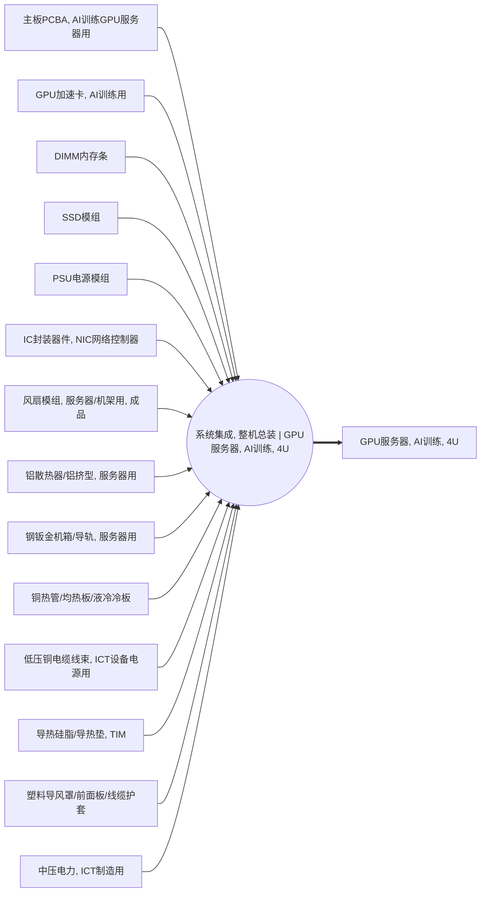

<!-- BODY:START -->
## 定义与活动身份

A011 表示把已检验合格的板卡、存储、电源、结构件、散热件、线束和其他装配物料集成为一台 4U AI 训练 GPU 服务器的机箱级整机总装活动。UNSD ISIC Rev.4 2620 的说明包括计算机服务器的制造或装配，可作为本活动的行业分类依据。[^ku-unsd-isic2620]

本活动的技术路线是 `chassis_integration`，核心转换是把可独立计量的上游产品流装入服务器机箱并完成机械、电气和热管理连接；它不是主板 SMT、GPU 加速卡制造、服务器测试老化、BIOS 配置包装、机架集成或数据中心使用活动。〔建模判断〕

## 参考产品与状态转换

A011 的参考产品是 P004“GPU服务器, AI训练, 4U”。权威图规定 A011 消耗十四条产品流并产出 P004；后续 A022 负责烧录、压力测试与老化，A023 负责 BIOS 配置和出厂处理。[^ku-ict-a011-spine]

因此 A011 的参考输出状态应解释为“整机装配完成、等待规定测试和配置的在制服务器”，而 P004 产品页的最终交付状态是完成 A022 和 A023 后可进入机架集成的服务器。当前骨架暂时以同一个 P004 聚合这三种状态，数值模型必须按 A011 → A022 → A023 单向串接，不能把 P004 自消费边递归展开。〔建模判断〕

活动参考量优先定义为一台目标型号、配置和 BOM 版本的 A011 合格装配输出。若工厂以托盘、批次或工单计量，必须保存到 `piece` 的换算、在制品状态和不合格/返工处理，不能用最终出货量无条件替代 A011 完工量。

## 单元过程边界

前景边界从合格物料在总装线交接开始，包括机箱和导轨准备、主板或计算托盘安装、GPU 卡或 GPU 模块安装、DIMM、SSD、电源、网卡和内部线束安装，风扇、散热器、热管、均热板或冷板安装，导热界面材料施用，紧固、理线、装配完整性检查以及总装线自身的直接电力。H3C R5300 G5 手册列出的主板、GPU、电源、网卡、硬盘、风扇、内存、机箱和散热组件，可以支持这套活动字段清单；不能据此推定目标工厂的单位用量。[^ku-h3c-r5300-g5]

边界不包括上游 PCB/PCBA、芯片、板卡和零部件制造，不包括 A022 的烧录、压力测试、老化电力和返修，也不包括 A023 的 BIOS 配置、终检、包装及包装废物，不包括 A020 机架集成、运输、数据中心运行和报废。若目标工厂把短时通电检查计入总装线，应按设备日志和电表边界留在 A011；若属于统一测试工位，则转入 A022，并在两个活动间只计一次。〔建模判断〕

## 技术系统投入产出与脊边对账

权威图规定 A011 消耗 P019、P024、P026、P027、P029、P049、P051、P055、P057、P059、P061、P063、P064 和 P066，并以 P004 作为唯一参考输出。[^ku-ict-a011-spine] 页后投入产出表与这十五条脊边逐条对账；“待采”表示没有取得可审计的单位服务器数量，不表示零投入。

其中 P066 中压电力是技术系统产品流，不是自然环境基本流。风扇、散热件、TIM、线束和塑料件同样是进入整机的产品流；只有越过系统边界直接进入空气、水体或土壤的具体物质才进入基本流表。

当前 P049“NIC 网络控制器封装器件”可能与真实整机总装层级不一致：目标 BOM 若安装的是网卡、OCP 或 IB 适配器，应建立或复用板卡级产品及其装联活动，不能把裸控制器封装直接当作整机总装输入。A002 与 A011 还可能在 PCIe GPU、HGX GPU baseboard 和系统主板路线之间发生错层或重复展开；量化前必须按目标 BOM 选择互斥路线。〔建模判断〕

## 直接排放、废物与多功能性

A011 以机械装配和系统连接为主，当前公开来源没有给出可确认属于目标 A011 边界的直接环境基本流。若现场使用挥发性清洗剂并发生直接排气，应按具体化学物质和实际排放终点记录；车间 VOC 或非甲烷总烃等聚合监测口径先进入指标表，不能直接冒充某一种 LCI 基本流。〔建模判断〕

名称图尚未声明紧固件包装、保护膜、TIM 边料、废清洗材料、报废零部件或装配不良整机等技术系统废物流。项目台账确认这些流且达到研究截断阈值时，应先建立废物流产品节点和去向活动并通过名称图校验，再加入 A011 投入产出表；不能在没有脊边时把它们静默视为零。

A011 当前只有一个参考产品，没有已声明的可销售共产品。返工品仍返回过程时属于内部循环；报废部件、不良整机和可回收材料应按实际去向作为废物流或回收系统输入，不能因具有残值就自动作为共产品参与分配。〔建模判断〕

## 节点特定采集字段

- **生产坐标：**记录制造企业、场址、厂房、生产线、工位、电表边界、代表期、班次、开线时间和实际完工量。
- **产品配置联结：**记录 P004 完整型号、配置代码、BOM/AVL/ECN 版本、主板与 GPU 子系统路线、冷却方式和固件版本，确保十四条输入与同一产品配置对应。
- **物料计量：**保存 ERP/MES 工单、领料、退料、替代料、返工补料、报废和期末在制品；按件计量的模块同时保存单件质量或供应商料号。
- **能源与工时：**记录装配线、工具、物料输送和边界内短时通电检查的分项电力，设备运行时间、人工工时和共享设施分配键。
- **质量与损失：**记录一次通过率、返工率、返工路径、不良品、拆换部件、包装拆除物和其他装配废物的种类、质量及去向。
- **数据代表性：**记录型号组合、批次覆盖、有效计量时段、缺失值处理、异常停线、质量平衡闭合、分配公式和不确定度。

P004 产品页保存整机身份、配置、净质量、包装边界和交接状态；A011 保存总装过程的单位产品投入、直接能源、损失和数据质量。A022、A023 分别保存测试老化和配置包装清单，不在 A011 重复计算。

## 区域化补充要求

### CN 中国

以下要求用于建立中国区域 A011 活动数据集，不改变系统集成活动的通用定义。〔建模判断〕

- **场址确认：**只有总装活动实际发生在中国时，A011 才使用中国生产地域；在中国销售或部署的进口服务器不能因此把境外总装改标为中国。
- **配置组合：**按目标代表期的中国生产记录保存厂商、型号、GPU 拓扑、冷却路线和数量权重；H3C 产品族资料只能支持可采字段，不能直接外推为中国平均 BOM。[^ku-h3c-r5300-g5]
- **数据源优先级：**优先使用 PLM/ERP BOM 与变更记录、MES 工单和完工量、仓库领退料、装配线分项电表、设备日志、单机称量、返工不良记录、废物称量与转移记录。
- **环境数据：**HJ 1031—2019 可用于识别电子工业的实际排放量核算、自行监测、环境管理台账和排污许可证执行报告字段；设施总量缺少同期产量、产品组合和可审计分配键时，不能直接除以服务器产量。[^ku-d980c3e309044a3a]
- **共享系统分配：**空压、照明、暖通、物料输送和公用辅助系统只在具有同周期电表、运行时间、面积、工时或其他因果分配键时分配到 A011；企业 ESG 总量不能直接作为单位服务器总装清单。
- **数值状态：**中国来源不自动等于中国实测；实测、计算、代理、定义和待采分别标记。产品额定功率、TDP、使用阶段年用电和整机 PCF 均不能替代 A011 制造电力。

其他地区应在同一“区域化补充要求”下新增地区小节，通用节点采集字段保持不变。〔建模判断〕

## 数据来源、代理与适用限制

H3C 的服务器碳足迹披露覆盖原材料、制造、运输、使用和报废阶段，但没有公开 A011 单元过程的产品分配后物料、能源和废物流。[^ku-h3c-server-pcf-2024] HPE 的服务器 PCF 示例提供 CPU、DRAM、网卡、存储、电源、产品质量、寿命和使用阶段参数，并使用 PAIA 估算制造和报废排放；它属于不同型号的配置驱动产品碳足迹，不是本节点目标生产线实测。[^ku-hpe-dl325-gen11-pcf]

这些资料可以用于生命周期边界、配置字段和结果数量级检查，不能把整机碳足迹拆成 A011 的物料或电力，也不能把国际型号数值写成中国实测。若暂时缺少目标工厂数据，代理优先级依次为：同场址同线同型号批次、同场址同线且装配复杂度可比的服务器型号、按质量或装配工时归一的中国服务器总装线、配置可比的国际制造模型。每个代理必须保存原始总量、分母、公式、配置差异和敏感性范围。〔建模判断〕

## 数据适用状态与发布阻塞

现有资料足以核验活动身份、主要装配对象、P004 参考产品、A011/A022/A023 边界和中国数据获取路径。[^ku-ict-a011-spine][^ku-h3c-r5300-g5] 但还不能直接生成可发布的中国区 A011 LCI：

- 十四条输入只有结构和采集单位，没有目标型号的单位用量；
- P049 网络控制器可能错层，PCIe 与 HGX 路线可能重复展开；
- 未取得目标生产线分项电力、工时、一次通过率、返工、报废和装配废物台账；
- 未建立装配废物流脊节点，也未识别可确认属于本单元边界的直接基本流；
- A011、A022、A023 仍共用同一个 P004 状态产品，数值展开需要显式顺序约束。

因此本页已具备正式数据采集和审计上下文，但 `dataset_readiness` 保持 `blocked`；解除阻塞需要同型号、同场址、同期的 BOM/MES/能源/质量/废物数据，以及网络子系统和 GPU 路线的脊边裁决。

## 出处

[^ku-ict-a011-spine]: lca-cornerstone ICT Equipment Name Graph — A011 及全部十五条相邻边，仓库权威图，已定向核验。
[^ku-h3c-r5300-g5]: H3C UniServer R5300 G5 服务器用户指南，H3C 官方手册，§2.1、表2-1、表2-2、表2-4至表2-5，已独立核验。
[^ku-unsd-isic2620]: UNSD ISIC Rev.4 2620 classification detail，已独立核验。
[^ku-d980c3e309044a3a]: 生态环境部 HJ 1031—2019《排污许可证申请与核发技术规范 电子工业》，已独立核验其台账、监测和执行报告要求。
[^ku-h3c-server-pcf-2024]: 新华三服务器全系碳足迹发布，H3C 官方披露，已独立核验方法框架与生命周期边界。
[^ku-hpe-dl325-gen11-pcf]: HPE ProLiant DL325 Gen11 Server Product Carbon Footprint，HPE 官方文件，已独立核验其配置字段和方法说明。
<!-- BODY:END -->

## 邻域工序图
> 由 graph edges 确定性派生（图==边，可被 lint 比对）；模型不得增删连线。

## 🔒 数量（待挂 · NOT POPULATED）
> 本节为占位。输入流 / 输出流 / 参考单位的结构在此预留，数值由实测/权威库挂入，**LLM 不得填写**（数量防火墙）。

| 流 | 方向 | 单位 | 值 | 源 |
|---|---|---|---|---|
| (待挂) | — | — | — | — |

<!-- LCA_ASSOCIATION:START -->
## 🔗 可引用 LCA 数据集与关联

> **本轮暂无经过语义裁决的可引用数据集。** 这不表示全球不存在数据；应继续处理逐来源检索矩阵中的待裁决、未执行和受阻记录。

- 节点策略：`activity_process` — 优先关联与本活动相同参考产品和 gate-to-gate 边界的过程记录。
- 检索审计：候选 0 条，明确否决 1 条。
<!-- LCA_ASSOCIATION:END -->

<!-- CHANGELOG:START -->
## 修改日志

### 2026-07-30 · 从“预先强绑定”改为“可引用数据集关联”

- **发现的问题：** 节点 Wiki 的目的，是让后续 LCA 建模快速发现可直接引用或可作代理的数据集；旧栏目只展示正式绑定和 C2，隐藏了具有代理筛选价值的 C1，也把部分真实相邻记录直接归入否决，容易把“关联强弱”误读成“能否立即计算”。
- **采取的修改：** 按冻结的官方/公开证据重新裁决本节点的数据集引用关系，当前展示 0 条关联（C0=0、C1=0、C2=0、C3=0、C4=0），另保留 1 条真正否决；每条同时标记关联对象、潜在用途、主要限制和项目裁决要求。
- **修改原则：** C0–C4 只表示节点—数据集关联强度，不授予计算权限；C1/C2 可进入项目级 P0–P3 代理裁决，C3/C4 也必须在具体模型中核对边界、许可和版本后才形成真正绑定。
<!-- CHANGELOG:END -->
