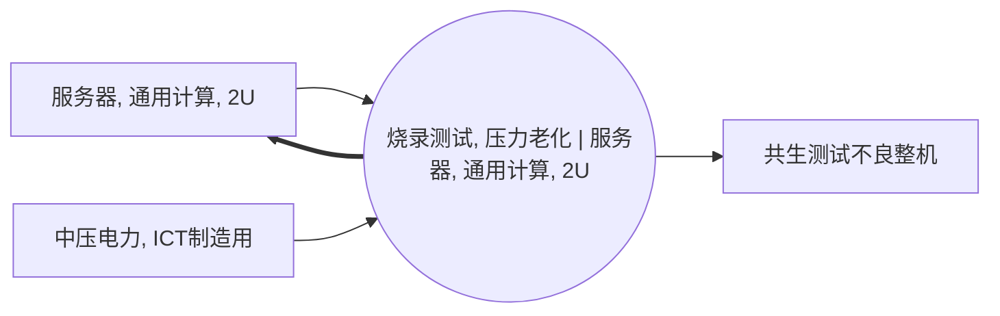

<!-- BODY:START -->
## 定义与参考活动

该活动表示对通用计算2U服务器执行烧录、压力测试和老化筛选，以确认其出厂前功能与稳定性。 〔未核实·模型回忆〕 [^internal-review]

## 参考产品与参考单位

参考产品锚定为“服务器, 通用计算, 2U”；参考单位应按一台完成压力老化测试的服务器定义。 〔未核实·模型回忆〕 [^internal-review]

## 单元过程边界

过程边界包括测试软件或固件烧录、通电压力负载、老化运行、结果判定及测试失败品处置；不包括服务器部件制造和最终运输。 〔未核实·模型回忆〕 [^internal-review]

## 技术路线与相邻活动区分

该节点以压力老化测试为技术路线，应与仅改变设定的BIOS配置活动以及GPU服务器的压力老化活动区分。 〔未核实·模型回忆〕 [^internal-review]

## 投入产出与脊边对账

脊边对账应记录输入P001和P066，以及输出P001和P032；P001的输入输出表示测试前后同一服务器产品的状态转换，P032为并生产出物。 〔未核实·模型回忆〕 [^internal-review]

## 直接排放、废物与监测指标边界

该活动应覆盖测试期间电力消耗、现场冷却相关负荷和测试失败品或耗材废物；服务器客户使用阶段的排放不在本过程内。 〔未核实·模型回忆〕 [^internal-review]

## 节点特定采集字段

应采集每台服务器的烧录时间、压力测试时长、平均与峰值功率、负载设定、测试通过率、返工率和冷却方式。 〔未核实·模型回忆〕 [^internal-review]

## 区域化补充要求

应记录测试地点、供电区域、冷却系统类型和冷却介质的区域化供应条件。 〔未核实·模型回忆〕 [^internal-review]

## 数据适用状态与缺口

该节点尚无已验证的来源关联；实际测试负载、持续时间、测试能耗、冷却负荷和失效率需要由制造现场补充。 〔未核实·模型回忆〕 [^internal-review]

## 出处

[^internal-review]: 内部评审与建模约定——仅支持显式标注的系统边界、参考流、采集字段与数据缺口判断，不作为外部事实证据。
<!-- BODY:END -->

## 邻域工序图
> 由 graph edges 确定性派生（图==边，可被 lint 比对）；模型不得增删连线。

## 🔒 数量（待挂 · NOT POPULATED）
> 本节为占位。输入流 / 输出流 / 参考单位的结构在此预留，数值由实测/权威库挂入，**LLM 不得填写**（数量防火墙）。

| 流 | 方向 | 单位 | 值 | 源 |
|---|---|---|---|---|
| (待挂) | — | — | — | — |

<!-- LCA_ASSOCIATION:START -->
## 🔗 可引用 LCA 数据集与关联

> **本轮暂无经过语义裁决的可引用数据集。** 这不表示全球不存在数据；应继续处理逐来源检索矩阵中的待裁决、未执行和受阻记录。

- 节点策略：`activity_process` — 优先关联与本活动相同参考产品和 gate-to-gate 边界的过程记录。
- 检索审计：候选 0 条，明确否决 0 条。
<!-- LCA_ASSOCIATION:END -->

<!-- CHANGELOG:START -->
## 修改日志

### 2026-08-03 · 断言级溯源受控合并

- **发现的问题：** 本次送审断言中有 0 条取得独立支持、9 条证据不足；另有 0 条因冲突、共享引用或锚点不唯一未自动修改。
- **采取的修改：** 已核实断言改挂专属 `ku-*` 引用；证据不足断言移除装饰性旧引用并明确降级。
- **修改原则：** 只修改哈希一致且唯一命中的原文行；不整页重写；不机械处理矛盾；来源注册、正文引用与修改日志同步更新。
- **数据影响：** 本次处理 9 条可安全合并断言；未新增或推断任何 LCI 数值。

### 2026-07-30 · 从“预先强绑定”改为“可引用数据集关联”

- **发现的问题：** 节点 Wiki 的目的，是让后续 LCA 建模快速发现可直接引用或可作代理的数据集；旧栏目只展示正式绑定和 C2，隐藏了具有代理筛选价值的 C1，也把部分真实相邻记录直接归入否决，容易把“关联强弱”误读成“能否立即计算”。
- **采取的修改：** 按冻结的官方/公开证据重新裁决本节点的数据集引用关系，当前展示 0 条关联（C0=0、C1=0、C2=0、C3=0、C4=0），另保留 0 条真正否决；每条同时标记关联对象、潜在用途、主要限制和项目裁决要求。
- **修改原则：** C0–C4 只表示节点—数据集关联强度，不授予计算权限；C1/C2 可进入项目级 P0–P3 代理裁决，C3/C4 也必须在具体模型中核对边界、许可和版本后才形成真正绑定。
<!-- CHANGELOG:END -->
