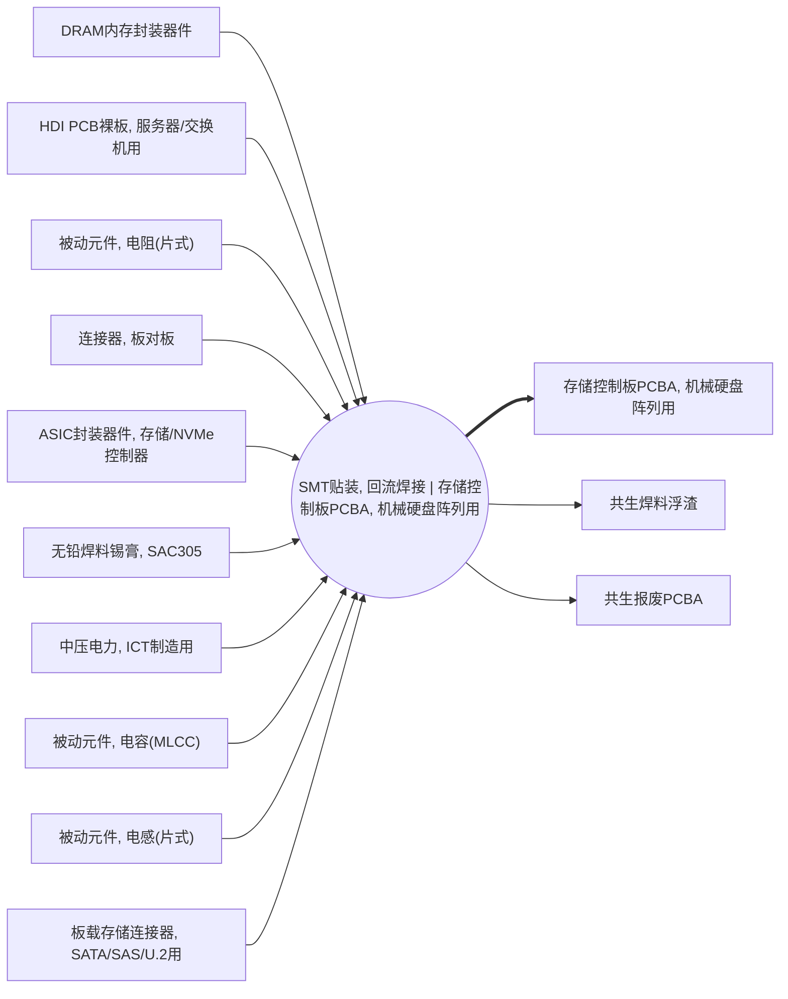

<!-- BODY:START -->
## 定义与参考活动

表面贴装技术将元器件装配到印制板表面，回流焊用于形成其焊接互连；本节点将该工艺应用于机械硬盘阵列用存储控制板PCBA。 〔未核实·模型回忆〕

## 参考产品与参考单位

参考产品锚定为“存储控制板PCBA, 机械硬盘阵列用”；参考单位应以一块完成SMT贴装和回流焊接的控制板PCBA表示。 〔未核实·模型回忆〕 [^internal-review]

## 单元过程边界

单元过程边界包括来料进入贴装线后的锡膏印刷、贴装、回流焊及相关工序检验，不包括上游电子元器件和裸板制造。 〔未核实·模型回忆〕 [^internal-review]

## 技术路线与相邻活动区分

本节点以reflow_smt路线限定为自动表面贴装与回流焊接，区别于通孔插装、波峰焊、选择焊和后续系统装配。 〔未核实·模型回忆〕

## 投入产出与脊边对账

脊边对账应记录消耗P048、P040、P043、P044、P080、P081、P062、P066、P045和P087，并产出P021、P030及P031。 〔未核实·模型回忆〕 [^internal-review]

## 直接排放、废物与监测指标边界

应采集回流焊相关的能源使用、助焊剂/清洗剂逸散（如适用）、锡膏与不合格板废物及返工流向；本节点不预设LCI数值。 〔未核实·模型回忆〕 [^internal-review]

## 节点特定采集字段

应采集裸板和元器件投料、锡膏和助焊剂用量、贴装与回流设备电耗、炉温曲线、良率、返工率及报废板处置。 〔未核实·模型回忆〕 [^internal-review]

## 区域化补充要求

应补充贴装工厂所在地的电力市场、焊接化学品管理要求、废焊料和报废PCBA的处理路径。 〔未核实·模型回忆〕 [^internal-review]

## 数据适用状态与缺口

该节点有四项LCA关联且列出若干候选及已核验来源，但机械硬盘阵列控制板的实际配方、工艺能耗、良率和废物流数据仍需按工厂采集。 〔未核实·模型回忆〕 [^internal-review]

## 出处

[^internal-review]: 内部评审与建模约定——仅支持显式标注的系统边界、参考流、采集字段与数据缺口判断，不作为外部事实证据。
<!-- BODY:END -->

## 邻域工序图
> 由 graph edges 确定性派生（图==边，可被 lint 比对）；模型不得增删连线。

## 🔒 数量（待挂 · NOT POPULATED）
> 本节为占位。输入流 / 输出流 / 参考单位的结构在此预留，数值由实测/权威库挂入，**LLM 不得填写**（数量防火墙）。

| 流 | 方向 | 单位 | 值 | 源 |
|---|---|---|---|---|
| (待挂) | — | — | — | — |

<!-- LCA_ASSOCIATION:START -->
## 🔗 可引用 LCA 数据集与关联

> 已核验关联 4 条：C0=2、C1=0、C2=2、C3=0、C4=0。这些记录用于发现与代理筛选；进入计算前仍须在具体项目中核对边界、许可和版本。

| 强度 | 数据库记录 | 数据库/版本 | 关联对象 | 潜在用途 | 主要限制 | 模型状态 |
|---|---|---|---|---|---|---|
| `C2` · 候选关联 | [mounting, surface mount technology, Pb-free solder](https://ecoquery.ecoinvent.org/3.12/cutoff/dataset/5084/documentation) | ecoinvent 3.12 | `process_dataset` | 候选关联；优先补证 | 活动和 SMT/回流焊路线达到近似门；功能单位、过程边界及中国工厂参数仍需校准。 | 仅知识关联 · 仍需项目裁决 · 不可直接计算 |
| `C2` · 候选关联 | [Assembly line SMD (1SP, 2CS, 1CP, 1R, 1Rf) throughput 300/h - open input printed circuit board](https://lcadatabase.sphera.com/2026/xml-data/processes/309288a5-19a4-4efc-9e62-e5cf173751cc.xml) | Sphera Managed LCA Content 2026.1 | `process_dataset` | 候选关联；优先补证 | 活动和 SMT/回流焊路线达到近似门；功能单位、过程边界及中国工厂参数仍需校准。 | 仅知识关联 · 仍需项目裁决 · 不可直接计算 |
| `C0` · 外部对照 | [printed wiring board production, surface mounted, unspecified, Pb free](https://ecoquery.ecoinvent.org/3.12/cutoff/dataset/1415/documentation) | ecoinvent 3.12 | `external_process_result` | 外部对照；不可替代 | 数据集边界覆盖完整产品/行业聚合，直接挂接会与已展开前景链重复计入。 | 仅知识关联 · 仍需项目裁决 · 不可直接计算 |
| `C0` · 外部对照 | [印制线路板组件](https://www.hiqlcd.com/dataset/hiqlcd/1.5.0/cut_off/e8b682ed-6133-44d5-8ef8-6603d9323a78) | HiQLCD 1.5.0 | `external_process_result` | 外部对照；不可替代 | 数据集边界覆盖完整产品/行业聚合，直接挂接会与已展开前景链重复计入。 | 仅知识关联 · 仍需项目裁决 · 不可直接计算 |

### C2 候选关联的校准缺口

> C2 是优先补证对象，不是已绑定数据。以下字段用于判断它以后应成为直接引用候选还是 P2/P3 项目代理。

| 候选数据集 | 功能单位对齐 | 过程边界对齐 | 中国工厂参数 | 使用前状态 |
|---|---|---|---|---|
| [mounting, surface mount technology, Pb-free solder](https://ecoquery.ecoinvent.org/3.12/cutoff/dataset/5084/documentation) | 源 `m2`；目标 `1 piece 存储控制板PCBA, 机械硬盘阵列用`；仍缺 4 项换算字段 | `partial`；待核 3 项 | 中国项目代理：锡膏 2.78 g/片；项目电力 1.39 kWh/片（均禁止计算） | C2 · 未形成模型绑定 · 不可直接计算 |
| [Assembly line SMD (1SP, 2CS, 1CP, 1R, 1Rf) throughput 300/h - open input printed circuit board](https://lcadatabase.sphera.com/2026/xml-data/processes/309288a5-19a4-4efc-9e62-e5cf173751cc.xml) | 源 `kg`；目标 `1 piece 存储控制板PCBA, 机械硬盘阵列用`；仍缺 4 项换算字段 | `partial`；待核 3 项 | 中国项目代理：锡膏 2.78 g/片；项目电力 1.39 kWh/片（均禁止计算） | C2 · 未形成模型绑定 · 不可直接计算 |

> 关联不等于计算绑定；项目采用分别进入 `model_dataset_bindings.json` 或 `model_proxy_bindings.json`。
<!-- LCA_ASSOCIATION:END -->

<!-- CHANGELOG:START -->
## 修改日志

### 2026-08-03 · 断言级溯源受控合并

- **发现的问题：** 本次送审断言中有 0 条取得独立支持、9 条证据不足；另有 0 条因冲突、共享引用或锚点不唯一未自动修改。
- **采取的修改：** 已核实断言改挂专属 `ku-*` 引用；证据不足断言移除装饰性旧引用并明确降级。
- **修改原则：** 只修改哈希一致且唯一命中的原文行；不整页重写；不机械处理矛盾；来源注册、正文引用与修改日志同步更新。
- **数据影响：** 本次处理 9 条可安全合并断言；未新增或推断任何 LCI 数值。

### 2026-07-30 · 从“预先强绑定”改为“可引用数据集关联”

- **发现的问题：** 节点 Wiki 的目的，是让后续 LCA 建模快速发现可直接引用或可作代理的数据集；旧栏目只展示正式绑定和 C2，隐藏了具有代理筛选价值的 C1，也把部分真实相邻记录直接归入否决，容易把“关联强弱”误读成“能否立即计算”。
- **采取的修改：** 按冻结的官方/公开证据重新裁决本节点的数据集引用关系，当前展示 4 条关联（C0=2、C1=0、C2=2、C3=0、C4=0），另保留 1 条真正否决；每条同时标记关联对象、潜在用途、主要限制和项目裁决要求。
- **中国源补检：** 本节点新增 1 条 HiQLCD 官方公共元数据关联；已核验稳定 UUID、版本、系统模型、参考产品/单位、地域、时间和公开边界，完整 I/O/LCIA 仍受许可控制。
- **修改原则：** C0–C4 只表示节点—数据集关联强度，不授予计算权限；C1/C2 可进入项目级 P0–P3 代理裁决，C3/C4 也必须在具体模型中核对边界、许可和版本后才形成真正绑定。
<!-- CHANGELOG:END -->
