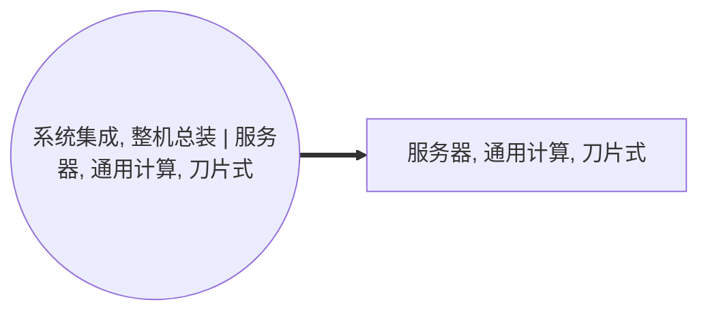

<!-- BODY:START -->
## 定义与产品身份

该节点表示图中 `form_factor=blade`、`compute_type=cpu_compute` 的前景服务器产品 〔图谱事实〕。 〔未核实·模型回忆〕

共享机箱不属于本产品节点 〔建模判断〕。 〔未核实·模型回忆〕

Dell 将 PowerEdge M1000e 描述为具有共享供电、冷却、网络和管理基础设施的刀片机箱 ✅已核实。 ✅已核实 [^ku-1e08289e962eefcc]

## 性质与形态

以 Dell M1000e 为例，其机箱管理控制器可独立于操作系统执行一对多的刀片 BIOS 和固件更新 ✅已核实。 ✅已核实 [^ku-990f1bf730ba9eb5]

## 参考流与交接边界

参考流应为一台完成装配、可交付并用于装入兼容刀片机箱的刀片式通用CPU服务器模块，交接边界设在制造商成品出厂点 〔未核实·模型回忆〕。 〔未核实·模型回忆〕

## 规格与相邻节点区分

该节点以 blade 外形和 CPU 通用计算身份区别于独立 1U 或 2U 机架服务器 〔建模判断〕。 〔未核实·模型回忆〕

其边界不包括承载多个刀片的共享机箱 〔建模判断〕。 〔未核实·模型回忆〕

Dell 的 M1000e 是可容纳最多 16 台半高刀片服务器的 10U 模块化机箱 ✅已核实。 ✅已核实 [^ku-5e5adca4597c163c]

该公开例证支持将服务器模块与共享机箱分开建模 〔建模判断〕。 〔未核实·模型回忆〕

## 在系统中的角色

权威图中，该产品由 A039“系统集成，整机总装”产出，且当前未声明下游消费活动 〔图谱事实〕。 〔未核实·模型回忆〕

## 分类与适用范围

ISIC Rev.4 类别 2620 包括电子计算机（包括计算机服务器）的制造或装配 ✅已核实。 ✅已核实 [^ku-6382982b68e9716d]

本节点的 HS 8471.50 与 CPC 4521 仅为图中分类字段 〔建模判断〕。 〔未核实·模型回忆〕

实际报关归类须按具体产品配置和适用税则另行裁定 〔建模判断〕。 〔未核实·模型回忆〕

## 节点特定采集字段

采集应区分刀片模块自身的处理器、内存、存储、板卡、散热和外壳，与共享机箱的电源、风扇和互连部件之间的分摊关系 〔建模判断〕。 〔未核实·模型回忆〕

## 区域化补充要求

应补充刀片模块及其兼容机箱的制造和装配地区，并记录跨地区采购和运输信息 〔建模判断〕。 〔未核实·模型回忆〕

## 数据适用状态与缺口

当前节点未附带可直接使用的生命周期清单数值 〔证据缺口〕。 〔未核实·模型回忆〕

共享机箱资源的归属和分摊规则是需要补充的关键数据缺口 〔证据缺口〕。 〔未核实·模型回忆〕

## 出处
[^ku-1e08289e962eefcc]: Dell — PowerEdge M1000e Blade Enclosure (https://www.dell.com/en-sg/shop/ipovw/poweredge-m1000e) —— 独立核验摘录:「Enhance data center efficiency with the shared power, cooling, networking and management infrastructure of the PowerEdge™ M1000e Blade Enclosure.」。
[^ku-990f1bf730ba9eb5]: Dell — PowerEdge M1000e Blade Enclosure (https://www.dell.com/en-sg/shop/ipovw/poweredge-m1000e) —— 独立核验摘录:「Enables automated and embedded one-to-many blade BIOS and firmware updates, independent of the OS through iDRAC」。
[^ku-5e5adca4597c163c]: Dell — PowerEdge M1000e Blade Enclosure (https://www.dell.com/en-sg/shop/ipovw/poweredge-m1000e) —— 独立核验摘录:「Chassis Form Factor: 10U modular enclosure holds up to sixteen half-height blade servers」。
[^ku-6382982b68e9716d]: UNSD Classification Detail — ISIC Rev.4 2620 (https://unstats.un.org/unsd/classifications/Econ/Detail/EN/27/2620) —— 独立核验摘录:「This class includes the manufacture and/or assembly of electronic computers, such as mainframes, desktop computers, laptops and computer servers;」。
<!-- BODY:END -->

## 邻域工序图
> 由 graph edges 确定性派生（图==边，可被 lint 比对）；模型不得增删连线。

## 🔒 数量（待挂 · NOT POPULATED）
> 本节为占位。输入流 / 输出流 / 参考单位的结构在此预留，数值由实测/权威库挂入，**LLM 不得填写**（数量防火墙）。

| 流 | 方向 | 单位 | 值 | 源 |
|---|---|---|---|---|
| (待挂) | — | — | — | — |

<!-- LCA_ASSOCIATION:START -->
## 🔗 可引用 LCA 数据集与关联

> 已核验关联 5 条：C0=5、C1=0、C2=0、C3=0、C4=0。这些记录用于发现与代理筛选；进入计算前仍须在具体项目中核对边界、许可和版本。

| 强度 | 数据库记录 | 数据库/版本 | 关联对象 | 潜在用途 | 主要限制 | 模型状态 |
|---|---|---|---|---|---|---|
| `C0` · 外部对照 | [はん用コンピュータ, GLO](https://sumpo.or.jp/consulting/lca/idea/din2eh00000001km-att/AIST-IDEAv34_Ja_sample.xlsx) | AIST-IDEA 3.4 public sample | `external_product_result` | 外部对照；不可替代 | 数据集边界覆盖完整产品/行业聚合，直接挂接会与已展开前景链重复计入。 | 仅知识关联 · 仍需项目裁决 · 不可直接计算 |
| `C0` · 外部对照 | [はん用コンピュータ, JPN](https://sumpo.or.jp/consulting/lca/idea/din2eh00000001km-att/AIST-IDEAv34_Ja_sample.xlsx) | AIST-IDEA 3.4 public sample | `external_product_result` | 外部对照；不可替代 | 数据集边界覆盖完整产品/行业聚合，直接挂接会与已展开前景链重复计入。 | 仅知识关联 · 仍需项目裁决 · 不可直接计算 |
| `C0` · 外部对照 | [ミッドレンジコンピュータ, GLO](https://sumpo.or.jp/consulting/lca/idea/din2eh00000001km-att/AIST-IDEAv34_Ja_sample.xlsx) | AIST-IDEA 3.4 public sample | `external_product_result` | 外部对照；不可替代 | 数据集边界覆盖完整产品/行业聚合，直接挂接会与已展开前景链重复计入。 | 仅知识关联 · 仍需项目裁决 · 不可直接计算 |
| `C0` · 外部对照 | [ミッドレンジコンピュータ, JPN](https://sumpo.or.jp/consulting/lca/idea/din2eh00000001km-att/AIST-IDEAv34_Ja_sample.xlsx) | AIST-IDEA 3.4 public sample | `external_product_result` | 外部对照；不可替代 | 数据集边界覆盖完整产品/行业聚合，直接挂接会与已展开前景链重复计入。 | 仅知识关联 · 仍需项目裁决 · 不可直接计算 |
| `C0` · 外部对照 | [PowerEdge FC430 carbon footprint](https://i.dell.com/sites/csdocuments/CorpComm_Docs/en/carbon-footprint-poweredge-fc430.pdf) | Dell Product Carbon Footprint public document | `external_product_result` | 外部对照；不可替代 | 数据集边界覆盖完整产品/行业聚合，直接挂接会与已展开前景链重复计入。 | 仅知识关联 · 仍需项目裁决 · 不可直接计算 |

> 关联不等于计算绑定；项目采用分别进入 `model_dataset_bindings.json` 或 `model_proxy_bindings.json`。
<!-- LCA_ASSOCIATION:END -->

<!-- CHANGELOG:START -->
## 修改日志

### 2026-08-03 · 断言级溯源受控合并

- **发现的问题：** 本次送审断言中有 4 条取得独立支持、13 条证据不足；另有 0 条因冲突、共享引用或锚点不唯一未自动修改。
- **采取的修改：** 已核实断言改挂专属 `ku-*` 引用；证据不足断言移除装饰性旧引用并明确降级。
- **修改原则：** 只修改哈希一致且唯一命中的原文行；不整页重写；不机械处理矛盾；来源注册、正文引用与修改日志同步更新。
- **数据影响：** 本次处理 17 条可安全合并断言；未新增或推断任何 LCI 数值。

### 2026-08-03 · P003 官方来源补充

- **范围：** 重新冻结 6 条外部断言，来源限定为 Dell 的 M1000e 产品页与 UNSD ISIC Rev.4 2620 页面。
- **核验：** 独立 Verify-only 在无联网条件下逐条裁决，6/6 为 CONFIRMED；本页采用其中 4 条不重复、直接服务于节点边界或分类的断言。
- **结果：** 页面保留为 `draft/partial`，因为本次是对既有草稿的局部补充，尚未形成覆盖全页的 production coverage 与 Go/No-Go 放行证据。
- **数据影响：** 未新增 LCI 数值，未改变名称图、刻面或边。

### 2026-08-03 · 断言级溯源受控合并

- **发现的问题：** 本次送审断言中有 0 条取得独立支持、9 条证据不足；另有 0 条因冲突、共享引用或锚点不唯一未自动修改。
- **采取的修改：** 已核实断言改挂专属 `ku-*` 引用；证据不足断言移除装饰性旧引用并明确降级。
- **修改原则：** 只修改哈希一致且唯一命中的原文行；不整页重写；不机械处理矛盾；来源注册、正文引用与修改日志同步更新。
- **数据影响：** 本次处理 9 条可安全合并断言；未新增或推断任何 LCI 数值。

### 2026-07-30 · 从“预先强绑定”改为“可引用数据集关联”

- **发现的问题：** 节点 Wiki 的目的，是让后续 LCA 建模快速发现可直接引用或可作代理的数据集；旧栏目只展示正式绑定和 C2，隐藏了具有代理筛选价值的 C1，也把部分真实相邻记录直接归入否决，容易把“关联强弱”误读成“能否立即计算”。
- **采取的修改：** 按冻结的官方/公开证据重新裁决本节点的数据集引用关系，当前展示 5 条关联（C0=5、C1=0、C2=0、C3=0、C4=0），另保留 0 条真正否决；每条同时标记关联对象、潜在用途、主要限制和项目裁决要求。
- **修改原则：** C0–C4 只表示节点—数据集关联强度，不授予计算权限；C1/C2 可进入项目级 P0–P3 代理裁决，C3/C4 也必须在具体模型中核对边界、许可和版本后才形成真正绑定。
<!-- CHANGELOG:END -->
