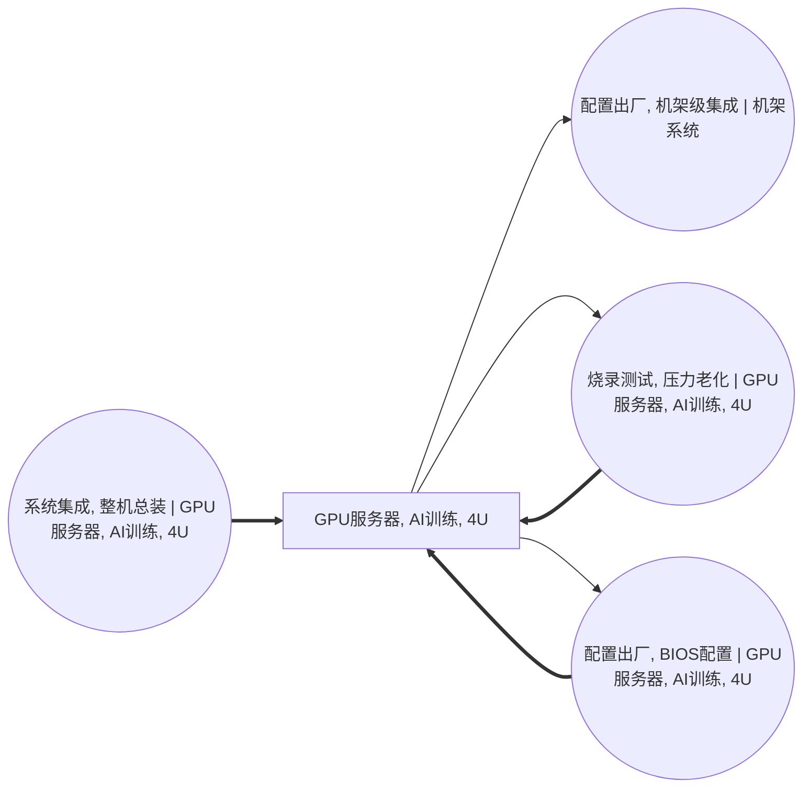

<!-- BODY:START -->
## 定义与产品身份

P004 表示面向人工智能训练的机架式 GPU 服务器整机，身份刻面固定为服务器级系统、GPU AI 训练用途和 4U 机箱形态。H3C R5300 G5 官方手册将其产品描述为面向深度学习和大规模并行训练的 4U 双路 GPU 服务器，可支持本节点的产品类型与用途识别。[^ku-h3c-r5300-g5]

P004 不是单张 GPU 加速卡、主板 PCBA、机架系统或数据中心运行服务，也不代表所有高度、拓扑和冷却方式的 AI 服务器。Supermicro 官方产品组合同时列有 4U 液冷 HGX 系统、其他高度的 HGX 系统和不同高度的 PCIe GPU 系统，说明“4U GPU 服务器”仍然是产品族身份，不是唯一物料清单。[^ku-supermicro-hgx-4u]

## 性质与形态

P004 的物理形态是可独立搬运和装入标准机架的固态服务器整机，由机箱、主板或计算托盘、GPU 子系统、处理器、内存、存储、电源、网络、线束、散热和结构件组成。H3C 手册列出的主板、GPU、电源、网卡、硬盘、风扇、内存和机箱等部件，可作为产品组成字段清单的中国来源。[^ku-h3c-r5300-g5]

同属 P004 的具体型号仍可能采用独立 PCIe GPU 加速卡、HGX/SXM GPU baseboard、风冷或液冷等不同配置。[^ku-h3c-r5300-g5][^ku-supermicro-hgx-4u] GPU 型号和数量、互连拓扑、CPU 与内存配置、存储、电源冗余、散热路线、机箱和导轨版本都会改变产品质量组成及其上游负担；因此本节点不设置跨型号默认 BOM、默认质量或默认材料比例。〔建模判断〕

## 参考流与交接边界

P004 的首选参考流是一台与目标型号、配置单和 BOM 版本一致，已经完成规定的整机测试、压力老化、固件或 BIOS 配置及出厂检验，可交付机架集成的 4U GPU 训练服务器。包装是否进入参考流必须单独声明；未随服务器进入下游机架系统的周转包装和运输包装不得默认计入服务器净质量。〔建模判断〕

权威图目前以同一个 P004 同时表示 A011 总装输出、A022 测试老化前后状态和 A023 配置出厂前后状态。[^ku-ict-p004-spine] 这是状态聚合，不表示一个数值数据集可以递归消费自身。量化时应按 A011 → A022 → A023 的单向顺序串接一次，并以 A023 输出作为进入 A020 机架集成的交付状态；取得分阶段在制品和返修台账后，应考虑拆分“装配完成”“测试合格”和“配置出厂”产品节点。〔建模判断〕

## 规格与相邻节点区分

- **与 P019 主板 PCBA 区分：**P019 是整机内部的板级子系统；P004 是装入处理器、内存、GPU、存储、电源、散热和机箱后的服务器级系统。[^ku-ict-a011-spine]
- **与 P024 GPU 加速卡区分：**P024 是独立训练加速板卡；P004 可以消费一张或多张 P024，但不能用 P024 的质量或制造清单替代整机。[^ku-ict-a011-spine]
- **与 P005 AI 推理服务器区分：**P005 的身份刻面是 AI 推理和 2U；即使采用相同芯片厂商，也不能因产品分类码接近而与 P004 合并。〔建模判断〕
- **与 P016 机架系统区分：**P016 是服务器、交换机、存储、配电和机架结构的更高层集成系统；P004 只是进入 A020 的单台服务器产品。[^ku-ict-p004-spine]
- **与 HGX GPU baseboard 区分：**NVIDIA 将 HGX H100 描述为包含多颗 GPU 和 NVSwitch 的 GPU baseboard；该对象是服务器内部的 GPU 子系统，不等同于系统主板或服务器整机。[^ku-nvidia-hgx-h100-baseboard] 目标配置采用 HGX 路线时，应单独保存其子系统 BOM，避免与独立 GPU 加速卡路线重复计算。〔建模判断〕

H3C 产品族内部包含不同 GPU 数量和 HGX 模块配置，国际 4U 产品也存在不同 GPU 拓扑和冷却方式。[^ku-h3c-r5300-g5][^ku-supermicro-hgx-4u] 因此完整型号、GPU 子系统形式、冷却路线和配置单是数据集身份字段，不能只用“GPU服务器, AI训练, 4U”名称判断两个数据集可互换。

## 在系统中的角色

P004 的初始整机由 A011 系统集成活动产出，随后经过 A022 烧录、压力测试与老化和 A023 BIOS 配置及出厂处理，再被 A020 消费并进入机架系统。[^ku-ict-p004-spine] 产品页保存每一交接状态下的产品身份、配置、净质量、包装边界和代表性；A011、A022、A023 分别保存总装、测试和配置包装过程的物料、能源、良率、返修、排放与废物流。

当前 A011 脊边列出的服务器总装投入包括主板、GPU 加速卡、DIMM、SSD、电源、网络控制、线束、机箱与导轨、风扇、散热和导热界面等产品流。[^ku-ict-a011-spine] P004 的产品边界默认包含目标配置实际安装的这些部件；默认不包含 P016 机架、外置液冷 CDU、外部交换网络、机架配电、数据中心使用阶段电力和报废处理。研究边界扩展到机架、运行或报废阶段时，应通过相应活动和产品节点继续展开，不在 P004 产品组成中无痕并入。〔建模判断〕

## 分类与适用范围

UNSD ISIC Rev.4 2620 的说明包括计算机服务器的制造或装配，可作为 P004 相关生产活动的行业分类依据。[^ku-unsd-isic2620] WCO 对 HS 8471.50 的描述为除指定完整系统子目以外的自动数据处理机处理单元，与作为独立处理单元交付的机架服务器具有描述匹配；实际报关仍须根据完整配置和海关章注裁定。[^ku-wco-hs847150]

旧版 CPC 中的 4521 对应模拟或混合自动数据处理机，不适用于数字 GPU 服务器。[^ku-unsd-cpc452-provisional] 权威图已按 CPC Rev.2.1 与 HS 847150 的对应关系采用 CPC 45250。[^ku-unsd-cpc45250] CPC、HS 和 ISIC 只能支持产品与行业宽类定位，不能表达 GPU 拓扑、服务器高度、冷却方式、生产地域或环境表现。

本节点适用于完成出厂状态的 4U GPU AI 训练服务器；不适用于单张加速卡、服务器主板、AI 推理服务器、通用 CPU 服务器、机架系统、服务器使用服务或尚未完成规定测试和配置的在制整机。

## 节点特定采集字段

- **产品身份：**记录制造商、完整型号、销售配置代码、硬件修订、BOM/AVL/ECN 版本、序列号规则和固件版本。
- **计算配置：**记录 GPU 型号、子系统形式与数量，CPU 型号与数量，DIMM 规格与数量，SSD、网卡、互连卡和其他板卡配置。
- **结构与热管理：**记录机箱和导轨版本、风冷或液冷路线、风扇、散热器、热管、均热板、冷板、导热界面材料及外置 CDU 是否在边界内。
- **电源与交付：**记录 PSU 配置与冗余方式、整机净质量、包装版本、测试合格状态、BIOS/固件配置状态、交接点和计量单位。
- **产品代表性：**记录总装、测试和配置场址，代表期，型号组合，批次及样本覆盖，称量方法，BOM 覆盖率和不确定度。

总装领退料、装配电力和装配废物归 A011；测试功率、测试时长、一次通过率、返修和测试不良品归 A022；配置作业、包装材料和包装废物归 A023。P004 产品页不重复保存或分配这些活动级过程清单。

## 区域化补充要求

### CN 中国

以下要求用于把 P004 的通用产品身份落到中国区域数据集，不改变 GPU 训练服务器的全球通用定义。〔建模判断〕

- **生产地域判定：**分别记录主板和板卡制造、整机总装、测试老化及配置包装的实际发生地；服务器在中国部署不等于全部制造环节发生在中国。
- **中国产品组合：**按目标研究期的实际出货或采购记录保存厂商、型号、GPU 拓扑、冷却路线和配置数量；H3C 单一产品族资料不能直接外推为中国市场平均。[^ku-h3c-r5300-g5]
- **中国来源优先级：**优先取得 PLM/ERP 的工程 BOM、配置单、AVL/ECN，MES 工单和完工记录，单机称量、序列号、质检、包装和交接台账；公开厂商手册只用于产品身份和字段校验。
- **活动版本联结：**A011、A022 和 A023 必须绑定同一型号、BOM 版本、场址和代表期；混线生产时按可审计的产量、工时、设备时间或质量参数分配，不能把设施总量直接平均到 P004。
- **背景系统区域化：**只有实际发生在中国的制造阶段才替换为中国电力、公用工程、运输和废物处理背景；进口 GPU、CPU、内存和其他组件保持其实际上游生产地域。
- **数值状态：**中国来源不自动等于中国实测；实测、计算、定义、产品族规格、代理和待采分别标记。额定功率、TDP、运行能耗、企业 ESG 总量和整机 PCF 不得冒充制造单元过程实测值。

其他地区应在同一“区域化补充要求”下新增地区小节，不修改上述通用节点特定字段。〔建模判断〕

## 数据适用状态与缺口

现有已核验资料足以支持 P004 的 4U GPU 训练服务器身份、主要组成字段、配置差异、活动顺序和分类宽类。[^ku-h3c-r5300-g5][^ku-supermicro-hgx-4u][^ku-ict-p004-spine] H3C 的服务器碳足迹披露采用生命周期评价标准框架，并覆盖原材料、制造、运输、使用和报废阶段，但公开内容没有给出 P004 目标型号可复算的产品 BOM、单位制造清单及 A011/A022/A023 分阶段数据。[^ku-h3c-server-pcf-2024]

因此本页可以支持产品识别、参考流定义、系统边界、产品字段设计和中国区域采集，但不能直接生成可发布的中国区 P004 LCI。正式量化仍需取得目标型号 BOM 与单机称量、包装边界、总装/测试/配置场址与同期台账、产品分配后的物料能源及废物流，并解决 P004 三种交付状态共用同一节点造成的循环展开风险。`dataset_readiness` 保持 `blocked`。

## 出处

[^ku-ict-p004-spine]: lca-cornerstone ICT Equipment Name Graph — P004、A011、A020、A022、A023 及全部相邻边，仓库权威图，已定向核验。
[^ku-ict-a011-spine]: lca-cornerstone ICT Equipment Name Graph — A011 及其全部投入产出边，仓库权威图，已定向核验。
[^ku-h3c-r5300-g5]: H3C UniServer R5300 G5 服务器用户指南，H3C 官方手册，§2.1、表2-1、表2-2、表2-4至表2-5，已独立核验。
[^ku-supermicro-hgx-4u]: Supermicro NVIDIA H200/H100 与 L40 GPU 系统产品组合，官方产品页，已独立核验。
[^ku-nvidia-hgx-h100-baseboard]: NVIDIA Fabric Manager User Guide — HGX H100 GPU Baseboard，NVIDIA 官方文档，已独立核验。
[^ku-unsd-isic2620]: UNSD ISIC Rev.4 2620 classification detail，已独立核验。
[^ku-wco-hs847150]: WCO Harmonized System 8471.50，已独立核验并限定为描述匹配、非海关裁定。
[^ku-unsd-cpc452-provisional]: UNSD CPC Provisional Group 452，已独立核验旧版 4521 的含义。
[^ku-unsd-cpc45250]: UNSD CPC Rev.2.1 45250 classification detail，已独立核验。
[^ku-h3c-server-pcf-2024]: 新华三服务器全系碳足迹发布，H3C 官方披露，已独立核验其方法框架与生命周期边界。
<!-- BODY:END -->

## 邻域工序图
> 由 graph edges 确定性派生（图==边，可被 lint 比对）；模型不得增删连线。

## 🔒 数量（待挂 · NOT POPULATED）
> 本节为占位。输入流 / 输出流 / 参考单位的结构在此预留，数值由实测/权威库挂入，**LLM 不得填写**（数量防火墙）。

| 流 | 方向 | 单位 | 值 | 源 |
|---|---|---|---|---|
| (待挂) | — | — | — | — |

<!-- LCA_ASSOCIATION:START -->
## 🔗 可引用 LCA 数据集与关联

> 已核验关联 5 条：C0=5、C1=0、C2=0、C3=0、C4=0。这些记录用于发现与代理筛选；进入计算前仍须在具体项目中核对边界、许可和版本。

| 强度 | 数据库记录 | 数据库/版本 | 关联对象 | 潜在用途 | 主要限制 | 模型状态 |
|---|---|---|---|---|---|---|
| `C0` · 外部对照 | [はん用コンピュータ, GLO](https://sumpo.or.jp/consulting/lca/idea/din2eh00000001km-att/AIST-IDEAv34_Ja_sample.xlsx) | AIST-IDEA 3.4 public sample | `external_product_result` | 外部对照；不可替代 | 数据集边界覆盖完整产品/行业聚合，直接挂接会与已展开前景链重复计入。 | 仅知识关联 · 仍需项目裁决 · 不可直接计算 |
| `C0` · 外部对照 | [はん用コンピュータ, JPN](https://sumpo.or.jp/consulting/lca/idea/din2eh00000001km-att/AIST-IDEAv34_Ja_sample.xlsx) | AIST-IDEA 3.4 public sample | `external_product_result` | 外部对照；不可替代 | 数据集边界覆盖完整产品/行业聚合，直接挂接会与已展开前景链重复计入。 | 仅知识关联 · 仍需项目裁决 · 不可直接计算 |
| `C0` · 外部对照 | [ミッドレンジコンピュータ, GLO](https://sumpo.or.jp/consulting/lca/idea/din2eh00000001km-att/AIST-IDEAv34_Ja_sample.xlsx) | AIST-IDEA 3.4 public sample | `external_product_result` | 外部对照；不可替代 | 数据集边界覆盖完整产品/行业聚合，直接挂接会与已展开前景链重复计入。 | 仅知识关联 · 仍需项目裁决 · 不可直接计算 |
| `C0` · 外部对照 | [ミッドレンジコンピュータ, JPN](https://sumpo.or.jp/consulting/lca/idea/din2eh00000001km-att/AIST-IDEAv34_Ja_sample.xlsx) | AIST-IDEA 3.4 public sample | `external_product_result` | 外部对照；不可替代 | 数据集边界覆盖完整产品/行业聚合，直接挂接会与已展开前景链重复计入。 | 仅知识关联 · 仍需项目裁决 · 不可直接计算 |
| `C0` · 外部对照 | [NVIDIA HGX H100 product carbon footprint summary](https://www.nvidia.com/en-us/foundation/archives/) | NVIDIA Product Carbon Footprint archive current at access date | `external_product_result` | 外部对照；不可替代 | 数据集边界覆盖完整产品/行业聚合，直接挂接会与已展开前景链重复计入。 | 仅知识关联 · 仍需项目裁决 · 不可直接计算 |

> 关联不等于计算绑定；项目采用分别进入 `model_dataset_bindings.json` 或 `model_proxy_bindings.json`。
<!-- LCA_ASSOCIATION:END -->

<!-- CHANGELOG:START -->
## 修改日志

### 2026-07-30 · 从“预先强绑定”改为“可引用数据集关联”

- **发现的问题：** 节点 Wiki 的目的，是让后续 LCA 建模快速发现可直接引用或可作代理的数据集；旧栏目只展示正式绑定和 C2，隐藏了具有代理筛选价值的 C1，也把部分真实相邻记录直接归入否决，容易把“关联强弱”误读成“能否立即计算”。
- **采取的修改：** 按冻结的官方/公开证据重新裁决本节点的数据集引用关系，当前展示 5 条关联（C0=5、C1=0、C2=0、C3=0、C4=0），另保留 0 条真正否决；每条同时标记关联对象、潜在用途、主要限制和项目裁决要求。
- **修改原则：** C0–C4 只表示节点—数据集关联强度，不授予计算权限；C1/C2 可进入项目级 P0–P3 代理裁决，C3/C4 也必须在具体模型中核对边界、许可和版本后才形成真正绑定。
<!-- CHANGELOG:END -->
