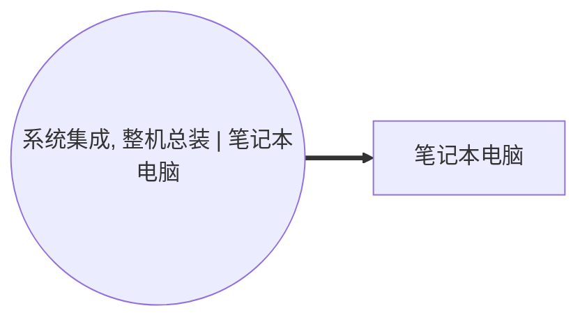

<!-- BODY:START -->
## 定义与产品身份

笔记本电脑是将处理、存储、显示、输入和供电等功能集成于便携式计算机系统中的终端设备。 〔未核实·模型回忆〕

## 性质与形态

该产品通常以可携带的一体式机身交付，包含显示屏、主板、处理器、存储、输入装置和电池等集成部件。 〔未核实·模型回忆〕

## 参考流与交接边界

模型参考流宜定义为一台满足声明配置的笔记本电脑，并以整机出厂或交付给下游使用阶段的状态作为前景交接边界。 〔未核实·模型回忆〕 [^internal-review]

## 规格与相邻节点区分

本节点按“server、system、cpu_compute、na、笔记本电脑, cpu_compute”刻面识别，应与台式机、服务器及仅售卖的计算部件区分。 〔未核实·模型回忆〕 [^internal-review]

## 在系统中的角色

笔记本电脑是 ICT 设备产品系统的前景成品输出，由活动 A040 生产。 〔未核实·模型回忆〕 [^internal-review]

## 分类与适用范围

笔记本电脑属于电子计算机制造活动所覆盖的计算机终端产品范围。 〔未核实·模型回忆〕

## 节点特定采集字段

采集时应记录整机配置、质量、关键部件清单、显示尺寸、存储与处理器配置、电池情况、包装及制造地点。 〔未核实·模型回忆〕 [^internal-review]

## 区域化补充要求

区域化应至少区分整机装配地点及主要零部件供应地，并记录对应电力与运输供应链的区域代表性。 〔未核实·模型回忆〕 [^internal-review]

## 数据适用状态与缺口

现有档案列有 ecoinvent 和 ISIC 作为候选来源且无已核验来源；具体产品配置和区域代表性仍构成数据缺口。 〔未核实·模型回忆〕 [^internal-review]

## 出处

[^internal-review]: 内部评审与建模约定——仅支持显式标注的系统边界、参考流、采集字段与数据缺口判断，不作为外部事实证据。
<!-- BODY:END -->

## 邻域工序图
> 由 graph edges 确定性派生（图==边，可被 lint 比对）；模型不得增删连线。

## 🔒 数量（待挂 · NOT POPULATED）
> 本节为占位。输入流 / 输出流 / 参考单位的结构在此预留，数值由实测/权威库挂入，**LLM 不得填写**（数量防火墙）。

| 流 | 方向 | 单位 | 值 | 源 |
|---|---|---|---|---|
| (待挂) | — | — | — | — |

<!-- LCA_ASSOCIATION:START -->
## 🔗 可引用 LCA 数据集与关联

> 已核验关联 3 条：C0=3、C1=0、C2=0、C3=0、C4=0。这些记录用于发现与代理筛选；进入计算前仍须在具体项目中核对边界、许可和版本。

| 强度 | 数据库记录 | 数据库/版本 | 关联对象 | 潜在用途 | 主要限制 | 模型状态 |
|---|---|---|---|---|---|---|
| `C0` · 外部对照 | [パーソナルコンピュータ, GLO](https://sumpo.or.jp/consulting/lca/idea/din2eh00000001km-att/AIST-IDEAv34_Ja_sample.xlsx) | AIST-IDEA 3.4 public sample | `external_product_result` | 外部对照；不可替代 | 数据集边界覆盖完整产品/行业聚合，直接挂接会与已展开前景链重复计入。 | 仅知识关联 · 仍需项目裁决 · 不可直接计算 |
| `C0` · 外部对照 | [パーソナルコンピュータ, JPN](https://sumpo.or.jp/consulting/lca/idea/din2eh00000001km-att/AIST-IDEAv34_Ja_sample.xlsx) | AIST-IDEA 3.4 public sample | `external_product_result` | 外部对照；不可替代 | 数据集边界覆盖完整产品/行业聚合，直接挂接会与已展开前景链重复计入。 | 仅知识关联 · 仍需项目裁决 · 不可直接计算 |
| `C0` · 外部对照 | [computer production, laptop](https://ecoquery.ecoinvent.org/3.12/cutoff/dataset/2077/documentation) | ecoinvent 3.12 | `reference_product` | 外部对照；不可替代 | 数据集边界覆盖完整产品/行业聚合，直接挂接会与已展开前景链重复计入。 | 仅知识关联 · 仍需项目裁决 · 不可直接计算 |

> 关联不等于计算绑定；项目采用分别进入 `model_dataset_bindings.json` 或 `model_proxy_bindings.json`。
<!-- LCA_ASSOCIATION:END -->

<!-- CHANGELOG:START -->
## 修改日志

### 2026-08-03 · 断言级溯源受控合并

- **发现的问题：** 本次送审断言中有 0 条取得独立支持、9 条证据不足；另有 0 条因冲突、共享引用或锚点不唯一未自动修改。
- **采取的修改：** 已核实断言改挂专属 `ku-*` 引用；证据不足断言移除装饰性旧引用并明确降级。
- **修改原则：** 只修改哈希一致且唯一命中的原文行；不整页重写；不机械处理矛盾；来源注册、正文引用与修改日志同步更新。
- **数据影响：** 本次处理 9 条可安全合并断言；未新增或推断任何 LCI 数值。

### 2026-07-30 · 从“预先强绑定”改为“可引用数据集关联”

- **发现的问题：** 节点 Wiki 的目的，是让后续 LCA 建模快速发现可直接引用或可作代理的数据集；旧栏目只展示正式绑定和 C2，隐藏了具有代理筛选价值的 C1，也把部分真实相邻记录直接归入否决，容易把“关联强弱”误读成“能否立即计算”。
- **采取的修改：** 按冻结的官方/公开证据重新裁决本节点的数据集引用关系，当前展示 3 条关联（C0=3、C1=0、C2=0、C3=0、C4=0），另保留 0 条真正否决；每条同时标记关联对象、潜在用途、主要限制和项目裁决要求。
- **修改原则：** C0–C4 只表示节点—数据集关联强度，不授予计算权限；C1/C2 可进入项目级 P0–P3 代理裁决，C3/C4 也必须在具体模型中核对边界、许可和版本后才形成真正绑定。
<!-- CHANGELOG:END -->
