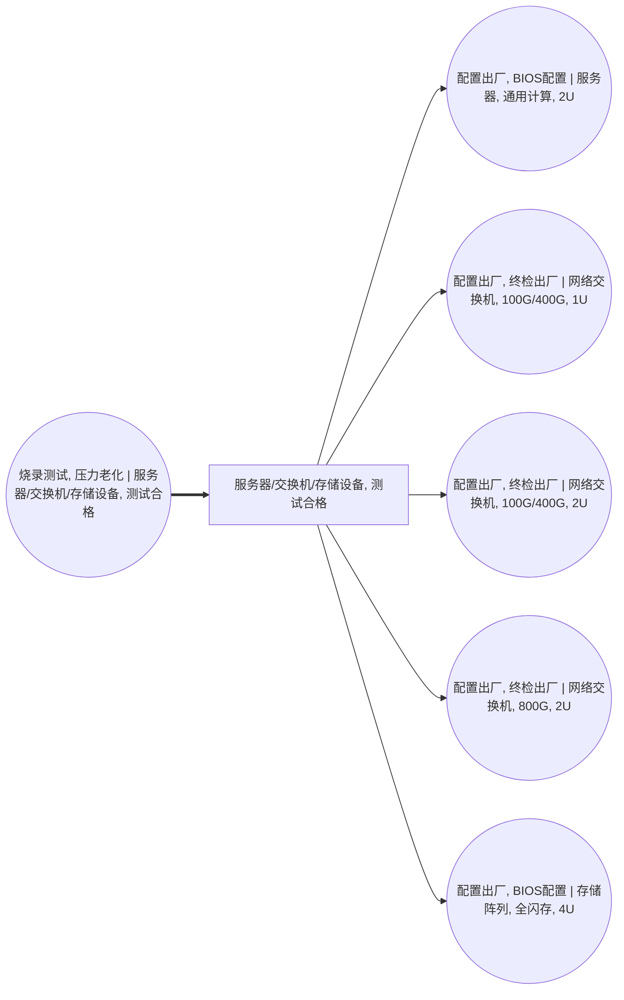

<!-- BODY:START -->
## 定义与产品身份

本章节的目标节点特异性外部证据尚未达到 CONFIRMED；相关候选事实不进入正文，需补充一手来源后重跑。 〔证据缺口〕 [^internal-review]

## 性质与形态

本章节的目标节点特异性外部证据尚未达到 CONFIRMED；相关候选事实不进入正文，需补充一手来源后重跑。 〔证据缺口〕 [^internal-review]

## 参考流与交接边界

本章节的目标节点特异性外部证据尚未达到 CONFIRMED；相关候选事实不进入正文，需补充一手来源后重跑。 〔证据缺口〕 [^internal-review]

## 规格与相邻节点区分

本章节的目标节点特异性外部证据尚未达到 CONFIRMED；相关候选事实不进入正文，需补充一手来源后重跑。 〔证据缺口〕 [^internal-review]

## 在系统中的角色

图谱中，P017由A018“烧录测试、压力老化”活动产出，并被A019、A026、A027、A028和A036消费，作为测试合格 ICT 整机向后续节点转移的前景产品。 〔图谱事实〕 [^internal-graph]

## 分类与适用范围

本章节的目标节点特异性外部证据尚未达到 CONFIRMED；相关候选事实不进入正文，需补充一手来源后重跑。 〔证据缺口〕 [^internal-review]

## 节点特定采集字段

建模时应采集整机类别（服务器/交换机/存储）、型号或配置、系统级测试与老化状态、测试失败返工路径、出厂交付状态及包装/随附件是否纳入参考流；这些字段是节点分辨率下的建模判断。 〔建模判断〕 [^internal-review]

## 区域化补充要求

区域化采集应记录制造与测试地点、电网区域、适用质量/安全合规市场、跨区域工厂配置差异及出货目的地；这些要求用于识别测试和交付阶段的地域代表性。 〔建模判断〕 [^internal-review]

## 数据适用状态与缺口

当前仅完成提名：缺少经确定性检索和独立核验的、同时直接覆盖服务器、交换机与存储设备整机“测试合格/交付就绪”状态的一手证据；不得据此将该节点标记为已核验或 reviewed。 〔证据缺口〕 [^internal-review]

## 出处

[^internal-graph]: lca-cornerstone 名称图冻结节点、刻面与连线——由图谱文件确定性提取，不作为外部事实证据。
[^internal-review]: 内部评审与建模约定——仅支持显式标注的系统边界、参考流、采集字段与数据缺口判断，不作为外部事实证据。
<!-- BODY:END -->

## 邻域工序图
> 由 graph edges 确定性派生（图==边，可被 lint 比对）；模型不得增删连线。

## 🔒 数量（待挂 · NOT POPULATED）
> 本节为占位。输入流 / 输出流 / 参考单位的结构在此预留，数值由实测/权威库挂入，**LLM 不得填写**（数量防火墙）。

| 流 | 方向 | 单位 | 值 | 源 |
|---|---|---|---|---|
| (待挂) | — | — | — | — |

## 产品性质与交付状态

<!-- EV:props:START -->
| property | condition | unit | 值 | 源 | pedigree |
|---|---|---|---|---|---|
| 节点产品身份 | 冻结名称图 | — | 服务器/交换机/存储设备, 测试合格 | internal-graph | 4,4,4,4,4 |
| 系统边界 | 冻结名称图 | — | foreground | internal-graph | 4,4,4,4,4 |
| 身份刻面 | 冻结名称图 | — | {"compute_type": "na", "equipment_class": "server", "form_factor": "na", "integration_level": "system", "product_subtype": "测试合格整机"} | internal-graph | 4,4,4,4,4 |
| 图谱交接关系 | 冻结名称图 | — | {"consumed_by": ["A019", "A026", "A027", "A028", "A036"], "produced_by": ["A018"]} | internal-graph | 4,4,4,4,4 |
<!-- EV:props:END -->

## 产品规格与地区参数

<!-- EV:params:START -->
| parameter | geo | unit | basis | 国际值 INT | 国际源 INT | 中国值 CN | 中国源 CN | pedigree |
|---|---|---|---|---|---|---|---|---|
| 完整型号或品级 | target | — | measured_average | 待采 | internal-review | 待采 | internal-review | 待评 |
| 参考流与交接单位 | target | — | reference | 待采 | internal-review | 待采 | internal-review | 待评 |
| 单件或单位净质量 | target | kg | measured_average | 待采 | internal-review | 待采 | internal-review | 待评 |
| 关键规格与组成 | target | — | measured_average | 待采 | internal-review | 待采 | internal-review | 待评 |
| 生产地域与代表期 | target | — | reference | 待采 | internal-review | 待采 | internal-review | 待评 |
| 包装、运输与交接状态 | target | — | measured_average | 待采 | internal-review | 待采 | internal-review | 待评 |
<!-- EV:params:END -->

## 数据质量与代表性

<!-- EV:quality:START -->
| field | unit | basis | 中国项目值 CN | 中国源 CN | proxy_policy | pedigree |
|---|---|---|---|---|---|---|
| 型号、批次与规格覆盖 | — | measured_average | 待采 | internal-review | 不得以相邻产品冒充目标节点 | 待评 |
| 参考流和交接边界一致性 | — | reference | 待核 | internal-review | 边界不一致只能作外部对照 | 待评 |
| 质量或数量测量方法 | — | measured_average | 待采 | internal-review | 规格上限不得冒充运行平均 | 待评 |
| 地域、技术和时间代表性 | — | reference | 待采 | internal-review | 保留原生产地与代表期 | 待评 |
| 代理、分配与不确定度 | — | calculated | 待算 | internal-review | 代理必须留痕并做敏感性分析 | 待评 |
<!-- EV:quality:END -->

<!-- LCA_ASSOCIATION:START -->
## 🔗 可引用 LCA 数据集与关联

> **本轮暂无经过语义裁决的可引用数据集。** 这不表示全球不存在数据；应继续处理逐来源检索矩阵中的待裁决、未执行和受阻记录。

- 节点策略：`composed_via_activity` — 经图内生产活动和上游输入组合；产品页关联用于发现，不代表整条聚合过程可直接导入。
- 检索审计：候选 0 条，明确否决 0 条。
<!-- LCA_ASSOCIATION:END -->

<!-- CHANGELOG:START -->
## 修改日志

### 2026-08-04 · 断言级溯源受控合并

- **发现的问题：** 本次送审断言中有 0 条取得独立支持、9 条证据不足；另有 0 条因冲突、共享引用或锚点不唯一未自动修改。
- **采取的修改：** 已核实断言改挂专属 `ku-*` 引用；证据不足断言移除装饰性旧引用并明确降级。
- **修改原则：** 只修改哈希一致且唯一命中的原文行；不整页重写；不机械处理矛盾；来源注册、正文引用与修改日志同步更新。
- **数据影响：** 本次处理 9 条可安全合并断言；未新增或推断任何 LCI 数值。

### 2026-08-03 · 断言级溯源受控合并

- **发现的问题：** 本次送审断言中有 0 条取得独立支持、9 条证据不足；另有 0 条因冲突、共享引用或锚点不唯一未自动修改。
- **采取的修改：** 已核实断言改挂专属 `ku-*` 引用；证据不足断言移除装饰性旧引用并明确降级。
- **修改原则：** 只修改哈希一致且唯一命中的原文行；不整页重写；不机械处理矛盾；来源注册、正文引用与修改日志同步更新。
- **数据影响：** 本次处理 9 条可安全合并断言；未新增或推断任何 LCI 数值。

### 2026-07-30 · 从“预先强绑定”改为“可引用数据集关联”

- **发现的问题：** 节点 Wiki 的目的，是让后续 LCA 建模快速发现可直接引用或可作代理的数据集；旧栏目只展示正式绑定和 C2，隐藏了具有代理筛选价值的 C1，也把部分真实相邻记录直接归入否决，容易把“关联强弱”误读成“能否立即计算”。
- **采取的修改：** 按冻结的官方/公开证据重新裁决本节点的数据集引用关系，当前展示 0 条关联（C0=0、C1=0、C2=0、C3=0、C4=0），另保留 0 条真正否决；每条同时标记关联对象、潜在用途、主要限制和项目裁决要求。
- **修改原则：** C0–C4 只表示节点—数据集关联强度，不授予计算权限；C1/C2 可进入项目级 P0–P3 代理裁决，C3/C4 也必须在具体模型中核对边界、许可和版本后才形成真正绑定。
<!-- CHANGELOG:END -->
