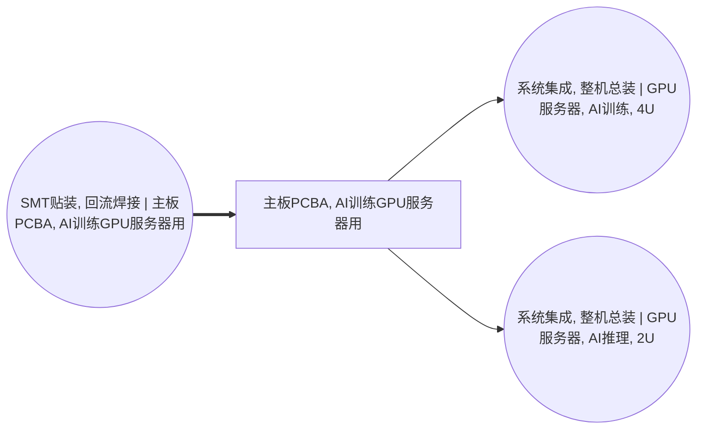

<!-- BODY:START -->
## 定义与参考产品

P019 表示用于 GPU 服务器的已装联主板 PCBA：以服务器主板裸 PCB 为载体，完成板上表面贴装器件、供电器件、管理与接口逻辑、插槽和连接器的焊接及板级检查。它不是 P043 裸 PCB，也不是装入 CPU、DIMM、GPU 加速卡、存储、电源、散热组件和机箱后的服务器整机。

参考产品建议定义为“一块按目标板号、修订版和装联 BOM 完成 SMT/必要插件焊接及规定板级检查、可交付整机总装的合格主板 PCBA”。是否包含 BMC、PCIe 交换/重定时器、板载管理网卡、TPM、固件烧录、三防涂覆和功能测试，必须由目标工艺路线逐项声明，不能从“主板 PCBA”名称自动推定。〔建模判断〕

H3C R5300 G5 手册把主板、处理器、内存、GPU 卡或 HGX 模块列为可识别的不同部件和配置对象。[^ku-h3c-r5300-g5] 因此本页默认把可插拔 CPU、DIMM、GPU 卡和 HGX GPU 模块排除在 P019 之外；厂商产品手册只能支持部件边界和字段设计，不能证明目标主板的 SMT BOM、单板质量或制造投入。〔建模判断〕

## 普通主板、GPU 基板与加速卡的切分

NVIDIA 官方文档把 HGX H100 描述为包含 GPU 和 NVSwitch 的 GPU baseboard。[^ku-nvidia-hgx-h100-baseboard] 这类 GPU 基板不是普通服务器主板 PCBA，也不等同于独立 GPU 加速卡。制作数据集时应按目标配置采用互斥路线：

- 普通 PCIe GPU 服务器：P019 只表示 CPU/系统主板，P024 表示独立 GPU 加速卡；
- HGX/SXM 服务器：系统主板、HGX GPU baseboard 和其 GPU 模块分别建模，不把同一 GPU/HBM 同时写入 P019 与 P024；
- 高度集成专用板：只有目标 BOM 明确将处理器或加速器永久焊装在该板上时，才把相应封装器件计入该特定 PCBA。

当前 A002 脊边同时把 CPU、GPU、HBM 和 DRAM 封装器件列为 P019 的 SMT 投入，而 A011 又另行消耗 GPU 加速卡。[^ku-ict-p019-a002-spine] 这是一项待修复的路线聚合，不是通用主板的正式 BOM；在 PCIe/HGX 路线拆分前，不得据此进行 GPU、HBM 或 CPU 数量展开。〔建模判断〕

## 节点身份与下游适用性

当前 P019 同时进入 A011 的 AI 训练服务器和 A012 的 AI 推理服务器。[^ku-ict-p019-a002-spine] 若两类服务器实际共用同一板号和装联 BOM，应把产品身份改为不带训练/推理限定的“GPU服务器用主板 PCBA”；若板号、处理器平台、PCIe 拓扑或冷却接口不同，应拆成独立产品节点。现有名称不能作为两个下游配置可互换的证据。〔建模判断〕

产品身份至少包括制造商、主板料号、PCB/PCBA 修订版、装联 BOM 版本、板尺寸和层数、板面数、主要板载 IC 与连接器、处理器插槽、DIMM 插槽、PCIe 拓扑、供电方案、固件/测试状态、净质量和交接点。

## 分类与数据归属

权威图当前把 P019 归为自动数据处理机零件/附件，并记录 HS 8473.30；UNSD CPC Rev.2.1 的 45290 对应自动数据处理机的其他零件和附件，并关联 HS 847330。[^ku-unsd-cpc45290] P019 因而采用 CPC 45290。实际报关仍须根据单板功能、交付状态和海关章注确认，分类码不能替代产品 BOM。

UNSD ISIC Rev.4 2610 明确包括把元器件装载到印刷电路板上的活动。[^ku-unsd-isic2610] 产品页只保存 P019 的身份、组成、质量、规格、测试状态和代表性；A002 保存锡膏、元器件、电力、辅助材料、良率、返修和废物流，不在两页重复计算。

## 中国项目数据获取与代理规则

中国项目优先从 PLM/ERP 的工程 BOM、AVL 和 ECN，PCB 制造图、Gerber/ODB++ 与拼板图，MES 工单、序列号和完工记录，贴片程序和 feeder 清单，SPI/AOI/X-ray/ICT/FCT 记录，单板称量、领退料、报废及返修记录取得 P019 数据。必须把目标板号、修订版、代表期和生产场址绑定到同一数据集版本。

公开服务器手册可用于检查主板与可插拔部件的边界；公开 GPU 平台文档可用于区分系统主板和 GPU baseboard。两者都不能填充目标单板的层数、铜量、器件数量、板重或中国制造实测值。若采用代理板，必须匹配板尺寸、层数、板面数、BGA/大封装数量、处理器平台、PCIe 拓扑和工艺路线，并标记“代理值”、保存换算公式和敏感性范围。消费级显卡、普通办公主板和整机 PCF 不得直接作为 P019 单板代理。

## 上下文完整性与发布状态

| 上下文模块 | 当前状态 | 正式量化前仍需取得 |
|---|---|---|
| 产品定义和交接状态 | 已完成 | 目标板号、修订版和验收状态 |
| 主板与 GPU 基板/加速卡切分 | 已完成 | 目标 PCIe 或 HGX 路线确认 |
| 分类和数据归属 | 已完成 | 项目实际报关及统计分类 |
| 产品字段和中国数据路径 | 已完成 | 工程 BOM、板图、质量和质检记录 |
| 中国单板实测或合格代理值 | 缺失 | 同型号台账或满足匹配条件的代理板 |
| P019 对训练/推理的共享关系 | 结构待核 | 共用板号证据或拆分节点 |

P019 已具备产品数据采集所需的正式上下文，但当前脊边仍混合普通主板、GPU baseboard 和 GPU 加速卡路线。截至 2026-07-27 对中国服务器厂商、服务器主板、PCBA 环评与相关制造资料的公开检索，未取得同时包含目标板号、器件级 BOM、单板制造投入和可审计分配方法的证据包；这只表示本次公开检索证据不足，不表示企业内部不存在数据。量化状态为 `blocked_spine_route_refinement_and_product_bom`。
<!-- BODY:END -->

## 邻域工序图
> 由 graph edges 确定性派生（图==边，可被 lint 比对）；模型不得增删连线。

## 🔒 数量（待挂 · NOT POPULATED）
> 本节为占位。输入流 / 输出流 / 参考单位的结构在此预留，数值由实测/权威库挂入，**LLM 不得填写**（数量防火墙）。

| 流 | 方向 | 单位 | 值 | 源 |
|---|---|---|---|---|
| (待挂) | — | — | — | — |

<!-- LCA_ASSOCIATION:START -->
## 🔗 可引用 LCA 数据集与关联

> 已核验关联 5 条：C0=4、C1=1、C2=0、C3=0、C4=0。这些记录用于发现与代理筛选；进入计算前仍须在具体项目中核对边界、许可和版本。

| 强度 | 数据库记录 | 数据库/版本 | 关联对象 | 潜在用途 | 主要限制 | 模型状态 |
|---|---|---|---|---|---|---|
| `C1` · 弱关联 | [印制线路板组件](https://www.hiqlcd.com/dataset/hiqlcd/1.5.0/cut_off/e8b682ed-6133-44d5-8ef8-6603d9323a78) | HiQLCD 1.5.0 | `reference_product` | 弱关联；可进入代理筛选 | 未通过节点特定硬门：product、reference_product、activity、route、boundary、geography、time。HiQLCD 记录是中国通用 PCBA 市场产品，参考单位为 kg；未证… | 仅知识关联 · 仍需项目裁决 · 不可直接计算 |
| `C0` · 外部对照 | [プリント配線実装基板, GLO](https://sumpo.or.jp/consulting/lca/idea/din2eh00000001km-att/AIST-IDEAv34_Ja_sample.xlsx) | AIST-IDEA 3.4 public sample | `external_product_result` | 外部对照；不可替代 | 数据集边界覆盖完整产品/行业聚合，直接挂接会与已展开前景链重复计入。 | 仅知识关联 · 仍需项目裁决 · 不可直接计算 |
| `C0` · 外部对照 | [プリント配線実装基板, JPN](https://sumpo.or.jp/consulting/lca/idea/din2eh00000001km-att/AIST-IDEAv34_Ja_sample.xlsx) | AIST-IDEA 3.4 public sample | `external_product_result` | 外部对照；不可替代 | 数据集边界覆盖完整产品/行业聚合，直接挂接会与已展开前景链重复计入。 | 仅知识关联 · 仍需项目裁决 · 不可直接计算 |
| `C0` · 外部对照 | [printed wiring board production, mounted mainboard, desktop computer, Pb free](https://ecoquery.ecoinvent.org/3.12/cutoff/dataset/1091/documentation) | ecoinvent 3.12 | `reference_product` | 外部对照；不可替代 | 数据集边界覆盖完整产品/行业聚合，直接挂接会与已展开前景链重复计入。 | 仅知识关联 · 仍需项目裁决 · 不可直接计算 |
| `C0` · 外部对照 | [Printed circuit and electronic assembly - United States](https://api.nal.usda.gov/FederalLCACommonsapi/search?query=9a21e1ba-46e9-39b5-a3d3-0004486ec40c&type=PROCESS) | Federal LCA Commons repository current at access date | `external_product_result` | 外部对照；不可替代 | 数据集边界覆盖完整产品/行业聚合，直接挂接会与已展开前景链重复计入。 | 仅知识关联 · 仍需项目裁决 · 不可直接计算 |

> 关联不等于计算绑定；项目采用分别进入 `model_dataset_bindings.json` 或 `model_proxy_bindings.json`。
<!-- LCA_ASSOCIATION:END -->

<!-- CHANGELOG:START -->
## 修改日志

### 2026-07-30 · 从“预先强绑定”改为“可引用数据集关联”

- **发现的问题：** 节点 Wiki 的目的，是让后续 LCA 建模快速发现可直接引用或可作代理的数据集；旧栏目只展示正式绑定和 C2，隐藏了具有代理筛选价值的 C1，也把部分真实相邻记录直接归入否决，容易把“关联强弱”误读成“能否立即计算”。
- **采取的修改：** 按冻结的官方/公开证据重新裁决本节点的数据集引用关系，当前展示 5 条关联（C0=4、C1=1、C2=0、C3=0、C4=0），另保留 0 条真正否决；每条同时标记关联对象、潜在用途、主要限制和项目裁决要求。
- **中国源补检：** 本节点新增 1 条 HiQLCD 官方公共元数据关联；已核验稳定 UUID、版本、系统模型、参考产品/单位、地域、时间和公开边界，完整 I/O/LCIA 仍受许可控制。
- **修改原则：** C0–C4 只表示节点—数据集关联强度，不授予计算权限；C1/C2 可进入项目级 P0–P3 代理裁决，C3/C4 也必须在具体模型中核对边界、许可和版本后才形成真正绑定。
<!-- CHANGELOG:END -->
