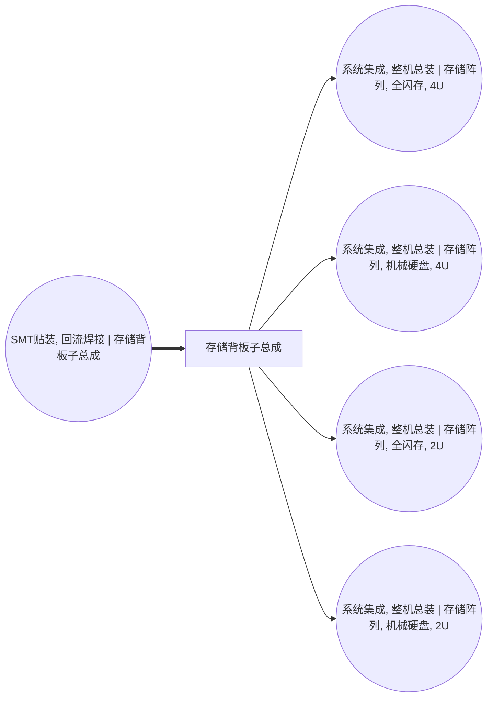

<!-- BODY:START -->
## 定义与产品身份

存储背板子总成指在存储设备内为多个驱动器或模块提供电气互连的背板级子系统；本节点按 storage_module、subsystem 与 backplane 刻面定义。 〔未核实·模型回忆〕

## 性质与形态

该子总成通常为装配有连接器、印制线路和机械支撑件的刚性板件，用于承载和连接存储驱动器或相关模块。 〔未核实·模型回忆〕

## 参考流与交接边界

参考流定义为一件完成制造并可交付给下游设备装配活动的存储背板子总成，交接点为该子总成离开其生产活动 A031。 〔未核实·模型回忆〕 [^internal-review]

## 规格与相邻节点区分

本节点仅表示存储背板级子系统，不包括完整存储设备、单独存储驱动器、主板或 PSU 电源模组；其身份由 product_subtype=backplane 确定。 〔未核实·模型回忆〕 [^internal-review]

## 在系统中的角色

存储背板为驱动器或模块提供共享的电气互连与安装接口，是存储系统内部的互连部件。 〔未核实·模型回忆〕

## 分类与适用范围

该节点适用于 ICT 设备前景系统中的存储模块子系统，不把可独立销售的整机存储产品归入本节点。 〔未核实·模型回忆〕 [^internal-review]

## 节点特定采集字段

采集时应记录背板的接口类型与数量、板尺寸或层数、连接器配置、所配套的驱动器槽位数及装配良率。 〔未核实·模型回忆〕 [^internal-review]

## 区域化补充要求

应补充制造地点的电力结构、印制板和连接器供应链来源、制造废物流去向及运输距离等区域化信息。 〔未核实·模型回忆〕 [^internal-review]

## 数据适用状态与缺口

该前景节点已有与 A031 的生产关联及多个下游消费关联，但冻结档案未提供已核验来源；具体材料构成和制造参数仍是数据缺口。 〔未核实·模型回忆〕 [^internal-review]

## 出处

[^internal-review]: 内部评审与建模约定——仅支持显式标注的系统边界、参考流、采集字段与数据缺口判断，不作为外部事实证据。
<!-- BODY:END -->

## 邻域工序图
> 由 graph edges 确定性派生（图==边，可被 lint 比对）；模型不得增删连线。

## 🔒 数量（待挂 · NOT POPULATED）
> 本节为占位。输入流 / 输出流 / 参考单位的结构在此预留，数值由实测/权威库挂入，**LLM 不得填写**（数量防火墙）。

| 流 | 方向 | 单位 | 值 | 源 |
|---|---|---|---|---|
| (待挂) | — | — | — | — |

<!-- LCA_ASSOCIATION:START -->
## 🔗 可引用 LCA 数据集与关联

> 已核验关联 5 条：C0=4、C1=1、C2=0、C3=0、C4=0。这些记录用于发现与代理筛选；进入计算前仍须在具体项目中核对边界、许可和版本。

| 强度 | 数据库记录 | 数据库/版本 | 关联对象 | 潜在用途 | 主要限制 | 模型状态 |
|---|---|---|---|---|---|---|
| `C1` · 弱关联 | [印制线路板组件](https://www.hiqlcd.com/dataset/hiqlcd/1.5.0/cut_off/e8b682ed-6133-44d5-8ef8-6603d9323a78) | HiQLCD 1.5.0 | `reference_product` | 弱关联；可进入代理筛选 | 未通过节点特定硬门：product、reference_product、activity、route、boundary、geography、time。HiQLCD 记录是中国通用 PCBA 市场产品，参考单位为 kg；未证… | 仅知识关联 · 仍需项目裁决 · 不可直接计算 |
| `C0` · 外部对照 | [プリント配線実装基板, GLO](https://sumpo.or.jp/consulting/lca/idea/din2eh00000001km-att/AIST-IDEAv34_Ja_sample.xlsx) | AIST-IDEA 3.4 public sample | `external_product_result` | 外部对照；不可替代 | 数据集边界覆盖完整产品/行业聚合，直接挂接会与已展开前景链重复计入。 | 仅知识关联 · 仍需项目裁决 · 不可直接计算 |
| `C0` · 外部对照 | [プリント配線実装基板, JPN](https://sumpo.or.jp/consulting/lca/idea/din2eh00000001km-att/AIST-IDEAv34_Ja_sample.xlsx) | AIST-IDEA 3.4 public sample | `external_product_result` | 外部对照；不可替代 | 数据集边界覆盖完整产品/行业聚合，直接挂接会与已展开前景链重复计入。 | 仅知识关联 · 仍需项目裁决 · 不可直接计算 |
| `C0` · 外部对照 | [printed wiring board production, surface mounted, unspecified, Pb free](https://ecoquery.ecoinvent.org/3.12/cutoff/dataset/1415/documentation) | ecoinvent 3.12 | `reference_product` | 外部对照；不可替代 | 数据集边界覆盖完整产品/行业聚合，直接挂接会与已展开前景链重复计入。 | 仅知识关联 · 仍需项目裁决 · 不可直接计算 |
| `C0` · 外部对照 | [Printed circuit and electronic assembly - United States](https://api.nal.usda.gov/FederalLCACommonsapi/search?query=9a21e1ba-46e9-39b5-a3d3-0004486ec40c&type=PROCESS) | Federal LCA Commons repository current at access date | `external_product_result` | 外部对照；不可替代 | 数据集边界覆盖完整产品/行业聚合，直接挂接会与已展开前景链重复计入。 | 仅知识关联 · 仍需项目裁决 · 不可直接计算 |

> 关联不等于计算绑定；项目采用分别进入 `model_dataset_bindings.json` 或 `model_proxy_bindings.json`。
<!-- LCA_ASSOCIATION:END -->

<!-- CHANGELOG:START -->
## 修改日志

### 2026-08-03 · 断言级溯源受控合并

- **发现的问题：** 本次送审断言中有 0 条取得独立支持、9 条证据不足；另有 0 条因冲突、共享引用或锚点不唯一未自动修改。
- **采取的修改：** 已核实断言改挂专属 `ku-*` 引用；证据不足断言移除装饰性旧引用并明确降级。
- **修改原则：** 只修改哈希一致且唯一命中的原文行；不整页重写；不机械处理矛盾；来源注册、正文引用与修改日志同步更新。
- **数据影响：** 本次处理 9 条可安全合并断言；未新增或推断任何 LCI 数值。

### 2026-07-30 · 从“预先强绑定”改为“可引用数据集关联”

- **发现的问题：** 节点 Wiki 的目的，是让后续 LCA 建模快速发现可直接引用或可作代理的数据集；旧栏目只展示正式绑定和 C2，隐藏了具有代理筛选价值的 C1，也把部分真实相邻记录直接归入否决，容易把“关联强弱”误读成“能否立即计算”。
- **采取的修改：** 按冻结的官方/公开证据重新裁决本节点的数据集引用关系，当前展示 5 条关联（C0=4、C1=1、C2=0、C3=0、C4=0），另保留 0 条真正否决；每条同时标记关联对象、潜在用途、主要限制和项目裁决要求。
- **中国源补检：** 本节点新增 1 条 HiQLCD 官方公共元数据关联；已核验稳定 UUID、版本、系统模型、参考产品/单位、地域、时间和公开边界，完整 I/O/LCIA 仍受许可控制。
- **修改原则：** C0–C4 只表示节点—数据集关联强度，不授予计算权限；C1/C2 可进入项目级 P0–P3 代理裁决，C3/C4 也必须在具体模型中核对边界、许可和版本后才形成真正绑定。
<!-- CHANGELOG:END -->
