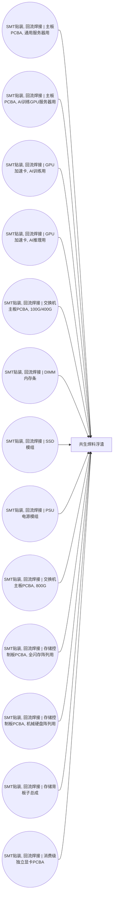

<!-- BODY:START -->
## 定义与产品身份

共生焊料浮渣是电子装配焊接过程中与主产品同时产生的含焊料氧化物和夹带金属的副产物流；本节点按 byproduct 刻面定义。 〔未核实·模型回忆〕

## 性质与形态

焊料浮渣通常为从熔融焊料表面分离出的固体或半固体残渣，其组成会随焊料合金、助焊剂和工艺条件变化。 〔未核实·模型回忆〕

## 参考流与交接边界

参考流定义为在 ICT 设备前景制造活动中产生并从生产现场分离的一单位共生焊料浮渣，交接点为其离开产生该副产物的制造活动。 〔未核实·模型回忆〕 [^internal-review]

## 规格与相邻节点区分

本节点仅表示焊接过程共生的焊料浮渣，不包括可直接作为原料投入的初级焊料、废弃 PCBA 或已完成金属回收处理后的再生金属产品。 〔未核实·模型回忆〕 [^internal-review]

## 在系统中的角色

该物流记录电子装配焊接的共生副产出，并作为后续废物管理或资源回收建模的潜在交接物流。 〔未核实·模型回忆〕 [^internal-review]

## 分类与适用范围

该节点适用于 ICT 设备制造的焊接相关前景活动所产生的副产物流，不代表产品使用阶段或报废设备拆解阶段产生的混合废物。 〔未核实·模型回忆〕 [^internal-review]

## 节点特定采集字段

采集时应记录产生工序、湿重或干重、所用焊料合金体系、氧化物或夹杂物状况、分离方式及最终去向。 〔未核实·模型回忆〕 [^internal-review]

## 区域化补充要求

应补充产生地、当地危险废物或资源化管理路径、回收设施位置和运输距离等区域化信息。 〔未核实·模型回忆〕 [^internal-review]

## 数据适用状态与缺口

该节点连接到多个前景制造活动但没有下游消费关联，且冻结档案无已核验来源；焊料组成、产生率和处置或回收去向仍是缺口。 〔未核实·模型回忆〕 [^internal-review]

## 出处

[^internal-review]: 内部评审与建模约定——仅支持显式标注的系统边界、参考流、采集字段与数据缺口判断，不作为外部事实证据。
<!-- BODY:END -->

## 邻域工序图
> 由 graph edges 确定性派生（图==边，可被 lint 比对）；模型不得增删连线。

## 🔒 数量（待挂 · NOT POPULATED）
> 本节为占位。输入流 / 输出流 / 参考单位的结构在此预留，数值由实测/权威库挂入，**LLM 不得填写**（数量防火墙）。

| 流 | 方向 | 单位 | 值 | 源 |
|---|---|---|---|---|
| (待挂) | — | — | — | — |

<!-- LCA_ASSOCIATION:START -->
## 🔗 可引用 LCA 数据集与关联

> **本轮暂无经过语义裁决的可引用数据集。** 这不表示全球不存在数据；应继续处理逐来源检索矩阵中的待裁决、未执行和受阻记录。

- 节点策略：`composed_via_activity` — 经图内生产活动和上游输入组合；产品页关联用于发现，不代表整条聚合过程可直接导入。
- 检索审计：候选 0 条，明确否决 0 条。
<!-- LCA_ASSOCIATION:END -->

<!-- CHANGELOG:START -->
## 修改日志

### 2026-08-03 · 断言级溯源受控合并

- **发现的问题：** 本次送审断言中有 0 条取得独立支持、9 条证据不足；另有 0 条因冲突、共享引用或锚点不唯一未自动修改。
- **采取的修改：** 已核实断言改挂专属 `ku-*` 引用；证据不足断言移除装饰性旧引用并明确降级。
- **修改原则：** 只修改哈希一致且唯一命中的原文行；不整页重写；不机械处理矛盾；来源注册、正文引用与修改日志同步更新。
- **数据影响：** 本次处理 9 条可安全合并断言；未新增或推断任何 LCI 数值。

### 2026-07-30 · 从“预先强绑定”改为“可引用数据集关联”

- **发现的问题：** 节点 Wiki 的目的，是让后续 LCA 建模快速发现可直接引用或可作代理的数据集；旧栏目只展示正式绑定和 C2，隐藏了具有代理筛选价值的 C1，也把部分真实相邻记录直接归入否决，容易把“关联强弱”误读成“能否立即计算”。
- **采取的修改：** 按冻结的官方/公开证据重新裁决本节点的数据集引用关系，当前展示 0 条关联（C0=0、C1=0、C2=0、C3=0、C4=0），另保留 0 条真正否决；每条同时标记关联对象、潜在用途、主要限制和项目裁决要求。
- **修改原则：** C0–C4 只表示节点—数据集关联强度，不授予计算权限；C1/C2 可进入项目级 P0–P3 代理裁决，C3/C4 也必须在具体模型中核对边界、许可和版本后才形成真正绑定。
<!-- CHANGELOG:END -->
