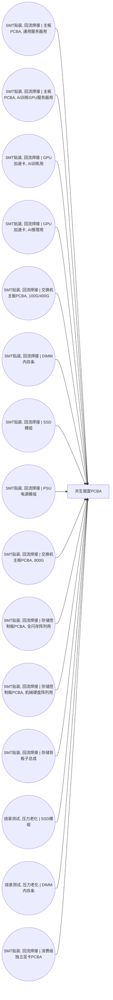

<!-- BODY:START -->
## 定义与产品身份

P031 的冻结身份是 ICT 前景边界中的 `byproduct`，产品子类为“共生报废 PCBA”。〔图谱事实〕 [^internal-graph]

本页把 P031 定义为印制板组件装配或测试过程中被判定为不能按目标合格产品交付、并从生产流程分离的板级报废物流。〔建模判断〕 [^internal-review] IPC-9261A 的适用对象是电子印制板组件的装配过程，并将 DPMO 用于装配中过程步骤而非最终产品判定。[^ku-2d9d20e3e40fd79f]

## 性质与形态

P031 按“报废 PCBA”而不是“报废裸 PCB”交接；是否带有元器件、焊料、三防漆、散热或连接部件，必须按目标批次实测。〔建模判断〕 [^internal-review]

本次证据未能支持一个适用于所有 P031 的固定材料配比；页面因此只定义应采字段，不填入通用金属含量、贵金属含量或危险成分比例。〔证据缺口〕 [^internal-review]

## 参考流与交接边界

P031 的参考流是从具名生产活动分离并交接的报废 PCBA 质量；交接点设在报废判定、称重和分流完成之后，不包含后续拆解、粉碎、分选、冶炼或焚烧处理。〔建模判断〕 [^internal-review]

IPC-9261A 要求把检验或测试点发现的缺陷归属到适当的过程步骤。[^ku-bf4452259fa36967] 因此 P031 的生成活动、发现点和报废判定点必须分别保存，不得仅记录“废板”总量。〔建模判断〕 [^internal-review]

## 规格与相邻节点区分

P031 不等于合格 PCBA、裸印制板边角料、使用后整机电子废物，也不等于已分离的金属或非金属回收料。〔建模判断〕 [^internal-review]

数据集身份至少要同时匹配产生阶段、实装板状态、报废判定、参考单位和地域。〔建模判断〕 [^internal-review] 现有三条 LCA 关联均是处理侧弱关联，不是 P031 生产端参考产品。〔证据缺口〕 [^internal-review]

## 在系统中的角色

冻结名称图中 P031 由十五个 SMT 或测试活动产生，且当前没有 `consumed_by` 连线。〔图谱事实〕 [^internal-graph]

该节点用于把制造损耗从合格产品流中分开，并为后续处理项目保留可追溯的生产起点。〔建模判断〕 [^internal-review] 在名称图添加下游处理活动前，应通过项目数据集绑定记录去向，不得虚构 `CONSUMES` 边。〔建模判断〕 [^internal-review]

## 分类与适用范围

本节点仅适用于 ICT 印制板组件装配或测试阶段的共生报废物流，不将消费者或机构使用后产生的整机电子废物并入。〔建模判断〕 [^internal-review]

《巴塞尔公约》第十六次缔约方大会通过了关于电子电气废物与使用过的电子电气设备跨境转移、并区分废物和非废物的临时技术准则。[^ku-80c1b867f7349dba] 该准则不替代项目所在地的废物属性、危险特性、转移和处理许可判定。〔建模判断〕 [^internal-review]

## 节点特定采集字段

- **身份与批次：**记录产生活动、厂区、产线、日期/班次、工单、板号/版本与批次。〔建模判断〕 [^internal-review]
- **报废判定：**记录发现检验点、归属过程步骤、缺陷类别、复检状态、可修复判定和最终报废原因。〔建模判断〕 [^internal-review]
- **交付物状态：**记录是否实装、已拆除部件、表面处理/焊料体系、三防漆、污染、混料和包装状态。〔建模判断〕 [^internal-review]
- **数量与去向：**记录件数、净质量、秤具和校准、暂存、交接日期、承运/处理方及最终路线。〔建模判断〕 [^internal-review]

## 区域化补充要求

区域化时应分别记录产生场址、废物属性判定、交接去向、处理设施与运输，不得由处理设施所在地反推生产地。〔建模判断〕 [^internal-review]

对中国项目，至少保存厂区所在地、项目期、企业废物代码/内部物料码、属性判定依据、转移联单或同等追溯记录，以及处理设施许可范围。〔建模判断〕 [^internal-review] 法规限值、许可上限和通用废电路板数据不得写成 P031 运行平均值。〔建模判断〕 [^internal-review]

## 数据适用状态与缺口

IPC-9261A 将过程步骤估算良率定义为基于历史缺陷率、预期在特定或组合过程步骤中无缺陷组件的比例。[^ku-9e454e4ae80cca4e] 该定义可支持收集缺陷率和良率的口径，但不能自动转换为 P031 的质量产生率。〔建模判断〕 [^internal-review]

当前证据可支持 P031 的生产阶段身份、缺陷与良率采集字段及分类边界，但未取得 P031 专属的产生量、材料组成、分选状态和生产端单元过程 LCI。〔证据缺口〕 [^internal-review] 因此本页可用于节点识别、边界设计和数据采集，不可直接用于 LCA 计算。〔建模判断〕 [^internal-review]

## 出处

[^internal-graph]: lca-cornerstone ICT 名称图冻结节点、刻面与连线；由图谱确定性提取，不作为外部事实证据。
[^internal-review]: 内部评审与建模约定——仅支持显式标注的系统边界、参考流、采集字段与数据缺口判断，不作为外部事实证据。
[^ku-2d9d20e3e40fd79f]: IPC-9261A，§1.1 Scope；确定性抓取后由无联网权限 Verify Agent 独立核验。
[^ku-bf4452259fa36967]: IPC-9261A，§1.2 Purpose；确定性抓取后由无联网权限 Verify Agent 独立核验。
[^ku-9e454e4ae80cca4e]: IPC-9261A，§1.3.3 Process Step Estimated Yield；确定性抓取后由无联网权限 Verify Agent 独立核验。
[^ku-80c1b867f7349dba]: Basel Convention decision BC-16/5，¶2；确定性抓取后由无联网权限 Verify Agent 独立核验。
<!-- BODY:END -->

## 邻域工序图
> 由 graph edges 确定性派生（图==边，可被 lint 比对）；模型不得增删连线。

## 产品性质与交付状态

<!-- EV:props:START -->
| property | condition | unit | 值 | 源 | pedigree |
|---|---|---|---|---|---|
| 图谱产品类型 | 冻结节点 | — | foreground byproduct | internal-graph | 4,4,4,4,4 |
| 产品子类 | 冻结节点 | — | 共生报废 PCBA | internal-graph | 4,4,4,4,4 |
| 产生阶段 | 装配/测试过程 | — | 过程中报废判定 | ku-2d9d20e3e40fd79f | 4,4,4,4,4 |
| 缺陷归属 | 检验或测试点 | — | 须回溯到适当过程步骤 | ku-bf4452259fa36967 | 4,4,4,4,4 |
| 下游处理 | P031 交接点后 | — | 不属于本产品生产边界 | internal-review | 3,4,4,3,4 |
<!-- EV:props:END -->

## 产品规格与地区参数

<!-- EV:params:START -->
| parameter | geo | unit | basis | 国际值 INT | 国际源 INT | 中国值 CN | 中国源 CN | pedigree |
|---|---|---|---|---|---|---|---|---|
| 产生活动与发现检验点 | target | — | measured_average | 待采 | ku-bf4452259fa36967 | 待采 | 待采 | 待评 |
| 板号、版本与批次 | target | — | measured_average | 待采 | 待采 | 待采 | 待采 | 待评 |
| 报废件数 | target | 件 | measured_average | 待采 | 待采 | 待采 | 待采 | 待评 |
| 报废 PCBA 净质量 | target | kg | measured_average | 待采 | 待采 | 待采 | 待采 | 待评 |
| 生产投入质量 | target | kg | measured_average | 待采 | 待采 | 待采 | 待采 | 待评 |
| 过程步骤估算良率 | target | % | calculated | 待算 | ku-9e454e4ae80cca4e | 待算 | 待采 | 待评 |
| 实装/拆除与混料状态 | target | — | measured_average | 待采 | 待采 | 待采 | 待采 | 待评 |
| 废物属性与转移要求 | target | — | reference | 待采 | ku-80c1b867f7349dba | 待采 | 待采 | 待评 |
| 交接去向与运输距离 | target | km | measured_average | 待采 | 待采 | 待采 | 待采 | 待评 |
<!-- EV:params:END -->

## 数据质量与代表性

<!-- EV:quality:START -->
| field | unit | basis | 中国项目值 CN | 中国源 CN | proxy_policy | pedigree |
|---|---|---|---|---|---|---|
| 工单、板号、版本与批次覆盖 | — | measured_average | 待采 | 待采 | 无批次映射的废板总量不得直接使用 | 待评 |
| 报废判定与过程归属 | — | measured_average | 待采 | 待采 | 仅有发现点不得代替缺陷生成步骤 | 待评 |
| 称重方法、秤具校准与样本数 | — | measured_average | 待采 | 待采 | 件数不得在无单件质量分布时转成总质量 | 待评 |
| 实装、拆除、混料和污染状态 | — | measured_average | 待采 | 待采 | 通用废 PCB 组成不得冒充目标 P031 批次 | 待评 |
| 代表期、班次与产品组合 | — | measured_average | 待采 | 待采 | 先保留分板型/分活动数据，再做透明加权 | 待评 |
| 交接去向、转移与处理记录 | — | measured_average | 待采 | 待采 | 处理侧数据集不得反向充当生产端产生率 | 待评 |
| 材料组成测量和不确定度 | — | measured_average | 待采 | 待采 | 无实测或物料平衡时保留待采 | 待评 |
<!-- EV:quality:END -->

<!-- LCA_ASSOCIATION:START -->
## 🔗 可引用 LCA 数据集与关联

> 已核验关联 3 条：C0=0、C1=3、C2=0、C3=0、C4=0。这些记录用于发现与代理筛选；进入计算前仍须在具体项目中核对边界、许可和版本。

| 强度 | 数据库记录 | 数据库/版本 | 关联对象 | 潜在用途 | 主要限制 | 模型状态 |
|---|---|---|---|---|---|---|
| `C1` · 弱关联 | [废电路板,再生利用，拆解](https://www.hiqlcd.com/dataset/hiqlcd/1.5.0/cut_off/06662f6c-3e2b-49d5-94ed-ecf42f8d18bb) | HiQLCD 1.5.0 | `waste_flow_and_treatment_process` | 弱关联；可进入代理筛选 | 未通过节点特定硬门：product、reference_product、activity、route、boundary、geography、time。中国废电路板再生拆解记录可作为后续处理路线候选；它不是 P031产生端副… | 仅知识关联 · 仍需项目裁决 · 不可直接计算 |
| `C1` · 弱关联 | [废电路板,截断](https://www.hiqlcd.com/dataset/hiqlcd/1.5.0/cut_off/fbbe8ee7-49dd-4c2e-8b02-bf6cacc40950) | HiQLCD 1.5.0 | `waste_flow_and_treatment_process` | 弱关联；可进入代理筛选 | 未通过节点特定硬门：product、reference_product、activity、route、boundary、geography、time。中国废电路板截断记录可用于废物流代理筛选；P031 是 SMT 产生端未… | 仅知识关联 · 仍需项目裁决 · 不可直接计算 |
| `C1` · 弱关联 | [Populated printed wiring board (after ROHS) in waste incineration plant (0% H2O content)](https://lcadatabase.sphera.com/2026/xml-data/processes/73a404c5-24cf-4add-bbbe-f80365d38f50.xml) | Sphera Managed LCA Content 2026.1 | `waste_flow_and_treatment_process` | 弱关联；可进入代理筛选 | 未通过节点特定硬门：treatment_route、boundary、reference_unit、geography。参考输入与 P031 同属报废实装线路板/PCBA，但源记录固定为美国生活垃圾焚烧中的 after-R… | 仅知识关联 · 仍需项目裁决 · 不可直接计算 |

> 关联不等于计算绑定；项目采用分别进入 `model_dataset_bindings.json` 或 `model_proxy_bindings.json`。
<!-- LCA_ASSOCIATION:END -->

<!-- CHANGELOG:START -->
## 修改日志

### 2026-08-03 · P031 v3 research-ready 单节点验收

- **来源路径：**先冻结十二条 claim，再由确定性 Search/Fetch 抓取 IPC-9261A、Basel BC-16/5 和同行评审文献；Verify Agent 使用 `gpt-5.6-sol / medium / read-only`，且无 WebSearch/WebFetch 权限。
- **核验结果：**六条外部断言中四条 `CONFIRMED`、两条 `INSUFFICIENT`；两条图谱事实、三条建模判断和一条证据缺口未进入外部检索。
- **页面升级：**迁移到 Product `wiki-v2`，补齐十个固定正文栏目与 `props / params / quality` 三张证据表，清除所有“未核实·模型回忆”标签。
- **状态边界：**当前为 `draft / research_ready / partial`；可用于节点识别、边界设计和数据采集，但因缺少 P031 专属产生量、组成与单元过程 LCI，不升为 `reviewed`，也不授予计算权。

### 2026-08-03 · 旧 v1 批次记录（已被上方 v3 样本取代）

- **历史结果：** 该旧批次送审断言中有 0 条取得独立支持、9 条证据不足；这不是上方 v3 样本的核验结果。
- **采取的修改：** 已核实断言改挂专属 `ku-*` 引用；证据不足断言移除装饰性旧引用并明确降级。
- **修改原则：** 只修改哈希一致且唯一命中的原文行；不整页重写；不机械处理矛盾；来源注册、正文引用与修改日志同步更新。
- **数据影响：** 本次处理 9 条可安全合并断言；未新增或推断任何 LCI 数值。

### 2026-07-30 · 从“预先强绑定”改为“可引用数据集关联”

- **发现的问题：** 节点 Wiki 的目的，是让后续 LCA 建模快速发现可直接引用或可作代理的数据集；旧栏目只展示正式绑定和 C2，隐藏了具有代理筛选价值的 C1，也把部分真实相邻记录直接归入否决，容易把“关联强弱”误读成“能否立即计算”。
- **采取的修改：** 按冻结的官方/公开证据重新裁决本节点的数据集引用关系，当前展示 3 条关联（C0=0、C1=3、C2=0、C3=0、C4=0），另保留 0 条真正否决；每条同时标记关联对象、潜在用途、主要限制和项目裁决要求。
- **中国源补检：** 本节点新增 2 条 HiQLCD 官方公共元数据关联；已核验稳定 UUID、版本、系统模型、参考产品/单位、地域、时间和公开边界，完整 I/O/LCIA 仍受许可控制。
- **修改原则：** C0–C4 只表示节点—数据集关联强度，不授予计算权限；C1/C2 可进入项目级 P0–P3 代理裁决，C3/C4 也必须在具体模型中核对边界、许可和版本后才形成真正绑定。
<!-- CHANGELOG:END -->
