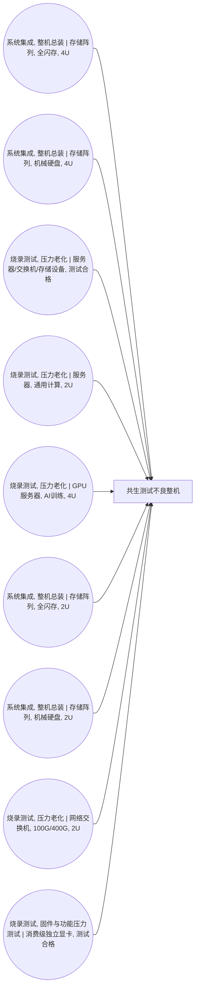

<!-- BODY:START -->
## 定义与产品身份

该节点表示在ICT设备制造测试环节产生的共生测试不良整机，产品子类型为“共生测试不良整机”。 〔未核实·模型回忆〕 [^internal-review]

## 性质与形态

该参考流以完整装配后的不良整机形态交接，而非拆解后的零部件或材料流。 〔未核实·模型回忆〕 [^internal-review]

## 参考流与交接边界

参考流为一个从制造测试相关前景活动输出的共生不良整机，交接边界位于该整机作为活动输出离开测试环节时。 〔未核实·模型回忆〕 [^internal-review]

## 规格与相邻节点区分

本节点按“测试不良整机”这一产品子类型区分于合格整机，并不以计算类型、集成层级或外形规格作为身份区分。 〔未核实·模型回忆〕 [^internal-review]

## 在系统中的角色

该节点是A015、A016、A018、A021、A022、A032、A033、A038和A043的产出物，冻结档案中未声明其被任何活动消耗。 〔未核实·模型回忆〕 [^internal-review]

## 分类与适用范围

该节点适用于ICT设备前景制造系统中的测试不良整机共生输出，不代表特定设备类别、计算类型或形态规格的市场产品。 〔未核实·模型回忆〕 [^internal-review]

## 节点特定采集字段

该节点的证据采集仅允许写入props、params和quality表。 〔未核实·模型回忆〕 [^internal-review]

## 区域化补充要求

区域化时应补充产生该不良整机的制造测试地点或供应链地区，以保持其前景活动关联的地域可追溯性。 〔未核实·模型回忆〕 [^internal-review]

## 数据适用状态与缺口

该节点当前没有已验证来源引用，且没有LCA关联记录，因此其具体产品范围、测试失效原因和后续处置路径仍需补充证据。 〔未核实·模型回忆〕 [^internal-review]

## 出处

[^internal-review]: 内部评审与建模约定——仅支持显式标注的系统边界、参考流、采集字段与数据缺口判断，不作为外部事实证据。
<!-- BODY:END -->

## 邻域工序图
> 由 graph edges 确定性派生（图==边，可被 lint 比对）；模型不得增删连线。

## 🔒 数量（待挂 · NOT POPULATED）
> 本节为占位。输入流 / 输出流 / 参考单位的结构在此预留，数值由实测/权威库挂入，**LLM 不得填写**（数量防火墙）。

| 流 | 方向 | 单位 | 值 | 源 |
|---|---|---|---|---|
| (待挂) | — | — | — | — |

<!-- LCA_ASSOCIATION:START -->
## 🔗 可引用 LCA 数据集与关联

> **本轮暂无经过语义裁决的可引用数据集。** 这不表示全球不存在数据；应继续处理逐来源检索矩阵中的待裁决、未执行和受阻记录。

- 节点策略：`composed_via_activity` — 经图内生产活动和上游输入组合；产品页关联用于发现，不代表整条聚合过程可直接导入。
- 检索审计：候选 0 条，明确否决 0 条。
<!-- LCA_ASSOCIATION:END -->

<!-- CHANGELOG:START -->
## 修改日志

### 2026-08-03 · 断言级溯源受控合并

- **发现的问题：** 本次送审断言中有 0 条取得独立支持、9 条证据不足；另有 0 条因冲突、共享引用或锚点不唯一未自动修改。
- **采取的修改：** 已核实断言改挂专属 `ku-*` 引用；证据不足断言移除装饰性旧引用并明确降级。
- **修改原则：** 只修改哈希一致且唯一命中的原文行；不整页重写；不机械处理矛盾；来源注册、正文引用与修改日志同步更新。
- **数据影响：** 本次处理 9 条可安全合并断言；未新增或推断任何 LCI 数值。

### 2026-07-30 · 从“预先强绑定”改为“可引用数据集关联”

- **发现的问题：** 节点 Wiki 的目的，是让后续 LCA 建模快速发现可直接引用或可作代理的数据集；旧栏目只展示正式绑定和 C2，隐藏了具有代理筛选价值的 C1，也把部分真实相邻记录直接归入否决，容易把“关联强弱”误读成“能否立即计算”。
- **采取的修改：** 按冻结的官方/公开证据重新裁决本节点的数据集引用关系，当前展示 0 条关联（C0=0、C1=0、C2=0、C3=0、C4=0），另保留 0 条真正否决；每条同时标记关联对象、潜在用途、主要限制和项目裁决要求。
- **修改原则：** C0–C4 只表示节点—数据集关联强度，不授予计算权限；C1/C2 可进入项目级 P0–P3 代理裁决，C3/C4 也必须在具体模型中核对边界、许可和版本后才形成真正绑定。
<!-- CHANGELOG:END -->
