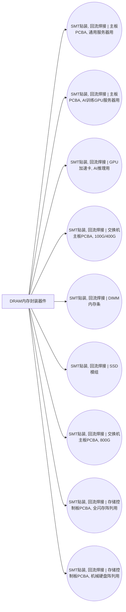

<!-- BODY:START -->
## 定义与产品身份

P040 表示进入 ICT 板级装联活动的通用 DRAM 内存封装器件，即带有外部可焊接端子的离散存储 IC，而不是裸晶粒、晶圆或装有多颗器件的内存模组。Samsung 将 DRAM chip 说明为单个半导体器件，并将 DRAM module 说明为把多颗 DRAM chip 组装到电路板后的产品。[^ku-samsung-ddr-dram-components]

P040 是 ICT 图中的背景产品引用，没有 ICT 侧生产活动；它通过 Exact 跨行业绑定解析到 electronics::P011“封装器件, DRAM, 通用内存用”，母行业生产活动为 electronics::A012。[^ku-ict-p040-spine] DRAM 晶圆制造、封装、测试的投入、能源、排放和良率应由 electronics 母行业活动维护，ICT 页只保存产品身份、交接、规格和代表性。

## 性质与形态

P040 的物理形态是固态、离散、可表面贴装的模塑半导体封装件。当前 DDR4/DDR5 厂商产品页列出的通用封装示例为 FBGA；封装外部以焊球与 PCB 连接，但封装尺寸、焊球数量、晶粒数量和材料组成会随代际、容量与具体料号变化。[^ku-samsung-ddr-dram-components]

中国公开项目也披露了 DRAM Package 采用 FBGA 封装并进入后续测试，工序包括减薄、划片、粘片、引线、EMC 塑封、植球和切割。[^ku-cn-chongqing-dram-fbga-eia-2024] 该项目证据只能证明一种中国封测路线及其采集字段，不能把该路线无条件外推到所有 DRAM 产品，也不能代替目标料号的质量和组成数据。

## 参考流与交接边界

P040 的首选参考流是一件满足目标料号出货判定的 DRAM 封装器件，交接点为封测厂成品库出库或 ICT 装联厂来料接收。中国项目公开的测试边界包括温度/压力筛选、电气与速度测试、分类、标识、外观检查和包装入库。[^ku-cn-chongqing-dram-fbga-eia-2024] 因此用于板级 SMT 的 P040 应记录测试合格与分档状态，不能把未测试封装体直接当成相同参考产品。

母行业图目前将封装及其生产负担集中在 A012，没有单列 DRAM 成品测试活动。建立数值数据集时必须确认目标 A012 数据是否已经包含出货测试；若不包含，应在 electronics 图中补建测试活动和测试前/测试后产品节点，避免漏算或重复计算。〔建模判断〕

质量口径数据集应同时保存 `piece` 与 `kg` 的换算关系；换算只能来自目标料号的实测单件净质量和样本覆盖，不得用 DIMM、SSD、主板或整机质量倒推。

## 规格与相邻节点区分

P040 的身份范围是服务器、计算、网络和存储设备所用的通用 DDR 类 DRAM 封装器件。代际、容量、位宽组织、速度等级、工作电压、温度等级、封装代码和焊球数量是配置字段，不在本节点层面预设为单一固定值。Samsung 的 DDR5 产品族示例列出最高 32 Gb、x8/x16、1.1 V 以及 78/82/102/106 FBGA；这些只能作为字段与数量级校验，不能作为跨厂商平均值。[^ku-samsung-ddr-dram-components]

- **与 P026 DIMM 内存条区分：**P040 是单颗离散 DRAM 封装器件；P026 是多颗 DRAM 器件及 PCB、寄存/缓冲和其他元件组成的模组。[^ku-samsung-ddr-dram-components]
- **与 P042 HBM 区分：**HBM 使用多层 DRAM 晶粒、TSV 和微凸点形成专用三维堆叠体，不属于 P040 的普通 DRAM 封装边界。 〔未核实·模型回忆〕
- **与 P068 GDDR 显存区分：**GDDR 是面向图形和加速器高带宽传输的专用 DRAM 产品族，具有不同的接口、速度和封装配置，应使用 P068，不并入 P040。 〔未核实·模型回忆〕
- **与 P041 NAND 区分：**NAND 是非易失存储器；即使与 DRAM 使用相似 FBGA 外形，也不能因封装形式相同而合并。〔建模判断〕
- **与裸晶粒区分：**尚未完成封装、外部互连和出货测试的 DRAM die 属于 electronics 上游产品，不是 ICT 装联活动接收的 P040。

LPDDR、MCP/PoP、多晶粒 3DS DRAM 等产品若在目标 BOM 中具有不同封装结构或功能边界，应按目标研究分辨率单独配置或新增节点，不得仅凭“DRAM”名称自动并入本节点。〔建模判断〕

## 在系统中的角色

P040 在当前 ICT 图中被九个 SMT 活动消费，包括 DIMM、服务器主板、交换机主板、GPU 推理加速卡、SSD 和存储控制板。[^ku-ict-p040-spine] 其中只有目标产品确实采用板载 DRAM 时，主板、加速卡、SSD 或控制板活动才应直接消费 P040。

标准 DIMM 路线应由 A006 消费 P040 并产出 P026，再由下游整机装配活动消费 P026。若同一产品系统已经输入 P026，就不得再次把组成该 DIMM 的 P040 直接计入主板或整机；A001、A002 和 A004 等现有直连边必须在具体 BOM 映射时按板载内存、独立 DIMM 或专用显存路线裁决。〔建模判断〕

## 分类与适用范围

P040 的 CPC 471 与 HS 8542.32 只把它定位在集成电路/存储器宽类，不能表达 DDR 代际、封装类型、容量、测试状态和应用场景。相同分类码下的 NAND、GDDR、HBM、LPDDR 与通用 DDR DRAM 不能因此共用一个精确产品流。〔建模判断〕

本节点适用于作为离散、可贴装、出货合格的通用 DRAM 封装器件进入 ICT 制造的场景；不适用于 DRAM 晶圆或裸晶、DIMM 模组、HBM stack、GDDR 显存、NAND 闪存、MCP/PoP 复合存储封装以及已经焊接到 PCB 的组件。

## 节点特定采集字段

- **产品配置：**记录厂商、完整料号、DDR 代际、容量/密度、位宽组织、速度等级、额定电压、温度等级、封装代码、焊球数量和封装尺寸。
- **交接状态：**记录出货测试与分档状态、交接地点、包装单元、防潮等级/烘烤状态、批次号、生产日期码和来料检验状态。
- **产品组成：**记录单件净质量、晶粒数量，以及硅、封装基板/引线框架、键合丝、焊球、EMC、粘接剂等可取得的质量组成。
- **产品代表性：**记录晶圆厂、封装厂、测试厂、代表期、料号组合、批次与样本覆盖、单件质量统计方法和不确定度。

晶圆制造的化学品、气体、超纯水、设备电力和晶圆良率属于 electronics 晶圆制造活动；减薄、划片、粘片、键合、塑封、植球的材料、能源和废物流属于 electronics 封装活动；测试功率、测试时长、温度程序、合格率与不良品去向属于 electronics 测试活动。P040 产品页不重复保存或分配这些活动清单。

## 区域化补充要求

### CN 中国

以下要求用于把通用 P040 产品身份落到中国区域数据集，不改变 DRAM 的全球通用定义。〔建模判断〕

- **生产地域判定：**分别记录晶圆制造、封装和测试发生地；在中国装入 DIMM、主板或 SSD 不等于 DRAM 晶圆与封测均发生在中国。
- **中国产品组合：**按目标研究期实际 BOM 保存供应商、料号、DDR 代际、容量、封装和采购数量；单一厂商产品族规格不得直接外推为中国市场平均。
- **中国来源优先级：**优先使用目标企业采购 BOM、来料检验、封测批次/MES、成品测试、包装交接和质量称量记录；政府环评、验收和排污许可用于核对工艺边界与场址环境流，不能自动替代产品分配后的单位 LCI。
- **混线分配：**中国公开 FBGA 项目同时生产 DRAM Package 和 NAND Package；若现场台账不能按产品、料号或批次拆分物料、能源、排放与废物，不得把装置总量直接归给 P040。[^ku-cn-chongqing-dram-fbga-eia-2024]
- **背景系统区域化：**各母行业活动按实际发生地选择电力、公用工程、电子化学品运输和废物处理背景；境外晶圆制造或封测环节保持原生产地背景。
- **数值状态：**中国来源不等于中国实测；实测、计算、定义、产品族规格、代理和待采必须分别标记，法规限值、许可量与厂商性能规格不得冒充运行平均值。

其他地区应在同一“区域化补充要求”下新增地区小节，通用节点字段保持不变。〔建模判断〕

## 数据适用状态与缺口

厂商资料足以核验 DRAM 单颗器件与 DIMM 模组的产品边界，并提供 DDR4/DDR5 容量、组织、工作电压和 FBGA 等产品族规格。[^ku-samsung-ddr-dram-components] 中国政府公开项目足以核验一种 DRAM/NAND FBGA 封装与测试路线及其产污环节。[^ku-cn-chongqing-dram-fbga-eia-2024]

这些来源仍不足以直接生成 P040 的可复算中国区 LCI：

- 中国项目为 DRAM 与 NAND 混线披露，公开文本未给出目标料号的单件质量、材料组成、产品分配后能耗、测试电耗、良率和单位排放。
- 台湾 DRAM LCA 研究聚焦 DRAM 制造阶段，并明确排除了硅晶圆生产、DRAM 组装封装、运输、使用和处置，不能直接代表“测试合格封装器件”的 cradle-to-gate 清单。 〔未核实·模型回忆〕
- Samsung 披露的半导体 PCF 方法覆盖原材料、芯片制造、组装与测试，并包括 DRAM 产品，但公开页面没有给出可供本节点复算的单位过程 LCI。 〔未核实·模型回忆〕
- electronics::A012 当前挂接的背景数据集为 `market for multi-Si wafer` 且等级为 weak，它不是 DRAM 引线键合/FBGA 封装的同物同工艺数据集，不能据此宣称 P040 已具有可用 LCI。〔建模判断〕

因此本页已经具备产品识别、系统边界、跨行业归属、数据源作用和完整采集字段，但 `dataset_readiness` 仍为 `blocked`；目标料号 BOM/称量、晶圆与封测场址、批次良率以及产品分配后的物料、能源和排放数据仍需取得。

## 出处

[^ku-ict-p040-spine]: lca-cornerstone ICT Equipment Name Graph — P040 及全部相邻边，仓库权威图，已定向核验。
[^ku-samsung-ddr-dram-components]: Samsung Semiconductor，DDR DRAM Components 官方产品页，已核对 DDR 器件、模组差异和产品族规格。
[^ku-cn-chongqing-dram-fbga-eia-2024]: 重庆高新区政府公开环境影响报告表，pp.40–42，已核对 DRAM/NAND FBGA 封装与测试原文。
<!-- BODY:END -->

## 邻域工序图
> 由 graph edges 确定性派生（图==边，可被 lint 比对）；模型不得增删连线。

## 🔒 数量（待挂 · NOT POPULATED）
> 本节为占位。输入流 / 输出流 / 参考单位的结构在此预留，数值由实测/权威库挂入，**LLM 不得填写**（数量防火墙）。

| 流 | 方向 | 单位 | 值 | 源 |
|---|---|---|---|---|
| (待挂) | — | — | — | — |

<!-- LCA_ASSOCIATION:START -->
## 🔗 可引用 LCA 数据集与关联

> 已核验关联 6 条：C0=0、C1=6、C2=0、C3=0、C4=0。这些记录用于发现与代理筛选；进入计算前仍须在具体项目中核对边界、许可和版本。

| 强度 | 数据库记录 | 数据库/版本 | 关联对象 | 潜在用途 | 主要限制 | 模型状态 |
|---|---|---|---|---|---|---|
| `C1` · 弱关联 | [DRAM, GLO](https://sumpo.or.jp/consulting/lca/idea/din2eh00000001km-att/AIST-IDEAv34_Ja_sample.xlsx) | AIST-IDEA 3.4 public sample | `reference_product_and_producer_process` | 弱关联；可进入代理筛选 | 未通过节点特定硬门：package、boundary、geography。IDEA DRAM 记录与产品族相符，但公开样本没有封装、测试、制程节点和系统边界元数据；JPN/GLO 版本均不足以形成正式绑定。 | 仅知识关联 · 仍需项目裁决 · 不可直接计算 |
| `C1` · 弱关联 | [DRAM, JPN](https://sumpo.or.jp/consulting/lca/idea/din2eh00000001km-att/AIST-IDEAv34_Ja_sample.xlsx) | AIST-IDEA 3.4 public sample | `reference_product_and_producer_process` | 弱关联；可进入代理筛选 | 未通过节点特定硬门：package、boundary、geography。IDEA DRAM 记录与产品族相符，但公开样本没有封装、测试、制程节点和系统边界元数据；JPN/GLO 版本均不足以形成正式绑定。 | 仅知识关联 · 仍需项目裁决 · 不可直接计算 |
| `C1` · 弱关联 | [integrated circuit production, memory type](https://ecoquery.ecoinvent.org/3.12/cutoff/dataset/9290/documentation) | ecoinvent 3.12 | `reference_product_and_producer_process` | 弱关联；可进入代理筛选 | 未通过节点特定硬门：reference_product、memory_technology、geography。官方产品说明覆盖封装的 memory-type IC，但未证明具体 DRAM 代际、封装测试边界及中国代表性。 | 仅知识关联 · 仍需项目裁决 · 不可直接计算 |
| `C1` · 弱关联 | [集成电路](https://www.hiqlcd.com/dataset/hiqlcd/1.5.0/cut_off/3a909d8e-a8be-4f90-9b7e-98f53b1c8226) | HiQLCD 1.5.0 | `reference_product` | 弱关联；可进入代理筛选 | 未通过节点特定硬门：product、reference_product、activity、route、boundary、geography、time。中国通用集成电路记录真实覆盖分离、封装、键合、电镀和测试，但未区分 CP… | 仅知识关联 · 仍需项目裁决 · 不可直接计算 |
| `C1` · 弱关联 | [IC BGA 78 (446 mg) 8x10 mm 1GB DDR4 RAM (57 nm node)](https://lcadatabase.sphera.com/2026/xml-data/processes/3ce14a7f-1285-46c5-8c76-68a8315931b1.xml) | Sphera Managed LCA Content 2026.1 | `reference_product_and_producer_process` | 弱关联；可进入代理筛选 | 未通过节点特定硬门：package、technology_node、geography。记录明确为 1 GB DDR4 BGA DRAM，但 57 nm 制程、容量和特定封装已经形成强技术年代限制，且不能代表当前通用 DR… | 仅知识关联 · 仍需项目裁决 · 不可直接计算 |
| `C1` · 弱关联 | [IC WLP CSP 425 (4.78g) 19x19x1.5mm DRAM (57 nm node)](https://lcadatabase.sphera.com/2026/xml-data/processes/62a02998-bae3-4bb2-a955-e3b65fc6147b.xml) | Sphera Managed LCA Content 2026.1 | `reference_product_and_producer_process` | 弱关联；可进入代理筛选 | 未通过节点特定硬门：package、technology_node、geography。记录明确为封装 DRAM，但属于 57 nm、特定 WLP/CSP 和全球平均路线；可作技术年代受限候选，不能代表当前通用 DRAM … | 仅知识关联 · 仍需项目裁决 · 不可直接计算 |

> 关联不等于计算绑定；项目采用分别进入 `model_dataset_bindings.json` 或 `model_proxy_bindings.json`。
<!-- LCA_ASSOCIATION:END -->

<!-- CHANGELOG:START -->
## 修改日志

### 2026-08-03 · 断言级溯源受控合并

- **发现的问题：** 本次送审断言中有 0 条取得独立支持、4 条证据不足；另有 25 条因冲突、共享引用或锚点不唯一未自动修改。
- **采取的修改：** 已核实断言改挂专属 `ku-*` 引用；证据不足断言移除装饰性旧引用并明确降级。 未决项保留在合并计划的 `manual_review` 中。
- **修改原则：** 只修改哈希一致且唯一命中的原文行；不整页重写；不机械处理矛盾；来源注册、正文引用与修改日志同步更新。
- **数据影响：** 本次处理 4 条可安全合并断言；未新增或推断任何 LCI 数值。

### 2026-07-30 · 从“预先强绑定”改为“可引用数据集关联”

- **发现的问题：** 节点 Wiki 的目的，是让后续 LCA 建模快速发现可直接引用或可作代理的数据集；旧栏目只展示正式绑定和 C2，隐藏了具有代理筛选价值的 C1，也把部分真实相邻记录直接归入否决，容易把“关联强弱”误读成“能否立即计算”。
- **采取的修改：** 按冻结的官方/公开证据重新裁决本节点的数据集引用关系，当前展示 6 条关联（C0=0、C1=6、C2=0、C3=0、C4=0），另保留 0 条真正否决；每条同时标记关联对象、潜在用途、主要限制和项目裁决要求。
- **中国源补检：** 本节点新增 1 条 HiQLCD 官方公共元数据关联；已核验稳定 UUID、版本、系统模型、参考产品/单位、地域、时间和公开边界，完整 I/O/LCIA 仍受许可控制。
- **修改原则：** C0–C4 只表示节点—数据集关联强度，不授予计算权限；C1/C2 可进入项目级 P0–P3 代理裁决，C3/C4 也必须在具体模型中核对边界、许可和版本后才形成真正绑定。
<!-- CHANGELOG:END -->
