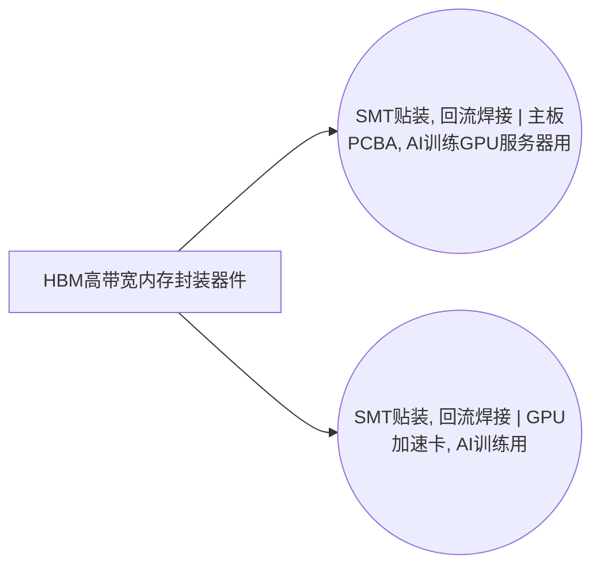

<!-- BODY:START -->
## 定义与产品身份

P042 表示可作为 GPU 加速卡或先进封装系统输入的 HBM 高带宽内存封装器件。Micron 将 HBM 定义为 3D 堆叠 SDRAM 架构：多层 DRAM 晶粒通过 TSV 和微凸点互连，并可堆叠在可选 base die 上。[^ku-micron-hbm-architecture] 因此它不是普通单芯片 DRAM 封装，也不能精确映射到引线框架/引线键合存储 IC。

P042 是 ICT 图中的背景产品引用，母行业精确解析到 electronics 图的“HBM高带宽内存封装器件, 测试合格”。ICT 页面不重复维护 HBM 晶圆制造、堆叠封装和测试活动的过程清单；产品生产负担由母行业节点及其活动链提供。

## 性质与形态

HBM 是由多层 DRAM 晶粒形成的三维堆叠存储封装，晶粒之间通过 TSV 和微凸点实现垂直互连；部分产品还包含独立 base die。[^ku-micron-hbm-architecture] 其交付形态是离散的测试合格堆叠封装器件，而不是液态、散装材料，也不是已经与 GPU、硅中介层或封装基板集成的完整加速器封装。

HBM 代际、堆叠层数、base die 配置、晶粒尺寸和数量、封装尺寸与单件质量都会改变产品的材料组成和上游制造负担。因此 P042 只定义产品类别与交付状态；具体数据集必须绑定目标型号和批次配置，不能把不同代际无条件合并。

## 参考流与交接边界

P042 的参考流是 ICT 制造活动接收的一件测试合格 HBM stack。Micron HBM2E 白皮书把交付形态描述为 `KGSD (known good stacked die)`，说明 HBM 堆叠体已经完成制造商规定的出货前测试。[^ku-micron-hbm2e-kgsd]

该交接状态不表示已经完成与 GPU/CPU、硅中介层和封装基板的 CoWoS/SiP 集成，也不表示已经通过板卡或服务器整机资格认证。TSMC 将 CoWoS 描述为在中介层上集成 logic chiplets 与 HBM stacks；因此该集成步骤属于 P042 的下游消费边界。[^ku-tsmc-cowos-hbm-boundary]

## 规格与相邻节点区分

P042 与普通 DRAM 封装器件的区别在于 HBM 的宽接口三维堆叠结构、TSV/微凸点互连以及测试合格堆叠体交付状态。P042 也不等于 electronics 图中的“HBM堆叠封装体, 未测试”：未测试堆叠体尚需经过 HBM 晶圆级/封装级测试，只有测试合格输出才对应 P042 的母行业产品。

P042 还不等于完成 GPU、中介层、封装基板或整卡装联的组件。TSMC 的 CoWoS 边界表明 HBM stack 是进入后续先进封装集成的输入，而不是该集成系统本身。[^ku-tsmc-cowos-hbm-boundary]

## 在系统中的角色

P042 在 ICT 图中作为外购背景产品，被 GPU 加速卡和 AI 训练服务器相关装联活动消费。其母行业上游依次包括 HBM 专用 DRAM 晶圆制造、TSV/微凸点堆叠封装和 HBM 测试；这些过程的投入、能源、排放、良率和不合格品统一由 electronics 活动节点维护。

当前名称图还将 P042 连接到 A002 主板 PCBA 与 A003 GPU 加速卡 PCBA。A003 是明确的板级消费位置；A002 是否代表包含 HBM 的 GPU baseboard/HGX 类主板，需要在具体数据集配置中核实。普通服务器主板数据集不得默认消费 P042。〔建模判断〕

## 分类与适用范围

P042 的 CPC 与 HS 映射用于把它定位到集成电路/存储器件宽类，但分类码不能表达 HBM 的堆叠层数、TSV 状态和交付测试状态。相同分类码下的普通 DRAM、NAND 和 HBM 不能因此共用同一个精确产品流。〔建模判断〕

P042 适用于作为独立、测试合格 HBM stack 进入先进封装或板卡制造的场景；不适用于未测试堆叠体、普通 DRAM 封装、GDDR 器件、含 GPU 的完整先进封装或整张加速卡。

## 节点特定采集字段

- **产品配置：**记录厂商、型号、HBM 代际、容量、堆叠层数、base die 状态、DRAM 晶粒数量和封装尺寸。
- **交接状态：**记录 KGSD/测试合格判定、交接地点、包装状态、单位计量方式和批次追溯。
- **产品组成：**记录单件净质量以及硅、铜互连、微凸点、底填/模塑料等可取得的材料组成。
- **产品代表性：**记录目标场址、代表期、批次覆盖、质量测量方法、型号混合规则和不确定度。

测试功率、测试时长、合格率和不合格品去向属于母行业的 HBM 测试活动；TSV/微凸点材料、公用工程、封装良率和废物流属于母行业的先进封装活动。P042 产品页只保存产品身份、规格、交接和产品级代表性。

## 区域化补充要求

### CN 中国

以下要求只用于把通用 P042 产品身份落到中国区域数据集，不改变 HBM 的全球通用产品定义。〔建模判断〕

- **生产地域判定：**区分中国境内制造、境外制造后进口以及中国境内仅完成下游装联的情景；不能因为产品在中国使用就把境外 HBM 制造负担改标为中国生产。
- **中国产品组合：**记录目标研究期内中国项目实际采用的厂商、代际、容量和堆叠配置；单一公开型号不能直接外推为中国市场平均。
- **中国来源优先级：**优先取得目标企业的产品 BOM、批次/MES、质量检测和交接记录；公开厂商资料、项目文件或论文只能按其实际场址、技术和时期作为独立证据场景。
- **背景系统区域化：**只有母行业活动确实发生在中国时，才替换为中国电力、公用工程、电子化学品运输和废物处理背景；境外生产环节保持原生产地背景。
- **数值状态：**中国来源不自动等于中国实测；实测、计算、定义、代理和待采必须分别标记，法规限值与产品规格不得冒充运行平均值。

其他区域应在同一“区域化补充要求”下新增相应地区小节，不修改上面的通用节点特定字段。〔建模判断〕

## 数据适用状态与缺口

厂商资料足以核验 HBM 的三维堆叠身份、TSV/微凸点互连和 KGSD 交付边界。[^ku-micron-hbm-architecture][^ku-micron-hbm2e-kgsd] 当前公开证据审计未取得可复算的 HBM 专属单元过程 LCI，也未取得中国 HBM 装置按产品分摊的物料、能源和排放清单。[^ku-hbm-public-lci-gap]

本页可以支持产品识别、系统边界和采集字段设计，但不能直接生成中国 HBM 产品清单。普通 DRAM 引线键合封装、一般存储 IC 数据、整张 GPU 卡产品碳足迹和法规限值均不得冒充 P042 的实测产品数据。

## 出处

[^ku-micron-hbm-architecture]: Micron High Bandwidth Memory (HBM)，Micron 官方技术页，已独立核验。
[^ku-micron-hbm2e-kgsd]: *Integrating and Operating HBM2E Memory*，Micron 官方白皮书，pp.1–2、13，已独立核验。
[^ku-tsmc-cowos-hbm-boundary]: TSMC CoWoS 官方技术页，已独立核验；上下游切分为建模判断。
[^ku-hbm-public-lci-gap]: HBM 公开 LCI 证据审计；结论为 INSUFFICIENT。
<!-- BODY:END -->

## 邻域工序图
> 由 graph edges 确定性派生（图==边，可被 lint 比对）；模型不得增删连线。

## 产品性质与交付状态

> 产品页只记录“交付的是什么”。以下定性值来自已经核验的厂商原文；活动级投入、能源、排放、良率和废物留在 electronics 母行业生产活动。

<!-- EV:props:START -->
| property | condition | unit | 值 | 源 | pedigree |
|---|---|---|---|---|---|
| 存储架构 | 产品身份 | — | 3D-stacked SDRAM | ku-micron-hbm-architecture | 4,4,4,4,4 |
| 垂直互连 | 堆叠结构 | — | TSV 与 microbumps | ku-micron-hbm-architecture | 4,4,4,4,4 |
| base die 配置 | 产品配置 | — | 可选，须按目标型号记录 | ku-micron-hbm-architecture | 4,4,4,4,4 |
| 交付测试状态 | ICT 接收点 | — | KGSD，测试合格堆叠体 | ku-micron-hbm2e-kgsd | 4,4,4,4,4 |
| 下游集成排除项 | ICT 接收点 | — | 不含 logic chiplet、中介层及 CoWoS/SiP 集成 | ku-tsmc-cowos-hbm-boundary | 4,4,4,4,4 |
<!-- EV:props:END -->

## 产品规格与地区参数

> 公开资料目前只够定义应采字段，不能把某一厂商代际或普通 DRAM 规格填成 P042 的通用代表值。

<!-- EV:params:START -->
| parameter | geo | unit | basis | 国际值 INT | 国际源 INT | 中国值 CN | 中国源 CN | pedigree |
|---|---|---|---|---|---|---|---|---|
| 厂商与完整型号 | target | — | measured_average | 待采 | ku-micron-hbm-architecture | 待采 | 待采 | 待评 |
| HBM 代际与接口版本 | target | — | standard_spec | 待采 | ku-micron-hbm-architecture | 待采 | 待采 | 待评 |
| 标称容量 | target | GB/件 | standard_spec | 待采 | 待采 | 待采 | 待采 | 待评 |
| 堆叠层数及 DRAM 晶粒数 | target | 层, 件/件 | standard_spec | 待采 | ku-micron-hbm-architecture | 待采 | 待采 | 待评 |
| base die 状态 | target | — | standard_spec | 待采 | ku-micron-hbm-architecture | 待采 | 待采 | 待评 |
| 封装外形尺寸 | target | mm | measured_average | 待采 | 待采 | 待采 | 待采 | 待评 |
| 单件净质量 | target | g/件 | measured_average | 待采 | 待采 | 待采 | 待采 | 待评 |
| 包装及交接地点 | target | — | measured_average | 待采 | 待采 | 待采 | 待采 | 待评 |
<!-- EV:params:END -->

## 数据质量与代表性

<!-- EV:quality:START -->
| field | unit | basis | 中国项目值 CN | 中国源 CN | proxy_policy | pedigree |
|---|---|---|---|---|---|---|
| 目标厂商、型号与 HBM 代际覆盖 | — | measured_average | 待采 | 待采 | 禁止以通用 memory IC 或普通 DRAM 型号替代 | 待评 |
| 代表期与批次覆盖 | — | measured_average | 待采 | 待采 | 公开单一型号不得外推为中国市场平均 | 待评 |
| 单件质量测量方法与样本数 | — | measured_average | 待采 | 待采 | 厂商规格上限不得冒充批次平均质量 | 待评 |
| KGSD 判定及测试交接记录 | — | measured_average | 待采 | 待采 | 未测试堆叠体不得映射到本产品 | 待评 |
| 型号混合、统计方法与不确定度 | — | calculated | 待算 | 待采 | 先保存分型号数据，再形成透明的质量加权组合 | 待评 |
| 母行业数据集版本与生产地域 | — | reference | 待采 | 待采 | 仅在真实生产发生于中国时采用中国制造背景 | 待评 |
<!-- EV:quality:END -->

<!-- LCA_ASSOCIATION:START -->
## 🔗 可引用 LCA 数据集与关联

> 已核验关联 3 条：C0=0、C1=3、C2=0、C3=0、C4=0。这些记录用于发现与代理筛选；进入计算前仍须在具体项目中核对边界、许可和版本。

| 强度 | 数据库记录 | 数据库/版本 | 关联对象 | 潜在用途 | 主要限制 | 模型状态 |
|---|---|---|---|---|---|---|
| `C1` · 弱关联 | [integrated circuit production, memory type](https://ecoquery.ecoinvent.org/3.12/cutoff/dataset/9290/documentation) | ecoinvent 3.12 | `reference_product_and_producer_process` | 弱关联；可进入代理筛选 | 未通过节点特定硬门：reference_product、memory_technology、package_route、test_state、geography。通用 memory-type IC 与目标 NAND/HBM… | 仅知识关联 · 仍需项目裁决 · 不可直接计算 |
| `C1` · 弱关联 | [集成电路](https://www.hiqlcd.com/dataset/hiqlcd/1.5.0/cut_off/3a909d8e-a8be-4f90-9b7e-98f53b1c8226) | HiQLCD 1.5.0 | `reference_product` | 弱关联；可进入代理筛选 | 未通过节点特定硬门：product、reference_product、activity、route、boundary、geography、time。中国通用集成电路记录真实覆盖分离、封装、键合、电镀和测试，但未区分 CP… | 仅知识关联 · 仍需项目裁决 · 不可直接计算 |
| `C1` · 弱关联 | [IC WLP CSP 425 (4.78g) 19x19x1.5mm DRAM (57 nm node)](https://lcadatabase.sphera.com/2026/xml-data/processes/62a02998-bae3-4bb2-a955-e3b65fc6147b.xml) | Sphera Managed LCA Content 2026.1 | `reference_product_and_producer_process` | 弱关联；可进入代理筛选 | 未通过节点特定硬门：reference_product、hbm_identity、stacking_route、package_boundary、geography。单颗 WLP/CSP DRAM 与 HBM 同属 DRA… | 仅知识关联 · 仍需项目裁决 · 不可直接计算 |

> 关联不等于计算绑定；项目采用分别进入 `model_dataset_bindings.json` 或 `model_proxy_bindings.json`。
<!-- LCA_ASSOCIATION:END -->

<!-- CHANGELOG:START -->
## 修改日志

### 2026-07-30 · 迁移到 Product wiki-v2 并修复来源展示

- **发现的问题：** 页面虽标为 `reviewed`，但没有 Product 规定的 `props / params / quality` 三类证据表；正文实际使用的 Micron、TSMC 与公开 LCI 审计来源也没有同步进入 frontmatter，导致页面“引用原文与核验记录”只显示无关的通用来源。
- **采取的修改：** 按固定 Product 结构保留十个正文栏目，新增产品性质、规格参数和数据质量三表；`provenance_refs` 改为正文与证据表实际使用的四个来源；把结构、来源、断言核验、数量和 LCI 就绪状态拆开显示。
- **状态处理：** 当前结构已合规，四个来源已经过来源级核验，但尚未形成覆盖整页全部外部断言的冻结逐条裁决，因此诚实降为 `draft / claim_verification_status: partial`；未取得的 HBM 专属 LCI 继续标为 blocked。
- **修改原则：** 产品页只描述产品身份、规格、交接与代表性；晶圆制造、TSV/微凸点封装和测试活动的投入、能源、排放、良率及废物不得复制到 P042。没有同产品、同边界和同地域的证据时保留“待采”，不以普通 DRAM、通用集成电路或整卡 PCF 冒充。

### 2026-07-30 · 从“预先强绑定”改为“可引用数据集关联”

- **发现的问题：** 节点 Wiki 的目的，是让后续 LCA 建模快速发现可直接引用或可作代理的数据集；旧栏目只展示正式绑定和 C2，隐藏了具有代理筛选价值的 C1，也把部分真实相邻记录直接归入否决，容易把“关联强弱”误读成“能否立即计算”。
- **采取的修改：** 按冻结的官方/公开证据重新裁决本节点的数据集引用关系，当前展示 3 条关联（C0=0、C1=3、C2=0、C3=0、C4=0），另保留 0 条真正否决；每条同时标记关联对象、潜在用途、主要限制和项目裁决要求。
- **中国源补检：** 本节点新增 1 条 HiQLCD 官方公共元数据关联；已核验稳定 UUID、版本、系统模型、参考产品/单位、地域、时间和公开边界，完整 I/O/LCIA 仍受许可控制。
- **修改原则：** C0–C4 只表示节点—数据集关联强度，不授予计算权限；C1/C2 可进入项目级 P0–P3 代理裁决，C3/C4 也必须在具体模型中核对边界、许可和版本后才形成真正绑定。
<!-- CHANGELOG:END -->
