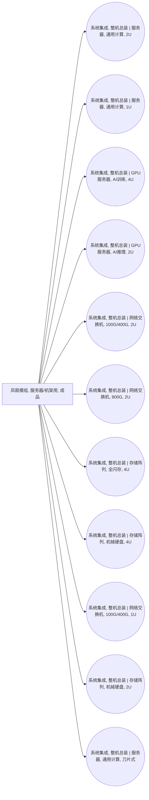

<!-- BODY:START -->
## 定义与产品身份

该节点表示用于服务器或机架设备的成品风扇模组，即可作为部件交付的送风组件，而非整机服务器。 〔未核实·模型回忆〕

## 性质与形态

风扇模组通过旋转叶轮产生空气流动，其性能通常以风量、压升和输入功率等参数表征。 〔未核实·模型回忆〕

## 参考流与交接边界

参考流应为一个完成装配并可交付给服务器或机架装配活动的风扇模组；不含其安装后的服务器运行用电。 〔未核实·模型回忆〕 [^internal-review]

## 规格与相邻节点区分

本节点按服务器用途和组件级集成度区分，不将散热器、机箱或已装入设备的风扇系统合并进来。 〔未核实·模型回忆〕 [^internal-review]

## 在系统中的角色

服务器空气冷却依赖由风扇驱动的气流，以将设备产生的热量输送至设备或设施冷却路径。 〔未核实·模型回忆〕

## 分类与适用范围

按HS商品分类，风扇通常归入品目8414；本节点的适用范围限于作为ICT服务器或机架组件采购的风扇模组。 〔未核实·模型回忆〕

## 节点特定采集字段

应采集风扇类型、额定风量、压升、额定功率、尺寸、材料构成、控制电子件和单件质量。 〔未核实·模型回忆〕 [^internal-review]

## 区域化补充要求

区域化时应记录制造地及电机、电子控制器和结构件的供应地，并区分适用的电力与运输背景。 〔未核实·模型回忆〕 [^internal-review]

## 数据适用状态与缺口

该节点目前是home_industry为machinery的未解析背景占位符，缺少可绑定的母行业节点和已核验来源。 〔未核实·模型回忆〕 [^internal-review]

## 出处

[^internal-review]: 内部评审与建模约定——仅支持显式标注的系统边界、参考流、采集字段与数据缺口判断，不作为外部事实证据。
<!-- BODY:END -->

## 邻域工序图
> 由 graph edges 确定性派生（图==边，可被 lint 比对）；模型不得增删连线。

## 🔒 数量（待挂 · NOT POPULATED）
> 本节为占位。输入流 / 输出流 / 参考单位的结构在此预留，数值由实测/权威库挂入，**LLM 不得填写**（数量防火墙）。

| 流 | 方向 | 单位 | 值 | 源 |
|---|---|---|---|---|
| (待挂) | — | — | — | — |

<!-- LCA_ASSOCIATION:START -->
## 🔗 可引用 LCA 数据集与关联

> 已核验关联 1 条：C0=0、C1=1、C2=0、C3=0、C4=0。这些记录用于发现与代理筛选；进入计算前仍须在具体项目中核对边界、许可和版本。

| 强度 | 数据库记录 | 数据库/版本 | 关联对象 | 潜在用途 | 主要限制 | 模型状态 |
|---|---|---|---|---|---|---|
| `C1` · 弱关联 | [fan production, for power supply unit, desktop computer](https://ecoquery.ecoinvent.org/3.12/cutoff/dataset/4642/documentation) | ecoinvent 3.12 | `reference_product_and_producer_process` | 弱关联；可进入代理筛选 | 未通过节点特定硬门：reference_product、application、geography。官方记录是台式机电源风扇，和服务器或显卡风扇在尺寸、轴承、材料、转速及冗余要求上存在代表性差异。 | 仅知识关联 · 仍需项目裁决 · 不可直接计算 |

> 关联不等于计算绑定；项目采用分别进入 `model_dataset_bindings.json` 或 `model_proxy_bindings.json`。
<!-- LCA_ASSOCIATION:END -->

<!-- CHANGELOG:START -->
## 修改日志

### 2026-08-03 · 断言级溯源受控合并

- **发现的问题：** 本次送审断言中有 0 条取得独立支持、9 条证据不足；另有 0 条因冲突、共享引用或锚点不唯一未自动修改。
- **采取的修改：** 已核实断言改挂专属 `ku-*` 引用；证据不足断言移除装饰性旧引用并明确降级。
- **修改原则：** 只修改哈希一致且唯一命中的原文行；不整页重写；不机械处理矛盾；来源注册、正文引用与修改日志同步更新。
- **数据影响：** 本次处理 9 条可安全合并断言；未新增或推断任何 LCI 数值。

### 2026-07-30 · 从“预先强绑定”改为“可引用数据集关联”

- **发现的问题：** 节点 Wiki 的目的，是让后续 LCA 建模快速发现可直接引用或可作代理的数据集；旧栏目只展示正式绑定和 C2，隐藏了具有代理筛选价值的 C1，也把部分真实相邻记录直接归入否决，容易把“关联强弱”误读成“能否立即计算”。
- **采取的修改：** 按冻结的官方/公开证据重新裁决本节点的数据集引用关系，当前展示 1 条关联（C0=0、C1=1、C2=0、C3=0、C4=0），另保留 0 条真正否决；每条同时标记关联对象、潜在用途、主要限制和项目裁决要求。
- **修改原则：** C0–C4 只表示节点—数据集关联强度，不授予计算权限；C1/C2 可进入项目级 P0–P3 代理裁决，C3/C4 也必须在具体模型中核对边界、许可和版本后才形成真正绑定。
<!-- CHANGELOG:END -->
