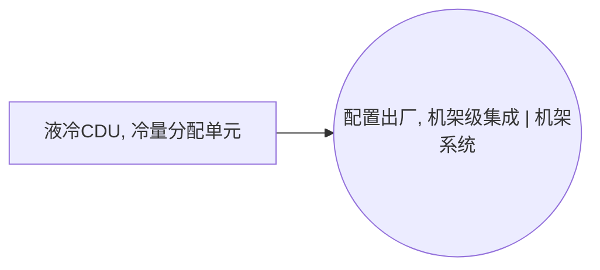

<!-- BODY:START -->
## 定义与产品身份

该节点表示用于数据中心液冷回路的冷量分配单元（CDU），即在设施侧冷却回路与设备侧冷却回路之间进行热量交换和冷却液分配的成品设备。 〔未核实·模型回忆〕

## 性质与形态

CDU通常包括换热、泵送、流量控制、监测和配液接口等功能部件，用于维持设备侧液冷回路的工况。 〔未核实·模型回忆〕

## 参考流与交接边界

参考流应为一台完整、可交付并可接入液冷系统的CDU；设备侧冷板、管路安装和运行期泵电耗不包含在该产品交接流中。 〔未核实·模型回忆〕 [^internal-review]

## 规格与相邻节点区分

本节点限于组件级CDU，不与机柜、服务器、冷板或建筑级冷水机组等不同集成层级的设备混同。 〔未核实·模型回忆〕 [^internal-review]

## 在系统中的角色

在数据中心液冷架构中，CDU将设施水回路与IT设备冷却液回路隔离或耦合，并向设备侧分配冷却液。 〔未核实·模型回忆〕

## 分类与适用范围

本节点按用于GPU/AI训练服务器液冷的组件级设备范围建模，适用分类应在后续绑定其机械设备母行业节点时确定。 〔未核实·模型回忆〕 [^internal-review]

## 节点特定采集字段

应采集额定热负荷、冷却液类型、流量与压降范围、泵和换热器配置、控制部件、材料构成和设备质量。 〔未核实·模型回忆〕 [^internal-review]

## 区域化补充要求

区域化时应记录CDU制造地以及泵、换热器、阀件和控制器的主要供应地，并记录设备所适配的区域性冷却液规范。 〔未核实·模型回忆〕 [^internal-review]

## 数据适用状态与缺口

该节点目前是home_industry为machinery的未解析背景占位符，档案中没有已核验来源或LCA关联记录。 〔未核实·模型回忆〕 [^internal-review]

## 出处

[^internal-review]: 内部评审与建模约定——仅支持显式标注的系统边界、参考流、采集字段与数据缺口判断，不作为外部事实证据。
<!-- BODY:END -->

## 邻域工序图
> 由 graph edges 确定性派生（图==边，可被 lint 比对）；模型不得增删连线。

## 🔒 数量（待挂 · NOT POPULATED）
> 本节为占位。输入流 / 输出流 / 参考单位的结构在此预留，数值由实测/权威库挂入，**LLM 不得填写**（数量防火墙）。

| 流 | 方向 | 单位 | 值 | 源 |
|---|---|---|---|---|
| (待挂) | — | — | — | — |

<!-- LCA_ASSOCIATION:START -->
## 🔗 可引用 LCA 数据集与关联

> **本轮暂无经过语义裁决的可引用数据集。** 这不表示全球不存在数据；应继续处理逐来源检索矩阵中的待裁决、未执行和受阻记录。

- 节点策略：`background_import` — 关联相同产品身份的生产/市场记录；具体模型再选择直接引用或代理。
- 检索审计：候选 0 条，明确否决 0 条。
<!-- LCA_ASSOCIATION:END -->

<!-- CHANGELOG:START -->
## 修改日志

### 2026-08-03 · 断言级溯源受控合并

- **发现的问题：** 本次送审断言中有 0 条取得独立支持、9 条证据不足；另有 0 条因冲突、共享引用或锚点不唯一未自动修改。
- **采取的修改：** 已核实断言改挂专属 `ku-*` 引用；证据不足断言移除装饰性旧引用并明确降级。
- **修改原则：** 只修改哈希一致且唯一命中的原文行；不整页重写；不机械处理矛盾；来源注册、正文引用与修改日志同步更新。
- **数据影响：** 本次处理 9 条可安全合并断言；未新增或推断任何 LCI 数值。

### 2026-07-30 · 从“预先强绑定”改为“可引用数据集关联”

- **发现的问题：** 节点 Wiki 的目的，是让后续 LCA 建模快速发现可直接引用或可作代理的数据集；旧栏目只展示正式绑定和 C2，隐藏了具有代理筛选价值的 C1，也把部分真实相邻记录直接归入否决，容易把“关联强弱”误读成“能否立即计算”。
- **采取的修改：** 按冻结的官方/公开证据重新裁决本节点的数据集引用关系，当前展示 0 条关联（C0=0、C1=0、C2=0、C3=0、C4=0），另保留 0 条真正否决；每条同时标记关联对象、潜在用途、主要限制和项目裁决要求。
- **修改原则：** C0–C4 只表示节点—数据集关联强度，不授予计算权限；C1/C2 可进入项目级 P0–P3 代理裁决，C3/C4 也必须在具体模型中核对边界、许可和版本后才形成真正绑定。
<!-- CHANGELOG:END -->
