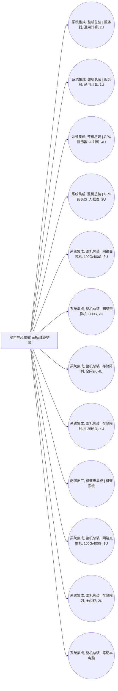

<!-- BODY:START -->
## 定义与产品身份

该节点表示服务器中使用的塑料导风罩、前面板或线缆护套这一组件级产品集合。 〔未核实·模型回忆〕 [^internal-review]

## 性质与形态

塑料线缆护套通常是包覆导体并提供电气绝缘和机械保护的聚合物层。 〔未核实·模型回忆〕

## 参考流与交接边界

参考流应按交付至服务器装配活动的塑料组件数量或质量定义，并在组件交付点与装配活动交接。 〔未核实·模型回忆〕 [^internal-review]

## 规格与相邻节点区分

本节点按服务器组件用途区分，不应替代独立显卡专用的塑料风扇罩或导流罩节点。 〔未核实·模型回忆〕 [^internal-review]

## 在系统中的角色

该节点作为背景塑料组件输入，被多个服务器装配活动消耗。 〔未核实·模型回忆〕 [^internal-review]

## 分类与适用范围

该节点的主行业归属为塑料行业，并已解析链接至塑料行业的 PVC 管材/型材标准产品节点。 〔未核实·模型回忆〕 [^internal-review]

## 节点特定采集字段

采集时应记录塑料树脂或配混体系、部件功能类别、成型工艺以及交付质量。 〔未核实·模型回忆〕 [^internal-review]

## 区域化补充要求

区域化时应补充塑料部件制造地及其所用电力市场。 〔未核实·模型回忆〕 [^internal-review]

## 数据适用状态与缺口

该节点没有已验证来源引用且 LCA 关联数为零，需补充适用的塑料部件背景数据关联。 〔未核实·模型回忆〕 [^internal-review]

## 出处

[^internal-review]: 内部评审与建模约定——仅支持显式标注的系统边界、参考流、采集字段与数据缺口判断，不作为外部事实证据。
<!-- BODY:END -->

## 邻域工序图
> 由 graph edges 确定性派生（图==边，可被 lint 比对）；模型不得增删连线。

## 🔒 数量（待挂 · NOT POPULATED）
> 本节为占位。输入流 / 输出流 / 参考单位的结构在此预留，数值由实测/权威库挂入，**LLM 不得填写**（数量防火墙）。

| 流 | 方向 | 单位 | 值 | 源 |
|---|---|---|---|---|
| (待挂) | — | — | — | — |

<!-- LCA_ASSOCIATION:START -->
## 🔗 可引用 LCA 数据集与关联

> **本轮暂无经过语义裁决的可引用数据集。** 这不表示全球不存在数据；应继续处理逐来源检索矩阵中的待裁决、未执行和受阻记录。

- 节点策略：`cross_industry_home_node` — 经 resolves_to 进入母行业；本页保留发现线索，建模时优先检查母行业节点。
- 检索审计：候选 0 条，明确否决 0 条。
- 母行业路径：`plastics::pvc.pipe_profile.standard.na.na`。
<!-- LCA_ASSOCIATION:END -->

<!-- CHANGELOG:START -->
## 修改日志

### 2026-08-03 · 断言级溯源受控合并

- **发现的问题：** 本次送审断言中有 0 条取得独立支持、9 条证据不足；另有 0 条因冲突、共享引用或锚点不唯一未自动修改。
- **采取的修改：** 已核实断言改挂专属 `ku-*` 引用；证据不足断言移除装饰性旧引用并明确降级。
- **修改原则：** 只修改哈希一致且唯一命中的原文行；不整页重写；不机械处理矛盾；来源注册、正文引用与修改日志同步更新。
- **数据影响：** 本次处理 9 条可安全合并断言；未新增或推断任何 LCI 数值。

### 2026-07-30 · 从“预先强绑定”改为“可引用数据集关联”

- **发现的问题：** 节点 Wiki 的目的，是让后续 LCA 建模快速发现可直接引用或可作代理的数据集；旧栏目只展示正式绑定和 C2，隐藏了具有代理筛选价值的 C1，也把部分真实相邻记录直接归入否决，容易把“关联强弱”误读成“能否立即计算”。
- **采取的修改：** 按冻结的官方/公开证据重新裁决本节点的数据集引用关系，当前展示 0 条关联（C0=0、C1=0、C2=0、C3=0、C4=0），另保留 0 条真正否决；每条同时标记关联对象、潜在用途、主要限制和项目裁决要求。
- **修改原则：** C0–C4 只表示节点—数据集关联强度，不授予计算权限；C1/C2 可进入项目级 P0–P3 代理裁决，C3/C4 也必须在具体模型中核对边界、许可和版本后才形成真正绑定。
<!-- CHANGELOG:END -->
