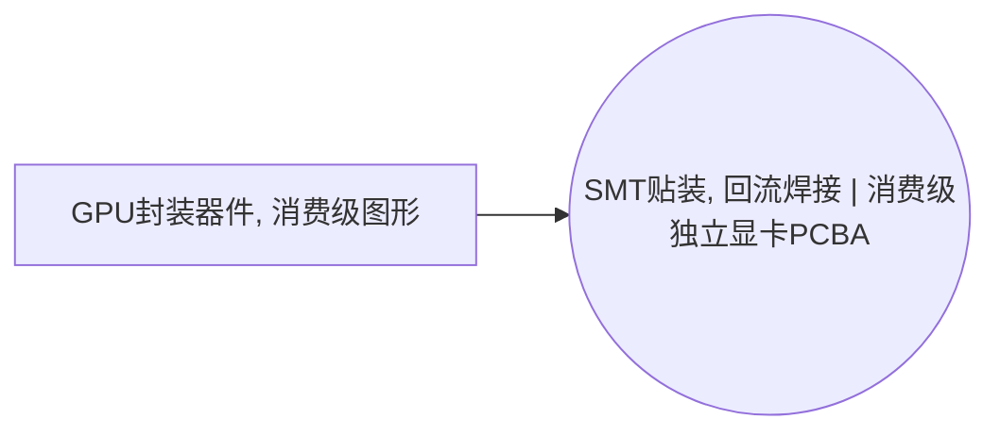

<!-- BODY:START -->
## 定义与产品身份

该节点表示面向消费级图形处理的GPU封装器件，即完成封装并可装配到独立显卡上的图形处理半导体器件。 〔未核实·模型回忆〕

## 性质与形态

GPU封装器件是将集成电路裸片通过封装提供电气互连、机械保护和热路径的半导体部件。 〔未核实·模型回忆〕

## 参考流与交接边界

参考流应为一个完成封装并可交付给独立显卡装配活动的消费级GPU器件；不包括显存封装、印制电路板或整张显卡。 〔未核实·模型回忆〕 [^internal-review]

## 规格与相邻节点区分

本节点以消费级图形GPU封装和组件级集成度为身份边界，区别于AI训练GPU、CPU及已装配的计算卡。 〔未核实·模型回忆〕 [^internal-review]

## 在系统中的角色

独立显卡通过PCI Express等主机扩展接口连接系统，GPU是该类图形计算卡的核心处理器件。 〔未核实·模型回忆〕

## 分类与适用范围

按HS商品分类，电子集成电路归入品目8542；本节点适用范围限于消费级独立图形卡所用GPU封装器件。 〔未核实·模型回忆〕

## 节点特定采集字段

应采集封装类型、裸片面积或工艺节点、封装基板、互连材料、散热界面、单件质量和良率相关信息。 〔未核实·模型回忆〕 [^internal-review]

## 区域化补充要求

区域化时应分别记录晶圆制造、封装测试和最终交付的地区，以反映其不同电力和供应链背景。 〔未核实·模型回忆〕 [^internal-review]

## 数据适用状态与缺口

该节点目前是home_industry为semiconductor的未解析背景占位符，尚未绑定母行业节点且没有已核验来源。 〔未核实·模型回忆〕 [^internal-review]

## 出处

[^internal-review]: 内部评审与建模约定——仅支持显式标注的系统边界、参考流、采集字段与数据缺口判断，不作为外部事实证据。
<!-- BODY:END -->

## 邻域工序图
> 由 graph edges 确定性派生（图==边，可被 lint 比对）；模型不得增删连线。

## 🔒 数量（待挂 · NOT POPULATED）
> 本节为占位。输入流 / 输出流 / 参考单位的结构在此预留，数值由实测/权威库挂入，**LLM 不得填写**（数量防火墙）。

| 流 | 方向 | 单位 | 值 | 源 |
|---|---|---|---|---|
| (待挂) | — | — | — | — |

<!-- LCA_ASSOCIATION:START -->
## 🔗 可引用 LCA 数据集与关联

> 已核验关联 4 条：C0=0、C1=4、C2=0、C3=0、C4=0。这些记录用于发现与代理筛选；进入计算前仍须在具体项目中核对边界、许可和版本。

| 强度 | 数据库记录 | 数据库/版本 | 关联对象 | 潜在用途 | 主要限制 | 模型状态 |
|---|---|---|---|---|---|---|
| `C1` · 弱关联 | [モス型集積回路 (論理素子), GLO](https://sumpo.or.jp/consulting/lca/idea/din2eh00000001km-att/AIST-IDEAv34_Ja_sample.xlsx) | AIST-IDEA 3.4 public sample | `reference_product_and_producer_process` | 弱关联；可进入代理筛选 | 未通过节点特定硬门：product_family、function、package、geography。IDEA 逻辑 IC 是产品族记录，公开样本不足以区分 CPU、GPU、ASIC、PHY、控制器或功率器件的芯片/封装… | 仅知识关联 · 仍需项目裁决 · 不可直接计算 |
| `C1` · 弱关联 | [モス型集積回路 (論理素子), JPN](https://sumpo.or.jp/consulting/lca/idea/din2eh00000001km-att/AIST-IDEAv34_Ja_sample.xlsx) | AIST-IDEA 3.4 public sample | `reference_product_and_producer_process` | 弱关联；可进入代理筛选 | 未通过节点特定硬门：product_family、function、package、geography。IDEA 逻辑 IC 是产品族记录，公开样本不足以区分 CPU、GPU、ASIC、PHY、控制器或功率器件的芯片/封装… | 仅知识关联 · 仍需项目裁决 · 不可直接计算 |
| `C1` · 弱关联 | [integrated circuit production, logic type](https://ecoquery.ecoinvent.org/3.12/cutoff/dataset/4026/documentation) | ecoinvent 3.12 | `reference_product_and_producer_process` | 弱关联；可进入代理筛选 | 未通过节点特定硬门：reference_product、technology_route、geography。官方数据集覆盖通用封装逻辑 IC，但未区分 CPU、GPU、交换 ASIC、PHY、NVMe 或 NIC 的芯片… | 仅知识关联 · 仍需项目裁决 · 不可直接计算 |
| `C1` · 弱关联 | [集成电路](https://www.hiqlcd.com/dataset/hiqlcd/1.5.0/cut_off/3a909d8e-a8be-4f90-9b7e-98f53b1c8226) | HiQLCD 1.5.0 | `reference_product` | 弱关联；可进入代理筛选 | 未通过节点特定硬门：product、reference_product、activity、route、boundary、geography、time。中国通用集成电路记录真实覆盖分离、封装、键合、电镀和测试，但未区分 CP… | 仅知识关联 · 仍需项目裁决 · 不可直接计算 |

> 关联不等于计算绑定；项目采用分别进入 `model_dataset_bindings.json` 或 `model_proxy_bindings.json`。
<!-- LCA_ASSOCIATION:END -->

<!-- CHANGELOG:START -->
## 修改日志

### 2026-08-03 · 断言级溯源受控合并

- **发现的问题：** 本次送审断言中有 0 条取得独立支持、9 条证据不足；另有 0 条因冲突、共享引用或锚点不唯一未自动修改。
- **采取的修改：** 已核实断言改挂专属 `ku-*` 引用；证据不足断言移除装饰性旧引用并明确降级。
- **修改原则：** 只修改哈希一致且唯一命中的原文行；不整页重写；不机械处理矛盾；来源注册、正文引用与修改日志同步更新。
- **数据影响：** 本次处理 9 条可安全合并断言；未新增或推断任何 LCI 数值。

### 2026-07-30 · 从“预先强绑定”改为“可引用数据集关联”

- **发现的问题：** 节点 Wiki 的目的，是让后续 LCA 建模快速发现可直接引用或可作代理的数据集；旧栏目只展示正式绑定和 C2，隐藏了具有代理筛选价值的 C1，也把部分真实相邻记录直接归入否决，容易把“关联强弱”误读成“能否立即计算”。
- **采取的修改：** 按冻结的官方/公开证据重新裁决本节点的数据集引用关系，当前展示 4 条关联（C0=0、C1=4、C2=0、C3=0、C4=0），另保留 0 条真正否决；每条同时标记关联对象、潜在用途、主要限制和项目裁决要求。
- **中国源补检：** 本节点新增 1 条 HiQLCD 官方公共元数据关联；已核验稳定 UUID、版本、系统模型、参考产品/单位、地域、时间和公开边界，完整 I/O/LCIA 仍受许可控制。
- **修改原则：** C0–C4 只表示节点—数据集关联强度，不授予计算权限；C1/C2 可进入项目级 P0–P3 代理裁决，C3/C4 也必须在具体模型中核对边界、许可和版本后才形成真正绑定。
<!-- CHANGELOG:END -->
