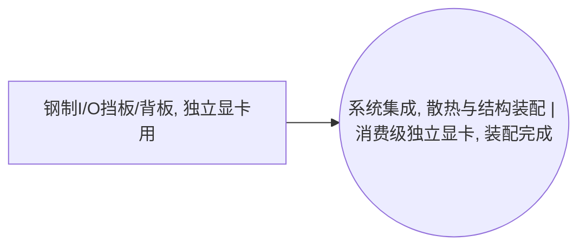

<!-- BODY:START -->
## 定义与产品身份

该节点表示安装于消费级独立显卡I/O端的钢制挡板或背板组件，而非显卡PCB、散热背板或计算机机箱面板。 〔未核实·模型回忆〕 [^internal-review]

## 性质与形态

独立显卡I/O挡板通常是冲压成形的薄钢板件，包含显示输出开孔和机箱固定结构。 〔未核实·模型回忆〕

## 参考流与交接边界

参考流应为一件可交付给独立显卡装配活动的钢制I/O挡板；紧固件、PCB、连接器和外部机箱不包含在该产品流内。 〔未核实·模型回忆〕 [^internal-review]

## 规格与相邻节点区分

该节点应按独立显卡I/O挡板识别，不应与显卡散热背板、服务器扩展卡挡板或通用机箱钣金件合并。 〔未核实·模型回忆〕 [^internal-review]

## 在系统中的角色

该产品作为独立显卡装配的背景机械输入，为显示输出接口提供定位、机箱安装和开孔承载。 〔未核实·模型回忆〕 [^internal-review]

## 分类与适用范围

适用范围限于消费级GPU独立显卡的组件级钢制I/O挡板或背板，不代表整张显卡的金属结构件集合。 〔未核实·模型回忆〕 [^internal-review]

## 节点特定采集字段

采集时应记录板材牌号或涂层、厚度、质量、冲压或折弯工艺、表面处理、I/O开孔布局及低矮或全高规格。 〔未核实·模型回忆〕 [^internal-review]

## 区域化补充要求

区域化时应补充钢材生产地、冲压和表面处理地点及显卡最终装配地，并分别处理其电力和运输背景。 〔未核实·模型回忆〕 [^internal-review]

## 数据适用状态与缺口

该节点目前为未解析的背景占位项，尚无跨行业钢制件节点绑定，也缺少部件级材料、工艺和地域证据。 〔未核实·模型回忆〕 [^internal-review]

## 出处

[^internal-review]: 内部评审与建模约定——仅支持显式标注的系统边界、参考流、采集字段与数据缺口判断，不作为外部事实证据。
<!-- BODY:END -->

## 邻域工序图
> 由 graph edges 确定性派生（图==边，可被 lint 比对）；模型不得增删连线。

## 🔒 数量（待挂 · NOT POPULATED）
> 本节为占位。输入流 / 输出流 / 参考单位的结构在此预留，数值由实测/权威库挂入，**LLM 不得填写**（数量防火墙）。

| 流 | 方向 | 单位 | 值 | 源 |
|---|---|---|---|---|
| (待挂) | — | — | — | — |

<!-- LCA_ASSOCIATION:START -->
## 🔗 可引用 LCA 数据集与关联

> **本轮暂无经过语义裁决的可引用数据集。** 这不表示全球不存在数据；应继续处理逐来源检索矩阵中的待裁决、未执行和受阻记录。

- 节点策略：`cross_industry_home_node` — 经 resolves_to 进入母行业；本页保留发现线索，建模时优先检查母行业节点。
- 检索审计：候选 0 条，明确否决 0 条。
- 母行业路径：`待解析`。
<!-- LCA_ASSOCIATION:END -->

<!-- CHANGELOG:START -->
## 修改日志

### 2026-08-03 · 断言级溯源受控合并

- **发现的问题：** 本次送审断言中有 0 条取得独立支持、9 条证据不足；另有 0 条因冲突、共享引用或锚点不唯一未自动修改。
- **采取的修改：** 已核实断言改挂专属 `ku-*` 引用；证据不足断言移除装饰性旧引用并明确降级。
- **修改原则：** 只修改哈希一致且唯一命中的原文行；不整页重写；不机械处理矛盾；来源注册、正文引用与修改日志同步更新。
- **数据影响：** 本次处理 9 条可安全合并断言；未新增或推断任何 LCI 数值。

### 2026-07-30 · 从“预先强绑定”改为“可引用数据集关联”

- **发现的问题：** 节点 Wiki 的目的，是让后续 LCA 建模快速发现可直接引用或可作代理的数据集；旧栏目只展示正式绑定和 C2，隐藏了具有代理筛选价值的 C1，也把部分真实相邻记录直接归入否决，容易把“关联强弱”误读成“能否立即计算”。
- **采取的修改：** 按冻结的官方/公开证据重新裁决本节点的数据集引用关系，当前展示 0 条关联（C0=0、C1=0、C2=0、C3=0、C4=0），另保留 0 条真正否决；每条同时标记关联对象、潜在用途、主要限制和项目裁决要求。
- **修改原则：** C0–C4 只表示节点—数据集关联强度，不授予计算权限；C1/C2 可进入项目级 P0–P3 代理裁决，C3/C4 也必须在具体模型中核对边界、许可和版本后才形成真正绑定。
<!-- CHANGELOG:END -->
