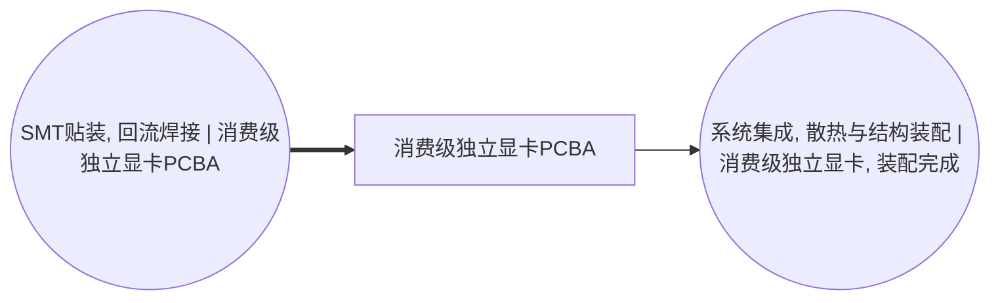

<!-- BODY:START -->
## 定义与产品身份

P074 是完成 GPU、GDDR 显存、供电级、被动元件、控制与接口器件贴装和回流焊后的**显卡板卡 PCBA**。参考流建议定义为“1 件完成板级装联、等待散热和结构装配的目标型号 PCBA”。它不是裸 PCB、单颗 GPU、已安装散热系统的整卡、测试合格显卡或零售包装商品。

权威名称图规定 A041 产出 P074，A042 消费 P074 并产出 P075；这条阶段关系是本页的结构边界，不得在 Wiki 中改写。[^ku-ict-graphics-spine]

## 阶段边界与防止重复计数

P074 包含板级装联形成的实体，但不包含风扇、散热器、热管或均热板、TIM、I/O 挡板、背板、导流罩，也不包含 VBIOS/固件测试、压力老化和出厂包装。上述投入和过程分别由 A042、A043、A044 承担。

〔建模判断〕如果目标工厂采购的是已经贴装完成的显卡 PCBA，P074 应作为背景采购流进入 A042，不能再次叠加 A041 的 GPU、GDDR、PCB、焊料和 SMT 电力；如果目标工厂从裸板开始贴装，则 A041 与全部板级投入应完整建模。

## 行业和商品分类

联合国 ISIC 2610 明确包括 video/interface cards 的制造以及把元件装载到印制板的活动，因此 A041 按 C2610 比原先的 C2620 更符合官方说明。 〔未核实·模型回忆〕

P074 是厂内中间流而不是默认可交易的完整显卡。本图暂以 CPC 45290、HS 847330 作为“计算机零部件/附件”阶段代理；联合国分类页面给出了这组对应关系。[^ku-unsd-cpc45290] 〔建模判断〕该代理只服务于外部对表，不证明任何未测试 PCBA 在具体海关申报中必然归入该编码；正式数据集应优先标记 `internal_WIP` 并保留代理判定依据。

## 产品组成和型号代表性

目标数据集必须绑定可复现的板号、PCB 版本、GPU 型号与封装、显存类型/容量/颗数、VRM 相数和功率级、显示接口、外接电源接口及生产变更版本。板卡品牌和营销系列不是骨架身份，但它们可能改变 PCB 层数、元件数量、板面积和良率，因此必须作为数据集属性保存。

中国制造企业公开披露证明显卡制造设施会涉及 GPU 采购、用电、焊接设备和 PCB 边角料等信息，但公开披露通常是企业或场址汇总口径，不是单个 P074 SKU 的实测清单。 〔未核实·模型回忆〕

## 中国区 LCI 数据获取规则

P074 的产品记录应来自目标工厂同一代表期的 PLM/工程 BOM、ERP 领料、MES 投产与完工、SPI/AOI/AXI 和功能初检记录、返修台账、废弃物转移记录以及 SMT 线分项电表。A041 的输入数量、回流焊电力、氮气或压缩空气、焊料损耗、良率和废板量属于活动页；P074 产品页保存板卡质量、几何、版本、样本覆盖和交接状态。

HJ 1031—2019 可用于识别电子工业排污单位的实际排放量核算、自行监测、环境台账与执行报告字段。[^ku-d980c3e309044a3a] 〔建模判断〕许可或执行报告只能为设施排放提供证据；缺少同期产量、产品组合和分配参数时，不得直接除以显卡产量形成 P074 实测值。

中国有害物质限制使用管理要求覆盖境内生产、销售和进口的电器电子产品，并规定有害物质限制与标注要求。[^ku-cn-rohs-2016] 这些合规资料可辅助核对焊料、阻燃材料和均质材料声明，但不替代 BOM 质量或制造 LCI。

## 上下文完整性与当前状态

| 上下文模块 | 当前状态 | 正式量化前仍需取得 |
|---|---|---|
| 阶段身份和上下游边界 | 已完成 | 目标工厂实际交接点 |
| 组成字段和去重规则 | 已完成 | 型号级工程 BOM 与变更版本 |
| CPC/HS | 中间流代理 | 企业实际商品归类或 `internal_WIP` 说明 |
| 中国设施环境字段 | 有规则来源 | 同期排污台账、产量和分配参数 |
| 中国 SKU 实测 LCI | 缺失 | SMT 线计量、物料平衡、良率和废物流 |

当前正文能够指导 P074 数据采集，但数值状态仍为 `blocked_primary_data_and_product_allocation`。不得把终端显卡功耗、企业总用电或国外参考卡规格填作 P074 制造电力。
<!-- BODY:END -->

## 邻域工序图
> 由 graph edges 确定性派生（图==边，可被 lint 比对）；模型不得增删连线。

## 🔒 数量（待挂 · NOT POPULATED）
> 本节为占位。输入流 / 输出流 / 参考单位的结构在此预留，数值由实测/权威库挂入，**LLM 不得填写**（数量防火墙）。

| 流 | 方向 | 单位 | 值 | 源 |
|---|---|---|---|---|
| (待挂) | — | — | — | — |

<!-- LCA_ASSOCIATION:START -->
## 🔗 可引用 LCA 数据集与关联

> 已核验关联 5 条：C0=4、C1=1、C2=0、C3=0、C4=0。这些记录用于发现与代理筛选；进入计算前仍须在具体项目中核对边界、许可和版本。

| 强度 | 数据库记录 | 数据库/版本 | 关联对象 | 潜在用途 | 主要限制 | 模型状态 |
|---|---|---|---|---|---|---|
| `C1` · 弱关联 | [印制线路板组件](https://www.hiqlcd.com/dataset/hiqlcd/1.5.0/cut_off/e8b682ed-6133-44d5-8ef8-6603d9323a78) | HiQLCD 1.5.0 | `reference_product` | 弱关联；可进入代理筛选 | 未通过节点特定硬门：product、reference_product、activity、route、boundary、geography、time。HiQLCD 记录是中国通用 PCBA 市场产品，参考单位为 kg；未证… | 仅知识关联 · 仍需项目裁决 · 不可直接计算 |
| `C0` · 外部对照 | [プリント配線実装基板, GLO](https://sumpo.or.jp/consulting/lca/idea/din2eh00000001km-att/AIST-IDEAv34_Ja_sample.xlsx) | AIST-IDEA 3.4 public sample | `external_product_result` | 外部对照；不可替代 | 数据集边界覆盖完整产品/行业聚合，直接挂接会与已展开前景链重复计入。 | 仅知识关联 · 仍需项目裁决 · 不可直接计算 |
| `C0` · 外部对照 | [プリント配線実装基板, JPN](https://sumpo.or.jp/consulting/lca/idea/din2eh00000001km-att/AIST-IDEAv34_Ja_sample.xlsx) | AIST-IDEA 3.4 public sample | `external_product_result` | 外部对照；不可替代 | 数据集边界覆盖完整产品/行业聚合，直接挂接会与已展开前景链重复计入。 | 仅知识关联 · 仍需项目裁决 · 不可直接计算 |
| `C0` · 外部对照 | [printed wiring board production, surface mounted, unspecified, Pb free](https://ecoquery.ecoinvent.org/3.12/cutoff/dataset/1415/documentation) | ecoinvent 3.12 | `reference_product` | 外部对照；不可替代 | 数据集边界覆盖完整产品/行业聚合，直接挂接会与已展开前景链重复计入。 | 仅知识关联 · 仍需项目裁决 · 不可直接计算 |
| `C0` · 外部对照 | [Printed circuit and electronic assembly - United States](https://api.nal.usda.gov/FederalLCACommonsapi/search?query=9a21e1ba-46e9-39b5-a3d3-0004486ec40c&type=PROCESS) | Federal LCA Commons repository current at access date | `external_product_result` | 外部对照；不可替代 | 数据集边界覆盖完整产品/行业聚合，直接挂接会与已展开前景链重复计入。 | 仅知识关联 · 仍需项目裁决 · 不可直接计算 |

> 关联不等于计算绑定；项目采用分别进入 `model_dataset_bindings.json` 或 `model_proxy_bindings.json`。
<!-- LCA_ASSOCIATION:END -->

<!-- CHANGELOG:START -->
## 修改日志

### 2026-08-03 · 断言级溯源受控合并

- **发现的问题：** 本次送审断言中有 0 条取得独立支持、2 条证据不足；另有 12 条因冲突、共享引用或锚点不唯一未自动修改。
- **采取的修改：** 已核实断言改挂专属 `ku-*` 引用；证据不足断言移除装饰性旧引用并明确降级。 未决项保留在合并计划的 `manual_review` 中。
- **修改原则：** 只修改哈希一致且唯一命中的原文行；不整页重写；不机械处理矛盾；来源注册、正文引用与修改日志同步更新。
- **数据影响：** 本次处理 2 条可安全合并断言；未新增或推断任何 LCI 数值。

### 2026-07-30 · 从“预先强绑定”改为“可引用数据集关联”

- **发现的问题：** 节点 Wiki 的目的，是让后续 LCA 建模快速发现可直接引用或可作代理的数据集；旧栏目只展示正式绑定和 C2，隐藏了具有代理筛选价值的 C1，也把部分真实相邻记录直接归入否决，容易把“关联强弱”误读成“能否立即计算”。
- **采取的修改：** 按冻结的官方/公开证据重新裁决本节点的数据集引用关系，当前展示 5 条关联（C0=4、C1=1、C2=0、C3=0、C4=0），另保留 0 条真正否决；每条同时标记关联对象、潜在用途、主要限制和项目裁决要求。
- **中国源补检：** 本节点新增 1 条 HiQLCD 官方公共元数据关联；已核验稳定 UUID、版本、系统模型、参考产品/单位、地域、时间和公开边界，完整 I/O/LCIA 仍受许可控制。
- **修改原则：** C0–C4 只表示节点—数据集关联强度，不授予计算权限；C1/C2 可进入项目级 P0–P3 代理裁决，C3/C4 也必须在具体模型中核对边界、许可和版本后才形成真正绑定。
<!-- CHANGELOG:END -->
