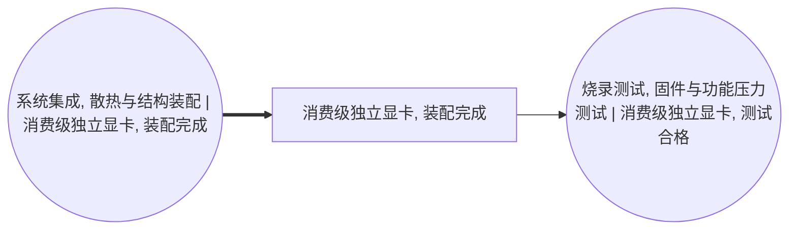

<!-- BODY:START -->
## 定义与产品身份

P075 是 P074 显卡 PCBA 安装导热介质、散热器、热管或均热板、风扇、导流罩及 I/O 结构件后形成的**装配完成但尚未完成合格测试的独立显卡**。参考流建议定义为“1 件完成目标 BOM 机械与热管理装配、等待固件和功能压力测试的整卡”。

名称图规定 A042 产出 P075，A043 消费 P075 并产出 P076；P075 因此是装配与测试之间的厂内在制品。[^ku-ict-graphics-spine]

## 与相邻节点的区别

- P074 只有完成装联的板卡，不含完整散热和结构总成；
- P075 已形成物理整卡，但没有“测试合格”状态；
- P076 已通过固件、显存、接口和压力测试，但不含销售包装；
- P077 是包含包装边界的最终销售 SKU。

〔建模判断〕装配完成不能自动等同质量合格。把 P075 直接作为最终参考产品会遗漏 A043 的测试电力、不良品、返修和报废负担；把这些负担同时填入 P075 和 A043 又会重复计算。

## 行业分类和商品编码处理

ISIC 2610 明确包括 video interface cards 和板级电子装联，因此显卡结构装配链在本图中按 C2610 管理。 〔未核实·模型回忆〕

P075 通常不作为单独交易的合格商品，本页不赋正式 CPC/HS，并以 `internal_WIP` 记录。〔建模判断〕若具体企业确实把未测试整卡作为外售半成品，应根据合同交付条件、功能状态和实际报关资料重新判定，不能机械继承 P076/P077 的 CPC 45281/HS 847180。

## 热管理和结构配置

散热路线是 P075 代表性的主要差异来源。目标记录至少区分风冷、液冷或无风扇方案，风扇数量，铝散热器质量，铜底/热管/均热板质量，TIM 类型与用量，钢或铝挡板/背板以及塑料导流罩。型号规格页显示不同显卡会采用不同尺寸、插槽厚度、显存和供电配置，厂商也明确提示合作板卡规格可能与参考设计不同。[^ku-nvidia-rtx5090-spec][^ku-amd-rx9070xt-spec]

〔建模判断〕终端板卡功耗可以帮助识别散热等级，却不能作为 A042 制造电力。风扇、散热器和结构件质量必须来自目标 BOM、拆解称量或供应商物料声明。

## 中国区 LCI 数据获取规则

产品页保存装配完成整卡的净质量、各热管理和结构部件质量、装配状态、板号/SKU 对应关系与代表期。A042 保存电动工具、压装或紧固、点胶/TIM、清洁、压缩空气、电力、部件损耗和装配废料数量。

中国显卡制造企业公开披露涉及用电、包装、纸塑废物、PCB 边角料和危险废物，但其数据通常汇总到东莞制造场址或企业层级。[^ku-pcpartner-2024-listing] HJ 1031—2019 可用于核对电子工业环境台账和实际排放量核算字段。[^ku-d980c3e309044a3a] 两者都不能在缺少 P075 同期产量与产品组合分配时直接形成 SKU 级 LCI。

中国有害物质限制要求可以辅助检查焊料、塑料、涂层和均质材料声明。[^ku-cn-rohs-2016] 它解决的是合规和材料声明，不提供显卡各部件质量。

## 当前状态

P075 的身份、阶段边界、组成字段和采集路径已经明确；中国 SKU 级质量、A042 实测电力、装配损耗和废物流仍缺失，状态为 `blocked_primary_data_and_product_allocation`。
<!-- BODY:END -->

## 邻域工序图
> 由 graph edges 确定性派生（图==边，可被 lint 比对）；模型不得增删连线。

## 🔒 数量（待挂 · NOT POPULATED）
> 本节为占位。输入流 / 输出流 / 参考单位的结构在此预留，数值由实测/权威库挂入，**LLM 不得填写**（数量防火墙）。

| 流 | 方向 | 单位 | 值 | 源 |
|---|---|---|---|---|
| (待挂) | — | — | — | — |

<!-- LCA_ASSOCIATION:START -->
## 🔗 可引用 LCA 数据集与关联

> **本轮暂无经过语义裁决的可引用数据集。** 这不表示全球不存在数据；应继续处理逐来源检索矩阵中的待裁决、未执行和受阻记录。

- 节点策略：`composed_via_activity` — 经图内生产活动和上游输入组合；产品页关联用于发现，不代表整条聚合过程可直接导入。
- 检索审计：候选 0 条，明确否决 0 条。
<!-- LCA_ASSOCIATION:END -->

<!-- CHANGELOG:START -->
## 修改日志

### 2026-08-03 · 断言级溯源受控合并

- **发现的问题：** 本次送审断言中有 0 条取得独立支持、1 条证据不足；另有 10 条因冲突、共享引用或锚点不唯一未自动修改。
- **采取的修改：** 已核实断言改挂专属 `ku-*` 引用；证据不足断言移除装饰性旧引用并明确降级。 未决项保留在合并计划的 `manual_review` 中。
- **修改原则：** 只修改哈希一致且唯一命中的原文行；不整页重写；不机械处理矛盾；来源注册、正文引用与修改日志同步更新。
- **数据影响：** 本次处理 1 条可安全合并断言；未新增或推断任何 LCI 数值。

### 2026-07-30 · 从“预先强绑定”改为“可引用数据集关联”

- **发现的问题：** 节点 Wiki 的目的，是让后续 LCA 建模快速发现可直接引用或可作代理的数据集；旧栏目只展示正式绑定和 C2，隐藏了具有代理筛选价值的 C1，也把部分真实相邻记录直接归入否决，容易把“关联强弱”误读成“能否立即计算”。
- **采取的修改：** 按冻结的官方/公开证据重新裁决本节点的数据集引用关系，当前展示 0 条关联（C0=0、C1=0、C2=0、C3=0、C4=0），另保留 0 条真正否决；每条同时标记关联对象、潜在用途、主要限制和项目裁决要求。
- **修改原则：** C0–C4 只表示节点—数据集关联强度，不授予计算权限；C1/C2 可进入项目级 P0–P3 代理裁决，C3/C4 也必须在具体模型中核对边界、许可和版本后才形成真正绑定。
<!-- CHANGELOG:END -->
