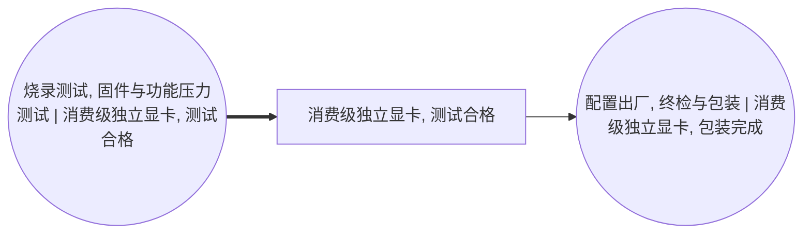

<!-- BODY:START -->
## 定义与产品身份

P076 是完成 VBIOS/固件烧录、显存和显示接口功能检查、功耗与热稳定性压力测试并被判定合格的**未包装独立显卡**。参考流建议定义为“1 件在规定测试方案下通过验收、等待终检和销售包装的目标 SKU 整卡”。

名称图规定 A043 消费 P075、产出 P076 和测试不良品，A044 再消费 P076 形成 P077。[^ku-ict-graphics-spine] 因此 P076 已具备合格功能状态，但不包含销售纸盒、缓冲材料、附件和 A044 的包装损耗。

## 合格状态和测试边界

目标数据集必须记录测试程序版本、VBIOS/固件版本、测试时长、负载工况、温度条件、合格判据、一次通过率、返修率和最终报废率。〔建模判断〕只写“通过测试”不能复现 A043 的能耗和良率；额定板卡功耗也不能直接替代测试柜或测试工位的实测电力。

P076 与 P075 的差异是已取得可审计的合格判定；与 P077 的差异是尚未进入销售包装边界。测试不良品应从 A043 产出，返修回流和最终报废路径由目标工厂台账确定，不能把全部不良品都假设为最终废弃。

## 商品分类和行业归属

联合国 CPC 45281 明确包括计算机用 video cards，并对应 HS 847180 和 ISIC 2610。[^ku-unsd-cpc45281] ISIC 2610 的说明也明确包括 video interface cards。[^ku-unsd-isic2610] 因此 P076 从原 CPC 4529/HS 847330 修正为 CPC 45281/HS 847180，并将 A043 按 C2610 管理。

〔建模判断〕CPC/HS 只确认商品类别，不区分是否带零售包装，也不证明目标型号的技术、质量、产地或 LCI。P076 与 P077 可以共享商品分类，但仍因参考流边界不同而保留为两个 LCA 产品节点。

## 型号规格与代表性

官方型号页说明消费级显卡的显存类型和容量、接口、外接电源、尺寸与板卡功耗存在显著型号差异。NVIDIA RTX 5090 参考规格列出 32 GB GDDR7、参考卡尺寸及总图形功耗，并明确合作板卡厂商的实际出货规格可能不同。[^ku-nvidia-rtx5090-spec] AMD RX 9070 XT 页面列出桌面板卡、16 GB GDDR6、256-bit 显存接口和典型板卡功耗。[^ku-amd-rx9070xt-spec]

这些数值只能说明目标 SKU 必须被精确识别。它们是使用阶段/性能和配置属性，不是中国制造 LCI，也不得将两种参考卡平均成“消费显卡代表值”。

## 中国区 LCI 数据获取规则

P076 产品页记录 SKU、板号、固件版本、合格状态、净质量、测试覆盖和代表期。A043 活动页记录测试设备数量与功率、实际负载曲线、测试时长、辅助空调、测试治具、一次通过率、返修和不良品去向。

PC Partner 的中国制造场址披露涉及显卡制造、购入 GPU、用电和废弃物管理，但环境数据是企业/场址汇总。[^ku-pcpartner-2024-listing] HJ 1031—2019 可用于核对电子工业实际排放、自行监测、环境台账和执行报告字段。[^ku-d980c3e309044a3a] 〔建模判断〕只有将场址数据与同代表期 SKU 产量、测试时长和产品组合关联后，才能形成 P076 的中国区分配结果。

中国有害物质限制资料可用于核对合格产品的材料声明和标识。[^ku-cn-rohs-2016] 它不能代替显卡称量、测试能耗和物料清单。

## 当前状态

P076 已具备正式的阶段定义、分类、规格字段、测试上下文和中国区采集规则；中国 SKU 级实测质量、测试电力、良率和废物流仍缺失。正文状态为 `draft`，量化状态为 `blocked_primary_data_and_product_allocation`。
<!-- BODY:END -->

## 邻域工序图
> 由 graph edges 确定性派生（图==边，可被 lint 比对）；模型不得增删连线。

## 🔒 数量（待挂 · NOT POPULATED）
> 本节为占位。输入流 / 输出流 / 参考单位的结构在此预留，数值由实测/权威库挂入，**LLM 不得填写**（数量防火墙）。

| 流 | 方向 | 单位 | 值 | 源 |
|---|---|---|---|---|
| (待挂) | — | — | — | — |

<!-- LCA_ASSOCIATION:START -->
## 🔗 可引用 LCA 数据集与关联

> **本轮暂无经过语义裁决的可引用数据集。** 这不表示全球不存在数据；应继续处理逐来源检索矩阵中的待裁决、未执行和受阻记录。

- 节点策略：`composed_via_activity` — 经图内生产活动和上游输入组合；产品页关联用于发现，不代表整条聚合过程可直接导入。
- 检索审计：候选 0 条，明确否决 0 条。
<!-- LCA_ASSOCIATION:END -->

<!-- CHANGELOG:START -->
## 修改日志

### 2026-07-30 · 从“预先强绑定”改为“可引用数据集关联”

- **发现的问题：** 节点 Wiki 的目的，是让后续 LCA 建模快速发现可直接引用或可作代理的数据集；旧栏目只展示正式绑定和 C2，隐藏了具有代理筛选价值的 C1，也把部分真实相邻记录直接归入否决，容易把“关联强弱”误读成“能否立即计算”。
- **采取的修改：** 按冻结的官方/公开证据重新裁决本节点的数据集引用关系，当前展示 0 条关联（C0=0、C1=0、C2=0、C3=0、C4=0），另保留 0 条真正否决；每条同时标记关联对象、潜在用途、主要限制和项目裁决要求。
- **修改原则：** C0–C4 只表示节点—数据集关联强度，不授予计算权限；C1/C2 可进入项目级 P0–P3 代理裁决，C3/C4 也必须在具体模型中核对边界、许可和版本后才形成真正绑定。
<!-- CHANGELOG:END -->
