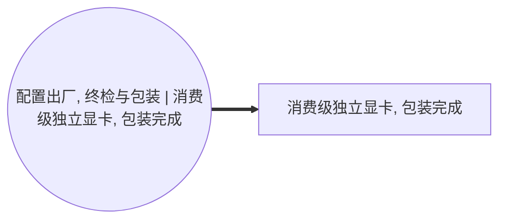

<!-- BODY:START -->
## 定义与参考产品

P077 是 P076 测试合格整卡经过终检、序列号和标签确认、附件配套、缓冲材料及销售包装后形成的**出厂包装独立显卡 SKU**。建议参考流定义为“一套在目标工厂门交付、包含声明包装和随箱附件的目标显卡 SKU”。

名称图规定 A044 消费 P076、包装材料和电力，产出 P077 与包装废料；P077 是这条显卡制造链的最终前景产品。[^ku-ict-graphics-spine] 如果研究对象使用质量参考流而不是单套 SKU，必须同时保存单件净重、包装质量和换算关系。

## 与 P076 的边界区别

P076 是不含销售包装的测试合格整卡；P077 包含明确声明的纸盒、纸塑托或泡棉、保护袋、标签、说明材料以及实际随箱附件。〔建模判断〕包装不改变显卡的 CPC/HS，但会改变参考流质量和摇篮到门清单，因此 P076 与 P077 不能合并成一个数值未知的模糊产品。

同一个 GPU 型号可由不同 AIB 厂商形成不同板号、散热器、供电、尺寸、包装和附件组合。NVIDIA 明确提示合作板卡厂商的实际出货规格可能不同；其参考规格列出显存、尺寸、接口和板卡功耗。[^ku-nvidia-rtx5090-spec] AMD 的桌面显卡规格同样列出显存、供电和接口配置。[^ku-amd-rx9070xt-spec] 因此“RTX 5090”或“RX 9070 XT”仍不足以唯一确定 P077，必须记录厂商、完整 SKU/料号和版本。

## 商品分类和行业归属

联合国 CPC 45281 明确包括计算机用 video cards，并对应 HS 847180 和 ISIC 2610。[^ku-unsd-cpc45281] ISIC 2610 也明确包括 video interface cards。[^ku-unsd-isic2610] 因此 P077 从原 CPC 4529/HS 847330 修正为 CPC 45281/HS 847180，A044 按 C2610 管理。

〔建模判断〕分类码只能说明 P077 是计算机视频扩展卡，不能证明包装边界、附件清单、制造地、质量、技术代际或产品环境表现。

## 产品组成和功能单位

P077 至少应分别记录：

- 合格整卡净质量及其中的 PCBA、散热金属、风扇、塑料罩、挡板/背板和 TIM；
- 销售包装各材料质量，并区分纸、塑料、泡棉、木材和复合材料；
- 随箱附件的名称、数量和质量，例如电源转接线、支架、线缆或说明材料；
- SKU、板号、VBIOS/固件版本、序列号规则、生产场址、代表期和交付地区；
- 工厂门交付是否包含区域运输托盘或仅包含单件零售包装。

中国显卡制造企业公开披露表明，制造场址会统计用电、废弃物和包装材料，并讨论减少纸塑包装；但披露数据是场址汇总口径。[^ku-pcpartner-2024-listing] 〔建模判断〕它可以证明应采集哪些字段和检查数量级，不能直接作为 P077 的 SKU 单件值。

## 中国区 LCI 数据获取规则

P077 产品页应从 PLM/ERP 包装 BOM、称量记录、包装工单、附件清单、成品入库与出货记录取得单件数据。A044 活动页保存包装线电力、标签和耗材损耗、包装报废、返工及包装废物流。

目标中国数据集必须把 A041–A044 的版本和数量链连接到同一 SKU：

1. P074 对应实际显卡 PCBA 板号；
2. P075 对应实际散热与结构版本；
3. P076 对应测试合格状态和良率；
4. P077 对应销售包装、附件和工厂门交接点。

HJ 1031—2019 可用于核对电子工业的实际排放量核算、自行监测、环境管理台账和执行报告。[^ku-d980c3e309044a3a] 只有场址同期总量、P077 完工量、产品组合和可审计分配参数同时存在时，设施数据才可分配到目标 SKU。

中国有害物质限制管理办法适用于境内生产、销售和进口的电器电子产品，并要求相关有害物质限制和标注。[^ku-cn-rohs-2016] 这类声明可用于材料合规和供应商证据链，不能替代产品质量与活动清单。

## 禁止使用的错误代理

- 不用整台台式机或笔记本的 PCF 倒推一张显卡；
- 不用 GPU 芯片的晶圆制造数据冒充显卡整卡；
- 不用额定板卡功耗、推荐电源功率或游戏测试功耗冒充制造电力；
- 不用企业 ESG 总用电直接除以显卡总产量，除非确认场址边界、产品组合、同期产量和分配方法；
- 不把国际参考设计规格填成中国 AIB SKU 实测值；
- 不在 P077 再重复计入已经包含于 P076 的 PCBA、散热和测试负担。

## 上下文完整性与当前状态

| 上下文模块 | 当前状态 | 正式量化前仍需取得 |
|---|---|---|
| 最终产品身份和参考流 | 已完成 | 目标厂商完整 SKU/料号 |
| P074–P077 阶段关系 | 已完成 | 同一 SKU 的版本映射 |
| CPC/HS/ISIC | 已修正 | 目标企业实际报关核对 |
| 国际型号规格 | 有官方样例 | 目标 SKU 实际出货规格 |
| 中国制造公开资料 | 有场址级字段来源 | 目标场址同期原始台账 |
| 包装和附件数据 | 字段已定义 | 包装 BOM、称量和附件清单 |
| 中国 SKU 实测 LCI | 缺失 | A041–A044 计量、良率和分配参数 |

P077 当前具备完整的数据采集上下文，但尚不能发布为中国区实测 LCI；量化状态为 `blocked_primary_data_and_product_allocation`。
<!-- BODY:END -->

## 邻域工序图
> 由 graph edges 确定性派生（图==边，可被 lint 比对）；模型不得增删连线。

## 🔒 数量（待挂 · NOT POPULATED）
> 本节为占位。输入流 / 输出流 / 参考单位的结构在此预留，数值由实测/权威库挂入，**LLM 不得填写**（数量防火墙）。

| 流 | 方向 | 单位 | 值 | 源 |
|---|---|---|---|---|
| (待挂) | — | — | — | — |

<!-- LCA_ASSOCIATION:START -->
## 🔗 可引用 LCA 数据集与关联

> **本轮暂无经过语义裁决的可引用数据集。** 这不表示全球不存在数据；应继续处理逐来源检索矩阵中的待裁决、未执行和受阻记录。

- 节点策略：`composed_via_activity` — 经图内生产活动和上游输入组合；产品页关联用于发现，不代表整条聚合过程可直接导入。
- 检索审计：候选 0 条，明确否决 0 条。
<!-- LCA_ASSOCIATION:END -->

<!-- CHANGELOG:START -->
## 修改日志

### 2026-07-30 · 从“预先强绑定”改为“可引用数据集关联”

- **发现的问题：** 节点 Wiki 的目的，是让后续 LCA 建模快速发现可直接引用或可作代理的数据集；旧栏目只展示正式绑定和 C2，隐藏了具有代理筛选价值的 C1，也把部分真实相邻记录直接归入否决，容易把“关联强弱”误读成“能否立即计算”。
- **采取的修改：** 按冻结的官方/公开证据重新裁决本节点的数据集引用关系，当前展示 0 条关联（C0=0、C1=0、C2=0、C3=0、C4=0），另保留 0 条真正否决；每条同时标记关联对象、潜在用途、主要限制和项目裁决要求。
- **修改原则：** C0–C4 只表示节点—数据集关联强度，不授予计算权限；C1/C2 可进入项目级 P0–P3 代理裁决，C3/C4 也必须在具体模型中核对边界、许可和版本后才形成真正绑定。
<!-- CHANGELOG:END -->
