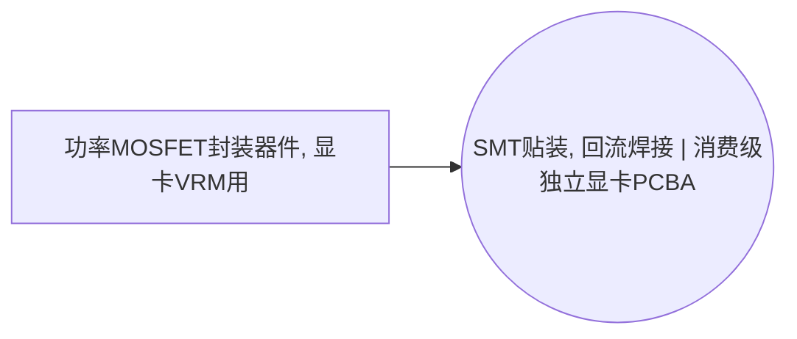

<!-- BODY:START -->
## 定义与产品身份

P078“功率MOSFET封装器件, 显卡VRM用”是 ICT 名称图中的背景产品接口，不由 ICT 前景活动生产。当前跨行业解析指向 semiconductor 母产品“功率MOSFET封装器件, Si, 引线键合QFN, 功率分立”，`home_status=linked`；母行业负责维护生产机理和上游投入产出，ICT 页面只维护本行业接收时的身份、交接和用途。[^ku-ict-name-graph-20260730]

本节点的身份刻面为 `compute_type=gpu_graphics_consumer`；`equipment_class=compute_card`；`form_factor=na`；`integration_level=component`；`product_subtype=graphics_card_power_stage`。这些刻面用于区分图中的接口身份，不等同于厂商规格、性能等级或一条可计算 LCI。

## 性质与形态

权威图只确定产品名称、身份刻面和跨行业去向，没有给出本节点的材料组成、尺寸、单件质量、包装、测试状态或质量等级。上述属性必须由目标 BOM、供应商规格和来料记录取得；在取得前不得从产品名称或母节点类别反推数值。〔建模规则〕

母行业页面当前为 `missing`。本页不复制其生产过程正文；母页后续修订时，本节点仍通过稳定 GPID 解析，避免在 ICT 行业产生第二份相互漂移的生产机理。

## 参考流与交接边界

参考流应定义为 ICT 制造活动实际接收的合格产品，并明确计量单位、交接点、包装是否计入以及质量与件数之间的换算。图层只确认本节点被哪些 ICT 活动消费，不提供数量。〔建模规则〕

上游 cradle-to-gate 清单应从 semiconductor 母产品“功率MOSFET封装器件, Si, 引线键合QFN, 功率分立” 或经项目裁决的数据集取得；ICT 前景从来料接收、检验或实际进入下游活动的交接点开始。不得同时计入母行业完整产品和其组成材料。〔建模规则〕

## 规格与相邻节点区分

共享同一母行业产品的 ICT 相邻接口包括：当前 ICT 图无共享同一母节点的相邻产品。 〔未核实·模型回忆〕

这些节点可能具有相同的母行业宽产品族，但在 ICT 图中因用途、产品锚或配置身份不同而分开。项目映射时应先核对完整料号、功能和交接形态；只有在母行业参考产品、功能单位和边界均相容时，才可复用同一背景数据集。〔建模规则〕

## 在系统中的角色

当前权威边显示本节点被以下 ICT 活动消费：A041“SMT贴装, 回流焊接 | 消费级独立显卡PCBA”。 〔未核实·模型回忆〕

该列表是图拓扑而不是 BOM 数量表。具体产品系统只保留目标配置真实存在的消费边，不能因为图中存在一条可能连接就自动计入。

## 分类与适用范围

当前登记分类为：当前图未登记外部分类码。 〔未核实·模型回忆〕

分类码只用于目录发现与范围检查，不足以证明具体型号、制造路线、封装、技术代际、地域和时间代表性一致。母行业 GPID 是跨行业身份解析锚，LCA 数据集关联仍须单独经过 C0–C4 关联与项目级 P0–P3 裁决。〔建模规则〕

## 节点特定采集字段

- **产品身份：**供应商、制造商、完整料号、产品族、版本或代际，以及与 semiconductor 母产品“功率MOSFET封装器件, Si, 引线键合QFN, 功率分立” 的映射依据。
- **交接信息：**生产地、供应地、交接地点、包装状态、质量状态、批次和代表期。
- **数量换算：**采购单位、建模参考单位、单件净质量、包装分摊和换算样本覆盖。
- **组成与规格：**只保存会影响数据集选择、运输、报废或下游工艺的节点特定字段；缺失项标记待采。
- **数据追踪：**BOM 行号、供应商文档版本、测量方法、异常值处理和不确定度。

## 区域化补充要求

### CN 中国

中国区域化需要分别记录制造地、采购地和 ICT 装配地；“在中国装配”不能自动推出该背景产品在中国生产。优先使用目标企业采购 BOM、供应商声明、来料检验、物流和质量记录。〔建模规则〕

若使用中国数据库或中国公开项目代理，应核对参考产品、技术路线、功能单位、时间、地域和系统边界；法规限值、设计产能和产品规格不能冒充运行平均值。境外生产环节保持实际生产地背景。〔建模规则〕

## 数据适用状态与缺口

本页已经确定跨行业母节点、ICT 消费活动、分类入口和项目采集字段；当前登记的可引用 LCA 数据集关联为 1 条，但关联不等于项目计算绑定。[^ku-ict-name-graph-20260730]

由于目标供应商、型号、质量换算、制造地、代表期和项目级背景数据集尚未确定，`dataset_readiness` 保持 `blocked`。母行业页面状态为 `missing`；其正文或数值未通过时，本页不得越权宣称生产清单完整。

## 出处

[^ku-ict-name-graph-20260730]: lca-cornerstone `docs/ict_equipment-name-graph.json` 中 P078 节点、相邻边和 `resolves_to`；本仓库权威名称图，按文件哈希核对。
<!-- BODY:END -->

## 邻域工序图
> 由 graph edges 确定性派生（图==边，可被 lint 比对）；模型不得增删连线。

## 🔒 数量（待挂 · NOT POPULATED）
> 本节为占位。输入流 / 输出流 / 参考单位的结构在此预留，数值由实测/权威库挂入，**LLM 不得填写**（数量防火墙）。

| 流 | 方向 | 单位 | 值 | 源 |
|---|---|---|---|---|
| (待挂) | — | — | — | — |

<!-- LCA_ASSOCIATION:START -->
## 🔗 可引用 LCA 数据集与关联

> 已核验关联 1 条：C0=0、C1=1、C2=0、C3=0、C4=0。这些记录用于发现与代理筛选；进入计算前仍须在具体项目中核对边界、许可和版本。

| 强度 | 数据库记录 | 数据库/版本 | 关联对象 | 潜在用途 | 主要限制 | 模型状态 |
|---|---|---|---|---|---|---|
| `C1` · 弱关联 | [transistor production, surface-mounted](https://ecoquery.ecoinvent.org/3.12/cutoff/dataset/8342/documentation) | ecoinvent 3.12 | `reference_product_and_producer_process` | 弱关联；可进入代理筛选 | 未通过节点特定硬门：reference_product、mosfet_identity、geography。表面贴装晶体管与功率 MOSFET 形态接近，但未确认器件类型、功率等级、芯片面积和封装路线。 | 仅知识关联 · 仍需项目裁决 · 不可直接计算 |

> 关联不等于计算绑定；项目采用分别进入 `model_dataset_bindings.json` 或 `model_proxy_bindings.json`。
<!-- LCA_ASSOCIATION:END -->

<!-- CHANGELOG:START -->
## 修改日志

### 2026-08-03 · 断言级溯源受控合并

- **发现的问题：** 本次送审断言中有 0 条取得独立支持、3 条证据不足；另有 5 条因冲突、共享引用或锚点不唯一未自动修改。
- **采取的修改：** 已核实断言改挂专属 `ku-*` 引用；证据不足断言移除装饰性旧引用并明确降级。 未决项保留在合并计划的 `manual_review` 中。
- **修改原则：** 只修改哈希一致且唯一命中的原文行；不整页重写；不机械处理矛盾；来源注册、正文引用与修改日志同步更新。
- **数据影响：** 本次处理 3 条可安全合并断言；未新增或推断任何 LCI 数值。

### 2026-07-30 · 批量补齐跨行业背景接口正文

- **发现的问题：** P078 已有权威图身份、跨行业 GPID 和 LCA 数据集关联，但正文为空，无法说明接口边界、母行业归属和项目采集字段。
- **采取的修改：** 按 Product-v2 固定十段结构补入图内可确定事实、跨行业路由、区域化要求和数据缺口；未复制母行业生产机理，未填任何 LCI 数值。
- **修改原则：** 内部图事实由哈希锁来源支撑；外部事实仍待独立检索；页面保持 `draft`，`dataset_readiness=blocked`，不因结构补齐而升级可信状态。

### 2026-07-30 · 从“预先强绑定”改为“可引用数据集关联”

- **发现的问题：** 节点 Wiki 的目的，是让后续 LCA 建模快速发现可直接引用或可作代理的数据集；旧栏目只展示正式绑定和 C2，隐藏了具有代理筛选价值的 C1，也把部分真实相邻记录直接归入否决，容易把“关联强弱”误读成“能否立即计算”。
- **采取的修改：** 按冻结的官方/公开证据重新裁决本节点的数据集引用关系，当前展示 1 条关联（C0=0、C1=1、C2=0、C3=0、C4=0），另保留 0 条真正否决；每条同时标记关联对象、潜在用途、主要限制和项目裁决要求。
- **修改原则：** C0–C4 只表示节点—数据集关联强度，不授予计算权限；C1/C2 可进入项目级 P0–P3 代理裁决，C3/C4 也必须在具体模型中核对边界、许可和版本后才形成真正绑定。
<!-- CHANGELOG:END -->
