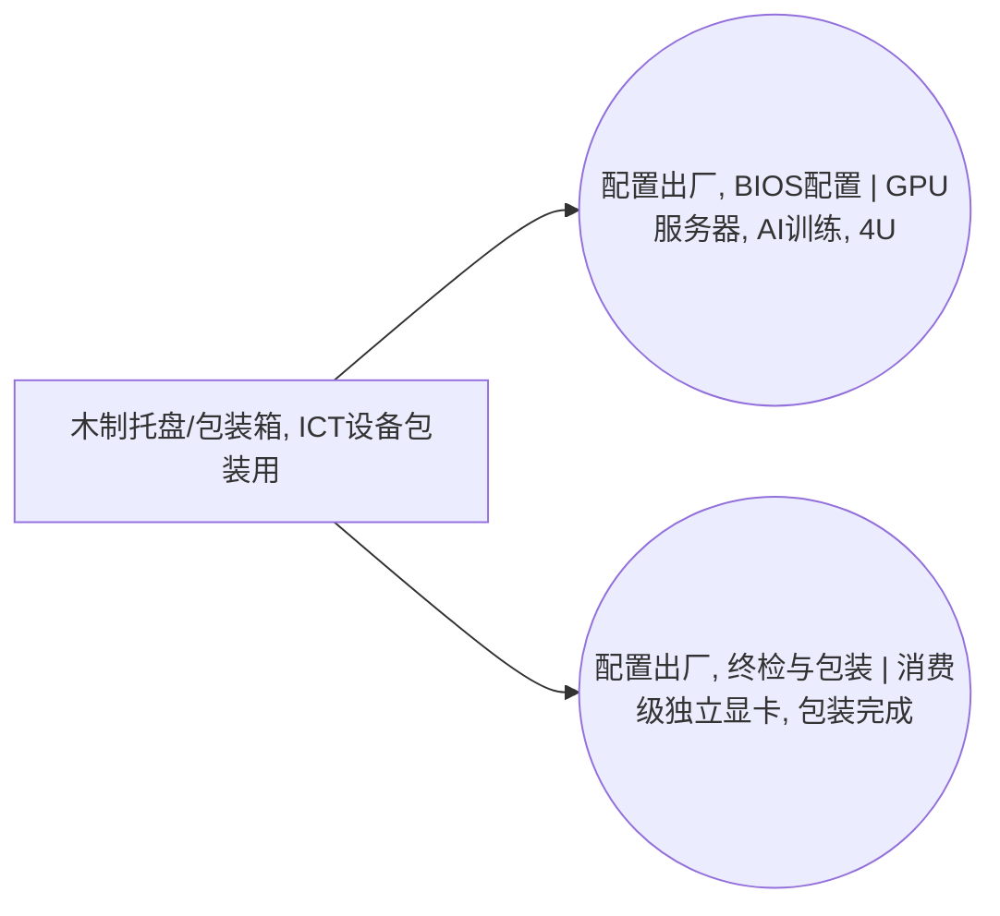

<!-- BODY:START -->
## 定义与产品身份

该节点表示用于交付ICT设备的木制托盘或木制包装箱，不表示设备本体或其零部件。 〔未核实·模型回忆〕

## 性质与形态

该产品为以木材构成的承载或围护型运输包装，形态可为托盘、木箱或板条箱。 〔未核实·模型回忆〕

## 参考流与交接边界

参考流应以交付到ICT设备包装或出货环节的一件木制托盘或包装箱为对象；交接边界按包装物供应至整机装配/包装活动时界定。 〔未核实·模型回忆〕 [^internal-review]

## 规格与相邻节点区分

本节点仅覆盖木制运输包装，应与瓦楞纸箱、塑料托盘、填充材料及不随设备交付的周转物流载具区分。 〔未核实·模型回忆〕 [^internal-review]

## 在系统中的角色

该背景产品作为整机总装或包装活动的投入，用于设备在后续仓储和运输中的承载或防护。 〔未核实·模型回忆〕 [^internal-review]

## 分类与适用范围

该节点适用于一次性或随货交付的木制运输包装；其上游归属木材材料行业并已链接至SPF木制包装箱/托盘节点。 〔未核实·模型回忆〕 [^internal-review]

## 节点特定采集字段

采集时应记录包装类型、木材种类或等级、尺寸/承载规格、单件质量、是否熏蒸或热处理以及每台设备的配置数量。 〔未核实·模型回忆〕 [^internal-review]

## 区域化补充要求

区域化时应补充木材供应地、加工地及适用的植物检疫处理要求，并识别跨境出货情形。 〔未核实·模型回忆〕 [^internal-review]

## 数据适用状态与缺口

当前节点为已跨行业链接的背景占位产品；仍需以具体产品包装规范确认木材种类、单件质量和复用/处置假设。 〔未核实·模型回忆〕 [^internal-review]

## 出处

[^internal-review]: 内部评审与建模约定——仅支持显式标注的系统边界、参考流、采集字段与数据缺口判断，不作为外部事实证据。
<!-- BODY:END -->

## 邻域工序图
> 由 graph edges 确定性派生（图==边，可被 lint 比对）；模型不得增删连线。

## 🔒 数量（待挂 · NOT POPULATED）
> 本节为占位。输入流 / 输出流 / 参考单位的结构在此预留，数值由实测/权威库挂入，**LLM 不得填写**（数量防火墙）。

| 流 | 方向 | 单位 | 值 | 源 |
|---|---|---|---|---|
| (待挂) | — | — | — | — |

<!-- LCA_ASSOCIATION:START -->
## 🔗 可引用 LCA 数据集与关联

> 已核验关联 1 条：C0=0、C1=0、C2=1、C3=0、C4=0。这些记录用于发现与代理筛选；进入计算前仍须在具体项目中核对边界、许可和版本。

| 强度 | 数据库记录 | 数据库/版本 | 关联对象 | 潜在用途 | 主要限制 | 模型状态 |
|---|---|---|---|---|---|---|
| `C2` · 候选关联 | [工业托盘,木质](https://www.hiqlcd.com/dataset/hiqlcd/1.5.0/cut_off/07e88c20-3b1d-4ab2-af1b-22184701826d) | HiQLCD 1.5.0 | `market_activity` | 候选关联；优先补证 | 产品、参考产品与参考单位已由官方记录核验；完整 I/O、目标地域/时间校准或商业数据访问仍未通过，因此仅为元数据候选。 | 仅知识关联 · 仍需项目裁决 · 不可直接计算 |

### C2 候选关联的校准缺口

> C2 是优先补证对象，不是已绑定数据。以下字段用于判断它以后应成为直接引用候选还是 P2/P3 项目代理。

| 候选数据集 | 功能单位对齐 | 过程边界对齐 | 中国工厂参数 | 使用前状态 |
|---|---|---|---|---|
| [工业托盘,木质](https://www.hiqlcd.com/dataset/hiqlcd/1.5.0/cut_off/07e88c20-3b1d-4ab2-af1b-22184701826d) | 源 `kg`；目标 `1 kg 木制托盘/包装箱, ICT设备包装用`；仍缺 4 项换算字段 | `identity_aligned_boundary_unverified`；待核 4 项 | HiQLCD 中国记录（中国,广东省，2022–2026）；产品和单位已核验，完整 I/O 与目标工厂参数仍待许可内校准 | C2 · 未形成模型绑定 · 不可直接计算 |

> 关联不等于计算绑定；项目采用分别进入 `model_dataset_bindings.json` 或 `model_proxy_bindings.json`。
<!-- LCA_ASSOCIATION:END -->

<!-- CHANGELOG:START -->
## 修改日志

### 2026-08-03 · 断言级溯源受控合并

- **发现的问题：** 本次送审断言中有 0 条取得独立支持、9 条证据不足；另有 0 条因冲突、共享引用或锚点不唯一未自动修改。
- **采取的修改：** 已核实断言改挂专属 `ku-*` 引用；证据不足断言移除装饰性旧引用并明确降级。
- **修改原则：** 只修改哈希一致且唯一命中的原文行；不整页重写；不机械处理矛盾；来源注册、正文引用与修改日志同步更新。
- **数据影响：** 本次处理 9 条可安全合并断言；未新增或推断任何 LCI 数值。

### 2026-07-30 · 从“预先强绑定”改为“可引用数据集关联”

- **发现的问题：** 节点 Wiki 的目的，是让后续 LCA 建模快速发现可直接引用或可作代理的数据集；旧栏目只展示正式绑定和 C2，隐藏了具有代理筛选价值的 C1，也把部分真实相邻记录直接归入否决，容易把“关联强弱”误读成“能否立即计算”。
- **采取的修改：** 按冻结的官方/公开证据重新裁决本节点的数据集引用关系，当前展示 1 条关联（C0=0、C1=0、C2=1、C3=0、C4=0），另保留 0 条真正否决；每条同时标记关联对象、潜在用途、主要限制和项目裁决要求。
- **中国源补检：** 本节点新增 1 条 HiQLCD 官方公共元数据关联；已核验稳定 UUID、版本、系统模型、参考产品/单位、地域、时间和公开边界，完整 I/O/LCIA 仍受许可控制。
- **修改原则：** C0–C4 只表示节点—数据集关联强度，不授予计算权限；C1/C2 可进入项目级 P0–P3 代理裁决，C3/C4 也必须在具体模型中核对边界、许可和版本后才形成真正绑定。
<!-- CHANGELOG:END -->
