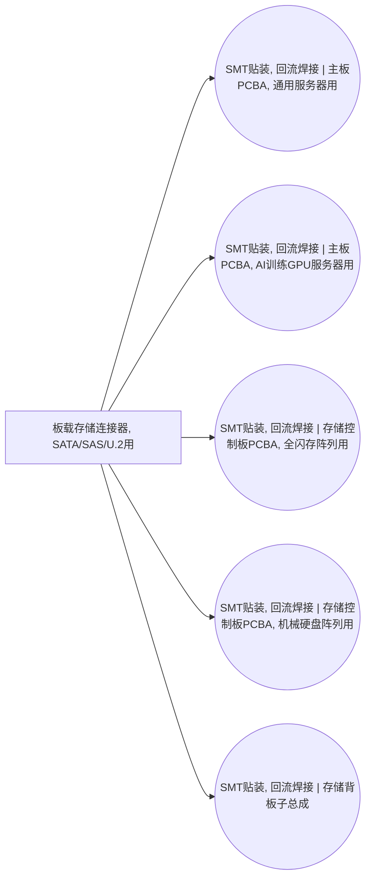

<!-- BODY:START -->
## 定义与产品身份

该节点表示安装在印制电路板上的存储设备连接器，用于 SATA、SAS 或 U.2 存储装置与主板或背板之间的互连。 〔未核实·模型回忆〕

## 性质与形态

该类部件通常是板载的多触点电连接器，其接口形态随 SATA、SAS 或 U.2 所采用的设备端和主板端配置而变化。 〔未核实·模型回忆〕

## 参考流与交接边界

参考流按一个满足指定存储接口、触点配置和板载安装要求的连接器组件交付；交接边界为该组件进入板级或背板装配。 〔未核实·模型回忆〕 [^internal-review]

## 规格与相邻节点区分

该节点按存储设备互连接口界定，应与 DIMM 插槽、M.2 插座、PCIe 扩展卡插槽及通用板对板连接器区分。 〔未核实·模型回忆〕

## 在系统中的角色

该背景组件被计算板卡、存储模块或相关装配活动消耗，用于建立板级系统与可更换或可连接存储装置之间的接口。 〔未核实·模型回忆〕 [^internal-review]

## 分类与适用范围

本节点按 storage_module 设备类别、component 集成层级及 connector_storage_board_mount 产品子类型建模，适用范围限于板载存储互连连接器。 〔未核实·模型回忆〕 [^internal-review]

## 节点特定采集字段

采集时应至少记录所支持的 SATA、SAS 或 U.2 接口、针位或通道配置、安装方式、触点表面处理、机械锁定特征及单位质量。 〔未核实·模型回忆〕 [^internal-review]

## 区域化补充要求

区域化时应补充连接器制造和装配地区，以及金属冲压、树脂成型和触点镀层供应链的地区信息。 〔未核实·模型回忆〕 [^internal-review]

## 数据适用状态与缺口

该节点当前为 electronics 行业的未解析 background placeholder，尚未绑定到可展开的母行业节点或经核验的专用数据来源。 〔未核实·模型回忆〕 [^internal-review]

## 出处

[^internal-review]: 内部评审与建模约定——仅支持显式标注的系统边界、参考流、采集字段与数据缺口判断，不作为外部事实证据。
<!-- BODY:END -->

## 邻域工序图
> 由 graph edges 确定性派生（图==边，可被 lint 比对）；模型不得增删连线。

## 🔒 数量（待挂 · NOT POPULATED）
> 本节为占位。输入流 / 输出流 / 参考单位的结构在此预留，数值由实测/权威库挂入，**LLM 不得填写**（数量防火墙）。

| 流 | 方向 | 单位 | 值 | 源 |
|---|---|---|---|---|
| (待挂) | — | — | — | — |

<!-- LCA_ASSOCIATION:START -->
## 🔗 可引用 LCA 数据集与关联

> 已核验关联 6 条：C0=0、C1=6、C2=0、C3=0、C4=0。这些记录用于发现与代理筛选；进入计算前仍须在具体项目中核对边界、许可和版本。

| 强度 | 数据库记录 | 数据库/版本 | 关联对象 | 潜在用途 | 主要限制 | 模型状态 |
|---|---|---|---|---|---|---|
| `C1` · 弱关联 | [プリント配線板用コネクタ, GLO](https://sumpo.or.jp/consulting/lca/idea/din2eh00000001km-att/AIST-IDEAv34_Ja_sample.xlsx) | AIST-IDEA 3.4 public sample | `reference_product_and_producer_process` | 弱关联；可进入代理筛选 | 未通过节点特定硬门：product_family、connector_subtype、geography。IDEA公开样本仅暴露印制板用或其他连接器产品族，未证明该节点特定的连接器子型、触点、壳体、镀层和交付边界。 | 仅知识关联 · 仍需项目裁决 · 不可直接计算 |
| `C1` · 弱关联 | [プリント配線板用コネクタ, JPN](https://sumpo.or.jp/consulting/lca/idea/din2eh00000001km-att/AIST-IDEAv34_Ja_sample.xlsx) | AIST-IDEA 3.4 public sample | `reference_product_and_producer_process` | 弱关联；可进入代理筛选 | 未通过节点特定硬门：product_family、connector_subtype、geography。IDEA公开样本仅暴露印制板用或其他连接器产品族，未证明该节点特定的连接器子型、触点、壳体、镀层和交付边界。 | 仅知识关联 · 仍需项目裁决 · 不可直接计算 |
| `C1` · 弱关联 | [コネクタ (プリント配線板用コネクタを除く), GLO](https://sumpo.or.jp/consulting/lca/idea/din2eh00000001km-att/AIST-IDEAv34_Ja_sample.xlsx) | AIST-IDEA 3.4 public sample | `reference_product_and_producer_process` | 弱关联；可进入代理筛选 | 未通过节点特定硬门：product_family、connector_subtype、geography。IDEA公开样本仅暴露印制板用或其他连接器产品族，未证明该节点特定的连接器子型、触点、壳体、镀层和交付边界。 | 仅知识关联 · 仍需项目裁决 · 不可直接计算 |
| `C1` · 弱关联 | [コネクタ (プリント配線板用コネクタを除く), JPN](https://sumpo.or.jp/consulting/lca/idea/din2eh00000001km-att/AIST-IDEAv34_Ja_sample.xlsx) | AIST-IDEA 3.4 public sample | `reference_product_and_producer_process` | 弱关联；可进入代理筛选 | 未通过节点特定硬门：product_family、connector_subtype、geography。IDEA公开样本仅暴露印制板用或其他连接器产品族，未证明该节点特定的连接器子型、触点、壳体、镀层和交付边界。 | 仅知识关联 · 仍需项目裁决 · 不可直接计算 |
| `C1` · 弱关联 | [电连接器](https://www.hiqlcd.com/dataset/hiqlcd/1.5.0/cut_off/6758aa72-f6d7-41d9-9297-7e1bd9ca9897) | HiQLCD 1.5.0 | `reference_product` | 弱关联；可进入代理筛选 | 未通过节点特定硬门：product、reference_product、activity、route、boundary、geography、time。中国通用电连接器记录覆盖注塑、冲压、电镀、组装和检测，但没有钉死 BTB… | 仅知识关联 · 仍需项目裁决 · 不可直接计算 |
| `C1` · 弱关联 | [Connector SATA/SAS - based on parametric plan model](https://lcadatabase.sphera.com/2026/xml-data/processes/b8e48556-451e-4441-99d1-a387f70de4f3.xml) | Sphera Managed LCA Content 2026.1 | `reference_product_and_producer_process` | 弱关联；可进入代理筛选 | 未通过节点特定硬门：product_family、connector_generation、geography。Sphera SATA连接器与板载存储连接器身份相关，但未覆盖SAS/U.2组合、材料镀层及中国代表性。 | 仅知识关联 · 仍需项目裁决 · 不可直接计算 |

> 关联不等于计算绑定；项目采用分别进入 `model_dataset_bindings.json` 或 `model_proxy_bindings.json`。
<!-- LCA_ASSOCIATION:END -->

<!-- CHANGELOG:START -->
## 修改日志

### 2026-08-03 · 断言级溯源受控合并

- **发现的问题：** 本次送审断言中有 0 条取得独立支持、9 条证据不足；另有 0 条因冲突、共享引用或锚点不唯一未自动修改。
- **采取的修改：** 已核实断言改挂专属 `ku-*` 引用；证据不足断言移除装饰性旧引用并明确降级。
- **修改原则：** 只修改哈希一致且唯一命中的原文行；不整页重写；不机械处理矛盾；来源注册、正文引用与修改日志同步更新。
- **数据影响：** 本次处理 9 条可安全合并断言；未新增或推断任何 LCI 数值。

### 2026-07-30 · 从“预先强绑定”改为“可引用数据集关联”

- **发现的问题：** 节点 Wiki 的目的，是让后续 LCA 建模快速发现可直接引用或可作代理的数据集；旧栏目只展示正式绑定和 C2，隐藏了具有代理筛选价值的 C1，也把部分真实相邻记录直接归入否决，容易把“关联强弱”误读成“能否立即计算”。
- **采取的修改：** 按冻结的官方/公开证据重新裁决本节点的数据集引用关系，当前展示 6 条关联（C0=0、C1=6、C2=0、C3=0、C4=0），另保留 2 条真正否决；每条同时标记关联对象、潜在用途、主要限制和项目裁决要求。
- **中国源补检：** 本节点新增 1 条 HiQLCD 官方公共元数据关联；已核验稳定 UUID、版本、系统模型、参考产品/单位、地域、时间和公开边界，完整 I/O/LCIA 仍受许可控制。
- **修改原则：** C0–C4 只表示节点—数据集关联强度，不授予计算权限；C1/C2 可进入项目级 P0–P3 代理裁决，C3/C4 也必须在具体模型中核对边界、许可和版本后才形成真正绑定。
<!-- CHANGELOG:END -->
