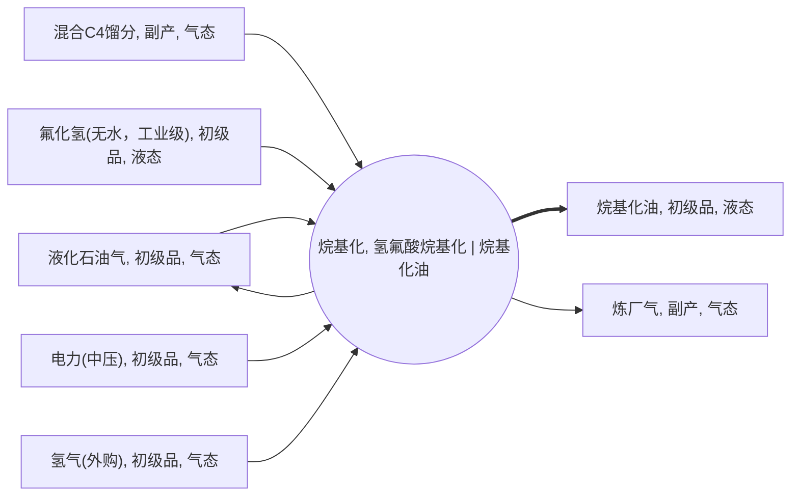

<!-- BODY:START -->
## 定义与参考活动

氢氟酸烷基化是以异丁烷和轻质烯烃为反应原料、以氟化氢为催化剂，制得烷基化油的炼油转化活动。[^ku-f4fefa3ea2cd74ce][^ku-eec9a3b3dbef4896] BREF 将这类反应描述为烯烃与异丁烷形成较高分子量、高辛烷值异构烷烃的过程。[^ku-ref-bref-2015]

本节点的身份同时由“烷基化”转化、“氢氟酸”技术路线和“烷基化油”参考产品限定。〔建模判断〕 它不是烷基化油与其他汽油组分的后续调合活动，也不是硫酸法、离子液法或固体酸法烷基化的泛化合并页。〔建模判断〕

## 参考产品与参考单位

装置的直接参考产品是 P057“烷基化油，初级品，液态”；该产品是汽油调合组分，不是已完成配方和质量放行的成品汽油。[^ku-0274bd08c6af3ce7] 烷基化油在脱除含氟化合物或残余氢氟酸后作为装置产品送往储存。[^ku-29cc130c4677925b]

本页的数量化证据以装置边界处交付的单位质量烷基化油为临时归一基准，并保留每条原始证据的分母和 basis。〔建模判断〕 参考产品交接还应记录温度、密度、含水状态和化验条件；质量坐标至少覆盖 RON、MON、蒸气压、终馏点、硫、烯烃、芳烃、氧含量、水分和残余酸性物质。〔建模判断〕

## 单元过程边界

工艺总体包含反应、分离和处理三类步骤：酸催化反应后，烷基化油、副产丙烷和丁烷、未反应异丁烷及酸经沉降和蒸馏分离。[^ku-fd3c175e1233bbab] 烷基化油、副产丙烷和副产丁烷经除氟处理后送往储存。[^ku-3d73d99668b2ca0f]

前景边界覆盖原料脱水、反应与酸烃沉降、HF 循环与再生、异丁烷回收、产品分馏、丙烷脱氟、烷基化油碱处理、含氟尾气碱洗、含氟废水中和及单元直接泄漏。[^ku-ref-bref-2015] 上游原料、HF、电力、燃料、蒸汽和水的生产属于背景系统；成品汽油调合和储运属于下游。〔建模判断〕

火炬、循环水站、污水处理、储罐和其他公用工程若为多装置共享，只在具备同周期可审计的流量、热量、运行时间或其他物理分摊键时计入 A017；无分摊键的全厂总量保留在上位系统。〔建模判断〕

## 技术路线与相邻活动区分

欧盟炼油 BAT 将“氢氟酸烷基化过程”单列为技术路线章节，与其他酸催化路线分开。[^ku-4d4b49f14c83d396] 分离后的未反应异丁烷和 HF 回流至反应器，新鲜酸、异丁烷和烯烃按需要补充。[^ku-44f4e41d00a4820e] 因此清单记录跨边界补充量，不把装置内部总循环量重复计为外部投入。〔建模判断〕

A018 代表不同酸催化路线，不得将其酸耗、污泥、能耗或物料平衡与 A017 混成一个“烷基化平均过程”。〔建模判断〕 A017 产生的轻烃共产品也不是本 HF 情景的并列上游原料；上游提供者和本单元产出必须按方向分开。〔建模判断〕

## 投入产出与脊边对账

当前名称图将 P057 烷基化油设为唯一参考产出，P013 液化石油气与 P020 炼厂气为共产出；外部投入边为 P013、P029 混合 C4、P038 中压电力、P040 外购氢气和 P046 无水 HF。〔图谱事实〕 证据表中未建脊的碱剂、燃料、蒸汽、冷却水、工艺水、吸附材料和送处理废物保持为显式结构缺口，不借用散文暗中建边。〔证据缺口〕

上游无环主路径在炼油图内采用 A024→P013→A017，并由 A024→P013→A025→P029→A017 表示气体分馏后的混合 C4 接口。A024 接收来自气体支路、加氢裂化粗 LPG 和富气回收支路的物流；原油主干最终在 P001→A002 到达炼油行业边界。[^ku-ref-bref-2015][^ku-cn-shenghong-refinery-eia-2018] A003→P025→A007→P035 是替代残渣处理支路，不与 FCC 主路径叠加。〔图谱事实〕

多产出模型首先保存未分配单元过程。丙烷和丁烷在粗粒度模型中可聚合为 LPG，牌号级清单则保留独立物流或组成；质量、经济或替代分配只能作为项目级派生版本。[^ku-ref-bref-2015] A004 直出轻烃边与 A004→A024→A025 细分路径只选其一，避免重复负担。〔建模判断〕

## 直接排放、废物与监测指标边界

为防止 HF 通过气相排放，HF 烷基化不可凝气在通往火炬前应经碱液湿法洗涤。[^ku-53a97c765fd1120b] 含氟废水控制包括沉淀或中和，并将生成的不溶性含氟化合物从水相分离。[^ku-d9f8e84b0ca20382]

直接排放边界覆盖加热炉烟气、无组织 VOC、含氟尾气、单元火炬分摊、含氟和含油废水。监测范围按排污许可、环评和实际排口确定，并覆盖有机废气处理设施、企业边界及泵、压缩机、阀门和泄压设备等 VOC 源。[^ku-hj880-2017] 法定排放限值只用于合规校核和异常检查，不得冒充装置平均排放因子。[^ku-gb31570-2024]

废物台账按实际工艺配置分别记录含氟中和污泥、酸溶性油或酸焦油、废碱液与碱渣、废分子筛和废吸附材料的产生量、含水率、含氟量、去向、处置技术和运输距离。[^ku-ref-bref-2015] HF 在装置内循环再生，不能仅凭行业通用名录推定本单元必然产生特定废酸或酸泥；实际废物再按危险废物名录和鉴别结果分类。[^ku-cn-hw-list-2025]

## 节点特定采集字段

- **原料与内循环：**异丁烷和各烯烃的质量、组成、水分与惰性组分；新鲜 HF 补充量；循环 HF 与循环异丁烷的系统边界。〔建模判断〕
- **产品与共产品：**烷基化油产量和完整化验；丙烷、丁烷、炼厂气及酸溶性油的独立计量、组成与去向；未分配基座及项目级分配版本。〔建模判断〕
- **能源与公用工程：**整装置电力、燃料、蒸汽、冷却水补水、工艺水、碱剂和吸附材料；共享系统的计量点与分摊键。〔建模判断〕
- **直接输出：**最终排放终点、组分基本流、聚合监测指标、火炬分摊、废水量与污染物质量，以及各类送处理废物。〔建模判断〕
- **质量与可追溯性：**炼厂、装置、HF 技术包、关键改造、代表期、运行负荷、计量点、采样频次、数据覆盖率、异常工况、平衡闭合和不确定度。[^ku-hj853-2017]

每条交换保存原始量、原始分母、单位换算、计量点、有效时段、缺失处理和数据性质。〔建模判断〕 目标装置数据、工程代理、单厂部分实测和单设备实测必须作为独立 evidence scenario 保存，不因地域同为中国而自动拼接。〔建模判断〕

## 区域化补充要求

### CN 中国

中国情景优先使用目标装置同周期的 DCS/MES、罐区收付存、能源计量、LIMS 化验、维修及环保台账，并依排污许可和自行监测要求校核排口和监测频次。[^ku-hj853-2017][^ku-hj880-2017] 燕山分公司公开许可证和历年执行报告可用于定位监管记录，但公开阅读版未提供可直接归属到本 HF 单元的完整原料、能源和产量底表。[^ku-cn-yanshan-permit-public-2018-2025]

中国工程代理情景使用统一设计条件下的 HF 方案物料平衡；其完整情景成组使用，不与其他案例端点交叉拼接。[^ku-cn-sinopec-c4-alkylation-balance-2022] 环评技术比选给出的 HF 补充量区间只是代理证据，须保留原始区间、计算方法和“代理值”标签。[^ku-cn-shuomo-eia-hf-proxy-2019]

燕山 HF 装置的部分实测排放和危险废物强度只代表该单厂、该报告披露边界，不是中国行业平均。[^ku-cn-yanshan-hf-eia-2025] 武汉石化循环水泵的功率和效率是单设备实测，因缺同周期产量、运行小时和其他用电，不得换算为整套装置单位产品电耗。[^ku-cn-wuhan-hf-pump-energy-2019]

其他地区情景在本节下新增并行小节，同样分离目标装置、工程代理、法规限值和行业范围，不修改上述通用活动身份和边界。〔建模判断〕

## 数据适用状态与缺口

当前证据已足以确认 HF 烷基化的活动身份、参考产品、基本工艺步骤、内部循环和主要空气/水控制边界。[^ku-f4fefa3ea2cd74ce][^ku-fd3c175e1233bbab][^ku-53a97c765fd1120b][^ku-d9f8e84b0ca20382] 页面同时具备国际 BREF 参考、中国工程代理、燕山单厂部分实测和武汉单设备实测四类证据情景，可用于节点识别、采集设计、代理情景和数量级校核。

完整中国装置级 LCI 仍缺目标装置同期的原料组成、质量与能源平衡、烷基化油化验、HF 补充量、共产品分项和分配、HF/火炬/最终排水基本流、危险废物分项、背景提供者和不确定度。〔证据缺口〕 P013 同时作为粗粒度原料接口与 LPG 共产品，也需目标数据集用组成和方向解除重叠。〔图谱事实〕

因此本页可作为“内容 Golden 候选”的丰富草稿和人工评审基线，但 `dataset_readiness` 保持 `blocked_pending_node_specific_lci`；在专家签署和数据缺口闭合前，不宣称已形成可发布的中国行业代表数据集。〔证据缺口〕

## 出处

[^ku-f4fefa3ea2cd74ce]: US EPA, *Hydrogen Fluoride Study Final Report*, §5.4.1；已独立核实轻质烯烃与异丁烷转化为烷基化油。
[^ku-eec9a3b3dbef4896]: US EPA, *Hydrogen Fluoride Study Final Report*, §5.4.1；已独立核实 HF 的反应催化剂身份。
[^ku-0274bd08c6af3ce7]: US EPA, *Hydrogen Fluoride Study Final Report*, §5.4.1；已独立核实烷基化油的直接产品和汽油调合组分身份。
[^ku-29cc130c4677925b]: US EPA, *Hydrogen Fluoride Study Final Report*, §5.4.1；已独立核实烷基化油经除氟处理后送往储存。
[^ku-fd3c175e1233bbab]: US EPA, *Hydrogen Fluoride Study Final Report*, §5.4.1；已独立核实反应、分离、处理三步和沉降/蒸馏分离。
[^ku-3d73d99668b2ca0f]: US EPA, *Hydrogen Fluoride Study Final Report*, §5.4.1；已独立核实烷基化油、丙烷和丁烷的除氟交接。
[^ku-4d4b49f14c83d396]: European Commission, Decision 2014/738/EU, §1.2.1；已独立核实 HF 烷基化路线的单列。
[^ku-44f4e41d00a4820e]: US EPA, *Hydrogen Fluoride Study Final Report*, §5.4.1；已独立核实酸和未反应异丁烷回流以及新鲜原料补充。
[^ku-53a97c765fd1120b]: European Commission, Decision 2014/738/EU, BAT 19；已独立核实不可凝气在通往火炬前的碱液湿法洗涤。
[^ku-d9f8e84b0ca20382]: European Commission, Decision 2014/738/EU, BAT 20；已独立核实含氟废水的沉淀/中和与固液分离。
[^ku-ref-bref-2015]: EU JRC, *Refining of Mineral Oil and Gas BREF* (2015)，HF 烷基化工艺、消耗、排放与残余物章节；来源级已核实。
[^ku-cn-shenghong-refinery-eia-2018]: 盛虹炼化一体化项目环境影响报告书，用于炼油上游装置与物流路径对照；来源级已核实。
[^ku-cn-sinopec-c4-alkylation-balance-2022]: 万辉等，《碳四烷基化工艺的技术与经济比选分析》，HF 方案统一设计物料平衡与综合能耗表；来源级已核实。
[^ku-cn-yanshan-hf-eia-2025]: 中国石化北京燕山分公司，《油品升级改造配套新建烷基化装置环境影响报告书》，§4.6.2 表 4.6-2、§4.8.2.1；来源级已核实。
[^ku-cn-shuomo-eia-hf-proxy-2019]: 新疆生态环境厅公开环评，氢氟酸工艺技术比选，印刷页 130–131；来源级已核实。
[^ku-cn-yanshan-permit-public-2018-2025]: 生态环境部全国排污许可证管理信息平台公开端，燕山分公司许可证及历年执行报告记录。
[^ku-cn-wuhan-hf-pump-energy-2019]: 工业和信息化部，《国家工业节能技术应用指南与案例（2019）》，武汉石化循环水泵节能改造案例，印刷页 94；来源级已核实。
[^ku-hj853-2017]: 生态环境部，HJ 853—2017《排污许可证申请与核发技术规范 石化工业》；来源级已核实。
[^ku-hj880-2017]: 生态环境部，HJ 880—2017《排污单位自行监测技术指南 石油炼制工业》；来源级已核实。
[^ku-gb31570-2024]: 生态环境部，GB 31570—2015 及 2024 年修改单，石油炼制工业污染物排放标准；来源级已核实。
[^ku-cn-hw-list-2025]: 《国家危险废物名录（2025 年版）》，炼油废酸、酸泥、废碱液和碱渣条目；来源级已核实。
<!-- BODY:END -->

## 邻域工序图
> 由 graph edges 确定性派生（图==边，可被 lint 比对）；模型不得增删连线。

## 证据场景与可拼接规则

| scenario_id | 范围与地域 | 数据性质 | 当前可用内容 | 允许用途 | 禁止用途 |
|---|---|---|---|---|---|
| A017-INT-BREF-HF-2015 | 国际 HF 烷基化装置 | BREF 区间和技术参考 | 电力、燃料、蒸汽、冷却水、HF、碱剂、洗涤水和浓度参数 | 数量级校核、国际代理和敏感性分析 | 写入中国实测轨；把浓度直接当质量流 |
| A017-CN-ENGINEERING-HF-2022 | 中国统一设计 HF 方案 | 工程代理 | 完整主要物料平衡、综合能耗和质量残差 | 独立的中国工程代理情景 | 与燕山排放或武汉单泵拼接并声称同厂同期 |
| A017-CN-YANSHAN-HF-EIA | 北京燕山既有 Phillips HF 装置 | 单厂部分实测核算 | 部分空气排放、监测指标和危废合计 | 单厂部分输出情景和量级校核 | 推导中国行业平均；补造未披露的物料能源数据 |
| A017-CN-WUHAN-HF-PUMP | 武汉石化 HF 装置循环水泵 | 单设备实测 | 单泵平均功率和机组效率 | 设备级采集线索和数量级校核 | 直接换算为整装置单位产品电耗 |
| A017-CN-TARGET-SITE | 待指定中国 HF 装置 | 目标数据集 | 同期物料、能源、质量、排放、废物和质量元数据 | 发布中国区单元过程 | 在代表期、覆盖率、分配和背景提供者未完成时发布 |

## 上游无环主路径与行业边界

| 层级 | 选定路径或节点 | 在本情景中的作用 | 停止/排除规则 |
|---|---|---|---|
| HF 直接原料 | A024 → P013 → A017；A024 → P013 → A025 → P029 → A017 | 分别提供 LPG 与气分混合碳四接口 | 同一 LPG 不得在 P013/P029 两行重复全量计入 |
| 气体来源 | A004 等 → P020 → A024 | 多装置气经回收/吸收稳定 | A004 直出 P013/P029 与 A024→A025 细分路径二选一 |
| 粗 LPG 来源 | A006 → P054 → A024 | 加氢裂化粗液化气进入产品精制 | 禁止与 A006 原粗粒度 P013 边并存 |
| 富气回收石脑油 | A002→P055、A010→P056 → A024 → P011 | 分别记录两股总投入与总产出 | 仅装置内回流不重复计入 |
| FCC 重质进料 | A003 → P051 → A004 | 减压瓦斯油主进料 | A005 仅为替代参考产品视图 |
| 减黏支路 | A003 → P025 → A007 → P035 | 表示可选残渣处理路线 | 不再作为 A004 主进料路径 |
| 原油主干 | P001 → A002 → P050 → A003 | 从原油到常压/减压分馏 | 在 P001 跨至油气行业 |
| 当前聚合边界 | P001 → A002 | 原油接收、调和、脱水/脱盐和常压分馏 | 独立预处理台账取得前不拆分 |
| 跨行业已关联 | P038、P039、P040、P048 | 电力、蒸汽、氢、水 | 在对应背景行业停止 |
| 跨行业未解析 | P043、P046 | FCC 催化剂、工业 HF | 显式 gap，不用通用化学品替代 |

## 证据层：脊图投入产出与实采槽

> 标签口径：“实测值”表示公开文件明确声明为实际装置测量或实测核算；“代理值”表示由公开技术区间或工程设计平衡归一得到的情景值；“定义值”表示功能单位归一量。中国工程代理采用统一设计基准，不代表具体装置实测。P038 中国电力仍待采，因为公开资料只给综合能耗，不能无依据拆分为电力、蒸汽和燃料。

<!-- EV:flows:START -->
| 流 | 方向 | 单位 | basis | 国际值 INT | 国际源 INT | 中国值 CN | 中国源 CN | pedigree |
|---|---|---|---|---|---|---|---|---|
| P013 液化石油气（加氢裂化 LPG 粗粒度入口） | 输入 | kg/t provisional alkylate | proxy | 待采 | 待采 | 〔代理值〕269.84 | ku-cn-sinopec-c4-alkylation-balance-2022 | 3,4,3,4,3 |
| P029 混合 C4 馏分（醚后 C4 口径） | 输入 | kg/t provisional alkylate | proxy | 待采 | 待采 | 〔代理值〕1048.19 | ku-cn-sinopec-c4-alkylation-balance-2022 | 3,4,3,4,3 |
| P040 外购氢气 | 输入 | kg/t provisional alkylate | proxy | 待采 | 待采 | 〔代理值〕0.64 | ku-cn-sinopec-c4-alkylation-balance-2022 | 3,4,3,4,3 |
| P046 无水氟化氢补充量 | 输入 | kg/t provisional alkylate | proxy | 〔代理值〕1.15 | ku-ref-bref-2015 | 〔代理值〕0.50（原区间 0.4–0.6） | ku-cn-shuomo-eia-hf-proxy-2019 | INT 2,3,3,4,3；CN 3,4,3,4,3 |
| P038 中压电力 | 输入 | kWh/t provisional alkylate | proxy | 〔代理值〕42.5（原区间 20–65） | ku-ref-bref-2015 | 待采 | 待采 | 2,3,3,4,3 |
| P057 烷基化油 | 输出 | t/t provisional alkylate | reference | 〔定义值〕1.0 | — | 〔定义值〕1.0 | — | 不适用 |
| P013 LPG 共产品（LPG 与正丁烷聚合接口） | 输出 | kg/t provisional alkylate | proxy | 待采 | 待采 | 〔代理值〕309.03（61.36 + 247.67） | ku-cn-sinopec-c4-alkylation-balance-2022 | 3,4,3,4,3 |
| P020 炼厂气（论文燃料气口径） | 输出 | kg/t provisional alkylate | proxy | 待采 | 待采 | 〔代理值〕8.35 | ku-cn-sinopec-c4-alkylation-balance-2022 | 3,4,3,4,3 |
| 危险废物合计（未分项；未建脊节点） | 输出（送处理） | kg/t alkylate | measured_average | 待采 | 待采 | 〔实测值〕1.3 | ku-cn-yanshan-hf-eia-2025 | 待评 |
| 含氟中和污泥（湿基；未建脊节点） | 输出（送处理） | kg/t alkylate | proxy | 〔代理值〕8.05–80.5（假设 used HF=新鲜 HF） | ku-ref-bref-2015 | 待采 | 待采 | 2,3,3,4,5 |
| 酸溶性油/酸焦油（HF 再生副产；未建脊节点） | 输出（处理、回收或作燃料） | kg/t alkylate | measured_average | 待采 | ku-ref-bref-2015#existence-only | 待采 | 待采 | 待评 |
| 废碱液和碱渣（依再生配置；未建脊节点） | 输出（送处理） | kg/t alkylate | measured_average | 待采 | ku-ref-bref-2015#existence-only | 待采 | ku-cn-hw-list-2025#classification-only | 待评 |
<!-- EV:flows:END -->

## 证据层：烷基化油产品质量与实采槽

> 本表用于确认参考产品身份、交接条件和不同场景的可比性。当前公开来源未给出与目标中国 HF 装置同周期的完整产品化验，因此不填造代理值。

<!-- EV:props:START -->
| property | condition | unit | 中国项目值 CN | 中国源 CN | pedigree |
|---|---|---|---:|---|---|
| 密度 | 装置出口及规定温度 | kg/m³ | 待采 | 待采 | 待评 |
| 研究法辛烷值 RON | 装置出口样品 | — | 待采 | 待采 | 待评 |
| 马达法辛烷值 MON | 装置出口样品 | — | 待采 | 待采 | 待评 |
| 雷德蒸气压 RVP | 装置出口样品 | kPa | 待采 | 待采 | 待评 |
| 终馏点 | 装置出口样品 | ℃ | 待采 | 待采 | 待评 |
| 硫 | 装置出口样品 | mg/kg | 待采 | 待采 | 待评 |
| 烯烃 | 装置出口样品 | vol% | 待采 | 待采 | 待评 |
| 芳烃 | 装置出口样品 | vol% | 待采 | 待采 | 待评 |
| 氧含量 | 装置出口样品 | wt% | 待采 | 待采 | 待评 |
| 水分 | 装置出口样品 | mg/kg | 待采 | 待采 | 待评 |
| 残余酸性物质或氟 | 装置出口及交接控制口径 | mg/kg | 待采 | 待采 | 待评 |
<!-- EV:props:END -->

## 证据层：国际参考参数与中国实采槽

> 下列 BREF 数值均标为国际代理值。区间保留原始上下限；需要单值计算时才使用区间中点。中国 HF 补充量代理来自中国公开环评的技术比选区间，不是项目实测。武汉循环水泵数据是单设备实测参数，不代表整套装置单位产品电耗。

<!-- EV:params:START -->
| parameter | geo | unit | basis | 国际值 INT | 国际源 INT | 中国值 CN | 中国源 CN | pedigree |
|---|---|---|---|---:|---|---:|---|---|
| 电力使用 | INT | kWh/t alkylate | proxy | 〔代理值〕42.5（原区间 20–65） | ku-ref-bref-2015 | 待采 | 待采 | 2,3,3,4,3 |
| 燃料使用 | INT | MJ/t alkylate | bref_range | 〔代理值〕1000–3000 | ku-ref-bref-2015 | 待采 | 待采 | 2,3,3,4,3 |
| 蒸汽使用 | INT | kg/t alkylate | bref_range | 〔代理值〕100–1000 | ku-ref-bref-2015 | 待采 | 待采 | 2,3,3,4,3 |
| 循环冷却水（ΔT=11 °C） | INT | m³/t alkylate | estimate | 〔代理值〕62 | ku-ref-bref-2015 | 待采 | 待采 | 2,3,3,4,3 |
| 循环水泵平均耗电功率（单泵；两泵一用一备） | CN-Wuhan-component | kW | measured_average | — | — | 〔实测值〕434.39（单设备） | ku-cn-wuhan-hf-pump-energy-2019 | 2,1,4,3,2 |
| 循环水泵机组效率（改造前单泵） | CN-Wuhan-component | % | measured_average | — | — | 〔实测值〕55.69（单设备） | ku-cn-wuhan-hf-pump-energy-2019 | 2,1,4,3,2 |
| 新鲜氢氟酸补充 | INT | kg/t alkylate | proxy | 〔代理值〕1.15 | ku-ref-bref-2015 | 〔代理值〕0.50（原区间 0.4–0.6） | ku-cn-shuomo-eia-hf-proxy-2019 | INT 2,3,3,4,3；CN 3,4,3,4,3 |
| 苛性碱折纯 | INT | kg NaOH/t alkylate | estimate | 〔代理值〕0.57 | ku-ref-bref-2015 | 待采 | 待采 | 2,3,3,4,3 |
| HF 方案综合能耗 | CN-engineering | MJ/t alkylate | proxy | — | — | 〔代理值〕5555.88（未拆分能源品种） | ku-cn-sinopec-c4-alkylation-balance-2022 | 3,4,3,4,3 |
| 物料平衡损失/残差 | CN-engineering | kg/t alkylate | calculated | — | — | 〔代理值〕1.28 | ku-cn-sinopec-c4-alkylation-balance-2022 | 3,4,3,4,3 |
| HF 洗涤废水流量（未按产品归一） | INT | m³/h | bref_range | 〔代理值〕2–8 | ku-ref-bref-2015 | 待采 | 待采 | 2,3,3,4,4 |
| 石灰处理后氟浓度（非质量流） | INT | mg F/L | bref_range | 〔代理值〕10–40 | ku-ref-bref-2015 | 待采 | 待采 | 2,3,3,4,4 |
| HF 洗涤气出口浓度（非质量流） | INT | mg HF/Nm³ | bref_range | 〔代理值〕<1 | ku-ref-bref-2015 | 待采 | 待采 | 2,3,3,4,4 |
<!-- EV:params:END -->

## 证据层：直接环境排放基本流

> 本表只保存越过技术系统边界并直接进入自然环境的排放。聚合监测指标与送处理废物不在本表中。

<!-- EV:emissions:START -->
| substance | CAS | compartment | unit | basis | 国际值 INT | 国际源 INT | 中国值 CN | 中国源 CN | pedigree |
|---|---|---|---|---|---:|---|---:|---|---|
| 氟化氢 | 7664-39-3 | air | kg/t alkylate | measured_average | 待采 | ku-ref-bref-2015#concentration-only | 待采 | ku-hj853-2017#requirement-only | 待评 |
| 氮氧化物 | — | air | kg/t alkylate | measured_average | 待采 | ku-ref-bref-2015#qualitative-only | 〔实测值〕0.0335 | ku-cn-yanshan-hf-eia-2025 | 待评 |
| 二氧化硫 | 7446-09-5 | air | kg/t alkylate | measured_average | 待采 | ku-ref-bref-2015#qualitative-only | 〔实测值〕0.0015 | ku-cn-yanshan-hf-eia-2025 | 待评 |
| 颗粒物 | — | air | kg/t alkylate | measured_average | 待采 | 待采 | 〔实测值〕0.0025 | ku-cn-yanshan-hf-eia-2025 | 待评 |
<!-- EV:emissions:END -->

## 证据层：废气与废水监测指标

> 本表保存法规或报告口径的聚合监测结果。它们不是默认可直接表征的物质基本流；只有确认排放终点、质量口径和目标数据库映射后，才进入 LCI 基本流清单，并须避免与组分流重复计算。

<!-- EV:indicators:START -->
| indicator | medium | unit | basis | 国际值 INT | 国际源 INT | 中国值 CN | 中国源 CN | mapping_status | pedigree |
|---|---|---|---|---|---|---|---|---|---|
| 装置区无组织 VOC（报告口径） | air monitoring aggregate | kg/t alkylate | measured_average | 待采 | ku-ref-bref-2015#qualitative-only | 〔实测值〕0.0174 | ku-cn-yanshan-hf-eia-2025 | 聚合指标；待组分或目标数据库代理映射 | 待评 |
| 化学需氧量 COD | wastewater analytical indicator | kg/t alkylate | measured_average | 待采 | ku-ref-bref-2015#qualitative-or-refinery-wwtp-only | 〔实测值〕0.036 | ku-cn-yanshan-hf-eia-2025 | 分析指标；仅可按明确数据库约定映射 | 待评 |
| 石油类 | wastewater mixture indicator | kg/t alkylate | measured_average | 待采 | ku-ref-bref-2015#refinery-wwtp-only | 待采 | ku-hj880-2017#monitoring-only | 混合物指标；待组成与排放终点 | 待评 |
| 氟化物（报告口径） | wastewater aggregate indicator | kg/t alkylate | measured_average | 待采 | ku-ref-bref-2015#concentration-only | 待采 | 待采 | 确认直接排水终点及以 F 计口径后方可映射 | 待评 |
<!-- EV:indicators:END -->

## 证据层：数据质量与代表性字段

> 这些字段描述目标数据集本身，不能用行业或其他装置代理值替代。

<!-- EV:quality:START -->
| field | unit | basis | 中国项目值 CN | 中国源 CN | proxy_policy | pedigree |
|---|---|---|---|---|---|---|
| 目标装置开工负荷 | % | measured_average | 待采 | ku-hj853-2017#requirement-only | 禁止代理；按同期实际运行量、设计能力和运行时间计算 | 待评 |
| 目标装置数据覆盖率 | % | calculated | 待算 | ku-hj853-2017#requirement-only | 禁止代理；按有效计量时段占目标代表期的比例计算 | 待评 |
| 目标装置和技术包 | — | reference | 待采 | ku-hj853-2017#requirement-only | 禁止代理；记录炼厂、装置、HF 技术包及关键改造状态 | 待评 |
| 目标代表期 | — | reference | 待采 | ku-hj853-2017#requirement-only | 禁止代理；声明起止时间、检修和异常工况处理 | 待评 |
| 同期烷基化油实际产量 | t | measured_average | 待采 | ku-hj853-2017#requirement-only | 禁止代理；作为全部单位产品换算的共同分母 | 待评 |
| 同期有效运行时间 | h | measured_average | 待采 | ku-hj853-2017#requirement-only | 禁止代理；用于功率、小时流量和浓度参数换算 | 待评 |
| 质量平衡闭合率 | % | calculated | 待算 | ku-hj853-2017#requirement-only | 禁止代理；覆盖全部外部原料、产品、共产品和损失 | 待评 |
| 能源计量覆盖率 | % | calculated | 待算 | ku-hj853-2017#requirement-only | 禁止代理；区分独立电表、共享公用工程和估算项 | 待评 |
| 产品和排放样本覆盖 | — | reference | 待采 | ku-hj880-2017#requirement-only | 禁止代理；记录样本数、频次、混样和异常值处理 | 待评 |
| 多产出处理版本 | — | reference | 待采 | 待采 | 禁止默认；保留未分配基座并声明质量、经济或替代版本 | 待评 |
| 代表值不确定度 | % | calculated | 待算 | 待采 | 禁止默认；合并计量、时间波动、代理、共享系统分摊和分配不确定度 | 待评 |
<!-- EV:quality:END -->

## 上下文完整性与发布阻塞

| 上下文模块 | 当前状态 | 解除阻塞所需内容 |
|---|---|---|
| 活动身份与工艺路线 | 已具备 | 保持 HF 与硫酸法、离子液法等其他路线分离 |
| 参考产品 | 已具备 | P057 已作为独立烷基化油节点和 A017 唯一参考产出；保持与 P008 成品汽油分离 |
| 原料和共产品粒度 | 阻塞 | 区分外部异丁烷、混合烯烃、循环异丁烷、丙烷和正丁烷，消除 P013 输入输出重叠 |
| 工程物料平衡 | 代理情景已具备 | 取得目标装置同期 DCS/MES、罐区收付存和 LIMS 组成后整体替换 |
| 能源与公用工程 | 部分参考 | 取得整装置电力、燃料、蒸汽、冷却水补水、工艺水和苛性碱分项 |
| 产品质量 | 字段已列，数值待采 | 取得目标装置同期烷基化油完整化验和交接条件 |
| 直接排放 | 部分单厂实测 | 补齐 HF、火炬分摊、最终排水石油类和氟化物，并确认环境终点 |
| 废物和末端 | 阻塞 | 建立含氟污泥、酸溶性油、废碱和废吸附材料节点，记录去向、处理技术和运输 |
| 分配 | 有规则，无选择 | 保留未分配过程并声明目标研究的共产品处理版本及价格或物理数据 |
| 数据质量 | 字段已列，数值待采 | 补齐代表期、负荷、覆盖率、样本、平衡闭合和不确定度 |
| 背景提供者 | 部分完成 | 保留 P038/P040 关联，解析 P046，并补齐燃料、蒸汽、水、碱剂和末端处理数据集 |

## 🔗 背景数据集
> 上游炼油主路径已经补齐至 P001 原油边界；P038、P039、P040、P048 已分别关联电力、热/蒸汽、工业气体和水供应背景。P043 FCC 催化剂与 P046 工业无水氟化氢仍是 specialty gap。燃料、碱剂和废物处理尚未完整建边；A017 因这些缺口、参考产品身份和目标装置原始数据未完成，暂不得发布为完整 cradle-to-gate 产品系统。

<!-- CHANGELOG:START -->
## 修改日志

### 2026-08-04 · 按完整草稿优先规则迁移为 wiki-v2 内容 Golden 候选

- **发现的问题：**前一次 Golden 尝试把 14 个最低主题槽位误当成整页的精确断言总数，导致原有丰富工艺、上游、中国情景和证据表被压缩成 14 句。
- **采取的修复：**保留全部场景表、上游路径、六类证据表和历史修改记录；将 BODY 重组为 Activity wiki-v2 十节；把已独立核实的活动身份、参考产品、过程步骤、内循环和空气/水控制原子 claim 嵌入完整段落，其余内部事实、建模判断和证据缺口显式标类。
- **状态处理：**页面保持 `draft / source_verified / partial`，登记为 `content_candidate_pending_expert_review`；内容丰富度和必要准确性门已通过，但未经专家签署，不升级 `reviewed` 或 `expert-signed`。
- **非退化原则：**14 个 slot 只是最低主题覆盖清单，每个主题允许多条原子证据；Verify 核验原子 claim，页面渲染多 claim 组成的完整叙述，不再用最小证据页替代知识页。

### 2026-07-24 · 同步 A024/A025 工艺拆分

- **发现的问题：** 原主路径把 A024 同时视为 LPG 和混合碳四提供者，实质合并了富气回收与下游 LPG 气体分馏，并可能把同一 LPG 在 P013/P029 两条输入中重复计量。
- **采用的修改：** 细分路径改为 `A004→P020→A024→P013→A025→P029→A017`，并补入 `A006→P054→A024`、`A002→P055→A024`、`A010→P056→A024` 与 `A024→P011` 的石脑油 gross 交换支路；P013 直接输入仅在确认为独立物理进料股时保留。
- **修改原则：** 粗粒度直出边与细分过程链二选一；同一物料不能因节点粒度不同而重复进入功能单位清单。

### 2026-07-24 · 批量溯源审计后修正上游主路径

- **发现的问题：** 早先主路径把 A007→P006→A004 与 A003→P051→A004 并列写入，同一 FCC 进料路线出现粗细粒度重复；A007 的减黏底部产品也同时登记为 P006 和 P035。
- **采用的修改：** 主路径固定为 `P001→A002→P050→A003→P051→A004→P020→A024→P013→A025→P029→A017`，P013 直接股按目标配料另行确认；`A003→P025→A007→P035` 仅保留为替代残渣处理支路，删除 A007→P006。
- **修改原则：** 主路径只选择一条可审计的物理提供链；替代支路不回接主路线；同一物流不得以粗细两个产品身份重复计量。

### 2026-07-24 · 上游主路径同步 A001 合并

- **发现的问题：** 原上游说明仍把 A001 作为可选活动，容易恢复 P001 同名自环并重复核算预处理公用工程。
- **采用的修改：** 主路径改为 `A002→A003→A004/A007→A024→A017`，P001 直接进入包含调和/脱盐的 A002。
- **未来拆分条件：** 取得可独立对账的预处理台账后，新建“调和/脱盐后原油”产品，并用不同输入、输出产品连接预处理活动与 A002。
- **修改原则：** 当前按证据支持的聚合边界建模；未来拆分必须表达真实状态转换且不得重复计算。

### 2026-07-24 · 补齐 A017 上游 Wiki 至炼油行业边界

- **发现的问题：** 直接投入节点已有数据槽，但其生产者被按“所有生产活动”反向展开时会进入多生产者循环，A004 直出轻烃与 A024 分离路径也可能重复计量；电力、蒸汽、氢、水和两类专用化学品的行业边界状态没有汇总。
- **采用的修改：** 建立 `A002→A003→A004/A007→A024→A017` 的无环主路径，逐页补齐 P001、P006、P013、P020、P029、P038、P039、P040、P043、P046、P048 和 A002、A004、A007、A024 的正式上下文；在本页新增路径表、替代路线和停止条件。
- **代理值处理：** A024 的中国工程代理仅用盛虹轻烃回收项目自身总进料归一；A002 的常减压联合数值没有强拆给常压单元；A007 未取得匹配中国装置数据，继续保留待采。
- **边界结论：** P001、P038、P039、P040、P048 已到达可解析的跨行业边界；P043 催化剂和 P046 工业 HF 的制造 LCI 明确标为 specialty gap。独立核查发现的原预处理伪共产品边和 P001 同名自环均已从权威图删除。
- **修改原则：** 上游路径一次只选择一个可审计提供者；替代技术、共产品回流、粗细粒度重复接口和调和循环不并行累加；缺少专用背景数据集时报告缺口，不用近似名称数据静默替代。

### 2026-07-23 · 通用规则与活动特定字段分层

- **发现的问题：** 原标题混合了通用方法学与 HF 烷基化专属采集要求，读者容易把字段要求误读为已取得数据。
- **采用的修改：** 改名为“中国区节点特定采集字段”；正文保留 HF 工艺特有的物料平衡、酸循环、公用工程、含氟排放与废物要求，通用代表性和代理规则统一继承方法规则。
- **修改原则：** 节点正文描述差异，方法文档管理共性；字段要求、代理情景和正式数据集状态必须分开。

### 2026-07-23 · 完整 LCI 上下文、场景隔离与发布验收修复

- **发现的问题：** 页面虽已有较多代理和实测证据，但缺少正式参考流条件、产品质量字段和统一的数据集坐标；中国工程物料平衡、燕山部分排放和武汉单泵实测容易被下游误拼成一套“中国实测清单”。数据质量表只有负荷与覆盖率两个字段，背景提供者和发布阻塞也未形成可执行验收表。
- **正文采用的修改：** 新增参考流与产品质量坐标、共享系统分摊原则、逐交换数据元数据和跨场景禁止拼接规则；明确完整中国区 LCI 还依赖产品身份、目标装置同周期数据、背景提供者和不确定度。
- **证据层采用的修改：** 建立国际 BREF、中国工程、燕山单厂、武汉单设备和目标装置五个独立场景；新增烷基化油密度、辛烷值、蒸气压、馏程和组成等实采槽；扩展装置、技术包、代表期、产量、运行时间、平衡闭合、样本、分配和不确定度字段；增加发布阻塞验收表。
- **背景关联修复：** 正式区分已关联的 P038/P040、待解析的 P046，以及尚未完整建边或绑定的燃料、蒸汽、水、碱剂和废物处理，不再笼统显示“暂无关联背景数据集”。
- **仍未改动的骨架问题：** 本次只修复 Wiki。P008 仍是成品汽油临时接口，P013 仍同时承担粗粒度原料和共产品，危险废物流仍未建节点；这些事项保持为发布硬阻塞。
- **修改原则：** 不跨装置、跨边界、跨数据性质拼接；产品化验参与身份确认；共享系统必须有可审计分摊键；代理情景可用于筛查但不可冒充实测；只有通过完整性验收的目标装置场景才可发布。

### 2026-07-23 · 中国 HF 装置设计、公用工程与清洁生产资料续挖

- **新增的可核验数据：** 工业和信息化部《国家工业节能技术应用指南与案例（2019）》的武汉石化案例明确对应 `6 万吨/年 HF 烷基化装置`。原文披露循环水系统两台泵一用一备，改造前 16# 泵机组效率 `55.69%`、平均耗电功率 `434.39 kW`；第三方节能评估给出的改造年节电量为 `109.24 万 kWh/a`。正文只录入前两项设备运行参数，年节电量属于改造效果，不作为装置能源投入。
- **未据此填入 P038 的原因：** `434.39 kW` 是一台运行循环水泵的平均功率，不是整套 HF 装置的总功率。资料没有同期实际烷基化油产量、泵运行小时、其他机泵和加热炉辅机用电，也没有说明水厂计量边界是否仅服务该装置。用 `6 万吨/年` 名义能力直接归一会混入未披露的开工率和运行小时假设，故 P038 中国 `kWh/t` 继续待采。
- **设计和运行原始资料线索：** 《武汉石化志（上卷）》公开目录包含“建成投产 6 万吨/年氢氟酸烷基化装置”“配套公用工程”和“烷基化装置历年各周期生产概况”，但扫描全文为付费馆藏，当前仅能确认目录，不能把未读取的表格作为证据。广州石化公开控制系统案例可确认 6 万吨/年 HF 路线、2001 年改造复产及主要工序，但没有公用工程总量。
- **节能评估和可研线索：** 公开行业评优资料可确认存在“大连石化公司烷基化装置扩能改造可行性研究报告”，但没有随附报告正文，且公开摘要不足以确认报告中扩建装置与历史 HF 路线的边界一致；因此不提取能耗代理。
- **清洁生产审核线索：** 武汉、燕山、大连和广州的政府页面可以确认企业进入或完成清洁生产审核，并披露部分全厂措施或汇总效益，但没有公开 HF 单元的物料、能源计量底表。企业级总量也没有可审计的装置分摊键，不能作为 A017 的中国值。
- **此次检索后的结论：** 新证据把“中国 HF 装置完全没有公用工程实测信息”修正为“已有单设备实测，但仍缺整装置分项计量”。目前仍不能形成中国 HF 电力、燃料、蒸汽、循环水和苛性碱的可辩护区间；至少需要另一套同边界中国 HF 装置的整装置数据，或目标装置同周期能源平衡与产量底表。
- **采用原则：** 区分整装置与单设备边界；区分实际消耗与改造节能量；不以名义产能代替实际产量；不把企业级清洁生产汇总值分摊到单元；不把目录、获奖名单或未公开报告当作已核验数值。
- **证据依据：** `ku-cn-wuhan-hf-pump-energy-2019`；其余资料仅作为后续获取线索，未用于回填数值。

### 2026-07-23 · 四表完整性复核与代理值可得性审计

- **复核范围：** 逐行检查技术系统产品/废物流、规格/工艺参数、直接环境基本流、监测指标及数据质量字段，重新核对 BREF Tables 3.19–3.22、HF 控制章节、中国石化统一设计物料平衡和燕山既有 HF 装置实测强度。
- **发现并修正的问题：** 循环冷却水代理值遗漏了 BREF 明示的温升条件，现补为 `ΔT=11 °C`；原“废酸及酸泥”把炼油行业通用危废类别误当成 HF 单元必然产物，现改为 BREF 明确支持的“酸溶性油/酸焦油”；中国装置开工负荷和数据覆盖率是数据集质量字段，不能寻找代理值，已移入“不允许代理”表。
- **新增可回填代理：** BREF Table 3.22 给出 `7–70 kg sludge/kg used HF`，Table 3.19 给出新鲜 HF `1.15 kg/t alkylate`。在明确假设 `used HF=新鲜 HF` 的筛查情景下，湿基含氟中和污泥代理范围为 `7×1.15=8.05` 至 `70×1.15=80.5 kg/t alkylate`。由于干固体含量、危废分类和处理去向差异很大，不取中点，也不移植到中国值轨。
- **存在上位参考、但不能填入当前 kg/t 槽的项目：** BREF 给出 HF 洗涤废水 `2–8 m³/h`、石灰处理后 `10–40 mg F/L`，以及碱洗后不可凝气 `<1 mg HF/Nm³`。这些是小时流量或浓度，缺少同周期产品产量或废气量，不能换算为氟化物或 HF 的 `kg/t alkylate`；现作为独立参考参数保存，基本流槽继续待采。
- **仍无同口径中国代理：** P038 电力以及燃料、蒸汽、循环冷却水、苛性碱的中国分项值。中国工程论文只给综合能耗，公开燕山资料只给新建硫酸法装置的分项公用工程；跨工艺拆分或直接移植都会造成错误。
- **仍无可辩护国际 kg/t 代理：** 国际外部 LPG/C4/氢气投入及 LPG/燃料气产出、HF 直接排放、装置级 VOC/COD/石油类/氟化物、酸溶性油与废碱分项。公开来源只提供反应区内部烷烯比、体积收率、炉子燃料相关因子、全厂污水厂指标或行业总废物量，缺少与当前节点相同的外部边界、组成、产品分母或处理去向。
- **保留的结构性问题：** P008 仍是“汽油”临时接口而非独立烷基化油产品；P013 聚合了 LPG 与正丁烷；危险废物流尚未建 P 节点和处理活动。这些问题会限制代理值与将来实测值的精确挂接，但不影响本次工程质量平衡的算术闭合。
- **修改原则：** 不把浓度冒充质量流，不把全厂指标分摊到单元，不把硫酸法数据移植到 HF，不把国际参考写入中国值轨，不为必须实测或计算的数据质量字段制造代理值。
- **证据依据：** `ku-ref-bref-2015` Tables 3.19–3.22、§4.2.1；`ku-cn-sinopec-c4-alkylation-balance-2022` Tables 1–2；`ku-cn-yanshan-hf-eia-2025` Table 4.6-2。

### 2026-07-23 · 基本流、监测指标与技术系统废物流拆分

- **发现的问题：** 原“排放表 · 基本流”把直接空气排放、法规监测指标和送处理危险废物放在同一张表中。COD 是分析指标，石油类和 VOC 是聚合或混合物指标；危险废物及污泥、废酸、废碱通常继续进入运输和处理活动，均不能不加区分地标为自然环境基本流。
- **正文采用的修改：** 将证据层拆为“直接环境排放表 · 基本流”“废气/废水监测指标表 · 待映射”和“投入产出表 · 技术系统产品/废物流”。氟化氢、氮氧化物、二氧化硫和颗粒物保留在直接排放表；VOC、COD、石油类和报告口径氟化物移入监测指标表；危险废物合计、含氟污泥、废酸及酸泥、废碱液和碱渣移入技术系统废物流表。
- **分类原则：** 直接越过系统边界进入空气、水体或土壤的物质/能量才是基本流；送往污水处理、危废处置、焚烧或资源化活动的是技术系统流；检测方法得到的总量或聚合指标先作为监测指标保存，不自动等同于 LCIA 可识别的物质流。
- **映射原则：** COD 只有在目标数据库明确提供相应约定流时才能建立代理映射；石油类、VOC 和氟化物须确认组成、质量基准、最终排放终点及数据库流名。任何聚合指标映射都必须防止与其组分基本流重复计入。
- **骨架状态：** 四类危险废物流目前尚无对应 P 节点，表中明确标为“未建脊节点”。本次先纠正流类型并保留采集槽，不虚构边；后续应按废物身份和处理去向补建产品/废物流节点与处理活动。
- **数据连续性：** 本次仅搬移分类，不改变既有数值、来源、实测/代理标签或单位。

### 2026-07-23 · 中国工程代理物料平衡回填

- **发现的问题：** 同日早期审计只检查了燕山装置环评和排污许可公开端，因此将 P013 输入、P029 输入和 P013 共产品判断为“公开资料无定量值”。继续检索后，在中国石化期刊平台发现 HF 工艺统一设计比选的完整物料平衡；这些数值可作为中国工程代理情景，但不是燕山或其他具体装置的实测值。
- **正文采用的修改：** 在名称图为 A017 补入既有 P040 外购氢气输入和 P020 炼厂气共产品边；证据表新增相应行。将统一设计年量全部除以烷基化油产量后，填入 P029 醚后 C4、P013 加氢裂化 LPG、P040 补氢、P013 聚合共产品和 P020 燃料气代理值，并统一标注“代理值”。
- **归一化逻辑：** 以论文 HF 方案烷基化油产量为分母，分别计算 `326.3 / 311.3 × 1000 = 1048.19 kg/t`、`84.0 / 311.3 × 1000 = 269.84 kg/t`、`0.2 / 311.3 × 1000 = 0.64 kg/t`、`2.6 / 311.3 × 1000 = 8.35 kg/t`。论文将 LPG 和正丁烷分别报告；因当前骨架只有粗粒度 P013 接口，暂聚合为 `(19.1 + 77.1) / 311.3 × 1000 = 309.03 kg/t`，同时在数值单元格保留两个组成值。
- **质量平衡审计：** 不计催化剂与公用工程，归一化输入为 `1048.19 + 269.84 + 0.64 = 1318.67 kg/t`；输出为 `1000 + 309.03 + 8.35 + 1.28 = 1318.66 kg/t`，尾差来自显示精度。论文列示的损失 `0.4 / 311.3 × 1000 = 1.28 kg/t` 作为质量平衡残差记录，不创建虚假的产品流或基本流。
- **仍未回填及原因：** P038 中国电力仍为待采。论文只给 HF 方案综合能耗 `5555.88 MJ/t alkylate`，没有电力、蒸汽和燃料的分项计量；把综合能耗直接换算成电量会把不同能源载体错误合并。综合能耗已单列为代理参数，待取得分项设计表或装置能源计量后再替换。
- **适用限制：** 该组数据来自统一原料组成、装置规模和价格基准下的工程比较，不是运行统计均值；不得与燕山实测排放直接拼接并声称属于同厂同年。建模时应作为独立的 `CN-engineering-proxy` 情景，取得目标装置同周期物料平衡后整体替换。
- **证据依据：** `ku-cn-sinopec-c4-alkylation-balance-2022` Table 1、Table 2。

### 2026-07-23 · 代理值回填及实测/代理标签

- **发现的问题：** 无实测值时完全留空会阻断初始模型和敏感性分析，但直接把公示文件的技术区间或 BREF 数值写入“中国值”又会让代理数据看起来像装置实测；旧表也没有在数值层直观区分实测、代理和功能单位定义。
- **正文采用的修改：** 数值单元格新增“实测值”“代理值”“定义值”标签。燕山环评明确声明为实测的六项输出保留为“实测值”；BREF 消耗参数标为“代理值”；参考产品归一量标为“定义值”。P046 中国 HF 补充量填入 `0.50 kg/t alkylate` 代理值，P038 国际电力填入 `42.5 kWh/t alkylate` 代理中心值。
- **P046 中国代理值的选择与计算：** 新疆生态环境厅公开环评的工艺技术比选给出 HF 酸耗区间 `0.4–0.6 kg/t 工业异辛烷`。该段不是装置运行实测，因此不计算“样本均值”，只取可复算的区间中点：`(0.4 + 0.6) / 2 = 0.50 kg/t`；原始区间与来源同时保留。
- **P038 国际代理值的选择与计算：** BREF Table 3.19 给出 `20–65 kWh/t alkylate`。需要单值的初始模型采用区间中点：`(20 + 65) / 2 = 42.5 kWh/t`；原区间仍显示在同一单元格。由于没有中国 HF 装置电表资料，该值只留在国际轨，中国轨继续待采。
- **未采用的均值：** 不把国际 BREF 与中国工程比选值混算为跨地域均值；不把硫酸法、离子液法或固体酸法数据纳入 HF 代理；不对 P013、P029 和 LPG 共产品做跨文件平均，因为当前节点重叠且进料组成、产品切割和分配边界不一致。
- **使用限制与替换规则：** 代理值只用于初始模型、敏感性分析和采集优先级排序，不得作为“中国行业实测平均值”发布。取得同装置、同周期实测值后，实测值替换代理中心值，原代理值及计算逻辑保留在修改日志中。
- **证据依据：** `ku-ref-bref-2015` Table 3.19；`ku-cn-shuomo-eia-hf-proxy-2019` 印刷页 130–131；`ku-cn-yanshan-hf-eia-2025` Table 4.6-2。

### 2026-07-23 · 产品流数值回填与公开资料缺口审计

- **发现的问题：** 投入产出表没有复用同页已经核验的 BREF 电力和 HF 补充量，造成“国际来源已有、国际值仍为 0”；同时，BREF 只定性说明异丁烷、烯烃、烷基化油、丙烷和丁烷，不能支撑三个物料流的定量值。燕山排污许可公开端确有 2018—2025 年年度执行报告，但公开阅读版没有开放可归属至既有 HF 装置的原料、HF 领用、电耗和产品产量底表。
- **正文采用的修改：** 将 P046 国际值填为 `1.15 kg/t alkylate`，P038 国际值填为 `20–65 kWh/t alkylate`；按 1 t 临时烷基化油功能单位将参考输出填为 `1.0 t/t`，并明确它是定义值而非地域实测；删除三个无定量支撑流上的装饰性 BREF 来源；新增逐流阻塞原因及所需原始资料。
- **仍未填充：** P013 外部异丁烷来源、P029 混合 C4、P046 中国 HF 补充量、P038 中国电力以及 P013 LPG 共产品。缺口不是计算能力问题，而是公开文件未披露同装置、同周期底表，并且 P013/P029 以及 LPG 共产品的脊节点粒度尚不足以排除重复和聚合误差。

- **P013 异丁烷来源输入：** BREF 只给出原料类型，没有给出按吨烷基化油归一的外部异丁烷补充量；当前 P013 还可能与 P029 中的异丁烷成分重叠。解除阻塞需要同期原料交接计量、混合 C4 化验组成、异丁烷罐收付存及装置质量平衡。
- **P029 混合 C4 馏分输入：** 公开资料没有既有燕山 HF 装置的 C4 进料量及丙烯、丁烯、异丁烷、正丁烷组成。解除阻塞需要同期 DCS/MES 进料累计量与 LIMS 组成分析。
- **P046 HF 补充量（中国值）：** 现有环评披露工艺和部分排放强度，但未披露 HF 实际领用量；公开执行报告阅读版也未开放该底表。解除阻塞需要 HF 采购与领料台账、储罐期初期末库存、再生回收量及烷基化油同期产量。
- **P038 电力（中国值）：** 新建硫酸法项目公用工程值不能移植到既有 HF 装置；既有装置公开资料没有独立电表数据。解除阻塞需要装置级电表、能源管理系统、能源审计或清洁生产审核底表。
- **P013 LPG 共产品：** BREF 仅确认会产生丙烷和正丁烷，没有数量；当前单一 LPG 节点也不能区分丙烷、正丁烷和其他轻烃。解除阻塞需要产品分馏计量、罐区收付存、LIMS 组成及未分配质量平衡。

- **修改原则：** 已核验的同口径数值跨表复用；参考流与实测流分开；来源标签只绑定实际支持该数值的原文；硫酸法设计值不移植到 HF 装置；无法以质量平衡闭合的数据不做化学计量猜填。
- **证据依据：** `ku-ref-bref-2015` Table 3.19；`ku-cn-yanshan-hf-eia-2025`；`ku-cn-yanshan-permit-public-2018-2025`。

### 2026-07-23 · 投入产出表流类型术语校正

- **发现的问题：** “LCI 流”描述的是清单阶段中的宽泛 exchange，不能区分产品流、废物流和基本流，容易把 P038 中压电力误解为基本流。
- **正文采用的修改：** 表名改为“投入产出表 · 技术系统产品/废物流（与脊边对账）”；排放表继续单独承载按环境介质记录的基本流。
- **修改原则：** LCI 是清单层级，不作为流类型；活动之间交换的电力、物料、产品和送处理废物归入技术系统流，跨越自然环境边界的资源与排放归入基本流。

### 2026-07-23 · 国际值与中国值拆列

- **发现的问题：** 旧证据表只有一个“值”列，却同时陈列国际源和中国源；当两类来源并存时，无法从表头判断数值究竟属于国际参考还是中国装置。
- **正文采用的修改：** 将投入产出、工艺参数和排放表统一改为“国际值—国际源”和“中国值—中国源”两组相邻字段；BREF 参数保留在国际值列，燕山 HF 装置六项实测强度迁入中国值列。
- **修改原则：** 每个数值只与同地域、同口径的直接来源绑定；来源存在不等于数值已经取得；法规、分类和监测规范可以占据来源槽，但不得据此填造中国装置值。

### 2026-07-23 · 补入燕山 HF 装置实测排放强度

- **发现的问题：** 原参数表把中国法规和监测规范列作“中国源”，但这些文件只规定填报、监测或限值要求，没有提供 A017 的中国装置数值，因而页面显示“中国来源字段 2/8、中国值已填 0/8”。同时，不能把“烷基化项目”自动视为 HF 路线，也不能把危险废物合计自动拆成含氟污泥。
- **正文采用的修改：** 增加燕山分公司既有 6 万吨/年 Phillips HF 烷基化装置案例；按环评表 4.6-2 的 `t/万t 烷基化油` 实测口径换算并填入 VOC、NOx、SO₂、颗粒物、COD 和危险废物合计六项中国单厂强度。
- **换算与限制：** 使用 `1 t/万t = 0.1 kg/t`；结果仅代表燕山既有装置的部分 gate-to-gate 输出。来源没有披露实测年份、监测周期、采样次数及完整物料能源边界，因此不标为中国行业平均值；COD 是污染物质量而非废水量；危废 1.3 kg/t 保留为未分项合计。
- **修改原则：** 工艺路线、装置、分母和数据性质必须同时核实；实测值优先于许可因子，但单厂实测不外推为全国默认；合计流在没有同期台账前不进行成分猜分；原料、能耗、HF 补充量、产品收率和分配数据未取得时继续保留“待采”。
- **证据依据：** `ku-cn-yanshan-hf-eia-2025`，并由独立 verifier 对表号、单位、表注和换算进行复核。

### 2026-07-23 · 产品身份、边界与中国区数据要求整理

- **发现的问题：** 名称图把 A017 的参考产品锚定为 P008“汽油”，而核验来源将直接产品定义为烷基化油，即汽油调合组分；原料节点将异丁烷和低碳烯烃聚合得过粗；辅助投入、直接排放和危险废物路径不完整；正文混合了正式知识、纠错过程和操作建议。
- **正文采用的修改：** 正文统一使用烷基化油作为单元过程参考产品身份，明确上游、前景和下游边界；把内部循环与跨边界补充量分开；将中国区采集内容改写成正式 LCI 数据要求；保留多产出与分配规则。
- **待执行的结构修改：** 在权威名称图新增“烷基化油，初级品，液态”产品节点，使 A017 生产该节点、A031 消费该节点；细化丙烷和丁烷或保存 LPG 组成；补齐燃料、蒸汽、循环冷却水、碱剂及废物相关脊节点；解析 P046 氢氟酸上游。
- **修改原则：** 以直接产品身份确定参考流；装置内部循环不重复计入外部投入；法规限值不冒充实测排放；国际 BREF 只作量级检查，不替代中国装置数据；图层未完成的结构修改在日志中保留，不在正式正文中反复叙述。
- **证据依据：** `ku-ref-bref-2015`、`ku-hj853-2017`、`ku-hj880-2017`、`ku-gb31570-2024`、`ku-cn-hw-list-2025`。
<!-- CHANGELOG:END -->
